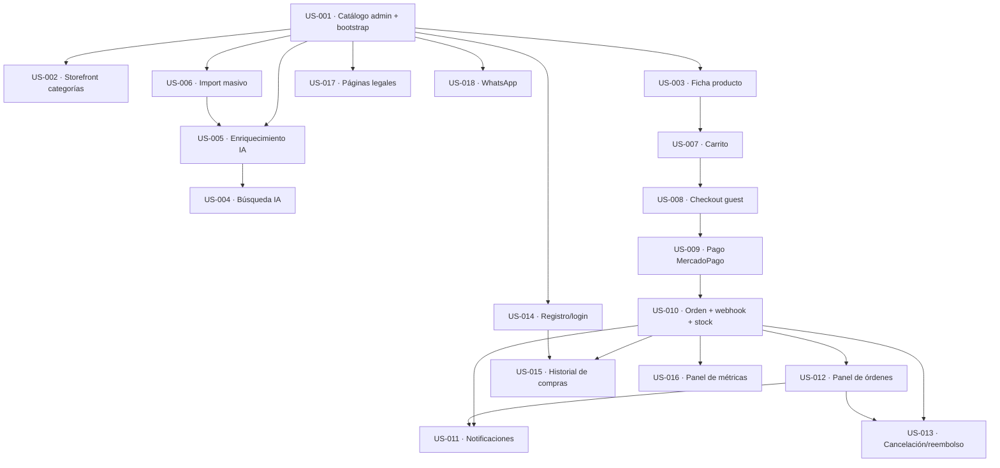

# Orden de construcción (build order) — DSM E-commerce

> Secuencia recomendada para construir el backlog (18 User Stories `Ready`): qué se construye, en qué orden, qué se paraleliza y cuál es el camino crítico. Derivado del grafo de dependencias (`blocked_by`). Índice materializado: `docs/_index/build-order.yaml`.
>
> **Estrategia:** *foundation-first → rebanadas verticales.* Una sola tarea horizontal al inicio (el bootstrap, US-001) que da el entorno local + CI + migraciones; después, por cada US, **backend → frontend → QA juntos**, integrando para que cada US quede **demostrable**. Dentro de una US, el backend va primero porque el frontend consume su contrato de API — pero el frontend puede arrancar contra un **mock** apenas exista ese contrato (no espera al backend terminado).

## Grafo de dependencias (DAG)

## Camino crítico (el cuello de botella)

**US-001 → US-003 → US-007 → US-008 → US-009 → US-010 → US-012 → US-011** (8 niveles). Es la cadena del **loop de compra + fulfillment**: es lo más profundo y lo que marca la duración total. Hay que protegerla — cualquier demora acá empuja todo el cronograma.

## Capas (lo que se puede paralelizar)

Las US de la misma capa **no dependen entre sí** → se pueden encarar en paralelo (por distintas personas).

| Capa | US | Nota |
|---|---|---|
| 0 | **US-001** | Foundation. Desbloquea todo. Va primera y sola. |
| 1 | US-002, US-003, US-006, US-014, US-017, US-018 | Todo lo que depende solo del bootstrap. |
| 2 | US-005, US-007 | |
| 3 | US-004, US-008 | |
| 4 | US-009 | |
| 5 | US-010 | El núcleo transaccional. |
| 6 | US-012, US-015, US-016 | |
| 7 | US-011, US-013 | Post-venta. |

## Agrupación en cycles (~2 semanas, reconciliado con el plan de releases del PRD §10)

| Cycle | US | Demo al cierre |
|---|---|---|
| 1 | US-001 (+ US-017 legal en paralelo) | El dueño carga catálogo en un sitio indexable; páginas legales publicadas. |
| 2 | US-002, US-003, US-006 | Browse por categorías + ficha + import masivo del catálogo real. |
| 3 | US-005, US-004 | **El diferenciador**: describir una necesidad en lenguaje natural y obtener productos. |
| 4 | US-007, US-008, US-009, US-010 | Compra de punta a punta (con pago simulado): carrito → checkout → pago → orden + stock. |
| 5 | US-012, US-011, US-013 | Loop completo: el dueño gestiona la orden, ambas partes reciben emails, cancelación/reembolso. |
| 6 | US-014, US-015, US-016, US-018 | Cuentas + historial + métricas del dueño + canal WhatsApp. |

## Secuencia recomendada para arrancar

1. **US-001 (INFRA primero)** — el bootstrap: scaffolding (NestJS + Next.js), `docker-compose` (Postgres+pgvector+Redis local), migraciones, CI. Esto da el **entorno local**. La provisión real de la nube (Railway/Neon/R2) corre en paralelo; recién se necesita para el primer deploy a staging.
2. **US-001 backend** (CRUD de catálogo + el contrato de API). El contrato desbloquea el frontend.
3. **US-001 frontend** (panel admin; puede empezar contra mock apenas exista el contrato) + **QA**.
4. Integrar y demostrar ("el dueño carga catálogo") → recién ahí se pasa a la próxima vertical.
5. Seguir por el **track del diferenciador** (US-006 → US-005 → US-004) y, en paralelo, el storefront público (US-002, US-003) y lo legal (US-017).
6. Después el **loop de compra** (US-007 → US-008 → US-009 → US-010) y el fulfillment/post-venta (US-012 → US-011/US-013).

## Qué está desbloqueado ahora

*(Actualizado 2026-08-09)* **US-001** (en curso: BE + FE + QA + bootstrap-local cerrados) y **US-019**
(provisión de la nube — sin dependencias de US, *gated* sólo en cuentas/billing externos).

**Re-alcance de la infra**: la provisión cloud salió de US-001 a **US-019**. `railway-baseline` §0 la
define como pista paralela fuera del camino crítico, pero al vivir bajo US-001 impedía que ésta
pasara a `Done` y mantenía bloqueadas a las 17 US que dependen de ella. Con el split, US-001 cierra
con la pista local y el DAG se libera; la nube se agenda por su cuenta cuando resuelvan las
dependencias externas. (Workaround del gap F53: el framework no tiene status `deferred`.)

El resto se desbloquea a medida que sus `blocked_by` pasan a `Done`. Recalcular esta vista cuando
avancen los estados.
