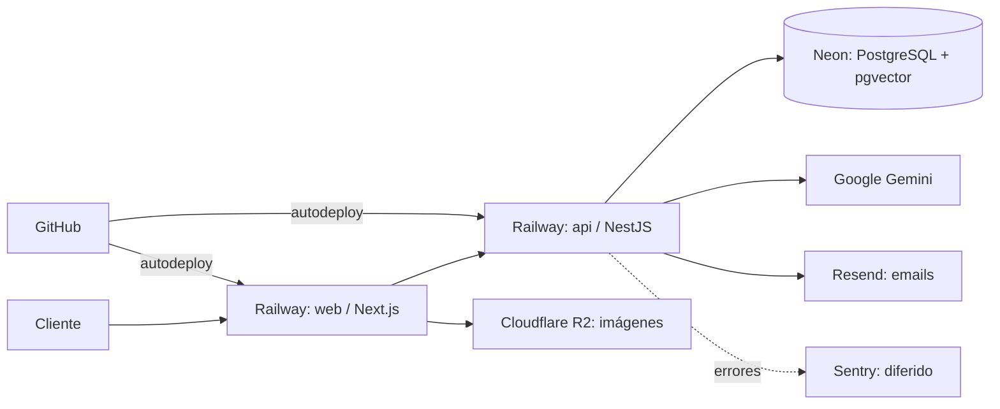

# Plataformas del stack cloud — DSM E-commerce

Resumen de los proveedores externos que usa la plataforma en la nube y **qué rol cumple cada uno**.
Complementa (no reemplaza) las decisiones formales en los ADR y el runbook operativo.

- Decisión de plataforma base: [`ADR-0001`](../architecture/decisions/0001-platform-railway-neon-r2.md)
- Runbook operativo (deploy, rollback, incidentes): [`docs/services/dsm-ecommerce/runbook.md`](../services/dsm-ecommerce/runbook.md)

> **Estado actual:** entorno **staging** aprovisionado. El entorno **production** existe en Railway
> pero el corte productivo (dominio propio, Postgres con PITR pago, alertas) es un gate posterior.

---

## Vista rápida

| Plataforma | Rol en DSM | Qué corre / guarda | Tier |
|------------|-----------|--------------------|------|
| **Railway** | PaaS de aplicaciones | Servicios `web` (Next.js) y `api` (NestJS) | Trial / Hobby (~US$5/mes) |
| **Neon** | PostgreSQL serverless | Base de datos + `pgvector` (embeddings) | Free (staging) |
| **Cloudflare R2** | Almacenamiento de objetos | Imágenes de productos (`dsm-product-images`) | Free |
| **Google Gemini** | Proveedor de IA | Enriquecimiento de descripciones + embeddings de búsqueda | Free tier |
| **Resend** | Emails transaccionales | Reset de contraseña, avisos de orden al dueño | Free tier |
| **Sentry** | Monitoreo de errores | Web + API (diferido) | Developer (free) |
| **GitHub** | Repositorio + CI/CD | Código + trigger del autodeploy de Railway | — |
| **MercadoPago** | Checkout de pago | **Diferido** — hoy el checkout va por WhatsApp | — |

---

## Detalle por plataforma

### Railway — dónde corren las apps
PaaS que hostea los dos servicios de la aplicación:

- **`web`** — el frontend Next.js (la tienda). URL de staging: `https://web-staging-3418.up.railway.app`
- **`api`** — el backend NestJS (catálogo, carrito, auth, búsqueda). URL de staging: `https://api-staging-778f.up.railway.app`

El autodeploy se conecta a GitHub: un push a `main` despliega **production**, y a la rama `staging`
despliega **staging**. No hay servicio `worker` ni Redis (ver Gemini + [`ADR-0014`](../architecture/decisions/0014-in-process-enrichment-executor.md)).

> **Nota de build (monorepo):** Railway deprecó *Config-as-Code* (`railway.json`) para servicios nuevos.
> Los comandos de build/start se configuran por servicio en **Settings** (o vía la API de Railway):
> el `api` corre `prisma generate` + `nest build`, el `web` corre `next build`.

### Neon — la base de datos
PostgreSQL serverless gestionado (región **us-east-2 / US-East**). Es la **única base de datos** del
sistema. Aloja todas las tablas y la extensión **`pgvector`**, que guarda los *embeddings* de los
productos (vectores de 768 dimensiones) usados por la búsqueda semántica. El esquema se aplica con las
migraciones de Prisma (`packages/db`). Ver [`ADR-0002`](../architecture/decisions/0002-postgresql-pgvector-single-datastore.md).

### Cloudflare R2 — las imágenes
Almacenamiento de objetos compatible con S3. Guarda las **imágenes de los productos** (bucket
`dsm-product-images`). En staging el acceso es público vía el subdominio `r2.dev`; el dominio propio
para las imágenes es parte del corte productivo.

### Google Gemini — la inteligencia
Proveedor de IA ([`ADR-0003`](../architecture/decisions/0003-google-gemini-ai-provider.md)). Hace dos cosas:

1. **Enriquecer descripciones** de productos (texto comercial a partir de datos crudos).
2. Generar los **embeddings** que alimentan la búsqueda en lenguaje natural.

Corre **in-process dentro del `api`** (no hay worker ni cola BullMQ): la "cola" es una consulta SQL
sobre las filas pendientes. Es una decisión explícita — ver [`ADR-0014`](../architecture/decisions/0014-in-process-enrichment-executor.md),
que revisa el enfoque asíncrono original de [`ADR-0004`](../architecture/decisions/0004-redis-bullmq-async-processing.md).
Se configura con `GEMINI_API_KEY`.

### Resend — los emails
Envío de emails transaccionales: **reset de contraseña** y **notificaciones de orden** al dueño de la
tienda. Se configura con `RESEND_API_KEY`. Para enviar a cualquier destinatario en producción hace falta
verificar un dominio propio en Resend; en staging se usa el remitente de prueba.

### Sentry — el monitoreo *(diferido)*
Captura de errores en el frontend y el backend. Queda **diferido**: no bloquea el deploy — la app
funciona sin él; se activa cargando los `SENTRY_DSN` de cada servicio.

### GitHub — el código y el disparador
Aloja el repositorio y, mediante la integración de Railway, **dispara los despliegues** por rama.

### MercadoPago — el pago *(diferido)*
El medio de pago hosted ([`ADR-0006`](../architecture/decisions/0006-mercadopago-hosted-checkout.md)) está
**fuera de alcance por ahora** (US-009). Mientras tanto, el checkout se resuelve con un **handoff a
WhatsApp**: el cliente confirma el carrito y coordina el pago/envío por ese canal.

---

## Flujo entre plataformas (staging)

---

## Mapa de variables → plataforma

| Variable | Servicio | Plataforma que la provee |
|----------|----------|--------------------------|
| `DATABASE_URL` | api | Neon |
| `GEMINI_API_KEY` | api | Google Gemini |
| `RESEND_API_KEY` | api | Resend |
| `JWT_SECRET` | api | generada (infra) |
| `NEXT_PUBLIC_API_BASE_URL`, `API_INTERNAL_ORIGIN` | web | URL del `api` en Railway |
| `NEXT_PUBLIC_SITE_URL` | web | URL del `web` en Railway |
| `NEXT_PUBLIC_IMAGE_CDN_HOST` | web | Cloudflare R2 (r2.dev) |
| `NEXT_PUBLIC_WHATSAPP_PHONE` | web | número del negocio (checkout por WhatsApp) |
| `SENTRY_DSN` / `NEXT_PUBLIC_SENTRY_DSN` | api / web | Sentry *(diferido)* |
| `MP_ACCESS_TOKEN`, `MP_WEBHOOK_SECRET` | api | MercadoPago *(diferido)* |

---

## Costo

El mínimo para tener el stack en línea es **Railway (~US$5/mes)**. El resto de los proveedores
(Neon, Cloudflare R2, Google Gemini, Resend, Sentry) entra en **free tier** para el volumen del
proyecto. Los servicios de staging pueden borrarse tras la evaluación para no incurrir en costo.
