# Solución End-to-End — DSM Refrigeración y Ferretería (E-commerce)

> **Audiencia**: equipo técnico (Arquitecto + Devs). El PRD dice **QUÉ**; este documento dice **CÓMO**. Exhaustivo a propósito.
>
> **Aprueba**: el Arquitecto firma (§24). El §10 (frontend) no se firma `Approved` hasta que `design-system.md` esté `Approved`.

---

## 1. Resumen técnico

Construimos un **e-commerce SSR** para una ferretería de un local (CABA) cuyo diferenciador es la **búsqueda semántica en lenguaje natural**. El sistema cierra el loop comercial: el cliente **descubre** (browse por categoría o búsqueda IA) → **compra** (carrito + checkout guest con MercadoPago) → el dueño **prepara y entrega** (panel de órdenes), con el **stock como única fuente de verdad**.

**Decisiones arquitectónicas más importantes:**

1. **Monolito modular en NestJS** (un solo deployable de API, módulos por dominio) — simplicidad operativa acorde al presupuesto y al tamaño del equipo. La arquitectura deja el stock desacoplado para soportar a MercadoLibre como canal *downstream* (roadmap).
2. **PostgreSQL (Neon) + extensión `pgvector`** como datastore único: datos transaccionales **y** embeddings de productos para la búsqueda semántica, evitando un motor de búsqueda separado.
3. **Google Gemini** (`text-embedding-004` 768d + `gemini-1.5-flash`) para generar embeddings y **enriquecer descripciones pobres** — sub-objetivo crítico que habilita la búsqueda.
4. **Procesamiento asíncrono con Redis + BullMQ**: el import masivo de miles de SKUs, el enriquecimiento IA y la generación de embeddings corren en un **worker** con reintentos y rate-limit; nunca bloquean el request.
5. **MercadoPago Checkout Pro (hosted)** — DSM queda **fuera de alcance PCI**; el stock se decrementa **al confirmar el pago** vía webhook idempotente. Se añade un **medio de pago simulado "DSM"** (modo test) para demos y test E2E.
6. **Next.js con SSR** para que catálogo y fichas sean indexables (SEO, objetivo de negocio del PRD). El panel del dueño (backoffice) vive dentro del mismo app web.
7. **Plataforma Railway + Neon + Cloudflare R2** — **desviación del baseline AWS Lightsail** (ya fijada en `project-config.yml`), formalizada en ADR-0001.

### 1.1 Trazabilidad — capacidades PRD §2.1 → solución

| # | Capacidad (PRD) | Prioridad | Dónde se resuelve en este E2E |
|---|---|---|---|
| 1 | Catálogo + navegación por categorías | Must | Módulo `catalog`; §6.1, §8 (Product/Category), SSR §6.2 |
| 2 | Búsqueda semántica IA | Must | Módulo `search`; §9.1, pgvector §8, §3 (ADR-0002/0003) |
| 3 | Enriquecimiento descripciones IA | Must | Módulo `enrichment` + worker; §9.3, §3 (ADR-0003) |
| 4 | Ficha + carrito + checkout guest MercadoPago (+ pago simulado DSM) | Must | Módulos `cart`,`checkout`,`payments`; §9.2, §12 |
| 5 | Fulfillment: retiro + panel de órdenes | Must | Módulo `orders` + admin web; §9.4, §12 (FSM) |
| 6 | Registro orden + ajuste stock + notificaciones | Must | Módulos `orders`,`stock`,`notifications`; §9.2, §9.4 |
| 7 | Import masivo CSV/Excel | Should | Módulo `import` + worker; §9.3 |
| 8 | Cuentas de cliente registradas | Should | Módulo `auth/customers`; §3 (ADR-0005), §9 |
| 9 | Panel de métricas del dueño | Should | Módulo `metrics` + admin web (Recharts); §6.2 |
| 10 | Páginas legales + consentimiento | Must | Web (páginas estáticas SSR) + flag de consentimiento en orden; §8 (ORDERS.consent) |
| 11 | Cancelación / reembolso de orden | Should | Módulo `orders`+`payments`; §9.5, §12 (FSM) |
| 12 | Canal de contacto / soporte (WhatsApp) | Should | Web (enlace `wa.me`); sin backend |

> Cobertura: **12/12 capacidades**. Sin gaps silenciosos.

## 2. Pregunta inicial — Figma o no Figma

- **Tiene Figma**: **No**.
- Se generó `docs/product/design-system.md` (sin Figma). §10 de este doc resume los tokens. **Gate**: este E2E §10 se firma `Approved` recién cuando el design-system pase a `Approved` (hoy `Draft`).

## 3. Decisiones arquitectónicas clave (resumen)

| # | Decisión | ADR | Razón corta |
|---|---|---|---|
| 1 | Plataforma Railway + Neon + Cloudflare R2 (no AWS Lightsail) | ADR-0001 | Hosting económico ya fijado en config; desviación del baseline → requiere ADR. |
| 2 | PostgreSQL + `pgvector` como datastore único (sin motor de búsqueda aparte) | ADR-0002 | Búsqueda semántica sobre el mismo Postgres; menos infra/costo. |
| 3 | Google Gemini (`text-embedding-004` + `gemini-1.5-flash`) para embeddings + enriquecimiento | ADR-0003 | Económico, buen español; dependencia de IA externa. |
| 4 | Redis + BullMQ para trabajo asíncrono | ADR-0004 | Import/IA/embeddings robustos con reintentos + rate-limit. |
| 5 | Auth propia (NestJS + JWT + bcrypt) | ADR-0005 | Sin costo SaaS; alcance acotado (guest cubre el loop). |
| 6 | MercadoPago Checkout Pro (hosted) + medio simulado "DSM" | ADR-0006 | Fuera de PCI; pago simulado habilita demos y test E2E. |
| 7 | Monolito modular NestJS | ADR-0007 | Simplicidad; stock desacoplado para ML downstream. |
| 8 | Decremento de stock al aprobar pago (UPDATE atómico + idempotencia) | ADR-0008 | Stock = única fuente de verdad; sin reservas ni jobs de expiración. |

> Los ADR se materializan antes de codear las áreas que tocan (ver §20).

---

## 4. C4 — Nivel 1: Contexto del sistema (Obligatorio)

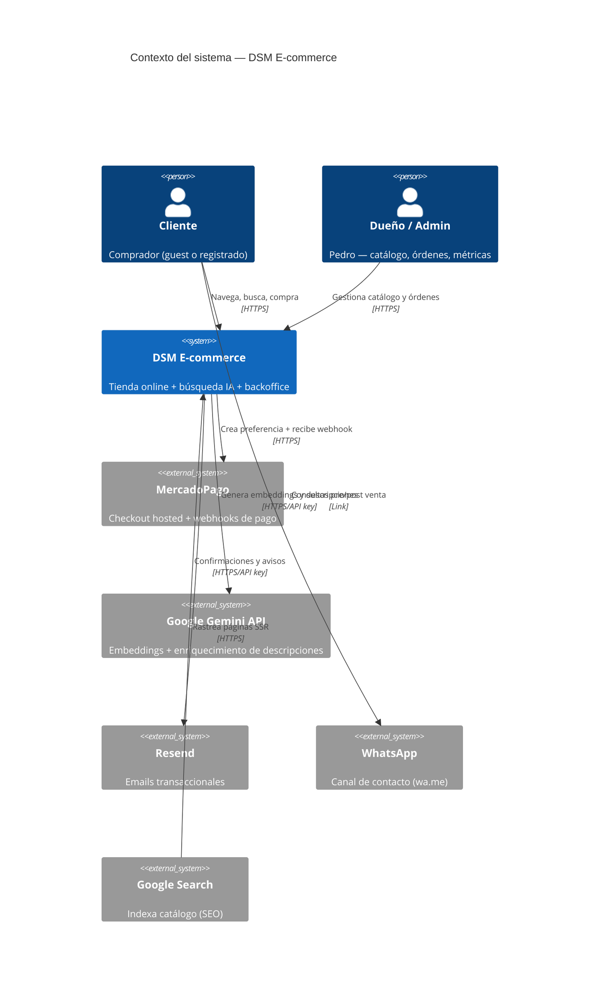

---

## 5. C4 — Nivel 2: Containers (Obligatorio)

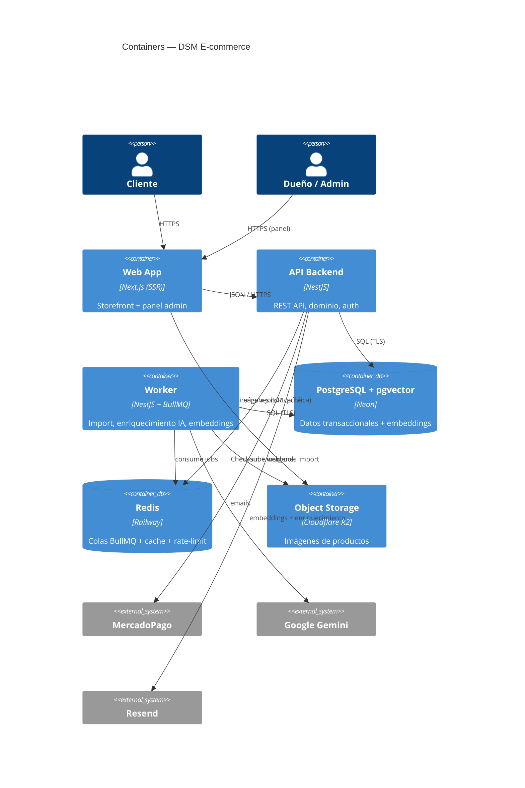

---

## 6. C4 — Nivel 3: Componentes (Obligatorio)

### 6.1 API Backend (NestJS) — componentes

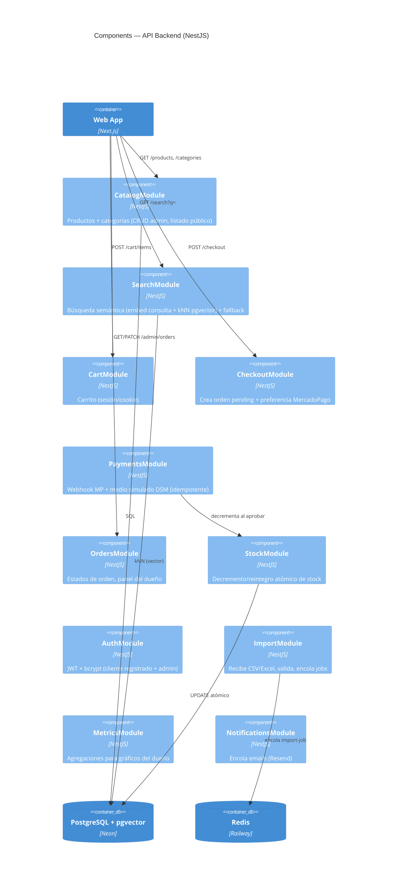

### 6.2 Web App (Next.js) — componentes

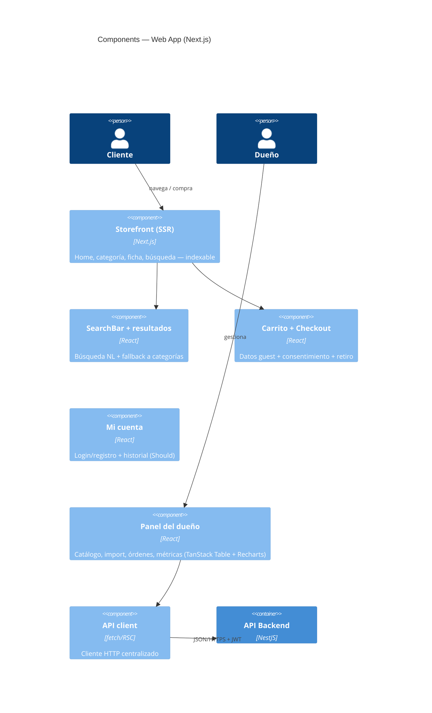

---

> **Contratos de API**: este E2E define los **límites y endpoints** a nivel componente (arriba). El **contrato OpenAPI detallado** (request/response, esquemas, errores) se produce por endpoint en la **planificación de tickets de backend** y se valida con contract-testing (§19). No es parte del E2E **por diseño**.

## 7. C4 — Nivel 4: Código (Opcional)

**Aplica a este proyecto**: no — razón: el dominio es e-commerce estándar; la lógica no trivial (decremento de stock, idempotencia de pago, kNN) se cubre con secuencias §9 y FSM §12. No se justifica UML de clases.

---

## 8. Modelo de datos (DER — Obligatorio)

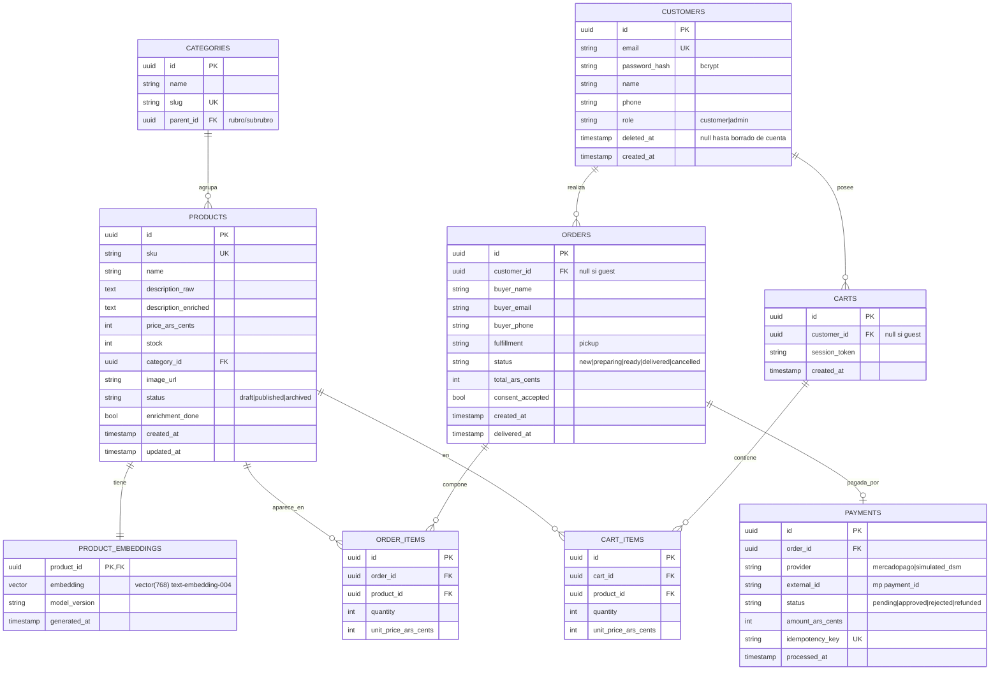

**Notas**:
- **Precios en centavos ARS** (`*_ars_cents` int) para evitar errores de redondeo; IVA incluido (PRD §11). El display formatea a `$`.
- **`pgvector`**: columna `vector(768)` (dimensión de `text-embedding-004`). **Índice HNSW** (`vector_cosine_ops`) sobre `product_embeddings.embedding` para kNN aproximado eficiente con miles de SKUs.
- **Idempotencia de pago**: `payments.idempotency_key` UNIQUE + `payments.external_id` (mp `payment_id`) evitan doble procesamiento del webhook.
- **Stock**: columna `products.stock` con `CHECK (stock >= 0)`; el decremento es `UPDATE ... SET stock = stock - :q WHERE id = :id AND stock >= :q` (atómico).
- **Soft delete**: `customers.deleted_at` (borrado de cuenta a pedido — PRD §6); productos usan `status='archived'`. Órdenes no se borran (historial 12 meses, métricas).
- **Índices**: `products(category_id, status)`, `products(sku)` UK, `orders(status, created_at)`, `payments(external_id)`, HNSW en embeddings.
- **Retención**: job mensual que purga/anonimiza órdenes > 12 meses (PRD §6).
- **ORM**: Prisma para esquema/migraciones; la búsqueda kNN (`embedding <=> :qvec`) se hace con `$queryRaw` (pgvector no es tipo nativo de Prisma).
- **AFIP (roadmap)**: facturación fuera del MVP (PRD §2.2), pero `ORDERS` queda preparada para colgarle una entidad `INVOICE` (CAE, tipo de comprobante, CUIT del comprador) sin reescribir. No se crea ahora.

> **Decisión de datos**: motor único PostgreSQL (baseline) + extensión `pgvector`. No se introduce motor de búsqueda dedicado (OpenSearch/Pinecone) — el volumen (~5.000 SKUs, baja concurrencia) lo permite. Formalizado en ADR-0002.

---

## 9. UML Secuencia — flujos críticos (Obligatorio)

### 9.1 Flujo: Búsqueda semántica (con fallback)

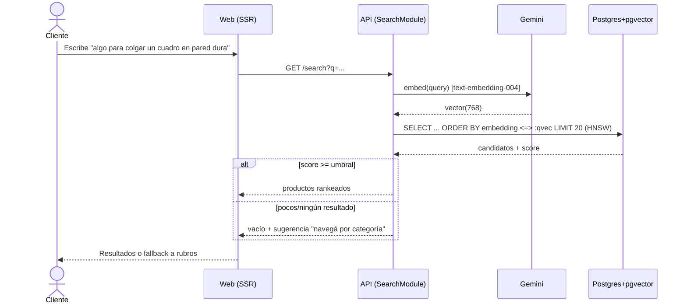
> Resiliencia: si Gemini falla/timeout, el endpoint degrada a búsqueda full-text (`tsvector` sobre `name`+`description_enriched`) sin romper la navegación.

### 9.2 Flujo: Checkout + pago + decremento de stock

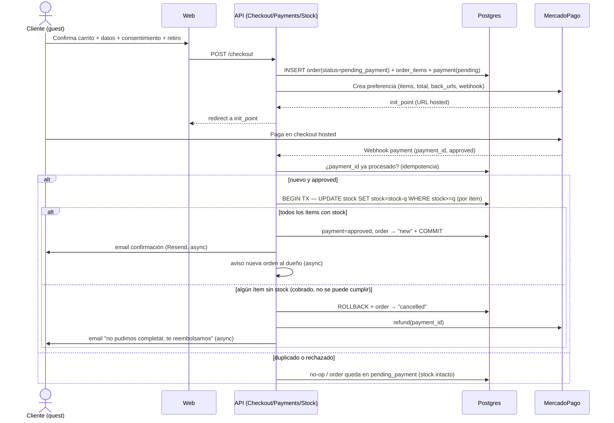
> El **medio simulado "DSM"** (PRD cap. 4) salta MercadoPago: `POST /checkout/simulate` marca el pago `approved` directo (solo en entornos test/demo, detrás de flag), disparando el mismo camino de decremento + notificación. Habilita el test E2E sin transacción real.

### 9.3 Flujo: Import masivo + enriquecimiento IA + embeddings (asíncrono)

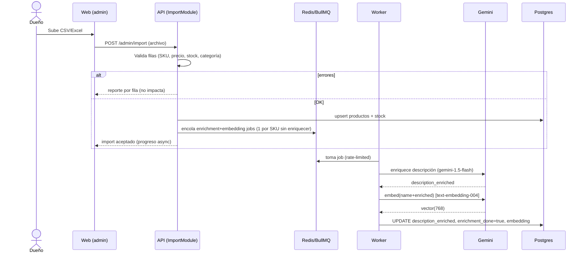
> Reintentos con backoff por rate-limit de Gemini. Re-enriquecer solo si cambia `description_raw` (control de costo).

### 9.4 Flujo: Fulfillment (gestión de órdenes del dueño)

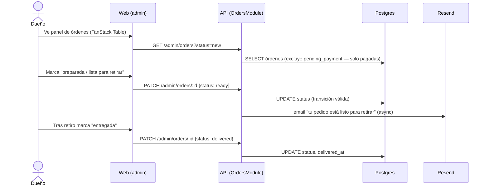

### 9.5 Flujo: Cancelación / reembolso (Should)

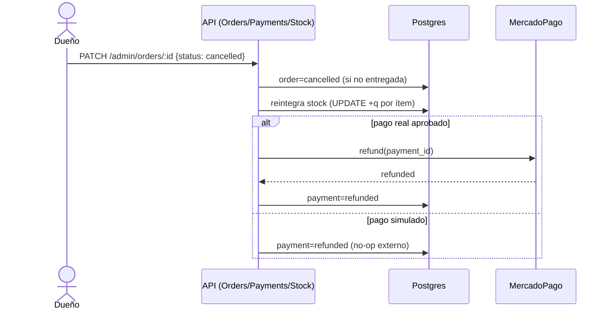

---

## 10. UML Clases — módulos con dominio rico (Opcional)

**Aplica a este proyecto**: no — razón: la lógica se modela mejor con secuencias (§9) y FSM de orden (§12). Sin orquestaciones de dominio que ameriten UML de clases.

## 11. UML Actividad (Opcional)

**Aplica a este proyecto**: no — los branches relevantes (búsqueda con fallback, webhook idempotente) ya están en §9.

## 12. UML Estados — FSM de Orden (Obligatorio para este proyecto)

**Aplica**: sí — la orden tiene estados explícitos.

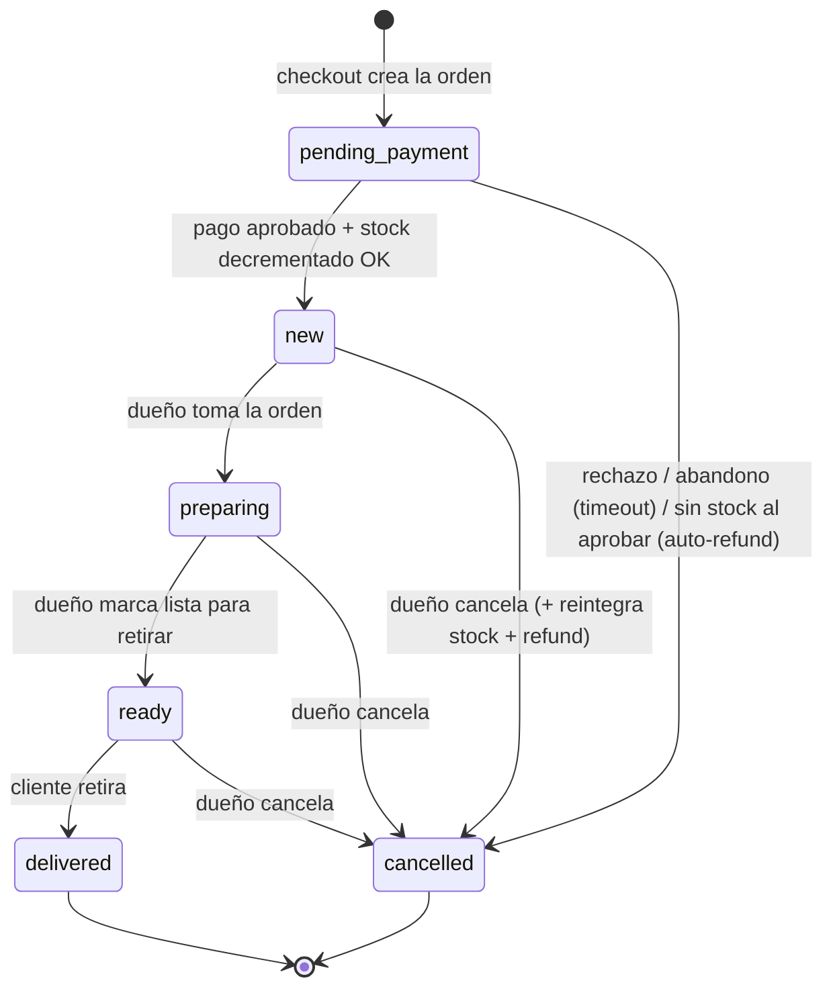
> `pending_payment` es el estado inicial (orden creada en checkout, aún sin pago confirmado); solo pasa a `new` cuando el webhook aprueba **y** el stock se decrementa OK. El **panel del dueño no muestra `pending_payment`** (solo órdenes pagadas). Un **job de limpieza** cancela las `pending_payment` vencidas (abandono). Transiciones inválidas (p. ej. `new → delivered`) rechazadas por el `OrdersModule`. `delivered` y `cancelled` son terminales.

## 13. Despliegue (Obligatorio)

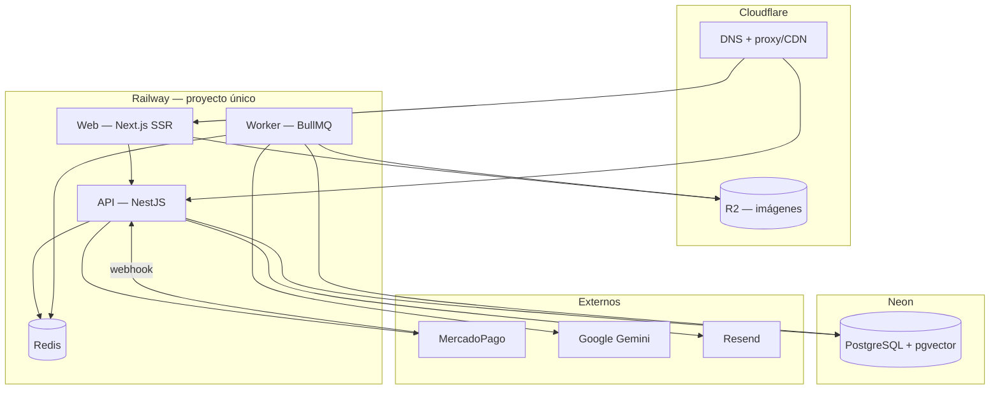

**Detalles**:
- **Region**: Railway + Neon en US-East (más barato/baja latencia a MercadoPago AR aceptable; revisar si se exige residencia AR — §23 Q-3).
- **Multi-AZ**: no (plan económico Railway/Neon; aceptable para 99.5%).
- **Backup strategy**: Neon point-in-time + snapshots diarios (RPO ≤ 24h). R2 versionado de imágenes.
- **Secret management**: variables de entorno cifradas de Railway (MP keys, Gemini key, Resend key, JWT secret, DB/Redis URLs). Nunca en repo ni imagen.
- **TLS**: gestionado por Railway/Cloudflare (HTTPS extremo).
- **Asincronía / colas**: Redis + BullMQ (worker dedicado). Webhook de MP idempotente.

---

## 14. Data Flow + Trust Boundaries (Obligatorio — STRIDE)

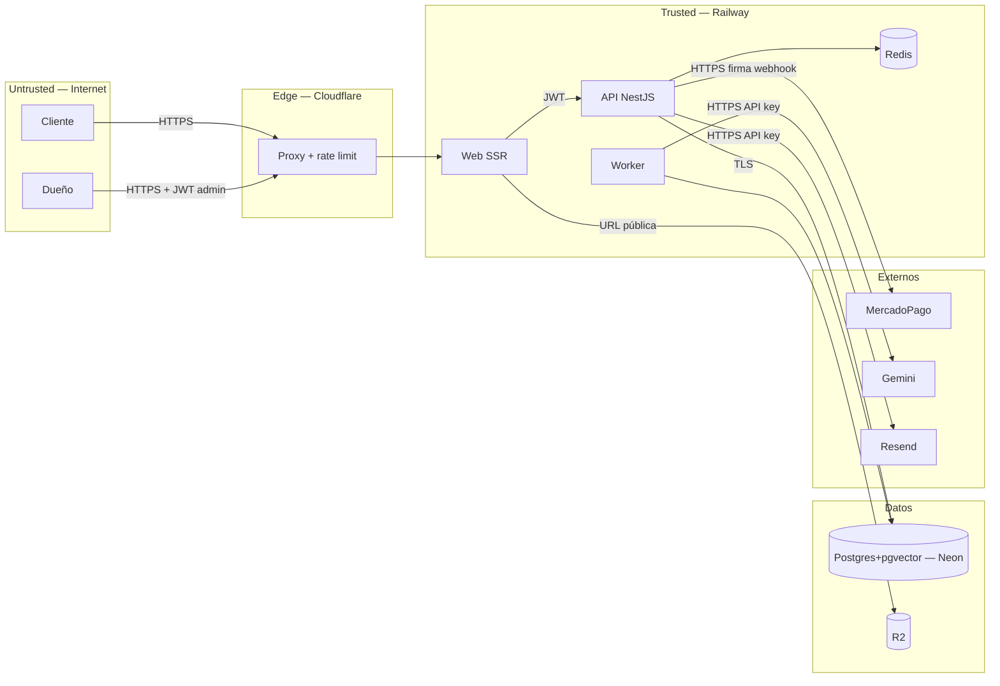

**STRIDE (superficies críticas):**

| Superficie | Amenaza | Mitigación |
|---|---|---|
| Webhook MercadoPago | **Spoofing/Tampering** (falso "approved") | Validar firma/`x-signature` de MP + re-consultar el pago a la API de MP antes de decrementar. Idempotencia por `payment_id`. |
| Endpoints admin (`/admin/*`) | **Elevation of privilege** | JWT con `role=admin` + guard; no exponer panel sin auth. |
| Pago simulado "DSM" | **Tampering** (uso en prod) | Detrás de feature flag deshabilitado en producción; solo test/demo. |
| Login / registro / sesión | **Brute force / enumeration / robo de token** | Rate-limit (Redis) + bcrypt + mensajes genéricos. **JWT en cookie `httpOnly`+`secure`+`SameSite` (NO localStorage)**; access corto (~15min) + **refresh token rotado**; logout invalida el refresh. 2FA opcional para el admin. |
| Datos del comprador (PII) | **Information disclosure** | TLS en tránsito; sin PAN/CVV (hosted MP); borrado de cuenta (`deleted_at`); PII fuera de logs. |
| Import de archivos | **DoS / injection** | Límite de tamaño/filas, validación estricta, parser seguro; jobs rate-limited. |
| Búsqueda / IA | **Cost abuse / prompt injection** | Rate-limit de `/search`; el texto del usuario no ejecuta acciones (solo embedding); cache de queries frecuentes en Redis. |

**Reglas**: ningún cliente habla directo con la DB. Secrets solo en env de Railway. JWT con scope mínimo (cliente vs admin).

---

## 15. BPMN (Cuando aplica)

**Aplica a este proyecto**: no — los procesos cross-system (pago, fulfillment) se cubren con secuencias §9 y FSM §12; no hay procesos con múltiples aprobaciones humanas que ameriten BPMN.

## 16. Stack de herramientas técnicas

| Concern | Tool |
|---|---|
| Backend | NestJS (Node + TypeScript) |
| Web framework | Next.js (SSR) + TypeScript |
| DB primaria | PostgreSQL (Neon) + extensión `pgvector` |
| ORM | **Prisma** (esquema + migraciones). Las queries vectoriales (kNN) van por **`$queryRaw`** — pgvector no es tipo nativo de Prisma. |
| Vector search | pgvector, índice HNSW (`vector_cosine_ops`), 768 dims |
| Cache / colas | Redis (Railway) + BullMQ |
| Object storage | Cloudflare R2 |
| IA | Google Gemini — `text-embedding-004` + `gemini-1.5-flash` |
| Email | Resend |
| Auth | JWT propio (Passport) + bcrypt |
| Pagos | MercadoPago Checkout Pro (hosted) + medio simulado "DSM" |
| UI base | Tailwind + ShadCN UI + TanStack Table + Recharts (design-system.md) |
| Observability | Sentry (errores FE+BE) + logs estructurados (pino) + métricas Railway *(ver §18, desviación del default OSS)* |
| CI/CD | GitHub Actions + SonarCloud |
| Hosting | Railway (web + api + worker + redis) · Neon (DB) · Cloudflare (DNS/CDN/R2) |

---

## 17. NFRs traducidos a infraestructura

(Hereda del PRD §4.)

| NFR producto | Cómo se cumple en infra |
|---|---|
| 99.5% disponibilidad mensual | Railway health checks + restart automático; Neon managed. Sin multi-AZ (aceptable). |
| p95 lectura < 300ms (catálogo/ficha) | SSR + índices (`category_id,status`) + cache de listados en Redis + CDN Cloudflare para estáticos/imágenes. |
| p95 escritura < 500ms (carrito/orden) | Transacciones cortas; decremento atómico de stock. |
| p95 búsqueda IA < 1.5s | `text-embedding-004` (latencia baja) + HNSW kNN + cache Redis de queries frecuentes; degradación a full-text si Gemini lento. |
| SEO / LCP < 2.5s | Next.js SSR, `next/font` self-host, imágenes optimizadas en R2/CDN, sitemap + JSON-LD de producto. |
| ~50 concurrentes pico / ≥5.000 SKUs | HNSW escala a decenas de miles de vectores; paginación cursor/offset en listados y panel. |
| RPO ≤ 24h | Neon snapshots diarios + PITR. |
| RTO ≤ 4h | Runbook de restore (Neon restore + redeploy Railway). |
| Idempotencia de pagos | `payments.external_id` UNIQUE + verificación de estado antes de decrementar. |
| WCAG 2.1 AA | Tokens y componentes del design-system (contraste verificado). |

> Sin TBD. Números heredados del PRD; los de infra son `[propuestos — confirma Arquitecto]` donde dependan de medición real (cache TTLs, tamaños de réplica).

---

## 18. Plan de observabilidad

> **Desviación del default OSS** (Grafana Loki/Tempo/Prometheus): en Railway se usa su observabilidad nativa + Sentry, evitando operar un stack Grafana propio (coherente con budget). Registrado como nota en ADR-0001.

| Stack | Logs | Métricas | Traces | Errores | Alertas |
|---|---|---|---|---|---|
| Backend NestJS | `pino` JSON → Railway logs | Railway metrics + contadores app | Sentry tracing (opcional) | Sentry | Sentry → email/Slack |
| Worker BullMQ | `pino` JSON | Métricas de cola (jobs ok/fail/retry) | — | Sentry | alerta si cola atascada |
| Frontend Next.js | console + Sentry | Web Vitals (Sentry/RUM) | propagado | Sentry | Sentry |
| MercadoPago | log de webhooks (sin PII) | tasa approved/rejected | — | Sentry en fallo de verificación | alerta en picos de rechazo |

Eventos de negocio a instrumentar: búsquedas (con/sin resultado → mide relevancia, KPI PRD §1.4), órdenes por estado, jobs de enriquecimiento (cobertura del catálogo).

---

## 18.5 Operatividad / Runbook operacional

Cómo se **opera** el sistema una vez desplegado. Dos roles de operación:
- **Operador de negocio (Pedro / dueño)** — opera vía el panel web (backoffice): catálogo, órdenes, métricas. No toca infraestructura.
- **Operador técnico (dev de guardia)** — opera la plataforma: deploys, secretos, incidentes, restores.

**Tareas day-2 del operador de negocio** (todo desde el panel, sin soporte técnico):

| Tarea | Cómo |
|---|---|
| Cargar/actualizar catálogo | Subir CSV/Excel → ver progreso del enriquecimiento → revisar errores por fila |
| Procesar una venta | Panel de órdenes: `new` → preparar → marcar `ready` (avisa al cliente) → `delivered` |
| Cancelar / reembolsar | Acción en la orden → reintegra stock + refund MercadoPago |
| Ver el negocio | Panel de métricas (ventas, productos más pedidos) |
| Producto sin stock | Editar stock o despublicar (`status=archived`) |

**Runbooks day-2 del operador técnico** (respuesta a incidentes / alertas de §18):

| Síntoma / alerta | Acción |
|---|---|
| Webhook MP no llega / órdenes atascadas en `pending_payment` | Reconciliar consultando estado a la API de MP (job/endpoint manual idempotente); reintentar decremento |
| Gemini caído / rate-limited | Búsqueda degrada a full-text (automático); jobs de enriquecimiento reintentan con backoff — sin acción salvo que persista (subir cuota) |
| Cola BullMQ atascada | Revisar jobs fallidos / dead-letter en el dashboard de la cola; reprocesar; verificar Redis up |
| Caída de la app | Railway reinicia por health check; si persiste, redeploy del último build verde |
| Restore de datos (RTO ≤ 4h) | Neon PITR/snapshot → restore → redeploy Railway → smoke test del loop (buscar → comprar simulado → preparar) |
| Rotar secretos (MP/Gemini/Resend/JWT) | Env vars de Railway → redeploy; rotar `JWT secret` invalida sesiones |
| Deploy / rollback | GitHub Actions → Railway; rollback = redeploy del commit anterior |

**Salud vigilada** (de §18): cola sin atascarse · tasa de rechazo de pagos · cobertura de catálogo enriquecido · errores Sentry · búsquedas sin resultado (señal de demanda/faltante).

---

## 19. Estrategia de testing

(Modelo de 3 capas — `qa-three-layer-regression`.)

| Capa | Qué se testea | Herramientas | Cobertura objetivo |
|---|---|---|---|
| Unit BE (L1) | Servicios, validación import, decremento stock, idempotencia | Jest | > 80% lógica de dominio |
| Integration BE | Handlers + Postgres real (con pgvector) + Redis | Jest + Testcontainers | Endpoints críticos |
| Contract | OpenAPI vs implementación | Spectral / supertest sobre el spec | Todos los endpoints públicos |
| Unit FE (L2) | Componentes con lógica (SearchBar, Cart) | Vitest + RTL | Componentes con lógica |
| E2E (L3) | Loop completo con **pago simulado DSM** | Playwright | Top flujos: buscar→comprar→preparar→entregar, import, cancelación |
| Performance | `/search`, listado, checkout | k6 | Targets §17 |
| Búsqueda IA (calidad) | Batería ~30 consultas NL → top-5 | script + assertions | ≥ 70% relevancia (KPI PRD) |

> El **medio de pago simulado "DSM"** es load-bearing para el E2E automatizado: permite ejercer el camino de pago/decremento/notificación sin transacción real.

---

## 20. Decisiones que necesitan ADR

- [ ] ADR-0001: Plataforma Railway + Neon + Cloudflare R2 (desviación del baseline AWS Lightsail; incluye nota de observabilidad Sentry+Railway en vez de Grafana OSS).
- [ ] ADR-0002: PostgreSQL + `pgvector` (HNSW) como datastore único, sin motor de búsqueda dedicado.
- [ ] ADR-0003: Google Gemini (`text-embedding-004` + `gemini-1.5-flash`) como proveedor de IA (embeddings + enriquecimiento).
- [ ] ADR-0004: Redis + BullMQ para procesamiento asíncrono.
- [ ] ADR-0005: Autenticación propia (NestJS + JWT + bcrypt) vs SaaS — incluye cookie `httpOnly`+`secure`+`SameSite`, access corto + refresh rotado, rate-limit/lockout, 2FA admin opcional.
- [ ] ADR-0006: MercadoPago Checkout Pro (hosted) + medio de pago simulado "DSM" para test/demo.
- [ ] ADR-0007: Monolito modular NestJS (vs microservicios), con stock desacoplado para ML downstream.
- [ ] ADR-0008: Decremento de stock al aprobar pago con UPDATE atómico + idempotencia (vs reserva con TTL).

## 21. Suposiciones técnicas

- Neon soporta la extensión `pgvector` con índice HNSW en el plan elegido.
- El volumen del catálogo (~5.000 SKUs) y la concurrencia (~50) caben en planes económicos de Railway/Neon sin sharding ni réplicas.
- MercadoPago provee firma verificable de webhook y endpoint de consulta de pago + refund en la cuenta de DSM.
- Gemini tiene cuota/rate-limit suficiente para enriquecer el catálogo inicial en una ventana razonable (worker con backoff).
- El dueño provee un CSV/Excel con columnas mínimas (SKU, descripción base, precio, stock, categoría).

## 22. Riesgos técnicos

| Riesgo | Probabilidad | Impacto | Mitigación |
|---|---|---|---|
| Calidad de embeddings insuficiente por descripciones pobres | media | alto | Enriquecimiento IA (cap. 3) + fallback a browse por categoría + batería de relevancia (KPI ≥70%). |
| Rate-limit / costo de Gemini en import inicial masivo | media | medio | Worker con backoff + re-enriquecer solo si cambia descripción + cache. |
| Webhook de MP perdido/duplicado/tardío | media | alto | Idempotencia + reconciliación (consulta de estado a MP) + reintentos. |
| Oversell por concurrencia en stock | baja | medio | UPDATE atómico condicional (`stock >= q`) + CHECK; decremento solo al aprobar. |
| Plan económico sin multi-AZ → caída prolongada | baja | medio | RPO/RTO documentados; runbook de restore; 99.5% lo tolera. |
| Residencia de datos AR (PII) en US-East | baja | medio | Confirmar requisito legal (§23 Q-3); Neon permite región. |

## 23. Preguntas abiertas

| Id | Pregunta | A quién | Bloquea aprobación |
|---|---|---|---|
| Q-1 | Aprobar `design-system.md` para poder firmar §10. | Arquitecto + PO | ✅ Resuelta — `design-system.md` `Approved` el 2026-06-15. |
| Q-2 | Plan concreto de Neon/Railway que garantice `pgvector`+HNSW y backups PITR. | Arquitecto | No (confirmación, no rediseño) |
| Q-3 | ¿Ley 25.326 exige residencia de PII en Argentina? Define región de Neon/Railway. | PO / Legal | No (default US-East; ajustable) |
| Q-4 | Ventana aceptable para el enriquecimiento inicial del catálogo (afecta rate-limit/costo). | PO | No |

> Ninguna bloquea la **autoría** del E2E. Q-1 bloquea la firma `Approved` de §10 (gate del design-system).

---

## 24. Aprobación

- [x] Arquitecto: **Gabriel Suarez**  Fecha: **2026-06-15**

> E2E **Approved** el 2026-06-15 (incluida la firma de §10 — `design-system.md` está `Approved`). Input habilitado para que el PO escriba las User Stories. Cambios materiales posteriores → Change Request (CR).
