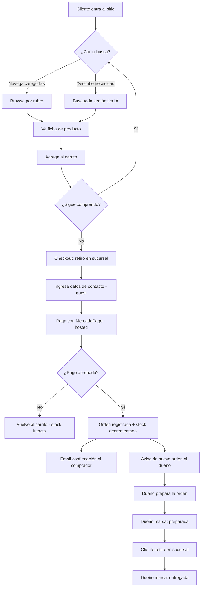
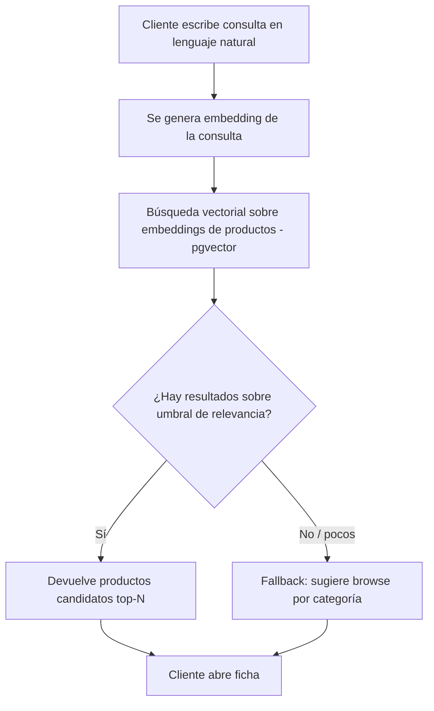
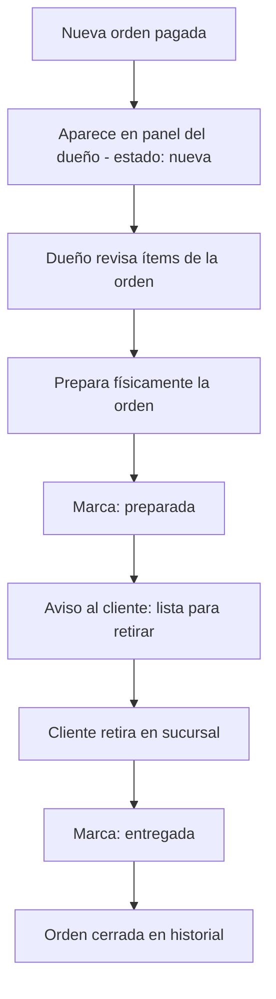
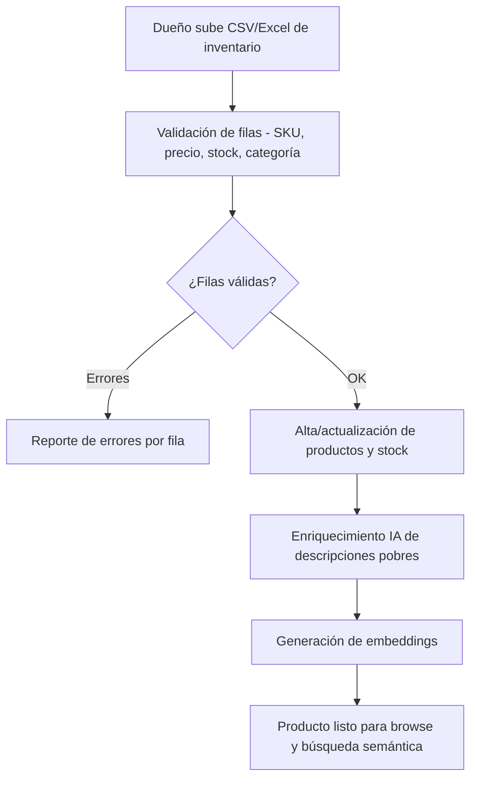

# Product Requirements Document — DSM Refrigeración y Ferretería (E-commerce)

> **Audiencia**: INTERNA (PO + Arquitecto + equipo). Profundidad media-alta. Expande el brief de discovery con use cases, casos borde, NFRs numéricos e integraciones detalladas.
>
> **Reglas clave**:
> - El idioma del PRD (`es`) define el idioma del resto del proyecto (E2E, US, código).
> - Cambios al PRD post-aprobación → solo vía Change Requests si afectan el alcance.

---

## 1. Visión del producto

### 1.1 Una frase

Tienda online para DSM Refrigeración y Ferretería que permite **encontrar productos describiendo la necesidad en lenguaje natural**, comprarlos con MercadoPago y retirarlos en sucursal, mientras el dueño gestiona inventario y órdenes desde un panel — con el stock como única fuente de verdad.

### 1.2 Por qué existe

DSM es una ferretería real con un local en CABA (en la esquina de Av. Córdoba y Av. Pueyrredón) que **hoy no tiene ninguna presencia digital**: no vende online ni aparece en Google. Pierde ventas frente a competidores que sí están en internet, y depende del tráfico a pie. El producto cierra el loop comercial completo —el cliente **encuentra y paga**, el dueño **prepara y entrega**— y diferencia a DSM con una búsqueda inteligente que entiende lo que el cliente necesita aunque no sepa el nombre técnico del producto ("algo para colgar un cuadro en pared dura").

### 1.3 A quién sirve

- **Usuario primario**: cliente final comprador (particular o pequeño gremio — plomero, electricista, refrigerista) que busca un producto de ferretería para retirar en sucursal. Compra como invitado o, opcionalmente, con cuenta.
- **Usuarios secundarios**: el dueño/administrador (Pedro Suarez), que carga y mantiene el catálogo y gestiona las órdenes.
- **Decisor / comprador del producto**: Pedro Suarez (dueño de DSM) — patrocina el proyecto y define prioridades de negocio.

### 1.4 Cómo se mide el éxito

Criterio **mixto**: el MVP no tiene baseline (cero presencia digital previa), por lo que el éxito primario es un **entregable verificable** (el loop end-to-end funcionando) y los KPIs de negocio son **targets aspiracionales proyectados** sin baseline histórico.

| Métrica | Definición | Baseline | Target a fecha |
|---|---|---|---|
| Loop E2E funcional | El recorrido buscar → pagar → preparar → entregar se completa sin intervención manual fuera del panel | N/A (no existe) | 100% del flujo demostrable en MVP |
| Relevancia de búsqueda IA | % de consultas en lenguaje natural de una batería de prueba que devuelven ≥1 producto correcto en el top-5 | N/A | ≥ 70% en MVP (batería de ~30 consultas representativas) |
| Cobertura de catálogo enriquecido | % de SKUs con descripción enriquecida apta para embeddings | 0% (catálogo pobre del local) | ≥ 90% del catálogo importado |
| Indexación SEO | Páginas de categoría y producto indexadas por Google | 0 | Sitemap enviado + páginas indexables (SSR) al cierre del MVP |
| Órdenes online / mes | Órdenes pagadas vía el e-commerce | 0 (sin canal digital previo) | **100 órdenes/mes** como objetivo base, fijado por el dueño |
| Tasa de conversión *(proyectado)* | Órdenes pagadas / sesiones | 0 | Aspiracional — se establece como baseline tras el 1er mes con tráfico real |

> **Nota**: el KPI de conversión marcado *(proyectado)* no bloquea la aprobación del PRD; se ratifica como baseline real una vez haya tráfico. El objetivo base de 100 órdenes/mes es el norte de negocio del MVP.

## 2. Alcance funcional

### 2.1 Capacidades incluidas

Cada capacidad se descompone luego en N User Stories.

| # | Capacidad | Outcome de usuario | Prioridad (MoSCoW) |
|---|---|---|---|
| 1 | **Catálogo y navegación por categorías** | El cliente navega productos por rubros (refrigeración, plomería, electricidad, etc.) y el dueño da de alta/edita productos. Las páginas de categoría/producto son indexables (SEO). | Must |
| 2 | **Búsqueda semántica con IA** | El cliente describe su necesidad en lenguaje natural y recibe productos candidatos relevantes, sin conocer el nombre técnico. Es el diferenciador. | Must |
| 3 | **Enriquecimiento de descripciones con IA** | El dueño obtiene descripciones de producto ricas (a partir de datos pobres del catálogo del local) para que los embeddings entiendan las consultas. Sub-objetivo crítico que habilita la capacidad 2. | Must |
| 4 | **Ficha, carrito y checkout guest con MercadoPago** | El cliente ve la ficha, arma el carrito, deja sus datos de contacto sin crear cuenta y paga con MercadoPago (checkout hosted, fuera de alcance PCI). Incluye además un **medio de pago simulado «DSM»** (modo test/demo) que aprueba la compra sin transacción real, para pruebas del cliente, demos del sistema y el test E2E. | Must |
| 5 | **Fulfillment: retiro en sucursal + panel de órdenes del dueño** | El cliente confirma el retiro en la sucursal (única — esquina Av. Córdoba y Av. Pueyrredón) y el dueño ve las órdenes y gestiona el estado (nueva → preparada → entregada). | Must |
| 6 | **Registro de orden, ajuste de stock y notificaciones** | Cada orden pagada se registra, decrementa stock (única fuente de verdad) y dispara email de confirmación al comprador + aviso de nueva orden al dueño. Cuando el dueño marca la orden **«preparada / lista para retirar», el cliente recibe un aviso** para pasar a buscarla. | Must |
| 7 | **Importación masiva de inventario (CSV/Excel)** | El dueño carga/actualiza miles de SKUs de una vez (alta y actualización de precios incluida); el alta manual no escala para un catálogo real de ferretería. | Should |
| 8 | **Cuentas de cliente registradas** | El cliente puede registrarse, iniciar sesión y ver su historial de compras; el guest checkout cubre el loop, esto agrega retención. | Should |
| 9 | **Panel de métricas del dueño** | El dueño visualiza gráficos sobre las órdenes (historial de 12 meses) para medir el negocio: ventas, productos más pedidos, evolución temporal. Forma parte del **Backoffice administrativo** junto con la gestión de catálogo (cap. 1) y de órdenes (cap. 5). | Should |
| 10 | **Páginas legales + consentimiento** | El sitio publica política de privacidad y términos, y el cliente da consentimiento al comprar (se recolecta PII + se cobra). Requisito legal para salir a producción en Argentina (Ley 25.326 de protección de datos personales). | Must |
| 11 | **Cancelación / reembolso de orden** | El dueño puede cancelar una orden pagada y gestionar el reembolso vía MercadoPago; el stock se reintegra. Cierra el camino post-venta. | Should |
| 12 | **Canal de contacto / soporte (WhatsApp)** | Botón/enlace de WhatsApp para consultas pre y post-venta ("¿tenés X?", "¿está lista mi orden?"), el canal dominante en Argentina. | Should |

> **Backoffice administrativo del dueño** = capacidades 1 (admin de catálogo), 5 (órdenes), 9 (métricas) e 11 (cancelaciones), todas como sección dentro del frontend web (§9), no una app separada en MVP.
>
> Capacidades 7, 8, 9, 11 y 12 son **Should**: entran al MVP pero ceden ante las Must si la entrega se ajusta. La capacidad 7 habilita poblar el catálogo a escala real (precondición práctica de las capacidades 2 y 3). La capacidad 10 (legal) es **Must**: no se puede salir a producción recolectando PII y cobrando sin política de privacidad ni consentimiento.

### 2.2 Capacidades fuera del MVP 1 — Roadmap a producción

Estas capacidades **sí forman parte del producto** y son necesarias para la salida a producción plena; se **difieren** más allá del MVP 1, no se descartan. La arquitectura debe **contemplarlas desde el día 1** (especialmente MercadoLibre y la facturación AFIP). Excepción: la #6 (custodia PCI) es una decisión **permanente**, no un diferido.

| # | Fuera del MVP 1 | Motivo | Camino de incorporación |
|---|---|---|---|
| 1 | **Integración con MercadoLibre** (publicación + sync de stock bidireccional) | Alcance grande; el e-commerce primero debe ser la única fuente de verdad de stock. | CR + costo. La arquitectura de stock se diseña para soportar a ML como canal *downstream* (ver §11). |
| 2 | **Facturación electrónica AFIP** | Integración fiscal compleja; no bloquea el loop de venta/retiro. | CR + costo + revisión contable. |
| 3 | **Envíos a domicilio** (Correo Argentino / Andreani) | El MVP cierra con retiro en sucursal. | CR + costo + integración logística. |
| 4 | **Chatbot conversacional** | Evolución del buscador; el buscador semántico es el primer paso. | CR + costo (reusa los embeddings ya existentes). |
| 5 | **Filtros avanzados de catálogo** (por atributo, rango de precio, marca) | El browse por categoría + la búsqueda IA cubren el descubrimiento en MVP. | CR + costo. |
| 6 | **Custodia directa de datos de pago (PCI)** | Nunca almacenamos PAN/CVV; MercadoPago hosted mantiene a DSM fuera del alcance PCI. | No se agrega — decisión de seguridad permanente. Requeriría ADR + revisión legal. |

## 3. Flujos principales

### 3.1 Flujo: Compra end-to-end (descubrir → pagar → preparar → entregar)

**Pasos**:
1. El cliente entra y descubre productos por categoría o describiendo su necesidad (capacidad 1 o 2).
2. Abre la ficha, agrega al carrito, puede seguir comprando.
3. En checkout confirma el retiro en sucursal (única — esquina Córdoba y Pueyrredón) e ingresa datos de contacto como invitado.
4. Paga con MercadoPago (checkout hosted). DSM no toca datos de tarjeta.
5. Con el pago aprobado, la orden se registra, el stock se decrementa y se envían las notificaciones.
6. El dueño ve la orden en su panel, la prepara y la marca *preparada*; tras el retiro, *entregada*.

**Casos borde**:
- **Pago rechazado o abandonado**: la orden no se confirma y el stock **no** se decrementa (la reserva/decremento ocurre solo sobre pago aprobado vía webhook de MercadoPago).
- **Stock insuficiente al confirmar**: si un producto quedó sin stock entre el agregado al carrito y la confirmación, se avisa al cliente y no se cierra la orden con ese ítem.
- **Webhook de pago duplicado o tardío**: el procesamiento de confirmación es idempotente (una orden no se decrementa dos veces).
- **Carrito con producto despublicado**: si el dueño despublica un producto que está en un carrito activo, el checkout lo señala antes de cobrar.

### 3.2 Flujo: Búsqueda semántica con IA

**Pasos**:
1. El cliente escribe una necesidad en lenguaje natural.
2. El sistema genera el embedding de la consulta y hace búsqueda vectorial contra los embeddings de los productos (catálogo enriquecido por la capacidad 3).
3. Devuelve los candidatos más relevantes; si no hay suficiente señal, ofrece el browse por categoría como **red de seguridad**.

**Casos borde**:
- **Catálogo sin enriquecer**: si un producto no tiene descripción enriquecida ni embedding, no aparece en resultados semánticos — por eso la capacidad 3 es Must.
- **Consulta ambigua o fuera de dominio**: el fallback a categorías evita el "cero resultados" frustrante.
- **Proveedor de IA no disponible**: la búsqueda semántica degrada a búsqueda por texto/categoría sin romper la navegación (resiliencia; detalle en E2E).

### 3.3 Flujo: Gestión de órdenes del dueño (fulfillment)

**Pasos**:
1. La orden pagada entra al panel en estado *nueva*.
2. El dueño revisa los ítems, la prepara y avanza el estado a *preparada*; el cliente recibe un aviso de que su orden está lista para retirar.
3. Tras el retiro del cliente, la marca *entregada* y queda en el historial.

**Casos borde**:
- **Cliente no retira**: el dueño puede dejar la orden en *preparada* indefinidamente (no hay caducidad automática en MVP); gestión manual.
- **Transición de estado inválida** (p. ej. saltar de *nueva* a *entregada*): el panel solo permite el avance secuencial definido.

### 3.4 Flujo: Carga y enriquecimiento de catálogo (dueño)

**Pasos**:
1. El dueño sube un archivo con miles de SKUs (alta o actualización, incluido precio).
2. El sistema valida e impacta productos y stock.
3. Las descripciones pobres se enriquecen con IA y se generan los embeddings que habilitan la búsqueda semántica.

**Casos borde**:
- **Archivo con formato inválido o columnas faltantes**: se rechaza con reporte por fila, sin impactar el catálogo parcialmente de forma inconsistente.
- **Actualización de precios masiva (inflación)**: re-importar el archivo actualiza precios en ARS (ver §11 sobre moneda/IVA).
- **Re-enriquecimiento**: un producto ya enriquecido no se vuelve a procesar salvo que cambie su descripción base (control de costo de IA).

## 4. Requisitos no funcionales (NFRs)

Postura: **defaults de fábrica ajustados a presupuesto** (hosting económico: Railway + Neon + Cloudflare R2), con foco SEO. Escala objetivo: **catálogo real (miles de SKUs) con baja concurrencia** (decenas de usuarios concurrentes en pico).

| Categoría | Target |
|---|---|
| Disponibilidad | 99.5% mensual (~3.6h downtime/mes máximo) |
| Latencia p95 lectura (catálogo/ficha) | < 300ms |
| Latencia p95 escritura (carrito/orden) | < 500ms |
| Latencia p95 búsqueda semántica (incl. embedding de consulta) | < 1.5s |
| SEO / Core Web Vitals | LCP < 2.5s, render SSR para páginas de categoría y producto, sitemap + meta indexables |
| Concurrent users target | ~50 concurrentes en pico (baja concurrencia, catálogo grande) |
| Catálogo soportado | ≥ 5.000 SKUs sin degradación de búsqueda/browse |
| RPO | ≤ 24h (backups diarios — Neon) |
| RTO | ≤ 4h |
| Idempotencia de pagos | Procesamiento de webhook de MercadoPago idempotente (sin doble decremento de stock) |
| Accesibilidad | WCAG 2.1 AA |
| Idiomas soportados (UI) | Español (AR) — único idioma en MVP |
| Moneda / formato | ARS, precios con IVA incluido, formato local (ver §11) |

## 5. Integraciones externas

| Integración | Proveedor | Para qué | Quién tiene la cuenta | Modo de integración |
|---|---|---|---|---|
| Pagos | MercadoPago | Cobrar las órdenes online | Cliente (DSM) | **Checkout hosted** (token-only, fuera de alcance PCI) + webhook de confirmación. Soporta el **modo sandbox/test de MercadoPago** para pruebas. |
| Pago simulado «DSM» | Interno (no es proveedor externo) | Completar compras de prueba/demo sin transacción real | — | Gateway **mock** seleccionable en checkout: aprueba al instante y dispara el mismo flujo de orden (registro + stock + notificaciones). Habilitado solo en entornos de test/demo o detrás de un flag (no en producción real). |
| Email transaccional | **Resend** | Confirmación al comprador + aviso de nueva orden al dueño | Cliente (DSM) | API |
| IA — embeddings + generación de descripciones | Por confirmar — **opción económica** (LLM + embeddings de bajo costo) | Enriquecer descripciones (cap. 3) y generar embeddings de productos y consultas (cap. 2) | Cliente (DSM) | API |
| Almacenamiento de imágenes | Cloudflare R2 | Imágenes de productos | Cliente (DSM) | API/S3-compatible |

> **Regla**: ninguna integración con datos sensibles almacena PAN/CVV en el stack de DSM. MercadoPago hosted mantiene los datos de tarjeta fuera de alcance. Los datos de contacto del comprador (PII básica) sí se almacenan para gestionar la orden (ver §6).

## 6. Datos — alto nivel

(El DER detallado vive en `design-e2e.md` §DER. Aquí solo entidades + relaciones a nivel producto.)

- **Entidades principales**: Producto, Categoría/Rubro, Stock (único — una sola sucursal), EmbeddingDeProducto, Carrito, Orden, ÍtemDeOrden, Cliente (registrado, opcional), UsuarioAdmin (dueño). Sucursal única (esquina Av. Córdoba y Av. Pueyrredón) — no requiere modelarse como dimensión de stock.
- **Datos sensibles**: datos de contacto del comprador (nombre, email, teléfono) — PII básica. **No** se almacenan datos de tarjeta (hosted en MercadoPago).
- **Base legal**: la recolección de PII requiere **consentimiento explícito** en el checkout y páginas de **privacidad + términos** publicadas (cap. 10), conforme a la Ley 25.326 (AR).
- **Stock = única fuente de verdad**: el e-commerce es el sistema autoritativo de stock; el roadmap (MercadoLibre) consumirá este stock como canal downstream.
- **Política de retención**:
  - **Datos del comprador** (cuenta + contacto): se conservan **hasta que el cliente solicite el borrado de su cuenta**.
  - **Historial de órdenes**: se conserva **hasta 12 meses**, alimentando el panel de métricas del dueño (cap. 9).
  - **Embeddings**: se regeneran ante cambios de la descripción base del producto.

## 7. Permisos / roles

| Rol | Descripción | Qué puede hacer |
|---|---|---|
| **Admin / Dueño** (Pedro) | Operador del negocio | Alta/edición de productos y categorías, importación masiva, ver y gestionar órdenes (nueva → preparada → entregada), ver stock, actualizar precios. |
| **Cliente registrado** | Comprador con cuenta (Should) | Navegar, buscar, comprar, ver su historial de compras, gestionar sus datos. |
| **Invitado (guest)** | Comprador sin cuenta | Navegar, buscar, comprar dejando datos de contacto en el checkout. Cubre el loop completo del MVP. |

> No hay multi-tenant. Un único negocio (DSM), un dueño y **una única sucursal** (esquina Av. Córdoba y Av. Pueyrredón). El stock es único, no segmentado por sucursal.

## 8. Diseño — referencias

- **Tiene Figma**: **No** (decisión confirmada por el PO).
- **Dependencia**: se generará `docs/product/design-system.md` como fuente de verdad visual + de interacción antes de la primera tarea de UI.
- **Acción pendiente** (no es pregunta abierta): materializar el design-system baseline antes del primer ticket de frontend.

## 9. Plataformas / stacks (heredado de project-config.yml)

| Stack | Incluido | Notas |
|---|---|---|
| Backend (NestJS / Node) | sí | API, lógica de catálogo/órdenes/stock, integración MercadoPago e IA. |
| Frontend Web (Next.js) | sí | SSR para SEO (categorías + fichas indexables). Incluye el **Backoffice administrativo del dueño** (catálogo + órdenes + métricas + cancelaciones) como sección dentro del web, no como app `-BO` separada en MVP. |
| Infra | sí | Railway (compute), Neon (PostgreSQL + pgvector para embeddings), Cloudflare R2 (imágenes). |
| QA | sí | Estrategia de pruebas del loop crítico y de la calidad de búsqueda IA. |
| iOS / Android | no | Fuera de alcance — el MVP es web responsive. |
| Backoffice (app separada) | no | El Backoffice administrativo del dueño vive como sección del frontend web; se podría extraer a una app separada si el negocio crece. |

> Coincide con `docs/project-config.yml` (`stacks.active: [BE, WEB, INFRA, QA]`).

## 10. Plan de releases (alto nivel)

Cada cycle Linear (2 semanas) → un mini-release / demo. Curva de valor creciente; el loop comprable queda utilizable lo antes posible.

| Cycle | Capacidades a entregar | Demo al cliente |
|---|---|---|
| 1 | Setup del proyecto + Capacidad 1 (catálogo: alta/edición + navegación por categorías, SSR/SEO base) + Capacidad 7 (importación masiva CSV/Excel) | El dueño carga el catálogo real por archivo y el cliente navega por rubros en un sitio indexable. |
| 2 | Capacidad 3 (enriquecimiento IA de descripciones) + Capacidad 2 (búsqueda semántica con IA + fallback a browse) | El cliente describe una necesidad en lenguaje natural y obtiene productos relevantes. |
| 3 | Capacidad 4 (ficha + carrito + checkout guest con MercadoPago **+ pago simulado «DSM»**) + Capacidad 6 (registro de orden + ajuste de stock + idempotencia de webhook) + Capacidad 10 (páginas legales + consentimiento) | Un cliente compra de punta a punta y paga (real o simulado); el stock se decrementa, con privacidad/términos publicados. |
| 4 | Capacidad 5 (retiro en sucursal + panel de órdenes del dueño) + notificaciones email **incl. aviso "lista para retirar"** (Capacidad 6) + Capacidad 11 (cancelación/reembolso) + Capacidad 12 (WhatsApp) | El loop completo: el dueño ve la orden, la prepara y la marca entregada; ambas partes reciben emails; el cliente puede cancelar y contactar por WhatsApp. |
| 5 | Capacidad 8 (cuentas registradas + historial) + Capacidad 9 (panel de métricas del dueño) + endurecimiento SEO y NFRs | El cliente se registra y ve su historial; el dueño ve gráficos de sus órdenes; revisión de Core Web Vitals e indexación. |

> El loop comprable mínimo (Must) queda cerrado al final del cycle 4, incluida la cap. 10 (legal), prerequisito para cobrar en producción. El cycle 5 agrega los Should restantes (cap. 8 y 9) y el pulido. Las capacidades Should ceden primero si el cycle se ajusta.

## 11. Suposiciones

- El dueño (Pedro) provee el inventario en un archivo CSV/Excel procesable (con al menos SKU, descripción base, precio, stock, categoría). Si el archivo no es procesable → CR (trabajo de normalización de datos).
- El catálogo del local viene con descripciones pobres; el enriquecimiento IA es viable y suficiente para que los embeddings entiendan consultas representativas. Si no alcanza la calidad, el browse por categoría es la red de seguridad (riesgo mitigado, no eliminado).
- DSM tiene (o creará) cuenta de MercadoPago habilitada para checkout hosted + webhooks.
- **Precios en ARS con IVA incluido**; la actualización de precios por inflación se realiza vía re-importación masiva (Capacidad 7) o edición del dueño. El MVP **no** calcula ni discrimina IVA en factura (sin facturación AFIP — ver §2.2). Si el negocio requiere discriminar IVA o facturar → CR.
- El stock es la única fuente de verdad y el MVP es el único canal de venta digital; cuando se agregue MercadoLibre (roadmap), este e-commerce permanece autoritativo y ML es downstream. La arquitectura de stock se diseña con esa premisa.
- **Stock único** (una sola sucursal, esquina Córdoba y Pueyrredón): no se segmenta por ubicación, lo que simplifica el decremento y el checkout.
- Hosting económico (Railway + Neon + R2) es suficiente para la escala objetivo (miles de SKUs, ~50 concurrentes). Si el tráfico crece muy por encima → CR de escalado.
- Un único idioma (español AR) y un único negocio (sin multi-tenant) en MVP.

## 12. Preguntas abiertas

| Id | Pregunta | A quién | Estado | Bloquea aprobación |
|---|---|---|---|---|
| Q-1 | Objetivo de órdenes/mes del MVP. | Cliente (Pedro) | ✅ Resuelta — **100 órdenes/mes** como objetivo base (§1.4). La conversión se fija como baseline tras el 1er mes con tráfico. | No |
| Q-2 | Política de retención de datos del comprador y de órdenes. | Cliente (Pedro) | ✅ Resuelta — datos del comprador hasta borrado de cuenta; órdenes 12 meses con panel de gráficos (§6, cap. 9). | No |
| Q-3 | Fuente de diseño sin Figma. | Equipo | ✅ Resuelta — se usa un design-system propio (sin Figma); pendiente: materializarlo antes del primer ticket de UI (§8). | No |
| Q-4 | Proveedor de IA (embeddings + generación de descripciones): debe ser una **opción económica**; elegir el proveedor concreto y estimar costo por volumen de catálogo. *(Email ya confirmado: Resend.)* | Arquitecto + Cliente | 🟡 Abierta — se cierra en el diseño E2E. | No |
| Q-5 | Modelo de stock por sucursal. | Cliente (Pedro) | ✅ Resuelta — **una sola sucursal**, stock único (§6, §7, §11). | No |

> Solo queda abierta **Q-4** (elección del proveedor de IA económico), que no bloquea la aprobación y se resuelve en el E2E.

## 13. Aprobación

- [x] Product Owner: **Pedro Suarez**  Fecha: **2026-06-14**
- [x] Arquitecto: **Gabriel Suarez**  Fecha: **2026-06-14**

> PRD **Approved** el 2026-06-14. Cambios posteriores se gestionan como Change Request (CR).

## 14. Siguiente paso

PRD aprobado → arrancar `design-e2e.md` (la Solución End-to-End técnica) con el arquitecto. El E2E debe resolver **Q-4** (proveedor de IA económico), contemplar la premisa de **stock único** y la de stock como única fuente de verdad para el roadmap de MercadoLibre, y referenciar el design-system como fuente visual.
