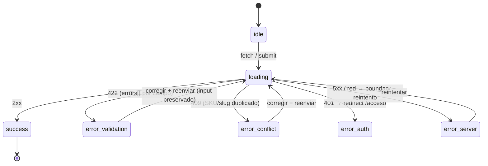

# US-001 Frontend Web — Design

## Context

El E2E (`Approved`) fija la arquitectura FE: Web App Next.js con SSR (§6.2, §16), el "panel del dueño" como una sección del web (no app separada — E2E §6.2, PRD §9), consumiendo la API NestJS vía un **cliente HTTP centralizado** (§6.2 "API client — Cliente HTTP centralizado"). El `design-system.md` (`Approved`, sin Figma) es la fuente de verdad visual: TanStack Table para el backoffice (§7.9), Button/Input/Field (§7.1/7.2), PriceTag ARS (§7.4), confirmación destructiva de dos pasos (§7.5), contrato de tokens con alias semánticos (§12.1), a11y WCAG 2.1 AA (§11).

El change de backend (`US-001-admin-catalogo-productos-backend`) ya entregó la API de administración: `/v1/admin/categories` y `/v1/admin/products` bajo `AdminGuard`, errores RFC 7807 (`type: dsm:catalog/*`, `errors[]` por campo en 422), money como entero `price_ars_cents` (centavos ARS), listado paginado (`limit`/`offset` → `pagination{limit,offset,total}`), máquina de estado `draft|published|archived` vía `PATCH {status}`. Este design **no re-arquitectura** nada: transcribe las decisiones del E2E + design-system a la superficie FE y **consume el contrato OpenAPI del backend como está**. `apps/web` es hoy un placeholder vacío; la Fase 1 lo scaffoldea con `create-next-app` (cross-reference del `bootstrap-local`, owned-by-FE).

La decisión de auth admin (OQ-1 del backend) quedó resuelta y formalizada en **ADR-0009**: el backend gatea con un seam mínimo (`role=admin` JWT). El FE tiene la pregunta espejo (OQ-FE-1): cómo obtiene Pedro ese token en US-001 — única pregunta abierta de este change.

## Goals

- Entregar el **panel del dueño** que consume la API de administración del catálogo, cubriendo los ACs FE-relevantes (AC-1..AC-9) a nivel superficie de usuario.
- Cliente HTTP centralizado con interceptores (auth, trace, timeout) + mapeo RFC 7807 → `AppError` tipado (`frontend-standards.md` §8, §11.1, §11.3).
- Capa de repositorio por recurso (§11.5) + state holders con unión discriminada (§11.4, §11.9).
- Formularios con validación cliente espejo de los DTO (§11.bis.6) + render de errores 422 por campo y 409.
- Accesibilidad WCAG 2.1 AA (US §9, design-system §11) + resiliencia (`frontend-resilience-patterns`) como concerns de primera clase.
- Suite de tests owned-by-dev (unit/component/integration MSW + smoke E2E).

## Non-goals

- Storefront público, ficha, búsqueda IA, carrito, checkout → US-002/003/004/005.
- Upload de imágenes a R2, import masivo CSV, enriquecimiento IA de descripciones → US-006/US-005.
- Panel de órdenes / fulfillment / métricas (Recharts) → US posteriores.
- AuthModule completo del FE (registro, login cliente, cookie `httpOnly`, refresh rotado, 2FA, "mi cuenta") → US-014. Solo el seam admin mínimo (ADR-0009).
- Modo oscuro (excluido del MVP; la capa de alias §12.1 lo deja habilitable sin reescribir componentes).
- Cambios de contrato de API o de esquema: ninguno. Se consume el OpenAPI del backend; una necesidad de cambio se escala al backend, no se resuelve acá.

## Approach

### Estructura de la app (a scaffoldear en `apps/web`)

Package-by-feature (`frontend-standards.md` §2). App Router con route group `(admin)` para el panel.

```
apps/web/                              # @dsm/web — create-next-app, App Router, TS strict
├── package.json                       # next 15, react 19, tailwind, shadcn, @tanstack/react-table,
│                                      #   react-hook-form, zod, @sentry/nextjs; dev: vitest, msw, @playwright/test
├── next.config.js                     # security headers (§8.bis) — CSP/HSTS/X-Frame/Referrer/nosniff
├── tailwind.config.ts                 # tokens del design-system (§12.1) via CSS vars
├── app/
│   ├── layout.tsx                     # Server Component: Inter (next/font), <html lang="es-AR">, Metadata API
│   ├── globals.css                    # :root alias semánticos (§12.1) + .dark placeholder (no implementado)
│   ├── error.tsx / not-found.tsx      # boundaries globales
│   ├── (auth)/
│   │   └── acceso/page.tsx            # acceso admin mínimo (OQ-FE-1) — Client Component
│   └── (admin)/                       # route group gated (guard de sesión admin)
│       ├── layout.tsx                 # shell del panel + guard (redirige sin sesión)
│       ├── categorias/page.tsx
│       ├── productos/page.tsx         # listado TanStack Table (server-side pagination)
│       ├── productos/nuevo/page.tsx   # alta
│       └── productos/[id]/page.tsx    # edición + publicar/archivar
│                                      #   cada segment con loading.tsx (skeleton) + error.tsx
├── src/
│   ├── components/ui/                 # Button, Input/Field, Select, Modal, Toast, Badge (design-system §7)
│   ├── features/
│   │   ├── auth/                      # adminSession, guard, página de acceso
│   │   ├── categories/               # categoriesService, state holder, componentes, tipos
│   │   └── products/                 # productsService, state holder, ProductList, ProductForm, acciones
│   ├── lib/
│   │   ├── http/                      # client.ts (interceptores), errors.ts (RFC 7807 → AppError)
│   │   ├── format/currency.ts         # helper ARS (server+client)
│   │   ├── env.ts                     # env tipado (Zod)
│   │   └── observability/             # Sentry init + eventos backoffice
│   └── test/                          # server.ts (MSW), handlers/, setup.ts, builders/
└── e2e/                               # Playwright: smoke happy-path (contra next build && next start)
```

**Anclaje al contrato**: los tipos de dominio de `categories`/`products` se derivan del OpenAPI del backend (idealmente codegen de tipos desde `apps/api/docs/api/openapi.yaml`, o tipos hand-written espejo si el codegen no está cableado — §3.2/§3.3). El servicio es hand-written (§3.3); el mapeo DTO↔dominio (money centavos ↔ `$`) vive en el servicio (§3.4).

### Rutas + pantallas (App Router)

| Ruta | Render | AC | Contenido |
|---|---|---|---|
| `/(auth)/acceso` | Client | AC-8 | Acceso admin (OQ-FE-1): obtiene el JWT `role=admin` del seam del backend |
| `/(admin)/categorias` | Client (interactivo) + shell Server | AC-1 | Listado + alta + edición de categorías |
| `/(admin)/productos` | shell Server + tabla Client | AC-2/4/7 (listado) | TanStack Table server-side + acciones de estado por fila |
| `/(admin)/productos/nuevo` | Client | AC-2, AC-5, AC-9 | Formulario de alta (draft) |
| `/(admin)/productos/[id]` | Client (form) + carga inicial | AC-3, AC-4, AC-6, AC-7 | Edición + publicar/archivar |

Decisión Server vs Client (next-standards §2): Server Components para el shell/layout y la carga inicial del listado (SSR); `"use client"` empujado a las hojas interactivas (tabla, formularios, modales). Sin `"use client"` en el root del route group.

### Cliente HTTP + error mapping (el corazón de la integración)

Patrón §11.1 + §11.3. El cliente centralizado (`src/lib/http/client.ts`) es el único punto de red:

1. **Interceptor de request**: inyecta `Authorization: Bearer <token>` (desde `adminSession`), propaga `traceparent` (correlación con el backend — E2E §18), aplica timeout (§8.3).
2. **Interceptor de response**: si `application/problem+json`, parsea el envelope RFC 7807 y lanza un `AppError` tipado; nunca deja pasar el body crudo a la UI.

**Mapeo RFC 7807 → `AppError`** (`src/lib/http/errors.ts`) — unión discriminada:

| HTTP | `type` backend | `AppError` | Superficie UI |
|---|---|---|---|
| 422 | `dsm:catalog/validation` | `{ kind: 'validation', fieldErrors: Record<field,msg> }` | inline por campo + resumen (AC-5, AC-6) |
| 409 | `dsm:catalog/conflict` | `{ kind: 'conflict', field?, message }` | banner + bajo `sku`/`name` (AC-9) |
| 401 | — | `{ kind: 'unauthorized' }` | redirige a `/acceso` (AC-8) |
| 403 | — | `{ kind: 'forbidden' }` | pantalla "sin permiso" |
| 404 | `dsm:catalog/not-found` | `{ kind: 'notFound' }` | estado accionable |
| 5xx / red | — | `{ kind: 'server' \| 'network' }` | error boundary + reintento (a Sentry) |

`errors[]` del 422 (`{field, message}`) se mapea 1:1 a los campos del formulario vía `aria-describedby`.

### State management

Patrón §11.4/§11.9 — **unión discriminada** por operación async, no flags booleanos:

```
type RemoteState<T> =
  | { status: 'idle' }
  | { status: 'loading' }
  | { status: 'success'; data: T }
  | { status: 'error'; error: AppError }
```

- **Listado de productos**: `RemoteState<Page<Product>>` + estado de paginación (`limit`/`offset`) cableado a TanStack Table `manualPagination` (OQ-FE-3, §11.bis.7).
- **Formularios**: React Hook Form + Zod para el estado del form; el submit produce transiciones `idle→loading→success|error`; en `error validation` se hidratan los `fieldErrors` sin perder el input.
- **Publicar/archivar**: **pesimista** (no optimista) — el estado en UI solo cambia tras confirmación del backend, porque publicar puede fallar con 422 (AC-6) y un optimismo falso mostraría "publicado" sobre un producto que sigue en draft. Es el anti-pattern explícito de `frontend-resilience-patterns` §4 (no optimismo sobre datos críticos / cuando el rollback es visible).

### Auth admin (seam FE — ADR-0009, OQ-FE-1)

`src/features/auth/adminSession.ts` obtiene el JWT `role=admin` del seam del backend y lo expone al cliente HTTP. La **arquitectura de auth del FE** (interceptor de token + guard de route group + `signOut`) se construye para que US-014 la **endurezca** (cookie `httpOnly`+`Secure`+`SameSite`, refresh rotado, 2FA) **sin reescribir** el guard ni los servicios — espeja exactamente ADR-0009 en el backend. El guard del route group es **UX** (redirige para no mostrar el panel a anónimo); la **autoridad** es el `AdminGuard` server-side del backend (AC-8). Ver OQ-FE-1 para A vs B.

### Resiliencia (`frontend-resilience-patterns`)

| Patrón | Dónde | Nota |
|---|---|---|
| Skeleton loading (§12) | `loading.tsx` por segment + skeleton rows en la tabla | matchea la forma final (§11.bis.7) |
| Error boundary (§10) | `error.tsx` por ruta | reporta a Sentry, nunca silencia; CTA reintentar |
| Request dedup / disable in-flight (§3) | submit de formularios y acciones | previene doble-submit |
| Cancellation (§8) | `AbortController` al desmontar | libera cliente + backend |
| Optimistic UI **evitado** en publicar/archivar (§4) | acciones de estado | pesimista por AC-6 |
| Image error fallback (§11) | imagen de producto | fallback `package` sobre `gray-100` (design-system §8.1) |

Retry con backoff: solo para GETs idempotentes del listado ante 5xx/red (§1); los `PATCH`/`POST` no se reintentan automáticamente (sin `Idempotency-Key` en v1 — coherente con OQ-3 del backend).

### Accesibilidad (WCAG 2.1 AA)

Concern de primera clase (design-system §11, US §9). Roles/labels en Button/Input/Table; navegación por teclado (tab order + Esc-to-cancel §11.bis.2); focus ring `shadow-focus` visible; foco gestionado al `<h1>` al cambiar de ruta (SPA Next); modal de archivar con focus trap + Esc + foco de retorno (§7.5); tabla→cards en mobile manteniendo la semántica dato↔encabezado; color nunca único portador (estado con texto+color); `<html lang="es-AR">`. Verificado con axe-core en test (T8.3).

### Observabilidad (`observability-patterns` §9.5, §11.bis.8)

Sentry (errores + Web Vitals, E2E §18). Eventos de negocio backoffice con `operator_id` (pseudónimo) + `correlation_id` propagado: `bo_screen_shown`, `product_created`, `product_published`, `product_archived`, `category_created` — alimentan la cobertura de catálogo (KPI PRD §1.4, espejo del evento de negocio del backend). Sin PII en dimensiones.

## API integration contract (referencia — NO se redefine)

Se consume tal cual `apps/api/docs/api/openapi.yaml` (+ per-endpoint en el change del backend). Puntos clave para el FE:

- **Auth**: `Authorization: Bearer <JWT role=admin>` en todas las rutas `/v1/admin/*`.
- **Money**: `price_ars_cents` entero en centavos en el wire; el FE formatea a `$` con el helper (T3.5) y espeja `$>0 → cents≥1` en la validación cliente.
- **Paginación**: `GET /v1/admin/products?limit=&offset=` → `{ data, pagination:{limit,offset,total} }`.
- **Estado**: `PATCH /v1/admin/products/{id}` con `{status: published|archived|draft}`; publicar incompleto → 422 con `errors[]` (permanece draft).
- **Errores**: RFC 7807 `application/problem+json`, `type: dsm:catalog/*`, `errors[]:{field,message}` en 422; 409 duplicado (SKU/slug).
- **Categoría**: el `slug` lo deriva el server; el FE no lo envía ni lo edita.

Cualquier divergencia entre lo que el FE necesita y el contrato se resuelve **cambiando el contrato en el backend**, no adaptando el FE a un contrato inventado.

## Diagrama de estados (operación async del panel)



## Test plan

Owned-by-dev (`qa-frontend-standards.md` §2.1); la batería de aceptación cross-funcional (Playwright, todos los AC) es owned-by-QA en `QA-US-001`, fuera de este change.

| Capa | Qué | Herramienta | Alcance |
|---|---|---|---|
| Unit FE | state holders, mapeo RFC 7807→AppError, helper ARS, DTO↔dominio, adminSession | Vitest | > 80% lógica |
| Component | Button/Input, ProductList, ProductForm, modal de archivar, estados idle/loading/success/error | Vitest + RTL + userEvent | pantallas del panel |
| Integration | servicios contra el **contrato** (MSW, `onUnhandledRequest: 'error'`): 201/200, 422 por campo, 409, 401, 5xx | Vitest + MSW | flujos críticos de API |
| A11y | axe-core sobre las 4 pantallas | jest-axe | 0 violaciones |
| Smoke E2E | acceso → crear categoría → alta draft → publicar (auto-waiting, sin `waitForTimeout`) | Playwright (`next build && next start`) | happy path (red de seguridad del dev) |

Cada AC FE tiene al menos un test que lo ejercita (trazabilidad en `tasks.md`).

## Trade-offs

- **Cliente HTTP client-side vs Server Actions (OQ-FE-2, resuelta)**: el overlay Next prefiere Server Actions, pero el backend ya expone el contrato REST versionado que es la fuente de verdad de integración. Se elige el **cliente HTTP centralizado** consumiendo `/v1/admin/*` desde Client Components interactivos, con Server Components para shell/carga inicial. Costo: no se aprovecha el CSRF-posture built-in de Server Actions → se compensa con el JWT `Bearer` + validación server-side autoritativa del backend. Beneficio: un solo contrato (OpenAPI), sin duplicar la API como proxy de Route Handlers.
- **Paginación server-side desde el día 1 (OQ-FE-3, resuelta)**: TanStack Table en `manualPagination` cableada a `limit`/`offset`. Costo: un poco más de cableado que client-side. Beneficio: cumple el NFR ≥5.000 SKUs sin degradación (§11.bis.7 exige server-side >1000 filas).
- **Publicar/archivar pesimista (no optimista)**: se rechaza el optimismo porque publicar puede fallar con 422 (AC-6) y mostrar "publicado" falso rompe la confianza; el rollback sería visible. Costo: un instante de spinner. Beneficio: la UI nunca miente sobre el estado del producto.
- **Backoffice §11.bis.9 (SSO/MFA) vs seam mínimo**: el estándar de backoffice pide SSO + MFA; US-001 usa el seam mínimo de ADR-0009 (no hay IdP corporativo ni US-014 aún). **Desviación consciente y temporal**: US-014 endurece el mecanismo; la arquitectura de auth del FE se construye para no reescribirse. Documentada acá; no requiere ADR nuevo (ya cubierta por ADR-0009).
- **`image_url` como texto vs upload a R2**: se acepta/edita la URL ya resuelta (coherente con el backend, que solo persiste `image_url`); el upload con presigned URL es fuera de v1. Costo: UX de imagen pobre en US-001. Beneficio: no bloquea el CRUD; el upload entra en una US posterior sin reescribir el formulario (solo se agrega el widget).

## Deployment considerations

- **Nueva superficie**: primer deploy vivo de `apps/web` (nueva app en el monorepo). Requiere planificación de deploy (build Next, dominio, headers, CORS contra la API).
- **Nueva dependencia/env**: `apps/web` incorpora Next + toolchain; env `NEXT_PUBLIC_API_BASE_URL` (URL de la API) — pública, sin secretos en el bundle (§12.3, next §8). Confirmar el nombre exacto contra el `.env.example` de infra.
- **Feature flag**: recomendado para el seam de acceso admin mientras US-014 no lo endurezca (des/habilitar el acceso admin básico), espejando el flag del backend (`ADMIN_AUTH_ENABLED`).
- **Coincide con el gate del change `platform-cloud`**: el primer deploy vivo de la web va junto con ese change.
- **Recomendación de deployment-planning**: **SÍ** — invocar `/plan-deployment` cuando `apps/web` esté scaffoldeada. Motivo: primer deploy vivo de la web (nueva superficie HTTP pública + security headers + wiring del env de API), en coordinación con el deploy de `apps/api`.

## ADR triggers heredados

No se dispara ningún ADR nuevo (no hay decisión de arquitectura irreversible: la lib de UI ShadCN+Tailwind ya la fija el design-system §9; App Router ya lo fija el stack Next; el patrón de auth ya lo fija ADR-0009). Se aplican (ya `Accepted`): **ADR-0009** (seam de auth admin — base de OQ-FE-1), ADR-0005 (auth propia — endurece el seam en US-014), ADR-0007 (monolito modular — el FE consume su API), ADR-0001 (Railway/Neon/R2 — money en centavos, secretos de plataforma). Si mid-ejecución se decidiera cambiar la lib de UI o el router, se detiene y se escala a un ADR (§frontend-standards no lo permite silenciosamente).

## Open questions

- **OQ-FE-1** `[Resolved: 2026-07-18 — opción A: login admin mínimo contra el seam]` — cómo obtiene el panel el JWT `role=admin` en US-001. La Fase 4 materializa una página mínima de acceso admin contra el seam del backend (US-014 la endurece sin reescribir). Ver proposal §Open questions + ADR-0009.
- **OQ-FE-2** `[Resolved: 2026-07-18 — cliente HTTP centralizado client-side contra la API REST; no Server Actions]` — ver Trade-offs.
- **OQ-FE-3** `[Resolved: 2026-07-18 — paginación server-side offset desde el día 1]` — ver Trade-offs.

## References

- Proposal: `./proposal.md`
- User Story: `docs/user-stories/US-001-admin-catalogo-productos.md` (§3 ACs, §9 NFRs, §8 diseño)
- E2E: `docs/product/design-e2e.md` §6.2 (Web App — Panel del dueño), §13, §17, §18, §19 (L2 FE), §20
- Design system (fuente visual): `docs/product/design-system.md` §7 (componentes), §11 (a11y), §12.1 (tokens)
- Contrato de API (NO se redefine): `apps/api/docs/api/openapi.yaml` + `openspec/changes/US-001-admin-catalogo-productos-backend/contracts/openapi/` + su `design.md`
- Change de backend hermano (la API): `openspec/changes/US-001-admin-catalogo-productos-backend/`
- Standards: `frontend-standards.md` (§8, §11, §11.bis, §12), `frontend-next-standards.md`, `api-standards.md` (§8), `qa-frontend-standards.md` (§2.1, §23)
- Skills: `openspec-workflow`, `fe-design-without-figma`, `frontend-resilience-patterns`, `msw-setup`, `playwright-stability`, `observability-patterns`
- ADRs: `docs/architecture/decisions/0009-admin-auth-seam-us001.md`, `0005-own-jwt-authentication.md`, `0007-modular-monolith-nestjs.md`, `0001-platform-railway-neon-r2.md`
