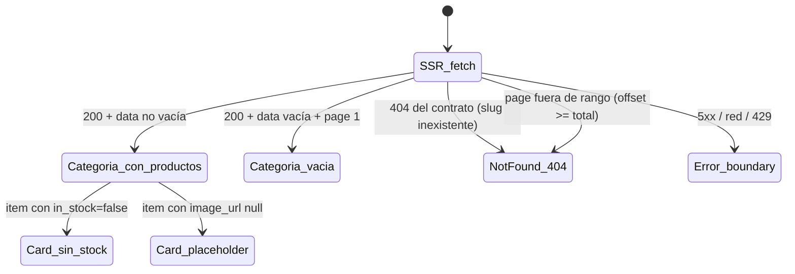

# US-002 Frontend Web — Design

> Diseño de la **navegación pública del storefront**: home con rubros, páginas de categoría SSR
> indexables con grilla paginada, y los artefactos de sitio (sitemap, robots, breadcrumbs) que
> convierten un conjunto de páginas en algo que un buscador puede recorrer. Consume el contrato del
> backend hermano **tal como está publicado** y hereda el namespace de **ADR-0010** sin re-abrirlo.

## Context

**Lo que ya existe y este change reutiliza** (nada de esto se rediseña):

| Pieza | Dónde | Qué aporta a US-002 |
|---|---|---|
| Cliente generado (orval: DTOs + Zod + MSW) | `src/api/generated/` | `storefrontListCategories`, `storefrontGetCategory`, `storefrontListCategoryProducts` **ya generados y commiteados** |
| `customFetch` isomorfo (F48) | `src/lib/http/client.ts` | único punto de red; en server no inyecta `authorization` ni `traceparent` (un header random por render envenena la clave de la Data Cache) y reenvía `init.next`/`init.cache` |
| `AppError` + `mapProblemToAppError` + `isAppError` | `src/lib/http/errors.ts` | 404 del contrato → `notFound()`; el resto → error boundary |
| `parseContract` | `src/lib/http/contract.ts` | validación runtime con los Zod **generados** |
| `storefrontService` + `productTag` | `src/features/storefront/` | patrón de servicio con política de caché declarada en el servicio |
| `revalidateProduct` + `revalidateProductSafely` | `src/features/storefront/` | **el puente panel→storefront ya está cableado en los 3 sitios de mutación de producto** |
| `ProductImage` | `src/features/storefront/` | `next/image` + placeholder `package` para `null`/roto — se **parametriza**, no se duplica |
| `formatArs` | `src/lib/format/currency.ts` | mismo helper server/client (sin hydration mismatch) |
| `track` + `PUBLIC_EVENTS` | `src/lib/observability/events.ts` | los eventos de superficie pública **no** heredan `operator_id: 'admin'` |
| Layout `(storefront)` | `app/(storefront)/layout.tsx` | wordmark; el top-nav quedó `Deferred: US-002` |
| Stub de contrato + `webServer` | `apps/web/e2e/support/api-stub.mjs`, `playwright.config.ts` | `page.route` **no sirve**: el fetch del storefront es server-side |
| Tokens del design-system | `tailwind.config.ts`, `app/globals.css` | colores, spacing, radius, focus ring |

**Lo que falta y este change construye**: el servicio de categorías, el circuito de invalidación
del catálogo, `CategoryNav`, la home real, la página de categoría con grilla paginada, `ProductCard`,
el estado vacío, `sitemap.ts`/`robots.ts`, los metadatos y breadcrumbs, el evento `category_shown`,
y la extensión del stub + los specs E2E.

## Goals

- Recorrido completo home → rubro → subrubro → ficha, con URLs amigables y linkeables (AC-1/AC-2/AC-3).
- Todo el contenido de listado **en el HTML del servidor**, sin depender de JavaScript (AC-10).
- Indexabilidad de sitio: metadatos por categoría, canonical por página, sitemap y robots (AC-4).
- Paginación que **nunca** transfiere el catálogo completo (AC-7) y es indexable página a página.
- Estado vacío accionable (AC-6) y disponibilidad honesta sin acción de compra (AC-5).
- **404 real** para categoría inexistente y para página fuera de rango (AC-9).
- Garantía de que un producto despublicado/archivado desaparece de los listados **al instante**,
  no al vencer un TTL (AC-8).
- WCAG 2.1 AA y presupuesto LCP < 2.5 s construidos desde el diseño (US §9).

## Non-goals

- Búsqueda / SearchBar / carrito / top-nav completo (US-004 / US-007), filtros (roadmap PRD §2.2).
- Grilla global `/productos` (no hay endpoint; ver OQ-FE-7).
- Medición de CWV, carga con ≥5.000 SKUs, BDD de aceptación, recorrido por teclado end-to-end e
  indexación real → `QA-US-002`.
- Cambios de contrato, esquema o comportamiento del backend.
- **Persistencia: ninguna** — sin tablas, columnas, storage local ni estado persistido en cliente.
- Re-arquitecturar el namespace de rutas (ADR-0010 `Accepted`).

## Approach — decisiones

### D1 — Mapa de rutas: se hereda ADR-0010 y se ocupa sólo el espacio que los AC piden

| Ruta | Quién la trae | Renderizado |
|---|---|---|
| `/` | **este change** (reemplaza el stub de US-003) | Server Component, estático + revalidación por tag |
| `/categorias/{slug}` | **este change** | Server Component, **dinámico** por `searchParams` (D3) |
| `/productos/{slug}` | US-003 (intacta) | Server Component, ISR con tag `product:{slug}` |
| `/sitemap.xml`, `/robots.txt` | **este change** | convenciones de archivo de Next |
| `/admin/*` | US-001 (intacta) | `noindex` + `AdminGuard` |

`/productos` **sin** slug no es una ruta (OQ-FE-7). ADR-0010 no se re-abre: la decisión del
namespace ya está tomada, `Accepted`, y este change es precisamente el que la usa como estaba
previsto ("US-002/US-004/US-007/US-016 heredan la convención").

### D2 — Caché e invalidación del catálogo: tag grueso `catalog` (la decisión de mayor valor)

**El problema, concreto.** US-003 dejó la frescura de la **ficha** resuelta: el fetch lleva el tag
`product:{slug}` y el panel invoca `revalidateProductSafely(slug)` tras cada mutación exitosa
(editar, publicar, archivar). US-002 introduce **otra ruta hacia los mismos datos**: la página de
categoría cachea el listado. Si el circuito no se extiende:

- El dueño **publica** un producto → su ficha se refresca al instante, pero **no aparece en su
  categoría** hasta que venza el safety-net.
- El dueño **archiva** un producto → la ficha pasa a 404 al instante, pero **el producto sigue
  listado en su categoría**, con precio y todo, enlazando a un 404. Eso es exactamente lo que AC-8
  prohíbe ("borradores y archivados NO aparecen en ningún listado público") y es peor que un dato
  viejo: es una promesa rota al comprador.

**Decisión**: un único tag grueso **`catalog`** en **todos** los fetches de catálogo del storefront
(árbol, detalle de categoría, listado de productos, y los que alimentan el sitemap), y una Server
Action `revalidateCatalog()` que lo purga junto con la Full Route Cache de las páginas afectadas.

```ts
// src/features/storefront/categoriesStorefrontService.ts
export const CATALOG_TAG = 'catalog';
export const CATALOG_REVALIDATE_SECONDS = 3600;   // safety-net, NO la vía de frescura
const catalogCache = { next: { revalidate: CATALOG_REVALIDATE_SECONDS, tags: [CATALOG_TAG] } };
```

```ts
// src/features/storefront/revalidate.ts  ('use server' — ya existe para producto)
export async function revalidateCatalog(): Promise<void> {
  revalidateTag(CATALOG_TAG);                     // Data Cache: árbol + detalle + listados + sitemap
  revalidatePath('/categorias/[slug]', 'page');   // Full Route Cache de TODAS las páginas de categoría
  revalidatePath('/');                            // home (grilla de rubros)
  revalidatePath('/sitemap.xml');                 // el sitemap es una ruta cacheada más
}
```

**Por qué grueso y no `category:{slug}`.** La invalidación quirúrgica obliga al panel a derivar, en
el cliente, **tres** cosas por cada producto mutado: (a) el slug de su categoría (tiene el
`category_id`, no el slug: hay que mapear contra la lista de categorías), (b) el slug del **rubro
padre**, porque un rubro agrega los productos de sus subrubros (decisión D1 del backend) y por lo
tanto su listado también quedó viejo, y (c) —si la edición **cambió** la categoría— también la
categoría **anterior**, que el formulario conoce sólo como valor inicial. Cada una de esas tres
derivaciones es un lugar donde AC-8 se rompe en silencio y ningún test lo ve, porque el listado
sigue devolviendo 200 con datos plausibles. El tag grueso las elimina por construcción.

**Qué cuesta.** Sobre-invalidar: editar el precio de un producto purga todos los listados. El costo
real es un re-fetch por página de categoría visitada después de la mutación, a p95 < 300 ms contra
un origen que además tiene su propia caché HTTP de 60 s. El perfil de uso lo hace irrelevante: **un
solo dueño** mutando un puñado de veces al día, decenas de categorías, ~50 concurrentes pico (E2E
§17). *Disparador documentado para migrar a `category:{slug}`*: si la tasa de mutación sube (import
masivo de US-006, catálogo multi-operador) o el número de páginas de categoría crece un orden de
magnitud, se re-evalúa con medición — y entonces la derivación se hace **server-side**, no en el
cliente del panel.

**Dónde se engancha (el detalle que hace que no se pueda olvidar).** El panel ya llama a
`revalidateProductSafely(slug)` en los tres sitios de mutación de producto (`ProductForm`
crear/editar, `ProductActions` publicar y archivar). En vez de agregar una cuarta llamada en cada
sitio, **el puente existente pasa a invalidar también el catálogo**:

```ts
// src/features/storefront/revalidateSafely.ts — el diff es de una línea
export function revalidateProductSafely(slug: string): void {
  void Promise.all([revalidateProduct(slug), revalidateCatalog()]).catch(captureError);
}
export function revalidateCatalogSafely(): void {          // para el alta/edición de categorías
  void revalidateCatalog().catch(captureError);
}
```

Así, **cualquier** mutación de producto futura que use el puente hereda la invalidación del
catálogo: no hay forma de agregar una acción nueva y olvidarse. El alta/edición de categorías
(`CategoryForm`, US-001) gana `revalidateCatalogSafely()` — sin él, una categoría nueva tarda hasta
el safety-net en aparecer en la nav y en el sitemap.

**Fire-and-forget, a propósito** (patrón heredado de US-003 D2): cuando se invoca, el backend ya
confirmó la mutación. Hacer esperar al dueño —o peor, mostrarle un error— porque falló una purga de
caché sería mentirle sobre lo que pasó. Un fallo se reporta a Sentry y el safety-net de 1 h lo
cubre.

**Seguridad de la action** (next-standards §4 — tratar toda Server Action como endpoint público):
`revalidateCatalog()` **no recibe input**, así que no hay nada que validar; su único efecto es
purgar caché — idempotente y benigno. El peor abuso posible es forzar re-fetches al origen, ya
acotado por el throttler `storefront` (60/min/IP) del backend.

**Nota de coordinación con US-019**: la inmediatez asume que el fetch SSR llega **directo al origen**
(topología actual Next → API en Railway). Si el despliegue interpone un CDN que respete el
`Cache-Control: max-age=60` del backend, la re-generación podría leer una respuesta de hasta ~60–90 s
— mismo punto que US-003 ya levantó; se revisa en el deployment planning de US-019.

### D3 — Paginación: server-side por `searchParams`, offset derivado, límite fijo de 20

```
/categorias/{slug}          → página 1
/categorias/{slug}?page=2   → offset = 20
```

- **`limit` fijo en 20** (el default del contrato; máximo permitido 100). No es configurable por
  query: un `?limit=` abierto multiplica URLs equivalentes para el buscador y es una palanca de DoS
  barata contra el origen.
- **`offset = (page - 1) * PAGE_SIZE`**. `page` malformada (`abc`, `0`, negativa, decimal) →
  **normaliza a 1** y el canonical apunta a la URL limpia (no se generan duplicados indexables).
- **Página fuera de rango** (`offset >= total`, con `total > 0`) → `notFound()` → **404 real**
  (OQ-FE-9). Categoría **vacía** en página 1 → **200 + estado vacío** (AC-6). La distinción es
  exactamente `offset > 0 && data.length === 0`.
- **AC-7 se cumple por construcción**: ningún request pide más de 20 ítems, y cambiar de página es
  una navegación a otra URL que trae otros 20 — el catálogo completo nunca viaja. El E2E lo prueba
  contra el **log de requests del stub**, no contra el DOM (T7.3).
- **Trade-off asumido**: leer `searchParams` vuelve la ruta **dinámica** (se pierde la Full Route
  Cache). Se acepta porque lo caro es la llamada a la API, y ésa **sigue cacheada** en la Data Cache
  con el tag `catalog`: el render es HTML a partir de datos en memoria. La alternativa para
  conservar render estático sería un segmento de ruta (`/categorias/{slug}/pagina/{n}`), que ensucia
  la URL canónica del caso dominante (página 1) a cambio de un TTFB que ya es de decenas de ms.

### D4 — SEO de la paginación: canonical auto-referencial + `rel=prev/next` + título por página

```tsx
// Metadata API (next-standards §6) — canonical de la PÁGINA, no de la página 1
alternates: { canonical: page === 1 ? base : `${base}?page=${page}` }
title: page === 1 ? `${cat.name} — DSM…` : `${cat.name} — Página ${page} — DSM…`
```

**Por qué auto-referencial y no canonical a la página 1**: canonicalizar todas las páginas hacia la
primera es el error clásico que **des-indexa los productos de la página 2 en adelante** — que en un
catálogo de 5.000 SKUs es la mayoría del inventario. Google no consolida señales de paginación desde
2019; la guía vigente es que cada página se auto-canonicalice y se enlacen entre sí.

`rel="prev"/"next"` se emiten como `<link>` renderizados desde el Server Component: React 19 (Next
15) **hoistea** `<link>`/`<meta>` al `<head>` automáticamente, así que no es un "manual `<head>`
hack" del anti-pattern de next-standards §10 — es la API soportada para los `rel` que el objeto
`Metadata` no modela. Ninguna página lleva `noindex`: esconder las páginas profundas esconde el
catálogo.

### D5 — Sitemap y robots: convenciones de archivo, frescura por el mismo tag

```ts
// app/sitemap.ts — MetadataRoute.Sitemap
// 1) árbol (1 fetch) → home + rubros + subrubros
// 2) categorías HOJA (subrubros + rubros sin hijos) → Promise.all de listados con limit=100
//    ...HOJA a propósito: un rubro agrega los productos de sus hijos (D1 del backend),
//    así que recorrer rubros Y subrubros duplicaría cada ficha en el sitemap.
```

- **Frescura**: todos los fetches del sitemap llevan el tag `catalog`, así que la misma
  `revalidateCatalog()` que refresca las páginas refresca el sitemap. Además `revalidatePath('/sitemap.xml')`
  purga su propia entrada de ruta.
- **`app/robots.ts`**: `allow: '/'`, `disallow: '/admin/'`, `sitemap: ${NEXT_PUBLIC_SITE_URL}/sitemap.xml`.
  El `Disallow` es **defensa en profundidad de indexación**, no control de acceso: la autoridad
  sigue siendo el `AdminGuard` y el backend (mismo encuadre que el `X-Robots-Tag` de ADR-0010).
- **Resiliencia**: si el árbol no responde, el sitemap devuelve al menos la home en vez de tirar un
  500 — un sitemap incompleto es recuperable; un sitemap que responde 500 le enseña al crawler a no
  volver.
- **Disparador de evolución**: > 50.000 URLs o generación > 10 s ⇒ migrar a `generateSitemaps`
  (sitemap index). A 5.000 SKUs no aplica (OQ-FE-8).

### D6 — `CategoryNav`: barra de rubros en el layout, Server Component, con degradación

El design-system §7.10 marca `CategoryNav` como **load-bearing para SEO** ("links indexables"). Vive
en `app/(storefront)/layout.tsx` para estar en **toda** superficie pública, incluida la ficha de
US-003 (que hoy es un callejón sin salida).

- **Cero JavaScript de cliente**: es una lista de `<a>` a los rubros. Sin dropdown con `hover`
  (a11y frágil y JS innecesario): los **subrubros** se muestran donde tienen contexto — en la home y
  en la página del rubro. El top-nav completo del §7.10 (buscador, carrito, cuenta) es
  `Deferred: US-004/US-007`.
- **Mobile-first (§4.1)**: la barra scrollea horizontalmente en mobile (`overflow-x-auto`, targets
  ≥ 44 px) y se despliega completa desde `bp-md`. Los links **están siempre en el DOM** — un
  buscador los ve aunque estén fuera de viewport.
- **Degradación explícita** (`frontend-resilience-patterns` #10): el fetch del árbol en el layout
  está envuelto en un `catch` que devuelve `[]` y **reporta a Sentry**. Sin eso, un 5xx del endpoint
  del árbol tumbaría **todas** las páginas del storefront —incluida la ficha, que no lo necesita—
  convirtiendo una degradación de navegación en una caída total del sitio público. La página se
  renderiza igual; sólo falta la barra.
- **Sin waterfall**: layout y page son componentes async hermanos; Next los renderiza en paralelo.

### D7 — Breadcrumb (AC-2) y el deferral que US-003 dejó abierto

Página de categoría: `Inicio › {parent?} › {categoría}`, construido con el `parent` que el contrato
devuelve (`null` cuando ya es rubro raíz). `<nav aria-label="Ruta de navegación">` + `<ol>`, con el
elemento actual marcado `aria-current="page"` y **sin** link.

Se emite además **JSON-LD `BreadcrumbList`** con la misma serialización segura que US-003 usa para
`Product` (`JSON.stringify(...).replace(/</g, '\\u003c')` — los nombres de categoría los escribe el
dueño, así que son input no confiable; security-standards §6). Es el único
`dangerouslySetInnerHTML` nuevo del change.

En la **ficha**, se cierra el `Deferred: US-002 — breadcrumb con link` que `ProductDetail` dejó: el
nombre de categoría, hoy texto plano, pasa a ser `Inicio › {categoría}` con link a
`/categorias/{slug}` — usando `product.category.slug`, que el contrato **ya trae**, sin ningún fetch
extra. La cadena completa con el rubro padre necesitaría un segundo fetch **en cadena** en la página
de conversión (waterfall sobre el presupuesto de LCP) o un cambio aditivo en el contrato: queda como
**OQ-FE-11** para coordinar con backend, no como deuda silenciosa.

### D8 — `ProductCard`: la card enlaza, no vende (todavía)

| Aspecto | Decisión | Fuente |
|---|---|---|
| Contenido | imagen → nombre → precio ARS ("IVA incluido") → disponibilidad | §7.3 jerarquía de lectura fija |
| Interacción | **toda la card es un `<a>`** a `/productos/{slug}`; nombre accesible = nombre del producto | §7.3 + §11 |
| Sin stock | badge "Sin stock" con **texto** (el color nunca es el único portador de significado) | §7.7 |
| CTA de compra | **ninguna card la tiene** — `Deferred: US-007` | ver abajo |
| Grilla | 2 col mobile → 3 tablet → 4 desktop, gap `space-4`/`space-6` | §4 |
| Headings | `h1` categoría → `h2` secciones → `h3` nombre de producto | §11 |

**Sobre la CTA — desviación consciente del §7.3.** El design-system prescribe "Agregar" en la card y,
sin stock, reemplazarlo por "Avisame por WhatsApp" ("no un botón disabled mudo"). El carrito no
existe hasta US-007, así que hoy la única opción fiel sería un botón deshabilitado **por card** —
veinte botones mudos por página, exactamente el patrón que el §7.3 rechaza, multiplicado. Y veinte
enlaces de WhatsApp por página convierten la grilla en ruido. **Decisión**: la card no lleva CTA;
la decisión de compra ocurre en la ficha, que ya tiene ambos estados resueltos (US-003 T4.3). Esto
además satisface AC-5 por construcción ("no ofrece la acción de agregar al carrito"). Cuando US-007
traiga el carrito, la card gana su "Agregar" real y su variante sin stock —
`Deferred: US-007 — CTA de la card per design-system §7.3`.

### D9 — `ProductImage`: se parametriza por contexto, no se duplica

`ProductImage` se construyó para el hero de la ficha: `priority` y `sizes="(max-width:1024px) 100vw, 50vw"`.
La grilla necesita lo contrario: `sizes="(max-width:768px) 50vw, 25vw"` (§8.1) y **nunca**
`priority` —marcar veinte imágenes como prioritarias las pone a competir entre sí y degrada el LCP
en vez de mejorarlo—.

```tsx
type ImageVariant = 'hero' | 'card';
// hero (default, no cambia ningún call-site existente): priority, sizes 100vw/50vw
// card: loading lazy, sizes 50vw/25vw
```

Se parametriza en vez de crear un componente nuevo porque lo **load-bearing** es el fallback
(`image_url` null u `onError` → placeholder `package` sobre `gray-100`, ratio 1:1), y duplicarlo
garantiza que un día diverjan. Sin `placeholder="blur"`: las imágenes son remotas y no hay
`blurDataURL` sin un loader propio — desviación de §8.1 documentada, no olvidada.

### D10 — Ningún `loading.tsx` en el route group `(storefront)` (F59)

**Hallazgo medido en US-003 (D1.bis), aplicable directo a AC-9.** Un `loading.tsx` colocado en un
segmento lo envuelve en una boundary de Suspense; Next entonces **transmite**: descarga el shell con
**status 200 ya comprometido** y ejecuta el componente después. Cuando el fetch devuelve 404 y la
página llama a `notFound()`, el status ya no se puede cambiar: el 404 llega como fallback de
streaming dentro de una respuesta **200**. Verificado aislando archivo por archivo con builds y
servidores limpios (`not-found.tsx` → 404 correcto; `+ error.tsx` → 404 correcto; `+ loading.tsx` →
**200**), registrado como gap de framework **F59** y documentado en `apps/web/README.md`.

**Decisión, más amplia que en US-003**: la prohibición se aplica a **todo el route group
`(storefront)`**, no sólo al segmento de categoría. Un `loading.tsx` en `app/(storefront)/` envolvería
en Suspense a **todos** sus hijos y rompería el 404 de la ficha (AC-7/AC-8 de US-003) además del de
la categoría (AC-9 de US-002). `error.tsx` y `not-found.tsx` **sí** se conservan: no comprometen el
status. El costo es nulo: la Data Cache tiene los datos y el fetch va a p95 < 300 ms, así que la
ventana que un skeleton cubriría es mínima — y en una página cuyo propósito es SEO se quiere el HTML
completo en la respuesta inicial, no un esqueleto que el crawler ve primero.

**Corolario para toda ruta futura**: `loading.tsx` sólo es seguro en rutas que **siempre** responden
200. Queda como criterio de salida verificable (T4.1), no como algo que el próximo dev redescubra.

### D11 — Estados de la pantalla (matriz, per frontend-standards §11.9 + design-system §10.1)



| Estado | Render | AC |
|---|---|---|
| Rubro con subrubros y productos | breadcrumb + chips de subrubros + grilla + paginación | AC-1/AC-3 |
| Subrubro | breadcrumb con el rubro padre + grilla (sólo propios) | AC-2/AC-3 |
| Categoría sin productos publicados | subrubros si los hay + **estado vacío** (ícono + copy §10.2 + links a otros rubros) | AC-6 |
| Item sin stock | badge "Sin stock" con texto; card sin acción de compra | AC-5 |
| Item sin imagen / rota | placeholder `package` 1:1; el layout no salta | §8.1 |
| Slug inexistente | **status 404 real** + `not-found.tsx` accionable | AC-9 |
| `?page` fuera de rango | **status 404 real** | AC-9 (OQ-FE-9) |
| `?page` malformada | 200 en página 1, canonical limpio | — |
| 5xx / red / 429 | `error.tsx` del segmento: copy §10.2 + reintento + **reporte a Sentry** | — |
| Árbol de categorías caído | la nav se degrada a vacío; la página se sirve igual | D6 |

No hay estado `loading` en el cliente: la página es SSR y no hay fetch de datos en cliente (AC-10).

### D12 — Observabilidad (US §9, E2E §18)

Evento público `category_shown` con `slug`, `is_rubro`, `page`, `product_count`,
`screen_name: 'category'` — como propiedades de **evento/analytics**, nunca dimensiones de métrica
(cardinalidad, `observability-patterns` §3.3). Sin PII: la lectura es anónima. Se suma a la unión
`BusinessEvent` y al set `PUBLIC_EVENTS` (para que **no** herede `operator_id: 'admin'` y ensucie
las métricas de US-016).

**Por qué un evento de cliente si el backend ya emite `category.viewed`**: con la caché por tag el
origen sólo ve los re-fetches post-invalidación, no las visitas — el evento del backend **subcuenta**
estructuralmente. Mismo razonamiento que OQ-FE-5 de US-003 para `pdp_shown`. La fuente autoritativa
del conteo la decide US-016.

### D13 — Estrategia de E2E: extensión del stub + `__reset` con alcance

El stub de contrato (`e2e/support/api-stub.mjs`, US-003 D10) se extiende con los tres endpoints de
categorías. Tres decisiones de determinismo, todas por lecciones ya pagadas:

1. **Aserciones sobre `response.status()`, jamás sobre el DOM.** Una aserción de DOM **no puede
   distinguir un 404 real de un soft-200**: la página renderizada se ve igual en ambos casos. AC-9 y
   AC-10 se prueban sobre el body y el status crudos de la respuesta, como ya hace `e2e/pdp-ssr.spec.ts`.
2. **`__reset` deja de ser global.** Hoy `POST /__reset` reconstruye el catálogo entero, y
   `pdp-invalidation.spec.ts` lo invoca. Con `fullyParallel: true`, si el spec de invalidación de
   catálogo corre en otro worker al mismo tiempo, el reset ajeno le devuelve el producto que acaba de
   archivar → flake que aparece una vez cada diez corridas y se diagnostica mal. Se agrega
   `POST /__reset?scope=pdp|catalog` y cada spec resetea **sólo su propio fixture**; sin `scope` se
   conserva el comportamiento actual para el resto.
3. **Fixtures disjuntos.** El spec de paginación usa una categoría propia con 25 productos (dos
   páginas) y **no toca** `heladera-exhibidora` / `taladro-percutor` / `ventilador-de-techo`, sobre
   los que asertan los specs de US-003.

Se agrega además `GET /__requests` al stub: un log de los requests recibidos. Es lo que permite
probar AC-7 de verdad — que la página 2 pidió `limit=20&offset=20` y que **ningún** request pidió el
catálogo completo — en vez de contar tarjetas en el DOM, que pasaría igual si el servidor se hubiera
traído las 5.000.

## Seguridad

- **XSS**: nombres de categoría y de producto los escribe el dueño (input no confiable) y se
  renderizan como **texto plano**. El único `dangerouslySetInnerHTML` nuevo es el JSON-LD
  `BreadcrumbList`, con el mismo escape de `<` que US-003 (security-standards §6, frontend-standards
  §12.1). El gate de la suite verifica que no aparezca ningún otro uso.
- **Server Action**: `revalidateCatalog()` no recibe input y su efecto es idempotente y benigno
  (next-standards §4). POST same-origin, postura CSRF built-in.
- **Secretos**: **cero env nuevas**. Se consumen las públicas existentes (`NEXT_PUBLIC_SITE_URL`,
  `NEXT_PUBLIC_API_BASE_URL`, `NEXT_PUBLIC_IMAGE_CDN_HOST`). Ningún secreto lleva prefijo
  `NEXT_PUBLIC_` (frontend-standards §12.3, next-standards §8).
- **Headers**: los de US-001 (`source: '/:path*'`) ya cubren las rutas nuevas; `img-src https:`
  admite el CDN. `robots.txt` desalienta la indexación de `/admin/` sobre el `X-Robots-Tag` que ya
  la impide — capas, no reemplazo.
- **Superficie pública sin auth**: sólo lectura. La autoridad sobre qué es visible (`published`) es
  del backend; el FE no filtra ni intenta filtrar nada que el contrato no exponga.

## Resiliencia (`frontend-resilience-patterns`)

| Patrón | Dónde | Por qué |
|---|---|---|
| #10 Error boundary que **reporta** | `error.tsx` del segmento + degradación del `CategoryNav` + fallback del sitemap | nunca silenciar; nunca dejar que una nav caída tumbe el sitio |
| #11 Fallback de imagen | `ProductImage` (reusado) | el broken-image nativo es inaceptable en una grilla de conversión |
| #12 Skeleton | **deliberadamente ausente** | D10: un `loading.tsx` degradaría el 404 a 200 |
| #15 Lazy loading | imágenes de la grilla (`loading="lazy"`, `sizes` de card) + paginación de 20 | AC-7 con ≥5.000 SKUs |
| Caché con invalidación | D2 | caché sin invalidación = dato viejo para siempre (anti-pattern del skill) |

## Accesibilidad (design-system §11 — WCAG 2.1 AA)

- Jerarquía de headings: `h1` único (nombre de la categoría) → `h2` ("Subrubros", "Productos") →
  `h3` (nombre de cada producto). El `h1` de la home es el claim de la tienda.
- `CategoryNav` en `<nav aria-label="Rubros">`; breadcrumb en `<nav aria-label="Ruta de navegación">`
  con `<ol>` y `aria-current="page"`; paginación en `<nav aria-label="Paginación">` con
  `aria-current="page"` en la página activa.
- Todos los controles de navegación son `<a href>` reales: alcanzables por teclado sin JS, con
  `focus-visible:shadow-focus` (token existente) y área táctil ≥ 44×44 px.
- `alt` descriptivo (nombre + categoría), nunca "imagen"; el placeholder expone `role="img"` +
  `aria-label`.
- El badge "Sin stock" lleva **texto**, no sólo color.
- axe-core sin violaciones sobre los tres estados de la página (con productos, vacía, con item sin
  stock). El recorrido completo por teclado end-to-end es `QA-US-002` §5.3.

## Performance (US §9: LCP < 2.5 s, p95 < 300 ms; E2E §17)

- HTML server-rendered a partir de datos en Data Cache: el render no espera a la API salvo en el
  primer hit post-invalidación.
- La imagen LCP de una página de categoría es la primera card: `sizes` de grilla evita bajar
  imágenes de hero en mobile (§8.1); ninguna lleva `priority` (D9).
- Máximo 20 ítems por página (D3): el peso del HTML y de las imágenes está acotado por diseño,
  independientemente del tamaño del catálogo (AC-7).
- Client JS del change: **cero componentes nuevos con `"use client"`** salvo el tracker de evento
  (hoja mínima) y `ProductImage`, que ya lo era. `CategoryNav`, breadcrumb, grilla, cards y
  paginación son Server Components.
- La medición numérica (Lighthouse/LCP p75 con catálogo grande) es `QA-US-002` §5.1 TC-205; este
  diseño construye para el presupuesto.

## Spec delta

Ninguno sobre el contrato REST: este change **consume** `storefrontListCategories`,
`storefrontGetCategory` y `storefrontListCategoryProducts` sin modificarlos. Al archivar,
`openspec/specs/catalogo/requirements.md` suma los requisitos FE del browse (navegación de dos
niveles SSR indexable, paginación linkeable, sitemap/robots del sitio, 404 real de categoría y de
página fuera de rango, invalidación del catálogo tras mutación) — lo aplica `/archive-change`.

## Trade-offs

- **Tag grueso vs quirúrgico (D2)**: se paga sobre-invalidación (re-fetches de más) a cambio de
  eliminar tres derivaciones en el cliente donde un AC negativo se rompería en silencio. A esta
  escala el costo es ruido; el disparador para revisarlo está escrito.
- **Ruta dinámica por `searchParams` (D3)**: se pierde la Full Route Cache de la página de
  categoría a cambio de URLs limpias y canónicas para el caso dominante. Mitigado: la Data Cache
  conserva lo caro.
- **Sitemap con fichas (D5/OQ-FE-8)**: ≈50 requests por regeneración a cambio de que las páginas de
  conversión entren explícitamente al índice. Mitigado: paralelo, tageado, y una vez por
  invalidación —no por visita—.
- **Card sin CTA (D8)**: se desvía del §7.3 a cambio de no sembrar veinte botones mudos por página;
  el deferral a US-007 queda declarado y AC-5 se cumple por construcción.
- **`CategoryNav` sin dropdown (D6)**: menos denso visualmente que el §7.10 completo, a cambio de
  cero JS de cliente, a11y trivial de sostener y todos los links en el HTML servido.
- **Sin `loading.tsx` (D10)**: se renuncia al skeleton en navegación entrante a cambio de que el 404
  sea real. No es negociable: es un AC.

## ¿Se dispara algún ADR? (evaluación explícita, `documentation-standards` §8.1)

- **Namespace de rutas** → ya es ADR-0010; este change lo consume.
- **Estrategia de invalidación de caché (D2)** → es una decisión de **alcance de US**, reversible
  cambiando un tag y con el disparador de revisión documentado acá. No cruza servicios ni compromete
  a otras disciplinas. **No dispara ADR**; si el disparador se activa (import masivo, multi-operador)
  y la invalidación pasa a ser server-side derivada, **eso sí** merecerá ADR.
- **Paginación offset por `searchParams`** → sigue la decisión ya tomada por el backend (D3 del
  change hermano). No dispara ADR.
- **Sitemap/robots** → convención de framework, no decisión arquitectónica. No dispara ADR.

Conclusión: **ningún ADR nuevo**.

## Open questions

Ver `proposal.md` §Open questions: OQ-FE-7 (grilla global), OQ-FE-8 (alcance del sitemap), OQ-FE-9
(página fuera de rango), OQ-FE-10 (granularidad del tag) — las cuatro `[Decidido por el plan —
ratificar]`; OQ-FE-11 (`category.parent` en `StorefrontProduct`) `[Open — coordinación con backend,
no bloquea]`; OQ-FE-3 (número de WhatsApp) heredada y diferida.

## References

- US: `docs/user-stories/US-002-storefront-navegacion-categorias.md` (AC-1…AC-10, §7 presupuesto FE,
  §8 diseño, §9 NFRs, §10 reglas de negocio).
- E2E: `docs/product/design-e2e.md` §6.1/§6.2, §8, §17, §18.
- Contrato consumido: `apps/api/docs/api/openapi.yaml`; drafts + `design.md` del change de backend
  hermano (`US-002-…-backend`: D1 agregación, D3 envelope offset, D4 `category.viewed`, D5 TTLs).
- Precedente FE: `openspec/changes/US-003-ficha-producto-pdp-frontend-web/design.md`
  (D0 namespace, D1.bis `loading.tsx`, D2 invalidación por tag, D3 cliente isomorfo, D10 stub E2E).
- Plan de QA hermano: `openspec/changes/US-002-storefront-navegacion-categorias-qa/qa-plan.md`
  (§5.1 SSR/SEO/sitemap, §5.3 a11y, §5.4 carga; B-1 bloquea su ejecución hasta este change).
- Design system `Approved`: `docs/product/design-system.md` §4, §4.1, §4.2, §7.3, §7.4, §7.7, §7.10,
  §8.1, §10.1, §10.2, §11.
- Standards: `frontend-standards.md` §2.1/§3/§5/§7/§8/§11.3/§11.5/§11.9/§12;
  `frontend-next-standards.md` §1/§2/§3/§4/§6/§7/§8/§8.bis/§9/§10; `api-standards.md` §5.5/§6.1/§6.3/§8;
  `security-standards.md` §6; `qa-frontend-standards.md` §19/§23; `documentation-standards.md` §8.1/§11.1.
- Skills: `openspec-workflow`, `fe-design-without-figma`, `openapi-client-codegen`,
  `frontend-resilience-patterns` (#10/#11/#12/#15), `msw-setup`, `playwright-stability`,
  `observability-patterns` §3.3/§9.5.
- ADRs: ADR-0010 (heredado), ADR-0001, ADR-0007. **Ninguno nuevo.**
- Gaps de framework aplicados: F48 (choke point), F49 (`Verify` terminante), F50 (`Verify` que
  ejercita), F51 (design → tasks), F57 (el scanner no se escanea a sí mismo), **F59** (`loading.tsx`
  degrada el 404 a soft-200).
