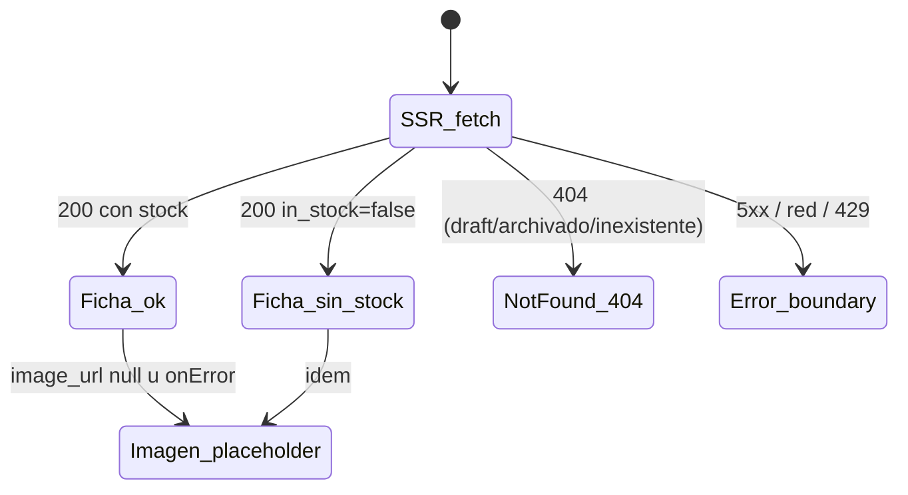

# US-003 Frontend Web — Design

> Diseño de la **primera página pública del storefront**: la ficha de producto (PDP) SSR
> indexable en `apps/web`. Hereda del E2E sin re-arquitecturar: §6.2 (Storefront SSR
> indexable como componente de la Web App), §17 (SEO/LCP < 2.5s vía Next SSR + imágenes
> optimizadas + JSON-LD, p95 lectura < 300ms), §18 (Sentry + Web Vitals). Consume el
> contrato del backend hermano **tal como está publicado** (`storefrontGetProduct`) —
> no se rediseña la API. Fuente visual: `design-system.md` `Approved` (no hay Figma).

## Context

US-001 dejó `apps/web` con el panel del dueño y el sustrato transversal: codegen orval
(DTOs + Zod + MSW desde `apps/api/docs/api/openapi.yaml`, gate `frontend-codegen-fresh`),
`customFetch` como mutator único (F48), mapeo RFC 7807 → `AppError`, tokens del
design-system en Tailwind + CSS vars, helper ARS server/client, security headers en
`next.config.mjs`, y toolchain Vitest/RTL/MSW/Playwright/jest-axe. El backend de US-003
(change verde) publicó `GET /v1/products/{sku}` público con 404 uniforme, `in_stock`
derivado, `image_url` nullable y `Cache-Control: public, max-age=60, stale-while-revalidate=30`.

Este change agrega el route group `(storefront)` con la ficha. Es la primera superficie
**SSR-para-SEO** de la app: introduce dos capacidades nuevas en el sustrato (cliente HTTP
isomorfo con caché de datos explícita; metadatos/JSON-LD por página) que US-002 y US-004
reutilizarán.

## Goals

- Ficha SSR indexable por `/productos/{sku}` con nombre, descripción, precio ARS (IVA
  incluido), imagen, categoría y disponibilidad (AC-1), metadatos + JSON-LD (AC-2).
- Estados completos: con stock (CTA disparador, AC-3), sin stock (badge + WhatsApp, AC-4),
  descripción base-o-enriquecida (AC-5), sin imagen (placeholder, AC-6).
- **404 real** (status HTTP) para draft/archivado/inexistente — nunca soft-200 (AC-7/AC-8).
- Precio vigente: frescura acotada FE↔BE, nunca caché indefinida (AC-9).
- WCAG 2.1 AA y presupuesto LCP < 2.5s construido desde el diseño (US §9, E2E §17).

## Non-goals

- Lógica de carrito (US-007), canal WhatsApp completo (US-018), navegación/top-nav del
  storefront y sitemap (US-002), enriquecimiento IA (US-005), galería/zoom/relacionados (v1).
- Cambios de contrato, de esquema o del comportamiento del backend. **Persistencia: ninguna**
  — este change no introduce tablas, columnas, storage local ni estado persistido; consume
  la API y renderiza (data-architect Mode B no aplica).
- Redefinir tokens o componentes del design-system (se consumen §7/§8/§10/§11).

## Approach — decisiones

### D1 — URL pública: `/productos/[slug]` (URL amigable definitiva, OQ-BE-1 resuelta)

El contrato expone la ficha por **`slug`** (`GET /v1/products/{slug}`, kebab-case derivado
del `name` server-side — nunca aceptado del cliente) y `StorefrontProduct` lo incluye como
campo. Ruta `/productos/{slug}` bajo el route group `app/(storefront)/` (App Router per
next-standards §1), con el canonical absoluto desde `NEXT_PUBLIC_SITE_URL`.

> ⚠️ **BLOQUEANTE detectado en ejecución (2026-08-17) — el namespace de rutas está sin
> resolver.** El panel de US-001 ya ocupa el espacio de URLs público: `/productos` (listado),
> `/productos/[id]` (edición), `/productos/nuevo`, `/categorias` y `/`. Poner la ficha en
> `/productos/{slug}` **no compila**: Next rechaza dos parámetros dinámicos distintos en la
> misma posición (`You cannot use different slug names for the same dynamic path
> ('id' !== 'slug')`), y aunque coincidieran los nombres, dos route groups no pueden resolver
> la misma ruta. Esto no es un detalle de este change: US-002 (catálogo público) va a necesitar
> `/productos` y `/categorias` para el storefront. La decisión —mover el panel a `/admin/*` vs
> darle otra ruta a la ficha— excede el alcance de US-003 FE porque toca superficie entregada
> de US-001, así que el desarrollo se detuvo y el plan se regenera. Radio medido de la mudanza
> del panel: `router.push('/productos')` tras login + su test + 4 referencias en el smoke E2E.

**Historia de la decisión** (relevante porque cambió durante la ejecución): el plan original
fijó una ruta **interina** `/productos/{sku}` porque `products.slug` no existía y era una
columna infra-owned diferida por el backend (OQ-BE-1), con un 301 previsto para el día de la
migración. Mientras se ejecutaba T3.1, el backend resolvió OQ-BE-1 en la Fase 10 de su change
— materializando `products.slug` **antes** de construir la PDP, con el argumento de que el SEO
es el objetivo de negocio del PRD y cambiar la URL después de indexar cuesta 301s + re-crawl.
Eso eliminó la premisa del interino, así que la ruta arranca ya en su forma definitiva y **no
hace falta ningún 301**. **Alternativas descartadas**: bloquear el FE hasta que la Fase 10
cerrara; sostener el interino por `sku` y migrar después (pagaba justo el re-crawl que la
Fase 10 evita). Decisión del usuario en **OQ-FE-1 `[Resolved: 2026-08-17 — repivotada a
slug]`**.

### D2 — Data fetching y frescura del precio (AC-9): caché por tag + invalidación on-demand desde el panel (OQ-FE-4 opción C, decisión del usuario 2026-08-16)

Fetch en el Server Component vía el servicio (next-standards §3: fetch en RSC, caché
**explícita** por fetch — nunca implícita), con **tag por producto**:

```ts
// storefrontService — la política de caché se declara en el servicio, no en el mutator
storefrontGetProduct(sku, { next: { revalidate: 3600, tags: [`product:${sku}`] } });
```

- **Tag naming**: `product:{sku}` — 1 tag por producto; el `sku` es el identificador
  público del contrato (D1). Cuando OQ-BE-1 migre a slug, el tag migra con el mismo edit.
- **Invalidación on-demand** (la parte que da frescura inmediata): una **Server Action**
  `revalidateProduct(sku)` en `src/features/storefront/revalidate.ts` (`'use server'`),
  que ejecuta `revalidateTag('product:'+sku)` **y** `revalidatePath('/productos/'+sku)`.
  Ambas a propósito: `revalidateTag` purga la Data Cache del fetch tageado;
  `revalidatePath` purga además la entrada del Full Route Cache de esa URL — cubre el caso
  **publicar un producto cuya ficha ya se cacheó como 404** (el render de `notFound()` no
  siempre deja una entrada tageada en la Data Cache, así que el tag solo no garantiza
  purgarlo; el path sí).
- **Quién la invoca — el puente panel→storefront**: el panel muta vía la API NestJS
  **desde el browser** (cliente generado + Bearer, decisión OQ-FE-2 de US-001), así que no
  hay código server-side de Next en el camino de la mutación. El puente elegido es la
  Server Action importada por el flujo de mutación de productos del panel
  (`productsService` / acciones de fila): tras un `PATCH`/`POST` **exitoso** de producto
  (edición de datos/precio, publicar, archivar), el cliente invoca
  `revalidateProduct(sku)` (fire-and-forget con reporte a Sentry si falla — la mutación ya
  se confirmó; un fallo de invalidación lo cubre el safety-net). Se elige Server Action y
  no un Route Handler porque: (a) no introduce un `fetch` crudo en código de app (F48 — la
  invocación de una action es RPC de Next, no HTTP escrito a mano, y no necesita entrada en
  `.consumer-contract-allow`); (b) es el mecanismo que next-standards §4 prescribe para
  mutaciones server-side de la propia app; (c) POST same-origin con la postura CSRF
  built-in (§8.bis).
- **Seguridad de la action** (next-standards §4 — "treat Server Actions as public
  endpoints"): valida el input con Zod (`sku` acotado a `[A-Za-z0-9._-]{1,64}`) y su único
  efecto es purgar caché — idempotente y benigno; el peor abuso posible es forzar
  re-fetches al origen, que ya está protegido por el throttler `storefront` del BE (§7.3).
  No requiere compartir el secreto JWT del BE con la app Next.
- **Safety-net `revalidate: 3600`** (next-standards §3 — preferir estática + revalidación):
  cubre mutaciones que NO pasan por el panel — el import masivo de US-006 (futuro),
  operaciones directas sobre la DB, o una invalidación que falló. Peor caso absoluto: 1h de
  dato viejo, **nunca indefinido** (AC-9). `Deferred: US-006 — el flujo de import debe
  invocar la misma invalidación por cada sku afectado; hasta entonces lo cubre el safety-net`.
- **Nota de coordinación FE↔BE**: la inmediatez asume que el fetch SSR llega **directo al
  origen** de la API (topología actual: Next → API en Railway, sin CDN intermedio). Si
  US-019 interpone un CDN que respete el `Cache-Control: max-age=60` del BE (OQ-BE-2), la
  re-generación podría leer una respuesta cacheada hasta ~60–90s vieja — revisar en el
  deployment planning de US-019 (bypass del CDN para el fetch server-side, o invalidación
  del CDN junto con el tag).

No hay `generateStaticParams` (los sku no se conocen al build; ISR on-demand cubre el
catálogo). Sin `force-dynamic`: la ruta es estática con revalidación + purga dirigida, lo
que sostiene p95 < 300ms y el budget LCP (E2E §17). **Alternativas descartadas**:
(A — recomendación original del planner) ISR `revalidate: 60` alineado al TTL del BE —
descartada por decisión del usuario 2026-08-16 (aceptaba ~60–90s de precio viejo);
(B) `cache: 'no-store'` — precio al segundo pero pierde ISR/SEO y paga origen por vista.

### D3 — Choke point del contrato (F48): cliente generado + `customFetch` isomorfo

Todo el tráfico sigue saliendo por el cliente generado (orval) → `customFetch`. El mutator
se vuelve isomorfo con dos reglas server-side: (a) **no** inyecta `authorization` (surface
pública; el token admin vive en el browser del panel) ni (b) `traceparent` aleatorio — un
header random por render cambiaría la clave de la Data Cache de Next y anularía `revalidate`
silenciosamente (el bug de caché más sutil de este change; la correlación de trazas del SSR
queda a cargo de la instrumentación de Sentry server-side, E2E §18). Además reenvía
`init.next`/`init.cache` del caller al `fetch` para que la política de caché se declare en
el servicio, no en el mutator. El comportamiento browser (token, traceparent, timeout,
RFC 7807 → `AppError`) queda intacto — los tests del panel lo garantizan.

### D4 — 404 real (AC-7/AC-8): `notFound()` + `not-found.tsx` del segmento

`AppError.notFound` del servicio → `notFound()` de Next en el Server Component → respuesta
con **status HTTP 404** y render de `app/(storefront)/productos/[sku]/not-found.tsx`
(next-standards §1). La página 404 es accionable (copy §10.2 + enlace al inicio y a
WhatsApp), no un dead-end; los buscadores la ven como 404 (no indexable). La uniformidad
draft ≡ archivado ≡ inexistente la garantiza el backend (sin enumeration leak) — el FE no
distingue ni intenta distinguir. Errores no-404 (5xx, red) suben al `error.tsx` del
segmento: boundary con reintento que **reporta a Sentry** (resilience #10 — nunca silencia).

### D5 — SEO: Metadata API + JSON-LD Product con serialización segura

`generateMetadata` (next-standards §6) reusa el mismo fetch (memoización de request de Next
lo deduplica — cero costo extra): title `{nombre} — DSM…`, description truncada, canonical
absoluto, OG con la imagen del producto o la default 1200×630 (design-system §8.1). El
JSON-LD `schema.org/Product` (name, description, image, sku, category, offers con
`priceCurrency: ARS`, `price` decimal derivado de centavos per api-standards §5.5, y
`availability` InStock/OutOfStock) se inyecta con `JSON.stringify(...).replace(/</g, '\\u003c')`
— nombre y descripción los escribe el dueño (input no confiable): el escape de `<` impide
cerrar el `<script>` (security-standards §6). Es el **único** `dangerouslySetInnerHTML`
permitido en el change; la descripción visible se renderiza como texto plano, jamás como HTML.

### D6 — Componentes (package-by-feature, `src/features/storefront/`)

| Componente | Tipo | Rol | Design-system |
|---|---|---|---|
| `ProductDetail` | Server | Composición; jerarquía fija imagen → nombre (`h1`) → precio → disponibilidad → CTA | §7.3 |
| `ProductImage` | Client (hoja) | `next/image` `fill` + `priority` + `sizes` ficha; fallback placeholder (`package` sobre `gray-100`, 1:1) para `null` y `onError` | §8.1, §10.1 |
| `PriceTag` (uso) | Server | `text-3xl`/bold + "IVA incluido"; helper `currency.ts` existente (server=client, sin hydration mismatch) | §7.4 |
| `StockBadge` | Server | "Sin stock" pill con texto + color (nunca solo color) | §7.7 |
| `AddToCartTrigger` | Client (hoja) | Botón `accent` deshabilitado con seam `onAddToCart` (OQ-FE-2 rec. A) — US-007 inyecta el handler sin re-layout | §7.1 |
| `WhatsAppCta` | Server | Enlace `wa.me/{env}` con ícono + texto, copy §10.2 | §7.10, §7.14 |

`"use client"` solo en las dos hojas que lo necesitan (onError / futuro handler) —
next-standards §2/§7: client JS mínimo, RSC para todo lo demás. La categoría se muestra
como texto; el breadcrumb con link es `Deferred: US-002 — navegación del storefront`.
El layout del storefront en este change es mínimo (wordmark "DSM" → home); el top-nav
completo (§7.10) es `Deferred: US-002`.

### D7 — Estados de la pantalla (matriz, per frontend-standards §11.9 + design-system §10.1)



| Estado | Render | AC |
|---|---|---|
| Éxito con stock | Ficha completa + CTA accent (deshabilitado, seam) | AC-1/AC-3 |
| Éxito sin stock | Badge "Sin stock" + **sin** CTA + WhatsApp | AC-4 |
| Sin imagen / imagen rota | Placeholder consistente; resto normal | AC-6 |
| Sin descripción | Sección omitida (contrato nullable) | AC-5 |
| 404 | Status 404 real + página accionable | AC-7/AC-8 |
| 5xx / red / 429 | `error.tsx`: mensaje §10.2 + reintento + reporte Sentry | — |
| Navegación client-side entrante (US-002+) | `loading.tsx` skeleton con la forma de la ficha | — |

El estado inicial no tiene loading en el cliente (es SSR); el skeleton del segmento cubre
las navegaciones suaves futuras (resilience #12: forma real, no spinner).

### D8 — Observabilidad (E2E §18; OQ-FE-5 `[Resolved: 2026-08-16 — opción A]`)

El BE emite `product.viewed` por hit al origen; con la caché por tag (D2) el origen solo ve
los re-fetches post-invalidación/safety-net → subcuenta. Decisión: evento cliente `pdp_shown` (`sku`,
`in_stock`, `screen_name` — `sku` como propiedad de evento/analytics, **no** dimensión de
métrica, per observability-patterns §3.3; sin PII, lectura anónima) extendiendo el catálogo
tipado de `src/lib/observability/events.ts`. Web Vitals de la ficha ya reportan vía la
init de Sentry de US-001 (LCP p75 de la PDP queda medible sin trabajo extra). La fuente
autoritativa del conteo la decide US-016.

### D9 — Performance / LCP < 2.5s (E2E §17, next-standards §7)

El LCP de la ficha es la imagen hero: `next/image` con `priority` + `sizes`
`(max-width:1024px) 100vw, 50vw` (§8.1) + `remotePatterns` acotado al host de imágenes
(env `NEXT_PUBLIC_IMAGE_CDN_HOST` — no wildcard). ISR sirve HTML pre-renderizado (TTFB
mínimo); Inter ya va por `next/font` (US-001); client JS mínimo (D6). La **medición**
numérica (Lighthouse/LCP p75) es owned-by-QA (`QA-US-003`) — este diseño construye para el
budget; el smoke E2E del dev verifica el SSR (contenido en el HTML del server), no el número.

## Seguridad

- **XSS**: datos del dueño (nombre/descripción) como texto plano; JSON-LD con escape de
  `<` (D5); cero HTML dinámico (security-standards §6, frontend-standards §12.1).
- **Headers**: los security headers del app (CSP report-only, HSTS, XFO, nosniff) ya cubren
  la nueva ruta (`source: '/:path*'`, US-001 T8.4); `img-src https:` ya admite el CDN. Sin
  cambios.
- **Secretos**: solo env `NEXT_PUBLIC_*` públicas nuevas (site URL, teléfono WhatsApp, host
  CDN) — ninguna es secreto (next-standards §8).
- **Surface**: la página es de solo lectura sin auth; la autoridad del 404/publicación es
  del backend (el FE no filtra nada que el contrato no exponga).

## Spec delta

Ninguno sobre el contrato REST (este change **consume** `storefrontGetProduct`). Al
archivar: `openspec/specs/catalogo/requirements.md` suma los requisitos FE de la ficha
(SSR indexable, 404 real, estados) desde este change — lo aplica `/archive-change`.

## Trade-offs

- **Invalidación on-demand vs ISR simple (D2, decisión del usuario)**: frescura inmediata
  del precio a cambio de acoplar el flujo de mutación del panel al storefront (una Server
  Action compartida) y de una pieza más a testear. Mitigado: la action es idempotente y
  benigna, el safety-net de 1h cubre cualquier camino que no la invoque, y el acople es un
  import de un módulo — no un contrato HTTP nuevo.
- **`sku` en la URL (D1)**: URL menos "amigable" que un slug hoy, a cambio de no bloquear el
  critical path en una columna infra-owned; migración 301 planificada.
- **CTA deshabilitado (D6)**: ficha visualmente completa y honesta vs un botón activo sin
  lógica; US-007 lo habilita inyectando el handler (cero re-layout).
- **Smoke E2E con API real** (no `page.route`): el fetch SSR es server-side — el mock de
  browser no lo intercepta; se paga el seed por API a cambio de verificar el SSR de verdad
  y, con la edición vía panel, el circuito completo de invalidación (AC-9 end-to-end).

## Open questions

Ver `proposal.md` §Open questions. Ratificación del usuario 2026-08-16: OQ-FE-1 (URL por
`sku`, opción A), OQ-FE-2 (CTA deshabilitado con seam, opción A), OQ-FE-4 (**opción C —
invalidación on-demand**, no la recomendada) y OQ-FE-5 (evento `pdp_shown` + `product.viewed`,
opción A) quedan `[Resolved]`. Pendiente solo OQ-FE-3 (número real de WhatsApp — dato del
cliente, no bloquea).

## References

- US: `docs/user-stories/US-003-ficha-producto-pdp.md` (AC-1…AC-9, §8, §9).
- E2E: `docs/product/design-e2e.md` §6.2, §17, §18 (heredado — no se re-arquitectura).
- Design system `Approved`: `docs/product/design-system.md` §7.1/§7.3/§7.4/§7.7/§7.10/§7.14/§8.1/§10.1/§10.2/§11/§12.
- Contrato consumido: `apps/api/docs/api/openapi.yaml` (`storefrontGetProduct`) +
  `openspec/changes/US-003-ficha-producto-pdp-backend/contracts/openapi/storefront-get-product.yaml`.
- Change BE hermano (decisiones heredadas: 404 uniforme, `in_stock`, Cache-Control, OQ-BE-1/2):
  `openspec/changes/US-003-ficha-producto-pdp-backend/design.md`.
- Standards: `frontend-standards.md` §3/§8/§11/§12; `frontend-next-standards.md` §1/§2/§3/§6/§7/§8/§9/§10;
  `api-standards.md` §5.5/§8; `security-standards.md` §6; `qa-frontend-standards.md` §2.1/§23.
- Skills: `openspec-workflow`, `fe-design-without-figma`, `openapi-client-codegen`,
  `frontend-resilience-patterns` (#10/#11/#12), `msw-setup`, `playwright-stability`,
  `observability-patterns` §9.5.
- ADRs: ADR-0001 (plataforma/R2 → host de imágenes), ADR-0007 (monolito modular). Ninguno nuevo.
