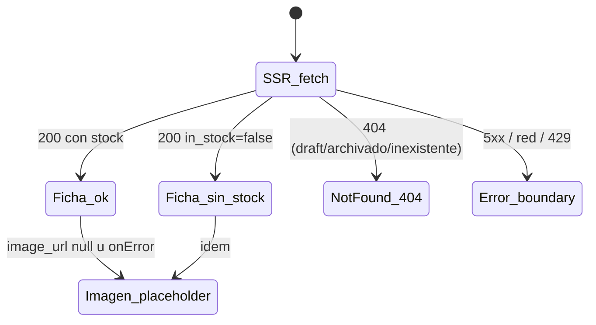

# US-003 Frontend Web — Design

> Diseño de la **primera página pública del storefront**: la ficha de producto (PDP) SSR
> indexable en `apps/web`. Hereda del E2E sin re-arquitecturar: §6.2 (Storefront SSR indexable
> **y panel dentro del mismo app web**), §14 (superficie `/admin/*`, "no exponer panel sin auth"),
> §17 (SEO/LCP < 2.5 s vía Next SSR + imágenes optimizadas + JSON-LD, p95 lectura < 300 ms),
> §18 (Sentry + Web Vitals). Consume el contrato del backend hermano **tal como está publicado**
> (`storefrontGetProduct` por `slug`). Fuente visual: `design-system.md` `Approved` (no hay Figma).
>
> **Regeneración 2026-08-17**: se agrega **D0 — namespace de rutas** como decisión de primer nivel
> (era el bloqueante que detuvo la ejecución); D1 se simplifica (el `slug` ya no es interino);
> D10 documenta la estrategia de E2E con stub server-side. El resto (D2–D9) se conserva.

## Context

US-001 dejó `apps/web` con el panel del dueño y el sustrato transversal: codegen orval
(DTOs + Zod + MSW desde `apps/api/docs/api/openapi.yaml`, gate `frontend-codegen-fresh`),
`customFetch` como mutator único (F48), mapeo RFC 7807 → `AppError`, tokens del design-system en
Tailwind + CSS vars, helper ARS server/client, security headers en `next.config.mjs`, y toolchain
Vitest/RTL/MSW/Playwright/jest-axe. El backend de US-003 publicó `GET /v1/products/{slug}` público
con 404 uniforme, `in_stock` derivado, `image_url` nullable y
`Cache-Control: public, max-age=60, stale-while-revalidate=30`.

Este change agrega el route group `(storefront)` con la ficha. Es la primera superficie
**SSR-para-SEO** de la app: introduce tres capacidades nuevas en el sustrato (namespace público
separado del panel; cliente HTTP isomorfo con caché de datos explícita; metadatos/JSON-LD por
página) que US-002 y US-004 reutilizarán.

**Estado del trabajo previo** (commiteado y vigente, ver `tasks.md`): T1.1 (codegen contra el
contrato por slug), T1.2 (cliente isomorfo + `isAppError`) y T2.1 (`storefrontService` con
`productTag` + `getProductBySlug`) están **hechos** y son **namespace-independientes**. El árbol
`app/(storefront)/`, `ProductDetail.tsx` y `ProductPage.test.tsx` se **borraron a propósito** para
mantener el build verde en la rama compartida mientras se resolvía D0; se re-planifican acá.

## Goals

- Fijar el **namespace de URLs** de la app (público vs panel) de una vez, para US-003 y las que siguen.
- Ficha SSR indexable en `/productos/{slug}` con nombre, descripción, precio ARS (IVA incluido),
  imagen, categoría y disponibilidad (AC-1), metadatos + JSON-LD (AC-2).
- Estados completos: con stock (CTA disparador, AC-3), sin stock (badge + WhatsApp, AC-4),
  descripción base-o-enriquecida (AC-5), sin imagen (placeholder, AC-6).
- **404 real** (status HTTP) para draft/archivado/inexistente — nunca soft-200 (AC-7/AC-8).
- Precio vigente: frescura inmediata al mutar desde el panel, nunca caché indefinida (AC-9).
- WCAG 2.1 AA y presupuesto LCP < 2.5 s construido desde el diseño (US §9, E2E §17).

## Non-goals

- Lógica de carrito (US-007), canal WhatsApp completo (US-018), navegación/top-nav/home real del
  storefront y sitemap (US-002), enriquecimiento IA (US-005), galería/zoom/relacionados (v1).
- **Rediseño del panel**: D0 mueve rutas, no pantallas. Ningún componente, copy o comportamiento
  del panel cambia.
- Cambios de contrato, de esquema o del comportamiento del backend. **Persistencia: ninguna** —
  este change no introduce tablas, columnas, storage local ni estado persistido.
- Redefinir tokens o componentes del design-system (se consumen §7/§8/§10/§11).

## Approach — decisiones

### D0 — Namespace de rutas: el storefront se queda con la raíz pública; el panel se muda a `/admin/*` (OQ-FE-6, bloqueante)

**El problema (medido, no hipotético).** El panel y el storefront viven en la **misma app Next**
(decisión del E2E §1.3-6 / §6.2, no negociada acá). El panel ya ocupa:

| URL actual | Archivo |
|---|---|
| `/` | `app/page.tsx` (hoy: "DSM — Panel del dueño") |
| `/acceso` | `app/(auth)/acceso/page.tsx` |
| `/productos` | `app/(admin)/productos/page.tsx` |
| `/productos/nuevo` | `app/(admin)/productos/nuevo/page.tsx` |
| `/productos/[id]` | `app/(admin)/productos/[id]/page.tsx` |
| `/categorias` | `app/(admin)/categorias/page.tsx` |

Agregar `app/(storefront)/productos/[slug]/page.tsx` **rompe el build**:
`Error: You cannot use different slug names for the same dynamic path ('id' !== 'slug')`. Y aunque
se igualaran los nombres de parámetro, **dos route groups no pueden resolver la misma ruta**: los
route groups organizan el árbol de archivos, **no** cambian el path (next-standards §1). El
conflicto tampoco es local a US-003 — US-002 necesita `/productos` (grilla) y `/categorias/{slug}`,
US-004 la home de búsqueda: el que "gane" `/productos` lo gana para siempre.

**Decisión**: el **storefront se queda con el espacio público raíz**; el **panel se muda bajo el
prefijo `/admin/*`**.

| Superficie | URLs después de D0 |
|---|---|
| Storefront (público, indexable) | `/` (stub, home real en US-002), `/productos/{slug}`; US-002 sumará `/productos` y `/categorias/{slug}` |
| Panel del dueño (privado, `noindex`) | `/admin/acceso`, `/admin/productos`, `/admin/productos/nuevo`, `/admin/productos/{id}`, `/admin/categorias` |

**Por qué esta dirección y no la inversa**:

1. **El activo es la URL pública.** El objetivo de negocio del PRD §1.2 es "ser encontrado";
   `/productos/{slug}` es la URL canónica que AC-1 pide explícitamente ("URL amigable (slug)").
   Anidar el storefront bajo un prefijo (`/tienda/…`, `/p/…`) grava exactamente el activo que la US
   existe para construir — y **ni siquiera resuelve el conflicto**, porque `/` (la home pública)
   sigue disputada.
2. **Simetría con la superficie ya establecida.** El E2E ya modela la API admin como `/admin/*`
   (§6.1 `GET/PATCH /admin/orders`, §14 "Endpoints admin (`/admin/*`)"). Un solo modelo mental —
   *`admin` es el prefijo privado, todo lo demás es público* — en API y en web.
3. **Postura de seguridad más simple de auditar.** Con el prefijo, "no exponer panel sin auth"
   (E2E §14) y el `X-Robots-Tag: noindex` son **una regla sobre `/admin/:path*`**, no una
   enumeración de rutas que hay que recordar extender. Hoy el gate es el layout del route group
   (`AdminGuard`, US-001 AC-8) y **sigue siendo la autoridad de UX**; el prefijo lo hace además
   verificable con un matcher único y elimina el riesgo de que una ruta pública futura caiga por
   error bajo el layout del panel (o viceversa).
4. **Costo real bajo y sin deuda externa.** Radio medido: mover 4 carpetas de ruta +
   `router.push('/productos')` (`AdminAccessForm.tsx`) + `router.replace('/acceso')` (`guard.tsx`)
   + 2 asserts de test + 5 referencias en `e2e/smoke.spec.ts`. **Nada está desplegado** (US-019 en
   curso) ⇒ cero URLs indexadas, cero bookmarks, **cero 301**. Es un **Move** behavior-preserving
   (`refactoring-discipline`): invariante = comportamiento del panel y del guard; criterio de éxito
   = la suite de US-001 y el smoke quedan verdes **sin cambiar asserts de comportamiento**, solo
   URLs.
5. **Postergarlo empeora la posición.** En US-002 el panel estará más entrelazado y el storefront
   ya tendría un namespace equivocado que migrar — con páginas potencialmente ya indexadas si
   US-019 despliega antes.

**Alternativas descartadas**:

| # | Alternativa | Por qué no |
|---|---|---|
| B | Storefront bajo prefijo (`/tienda/*`, `/p/{slug}`) | No toca US-001, pero degrada el activo SEO (PRD §1.2) y contradice AC-1; **sigue colisionando en `/`**; traslada el mismo problema a US-002/US-004 |
| C | Separar en dos apps Next (storefront + panel) | Contradice la decisión del E2E §1.3-6 (panel dentro del mismo app) → exigiría ADR de reversión + segundo deploy; **rompe el mecanismo de D2**: `revalidateProduct` dejaría de ser una Server Action del mismo app y pasaría a ser un endpoint HTTP cross-app con secreto compartido |
| D | Renombrar el parámetro del panel a `[slug]` | No resuelve nada: dos route groups siguen sin poder resolver la misma ruta; y mentiría semánticamente (el parámetro del panel es un UUID) |
| E | `basePath` / multi-zone / rewrites | Complejidad de despliegue e indirección de routing sin beneficio a esta escala |

**Gobernanza (¿CR de US-001?)**: se absorbe como **refactor in-scope de este change**, con tasks
dedicadas y explícitas (T0.1–T0.4), no como Change Request: ningún AC de US-001 referencia una URL
(verificado), el cambio es behavior-preserving y no hay superficie desplegada. Lo que **sí** se
formaliza es la convención, porque la heredan US-002/US-004/US-007/US-016 y revertirla después
costaría 301s + re-crawl → **ADR-0010** (`docs/architecture/decisions/0010-*.md`, T0.1; el
precedente de ADR US-scoped es ADR-0009). Disparador per documentation-standards §8.1: un
mantenedor futuro preguntará "¿por qué el panel está en `/admin`?".

**Consecuencias operativas**: `X-Robots-Tag: noindex, nofollow` para `/admin/:path*` en
`next.config.mjs` (T0.3, junto a los security headers de US-001 T8.4); `/` pasa a ser el layout
público mínimo (`(storefront)`: wordmark → home) que la 404 de la ficha y el canonical necesitan
(T0.4); la home real es `Deferred: US-002`.

### D1 — URL pública: `/productos/[slug]` (identificador definitivo)

El contrato expone la ficha por **`slug`** (`GET /v1/products/{slug}`, kebab-case derivado del
`name` server-side — nunca aceptado del cliente) y `StorefrontProduct` lo incluye como campo. Ruta
`app/(storefront)/productos/[slug]/page.tsx` (App Router per next-standards §1), con el canonical
absoluto desde `NEXT_PUBLIC_SITE_URL`.

**Historia** (relevante porque cambió durante la ejecución): el plan original fijaba una ruta
**interina** `/productos/{sku}` porque `products.slug` no existía (OQ-BE-1 diferida), con un 301
previsto. Mientras se ejecutaba T3.1, el backend resolvió OQ-BE-1 en su Fase 10 — materializando
`products.slug` **antes** de construir la PDP, con el argumento de que el SEO es el objetivo de
negocio del PRD y cambiar la URL después de indexar cuesta 301s + re-crawl. Eso eliminó la premisa
del interino: la ruta arranca en su forma definitiva y **no hace falta ningún 301**.

**Riesgo de secuencia (activo)**: las tasks de la Fase 10 del change backend siguen `[ ]` y su
edición del contrato está **sin commitear**. La *forma* está decidida, pero está en vuelo — por eso
`tasks.md` pone un pre-requisito verificable (P3) antes de la Fase 3, y el codegen ya commiteado
(T1.1) refleja esa forma. Si el backend cambiara la forma, el impacto es una regeneración del
codegen y el rename del parámetro de ruta, no un rediseño.

### D2 — Data fetching y frescura del precio (AC-9): caché por tag + invalidación on-demand desde el panel (OQ-FE-4 opción C)

Fetch en el Server Component vía el servicio (next-standards §3: fetch en RSC, caché **explícita**
por fetch — nunca implícita), con **tag por producto**:

```ts
// storefrontService — la política de caché se declara en el servicio, no en el mutator
storefrontGetProduct(slug, { next: { revalidate: 3600, tags: [productTag(slug)] } });
```

- **Tag naming**: `product:{slug}` — 1 tag por producto, construido con el helper exportado
  `productTag(slug)` (única fuente; la Server Action lo importa en vez de duplicar el literal).
- **Invalidación on-demand** (la parte que da frescura inmediata): una **Server Action**
  `revalidateProduct(slug)` en `src/features/storefront/revalidate.ts` (`'use server'`) que ejecuta
  `revalidateTag(productTag(slug))` **y** `revalidatePath('/productos/'+slug)`. Ambas a propósito:
  `revalidateTag` purga la Data Cache del fetch tageado; `revalidatePath` purga además la entrada
  del Full Route Cache de esa URL — cubre el caso **publicar un producto cuya ficha ya se cacheó
  como 404** (el render de `notFound()` no siempre deja una entrada tageada en la Data Cache, así
  que el tag solo no garantiza purgarlo; el path sí).
- **Quién la invoca — el puente panel→storefront**: el panel muta vía la API NestJS **desde el
  browser** (cliente generado + Bearer, decisión de US-001), así que no hay código server-side de
  Next en el camino de la mutación. El puente es la Server Action importada por el flujo de
  mutación de productos del panel: tras un `PATCH`/`POST` **exitoso** (editar datos/precio,
  publicar, archivar), el cliente invoca `revalidateProduct(slug)` (fire-and-forget con reporte a
  Sentry si falla — la mutación ya se confirmó; un fallo de invalidación lo cubre el safety-net).
  Se elige Server Action y no Route Handler porque: (a) no introduce un `fetch` crudo en código de
  app (F48 — invocar una action es RPC de Next, no HTTP escrito a mano, y no necesita entrada en
  `.consumer-contract-allow`); (b) es el mecanismo que next-standards §4 prescribe para mutaciones
  server-side de la propia app; (c) POST same-origin con la postura CSRF built-in (§8.bis).
  *Dependencia con D0*: el puente exige **una sola app Next** — es otra razón por la que la
  alternativa C de D0 (dos apps) se descartó.
- **De dónde sale el `slug` en el panel**: el DTO admin de producto ya lo expone (Fase 10 del
  backend). Si en la ejecución resultara que el `PATCH` admin no devuelve `slug`, el fallback es
  usar el `slug` que el panel ya tiene en la fila/formulario del producto — **nunca** derivarlo del
  `name` en el cliente (la derivación es server-side por contrato).
- **Seguridad de la action** (next-standards §4 — "treat Server Actions as public endpoints"):
  valida el input con Zod (`slug` acotado a `^[a-z0-9]+(-[a-z0-9]+)*$`) y su único efecto es purgar
  caché — idempotente y benigno; el peor abuso posible es forzar re-fetches al origen, ya protegido
  por el throttler `storefront` del BE. No requiere compartir el secreto JWT del BE con Next.
- **Safety-net `revalidate: 3600`**: cubre mutaciones que NO pasan por el panel — el import masivo
  de US-006 (futuro), operaciones directas sobre la DB, o una invalidación fallida. Peor caso
  absoluto: 1 h de dato viejo, **nunca indefinido** (AC-9).
  `Deferred: US-006 — el flujo de import debe invocar la misma invalidación por cada slug afectado`.
- **Nota de coordinación FE↔BE**: la inmediatez asume que el fetch SSR llega **directo al origen**
  de la API (topología actual: Next → API en Railway, sin CDN intermedio). Si US-019 interpone un
  CDN que respete el `Cache-Control: max-age=60` del BE (OQ-BE-2), la re-generación podría leer una
  respuesta cacheada hasta ~60–90 s vieja — revisar en el deployment planning de US-019 (bypass del
  CDN para el fetch server-side, o invalidación del CDN junto con el tag).

Sin `generateStaticParams` (los slugs no se conocen al build; ISR on-demand cubre el catálogo). Sin
`force-dynamic`: la ruta es estática con revalidación + purga dirigida, lo que sostiene p95 < 300 ms
y el budget LCP (E2E §17). **Alternativas descartadas**: (A) ISR `revalidate: 60` alineado al TTL
del BE — descartada por decisión del usuario (aceptaba ~60–90 s de precio viejo); (B)
`cache: 'no-store'` — precio al segundo pero pierde ISR/SEO y paga origen por vista.

### D3 — Choke point del contrato (F48): cliente generado + `customFetch` isomorfo *(implementado — T1.2)*

Todo el tráfico sale por el cliente generado (orval) → `customFetch`. El mutator es isomorfo con
dos reglas server-side: (a) **no** inyecta `authorization` (surface pública; el token admin vive en
el browser del panel) ni (b) `traceparent` aleatorio — un header random por render cambiaría la
clave de la Data Cache de Next y anularía `revalidate` silenciosamente (el bug de caché más sutil
de este change; la correlación de trazas del SSR queda a cargo de la instrumentación de Sentry
server-side, E2E §18). Además reenvía `init.next`/`init.cache` del caller al `fetch` para que la
política de caché se declare en el servicio. El comportamiento browser (token, traceparent, timeout,
RFC 7807 → `AppError`) queda intacto. El tipo `FetchInit` (RequestInit + `next`) y el helper
`isAppError(error, kind)` son la superficie que el resto del change consume.

### D4 — 404 real (AC-7/AC-8): `notFound()` + `not-found.tsx` del segmento

`AppError.notFound` del servicio → `notFound()` de Next en el Server Component → respuesta con
**status HTTP 404** y render de `app/(storefront)/productos/[slug]/not-found.tsx` (next-standards
§1). La página 404 es accionable (copy §10.2 + enlace al inicio y a WhatsApp), no un dead-end; los
buscadores la ven como 404 (no indexable). La uniformidad draft ≡ archivado ≡ inexistente la
garantiza el backend (sin enumeration leak) — el FE no distingue ni intenta distinguir. Errores
no-404 (5xx, red) suben al `error.tsx` del segmento: boundary con reintento que **reporta a Sentry**
(resilience #10 — nunca silencia).

### D5 — SEO: Metadata API + JSON-LD Product con serialización segura

`generateMetadata` (next-standards §6) reusa el mismo fetch (la memoización de request de Next lo
deduplica — cero costo extra): title `{nombre} — DSM…`, description truncada, canonical absoluto,
OG con la imagen del producto o la default 1200×630 (design-system §8.1). El JSON-LD
`schema.org/Product` (name, description, image, sku, category, offers con `priceCurrency: ARS`,
`price` decimal derivado de centavos per api-standards §5.5, y `availability` InStock/OutOfStock) se
inyecta con `JSON.stringify(...).replace(/</g, '\\u003c')` — nombre y descripción los escribe el
dueño (input no confiable): el escape de `<` impide cerrar el `<script>` (security-standards §6). Es
el **único** `dangerouslySetInnerHTML` permitido en el change; la descripción visible se renderiza
como texto plano, jamás como HTML.

### D6 — Componentes (package-by-feature, `src/features/storefront/`)

| Componente | Tipo | Rol | Design-system |
|---|---|---|---|
| `ProductDetail` | Server | Composición; jerarquía fija imagen → nombre (`h1`) → precio → disponibilidad → CTA | §7.3 |
| `ProductImage` | Client (hoja) | `next/image` `fill` + `priority` + `sizes` ficha; fallback placeholder (`package` sobre `gray-100`, 1:1) para `null` y `onError` | §8.1, §10.1 |
| `PriceTag` (uso) | Server | `text-3xl`/bold + "IVA incluido"; helper `currency.ts` existente (server=client, sin hydration mismatch) | §7.4 |
| `StockBadge` | Server | "Sin stock" pill con texto + color (nunca solo color) | §7.7 |
| `AddToCartTrigger` | Client (hoja) | Botón `accent` deshabilitado con seam `onAddToCart` (OQ-FE-2) — US-007 inyecta el handler sin re-layout | §7.1 |
| `WhatsAppCta` | Server | Enlace `wa.me/{env}` con ícono `message-circle` + texto; **reemplaza** al CTA cuando no hay stock | §7.3, §7.14, §10.2 |

`"use client"` solo en las dos hojas que lo necesitan (onError / futuro handler) — next-standards
§2/§7: client JS mínimo, RSC para todo lo demás. La categoría se muestra como texto; el breadcrumb
con link es `Deferred: US-002`. El layout `(storefront)` es mínimo (wordmark "DSM" → `/`); el
top-nav completo (§7.10) es `Deferred: US-002`.

**Precisión sobre el CTA deshabilitado**: el design-system §7.3 prescribe que **sin stock** el botón
se *reemplaza* por "Avisame por WhatsApp" ("no un botón disabled mudo") — así se implementa (AC-4).
El disabled aplica **solo al caso con stock** y es un seam temporal ratificado (OQ-FE-2) que US-007
retira al inyectar el handler.

### D7 — Estados de la pantalla (matriz, per frontend-standards §11.9 + design-system §10.1)



| Estado | Render | AC |
|---|---|---|
| Éxito con stock | Ficha completa + CTA accent (deshabilitado, seam) | AC-1/AC-3 |
| Éxito sin stock | Badge "Sin stock" + **sin** CTA de compra + CTA WhatsApp | AC-4 |
| Sin imagen / imagen rota | Placeholder consistente; resto normal | AC-6 |
| Sin descripción | Sección omitida (contrato nullable) | AC-5 |
| 404 | Status 404 real + página accionable | AC-7/AC-8 |
| 5xx / red / 429 | `error.tsx`: mensaje §10.2 + reintento + reporte Sentry | — |
| Navegación client-side entrante (US-002+) | `loading.tsx` skeleton con la forma de la ficha | — |

El estado inicial no tiene loading en el cliente (es SSR); el skeleton del segmento cubre las
navegaciones suaves futuras (resilience #12: forma real, no spinner).

### D8 — Observabilidad (E2E §18; OQ-FE-5)

El BE emite `product.viewed` por hit al origen; con la caché por tag (D2) el origen solo ve los
re-fetches post-invalidación/safety-net → subcuenta. Decisión: evento cliente `pdp_shown` (`slug`,
`sku`, `in_stock`, `screen_name` — como propiedades de **evento/analytics**, no dimensiones de
métrica, per observability-patterns §3.3; sin PII, lectura anónima) extendiendo el catálogo tipado
de `src/lib/observability/events.ts`. Web Vitals de la ficha ya reportan vía la init de Sentry de
US-001. La fuente autoritativa del conteo la decide US-016.

### D9 — Performance / LCP < 2.5 s (E2E §17, next-standards §7)

El LCP de la ficha es la imagen hero: `next/image` con `priority` + `sizes`
`(max-width:1024px) 100vw, 50vw` (§8.1) + `remotePatterns` acotado al host de imágenes (env
`NEXT_PUBLIC_IMAGE_CDN_HOST` — no wildcard). ISR sirve HTML pre-renderizado (TTFB mínimo); Inter ya
va por `next/font` (US-001); client JS mínimo (D6). La **medición** numérica (Lighthouse/LCP p75)
es owned-by-QA (`QA-US-003`) — este diseño construye para el budget; el smoke E2E del dev verifica
el SSR (contenido en el HTML del server), no el número.

### D10 — Estrategia de E2E: stub del contrato como `webServer` (no docker, no `page.route`)

El smoke de US-001 mockea el contrato con `page.route` (borde de red del **browser**) y no levanta
backend. Para la PDP eso **no sirve**: el fetch de la ficha ocurre **en el servidor de Next**, donde
`page.route` no llega. Opciones evaluadas:

| Opción | Veredicto |
|---|---|
| API real vía docker-compose + seed | Rechazada para el smoke del dev: contradice la convención establecida (la batería contra API viva es owned-by-QA), agrega dependencia de infra y tiempo de arranque, y vuelve el smoke no determinista |
| **Stub HTTP del contrato como segundo `webServer`** | **Elegida**: determinista, sin docker, arranca en ms, y permite guionar el escenario de AC-9 (cambiar el precio upstream a voluntad) |
| Mockear el servicio con `vi.mock` en E2E | Imposible: el proceso de Next es un binario separado |

Implementación: `apps/web/e2e/support/api-stub.mjs` — servidor `node:http` sin dependencias que
sirve `GET /v1/products/{slug}` desde un mapa en memoria (404 uniforme para lo no listado), los
endpoints admin que el flujo del panel necesita, y CORS permisivo (el panel llama desde el browser).
`playwright.config.ts` pasa a `webServer: [stub, next]` y **exporta `NEXT_PUBLIC_API_BASE_URL`
apuntando al stub en el entry de Next** — crítico: la variable se inlinea **en build**, y el comando
del webServer incluye `pnpm build`, así que debe estar en su `env` (no exportarla es el modo de
fallo silencioso: el build queda apuntando al default y el test verifica nada).

El stub es código de test fuera de `src/`/`app/`, así que no entra en el gate F48 (no es un cliente
HTTP de la app; es el servidor del otro lado).

## Seguridad

- **XSS**: datos del dueño (nombre/descripción) como texto plano; JSON-LD con escape de `<` (D5);
  cero HTML dinámico (security-standards §6, frontend-standards §12.1).
- **Superficie del panel** (D0): prefijo dedicado `/admin/*` + `X-Robots-Tag: noindex, nofollow`
  para que el panel no sea indexable ni descubrible por buscador (E2E §14). El `AdminGuard` sigue
  siendo el gate de UX y el **backend sigue siendo la autoridad** — mover la URL no cambia eso y no
  debe leerse como seguridad por oscuridad.
- **Headers**: los security headers del app (CSP report-only, HSTS, XFO, nosniff) ya cubren las
  rutas nuevas (`source: '/:path*'`, US-001 T8.4); `img-src https:` ya admite el CDN.
- **Secretos**: solo env `NEXT_PUBLIC_*` públicas nuevas (site URL, teléfono WhatsApp, host CDN) —
  ninguna es secreto (next-standards §8).
- **Surface pública**: la ficha es de solo lectura sin auth; la autoridad del 404/publicación es del
  backend (el FE no filtra nada que el contrato no exponga).

## Spec delta

Ninguno sobre el contrato REST (este change **consume** `storefrontGetProduct`). Al archivar:
`openspec/specs/catalogo/requirements.md` suma los requisitos FE de la ficha (SSR indexable, 404
real, estados) y la **convención de namespace** (público raíz vs `/admin/*`) desde este change — lo
aplica `/archive-change`.

## Trade-offs

- **Mudar el panel (D0)**: se toca superficie entregada de US-001 (~6 referencias) a cambio de que
  la superficie SEO —el objetivo de negocio— quede en su URL canónica y de que US-002/US-004 no
  choquen. Mitigado: es un Move behavior-preserving con la suite existente como red, nada está
  desplegado, y la convención queda en ADR-0010.
- **Invalidación on-demand vs ISR simple (D2)**: frescura inmediata del precio a cambio de acoplar
  el flujo de mutación del panel al storefront (una Server Action compartida) y de una pieza más a
  testear. Mitigado: la action es idempotente y benigna, el safety-net de 1 h cubre cualquier camino
  que no la invoque, y el acople es un import — no un contrato HTTP nuevo.
- **CTA deshabilitado con stock (D6)**: ficha visualmente completa y honesta vs un botón activo sin
  lógica; US-007 lo habilita inyectando el handler (cero re-layout).
- **Stub de contrato en E2E (D10)**: el smoke no prueba la integración real con NestJS (eso es de
  QA), a cambio de ser determinista y de poder guionar el escenario de invalidación de AC-9 — que es
  precisamente el cableado propio del dev.

## Open questions

Ver `proposal.md` §Open questions. Resueltas: OQ-FE-1 (slug, 2026-08-17), **OQ-FE-6 (namespace —
panel a `/admin/*`, 2026-08-17)**, OQ-FE-2 / OQ-FE-4 (opción C) / OQ-FE-5 (2026-08-16). Pendiente:
OQ-FE-3 (número real de WhatsApp — dato del cliente, no bloquea).

## References

- US: `docs/user-stories/US-003-ficha-producto-pdp.md` (AC-1…AC-9, §8, §9).
- E2E: `docs/product/design-e2e.md` §1.3-6, §6.2, §14, §17, §18 (heredado — no se re-arquitectura).
- Design system `Approved`: `docs/product/design-system.md`
  §7.1/§7.3/§7.4/§7.7/§7.14/§8.1/§10.1/§10.2/§11.
- Contrato consumido: `apps/api/docs/api/openapi.yaml` (`storefrontGetProduct`) +
  `openspec/changes/US-003-ficha-producto-pdp-backend/contracts/openapi/storefront-get-product.yaml`.
- Change BE hermano (404 uniforme, `in_stock`, Cache-Control, OQ-BE-1/2, Fase 10 `slug`):
  `openspec/changes/US-003-ficha-producto-pdp-backend/`.
- Standards: `frontend-standards.md` §3/§8/§11/§12; `frontend-next-standards.md`
  §1/§2/§3/§4/§6/§7/§8/§8.bis/§9/§10; `api-standards.md` §5.5/§8; `security-standards.md` §6;
  `qa-frontend-standards.md` §2.1/§23; `documentation-standards.md` §8.1/§11.1.
- Skills: `openspec-workflow`, `refactoring-discipline` (D0 como Move), `fe-design-without-figma`,
  `openapi-client-codegen`, `frontend-resilience-patterns` (#10/#11/#12), `msw-setup`,
  `playwright-stability`, `observability-patterns` §9.5.
- ADRs: ADR-0001, ADR-0007, ADR-0009 (precedente US-scoped). **Nuevo: ADR-0010 — namespace de URLs
  público vs panel** (T0.1).
