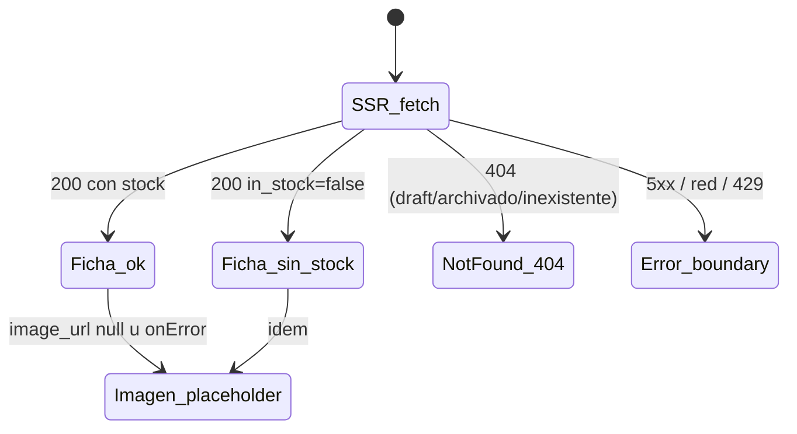

# US-003 Frontend Web — Design

> Diseño de la **primera página pública del storefront**: la ficha de producto (PDP) SSR
> indexable en `apps/web`. Hereda del E2E sin re-arquitecturar: §6.2 (Storefront SSR
> indexable como componente de la Web App), §17 (SEO/LCP < 2.5s vía Next SSR + imágenes
> optimizadas + JSON-LD, p95 lectura < 300ms), §18 (Sentry + Web Vitals). Consume el
> contrato del backend hermano **tal como está publicado** (`storefrontGetProduct`) —
> no se rediseña la API. Fuente visual: `design-system.md` `Approved` (no hay Figma).

## Context

US-001 dejó `apps/web` con el panel del dueño y el sustrato transversal: codegen orval
(DTOs + Zod + MSW desde `apps/api/docs/api/openapi.yaml`, gate `frontend-codegen-fresh`),
`customFetch` como mutator único (F48), mapeo RFC 7807 → `AppError`, tokens del
design-system en Tailwind + CSS vars, helper ARS server/client, security headers en
`next.config.mjs`, y toolchain Vitest/RTL/MSW/Playwright/jest-axe. El backend de US-003
(change verde) publicó `GET /v1/products/{sku}` público con 404 uniforme, `in_stock`
derivado, `image_url` nullable y `Cache-Control: public, max-age=60, stale-while-revalidate=30`.

Este change agrega el route group `(storefront)` con la ficha. Es la primera superficie
**SSR-para-SEO** de la app: introduce dos capacidades nuevas en el sustrato (cliente HTTP
isomorfo con caché de datos explícita; metadatos/JSON-LD por página) que US-002 y US-004
reutilizarán.

## Goals

- Ficha SSR indexable por `/productos/{sku}` con nombre, descripción, precio ARS (IVA
  incluido), imagen, categoría y disponibilidad (AC-1), metadatos + JSON-LD (AC-2).
- Estados completos: con stock (CTA disparador, AC-3), sin stock (badge + WhatsApp, AC-4),
  descripción base-o-enriquecida (AC-5), sin imagen (placeholder, AC-6).
- **404 real** (status HTTP) para draft/archivado/inexistente — nunca soft-200 (AC-7/AC-8).
- Precio vigente: frescura acotada FE↔BE, nunca caché indefinida (AC-9).
- WCAG 2.1 AA y presupuesto LCP < 2.5s construido desde el diseño (US §9, E2E §17).

## Non-goals

- Lógica de carrito (US-007), canal WhatsApp completo (US-018), navegación/top-nav del
  storefront y sitemap (US-002), enriquecimiento IA (US-005), galería/zoom/relacionados (v1).
- Cambios de contrato, de esquema o del comportamiento del backend. **Persistencia: ninguna**
  — este change no introduce tablas, columnas, storage local ni estado persistido; consume
  la API y renderiza (data-architect Mode B no aplica).
- Redefinir tokens o componentes del design-system (se consumen §7/§8/§10/§11).

## Approach — decisiones

### D1 — URL pública: `/productos/[sku]` (interino consciente, hereda OQ-BE-1)

El contrato solo ofrece lookup por `sku`; `products.slug` es una columna infra-owned
diferida por el backend (OQ-BE-1). Ruta interina `/productos/{sku}` bajo el route group
`app/(storefront)/` (App Router per next-standards §1). Migración sin churn cuando OQ-BE-1
resuelva: cambia el nombre del param del segmento y `/productos/{sku}` responde 301 al slug
(SEO preservado; el canonical ya se emite absoluto desde `NEXT_PUBLIC_SITE_URL`, así que el
día de la migración el canonical cambia con la misma edición). **Alternativas**: bloquear
por slug (detiene el critical path) o slug sintético client-side (duplica canónicas) —
descartadas; decisión final del usuario en **OQ-FE-1 `[PENDIENTE-DECISIÓN]`**.

### D2 — Data fetching y frescura del precio (AC-9): Server Component + `next: { revalidate: 60 }`

Fetch en el Server Component vía el servicio (next-standards §3: fetch en RSC, caché
**explícita** por fetch — nunca implícita). Recomendación (OQ-FE-4 `[PENDIENTE-DECISIÓN]`,
opción A): `next: { revalidate: 60 }`, espejo del TTL que el backend declaró (OQ-BE-2).
Resultado: ISR — la ficha se sirve cacheada y se regenera a lo sumo cada 60s; un cambio de
precio en el panel se ve en ≤ ~60–90s (peor caso: revalidate FE + max-age BE solapados),
**nunca** un precio viejo indefinido — que es exactamente lo que AC-9 prohíbe. El 404 de un
sku inexistente también queda acotado a 60s (un producto publicado después aparece solo).
**Alternativas**: `no-store` (precio al segundo, pierde ISR — viable si el negocio lo pide)
y `revalidateTag` on-demand desde el panel (frescura inmediata pero acopla panel↔storefront
y agrega infraestructura — YAGNI v1). No hay `generateStaticParams` (los sku no se conocen
al build; ISR on-demand cubre el catálogo). Sin `force-dynamic`: la ruta es estática con
revalidación, lo que además sostiene p95 < 300ms y el budget LCP (E2E §17).

### D3 — Choke point del contrato (F48): cliente generado + `customFetch` isomorfo

Todo el tráfico sigue saliendo por el cliente generado (orval) → `customFetch`. El mutator
se vuelve isomorfo con dos reglas server-side: (a) **no** inyecta `authorization` (surface
pública; el token admin vive en el browser del panel) ni (b) `traceparent` aleatorio — un
header random por render cambiaría la clave de la Data Cache de Next y anularía `revalidate`
silenciosamente (el bug de caché más sutil de este change; la correlación de trazas del SSR
queda a cargo de la instrumentación de Sentry server-side, E2E §18). Además reenvía
`init.next`/`init.cache` del caller al `fetch` para que la política de caché se declare en
el servicio, no en el mutator. El comportamiento browser (token, traceparent, timeout,
RFC 7807 → `AppError`) queda intacto — los tests del panel lo garantizan.

### D4 — 404 real (AC-7/AC-8): `notFound()` + `not-found.tsx` del segmento

`AppError.notFound` del servicio → `notFound()` de Next en el Server Component → respuesta
con **status HTTP 404** y render de `app/(storefront)/productos/[sku]/not-found.tsx`
(next-standards §1). La página 404 es accionable (copy §10.2 + enlace al inicio y a
WhatsApp), no un dead-end; los buscadores la ven como 404 (no indexable). La uniformidad
draft ≡ archivado ≡ inexistente la garantiza el backend (sin enumeration leak) — el FE no
distingue ni intenta distinguir. Errores no-404 (5xx, red) suben al `error.tsx` del
segmento: boundary con reintento que **reporta a Sentry** (resilience #10 — nunca silencia).

### D5 — SEO: Metadata API + JSON-LD Product con serialización segura

`generateMetadata` (next-standards §6) reusa el mismo fetch (memoización de request de Next
lo deduplica — cero costo extra): title `{nombre} — DSM…`, description truncada, canonical
absoluto, OG con la imagen del producto o la default 1200×630 (design-system §8.1). El
JSON-LD `schema.org/Product` (name, description, image, sku, category, offers con
`priceCurrency: ARS`, `price` decimal derivado de centavos per api-standards §5.5, y
`availability` InStock/OutOfStock) se inyecta con `JSON.stringify(...).replace(/</g, '\\u003c')`
— nombre y descripción los escribe el dueño (input no confiable): el escape de `<` impide
cerrar el `<script>` (security-standards §6). Es el **único** `dangerouslySetInnerHTML`
permitido en el change; la descripción visible se renderiza como texto plano, jamás como HTML.

### D6 — Componentes (package-by-feature, `src/features/storefront/`)

| Componente | Tipo | Rol | Design-system |
|---|---|---|---|
| `ProductDetail` | Server | Composición; jerarquía fija imagen → nombre (`h1`) → precio → disponibilidad → CTA | §7.3 |
| `ProductImage` | Client (hoja) | `next/image` `fill` + `priority` + `sizes` ficha; fallback placeholder (`package` sobre `gray-100`, 1:1) para `null` y `onError` | §8.1, §10.1 |
| `PriceTag` (uso) | Server | `text-3xl`/bold + "IVA incluido"; helper `currency.ts` existente (server=client, sin hydration mismatch) | §7.4 |
| `StockBadge` | Server | "Sin stock" pill con texto + color (nunca solo color) | §7.7 |
| `AddToCartTrigger` | Client (hoja) | Botón `accent` deshabilitado con seam `onAddToCart` (OQ-FE-2 rec. A) — US-007 inyecta el handler sin re-layout | §7.1 |
| `WhatsAppCta` | Server | Enlace `wa.me/{env}` con ícono + texto, copy §10.2 | §7.10, §7.14 |

`"use client"` solo en las dos hojas que lo necesitan (onError / futuro handler) —
next-standards §2/§7: client JS mínimo, RSC para todo lo demás. La categoría se muestra
como texto; el breadcrumb con link es `Deferred: US-002 — navegación del storefront`.
El layout del storefront en este change es mínimo (wordmark "DSM" → home); el top-nav
completo (§7.10) es `Deferred: US-002`.

### D7 — Estados de la pantalla (matriz, per frontend-standards §11.9 + design-system §10.1)

| Estado | Render | AC |
|---|---|---|
| Éxito con stock | Ficha completa + CTA accent (deshabilitado, seam) | AC-1/AC-3 |
| Éxito sin stock | Badge "Sin stock" + **sin** CTA + WhatsApp | AC-4 |
| Sin imagen / imagen rota | Placeholder consistente; resto normal | AC-6 |
| Sin descripción | Sección omitida (contrato nullable) | AC-5 |
| 404 | Status 404 real + página accionable | AC-7/AC-8 |
| 5xx / red / 429 | `error.tsx`: mensaje §10.2 + reintento + reporte Sentry | — |
| Navegación client-side entrante (US-002+) | `loading.tsx` skeleton con la forma de la ficha | — |

El estado inicial no tiene loading en el cliente (es SSR); el skeleton del segmento cubre
las navegaciones suaves futuras (resilience #12: forma real, no spinner).

### D8 — Observabilidad (E2E §18; OQ-FE-5 `[PENDIENTE-DECISIÓN]`)

El BE emite `product.viewed` por hit al origen; con ISR (D2) el origen ve ~1 request/60s
por sku → subcuenta. Recomendación (opción A): evento cliente `pdp_shown` (`sku`,
`in_stock`, `screen_name` — `sku` como propiedad de evento/analytics, **no** dimensión de
métrica, per observability-patterns §3.3; sin PII, lectura anónima) extendiendo el catálogo
tipado de `src/lib/observability/events.ts`. Web Vitals de la ficha ya reportan vía la
init de Sentry de US-001 (LCP p75 de la PDP queda medible sin trabajo extra). La fuente
autoritativa del conteo la decide US-016.

### D9 — Performance / LCP < 2.5s (E2E §17, next-standards §7)

El LCP de la ficha es la imagen hero: `next/image` con `priority` + `sizes`
`(max-width:1024px) 100vw, 50vw` (§8.1) + `remotePatterns` acotado al host de imágenes
(env `NEXT_PUBLIC_IMAGE_CDN_HOST` — no wildcard). ISR sirve HTML pre-renderizado (TTFB
mínimo); Inter ya va por `next/font` (US-001); client JS mínimo (D6). La **medición**
numérica (Lighthouse/LCP p75) es owned-by-QA (`QA-US-003`) — este diseño construye para el
budget; el smoke E2E del dev verifica el SSR (contenido en el HTML del server), no el número.

## Seguridad

- **XSS**: datos del dueño (nombre/descripción) como texto plano; JSON-LD con escape de
  `<` (D5); cero HTML dinámico (security-standards §6, frontend-standards §12.1).
- **Headers**: los security headers del app (CSP report-only, HSTS, XFO, nosniff) ya cubren
  la nueva ruta (`source: '/:path*'`, US-001 T8.4); `img-src https:` ya admite el CDN. Sin
  cambios.
- **Secretos**: solo env `NEXT_PUBLIC_*` públicas nuevas (site URL, teléfono WhatsApp, host
  CDN) — ninguna es secreto (next-standards §8).
- **Surface**: la página es de solo lectura sin auth; la autoridad del 404/publicación es
  del backend (el FE no filtra nada que el contrato no exponga).

## Spec delta

Ninguno sobre el contrato REST (este change **consume** `storefrontGetProduct`). Al
archivar: `openspec/specs/catalogo/requirements.md` suma los requisitos FE de la ficha
(SSR indexable, 404 real, estados) desde este change — lo aplica `/archive-change`.

## Trade-offs

- **ISR 60s vs precio al segundo (D2)**: se acepta hasta ~60–90s de precio viejo a cambio
  de ISR (SEO/LCP/carga de origen). Coherente con la decisión del BE; reversible cambiando
  una opción de fetch si OQ-FE-4 se ratifica distinto.
- **`sku` en la URL (D1)**: URL menos "amigable" que un slug hoy, a cambio de no bloquear el
  critical path en una columna infra-owned; migración 301 planificada.
- **CTA deshabilitado (D6)**: ficha visualmente completa y honesta vs un botón activo sin
  lógica; US-007 lo habilita inyectando el handler (cero re-layout).
- **Smoke E2E con API real** (no `page.route`): el fetch SSR es server-side — el mock de
  browser no lo intercepta; se paga el seed por API a cambio de verificar el SSR de verdad.

## Open questions

Ver `proposal.md` §Open questions: OQ-FE-1 (URL), OQ-FE-2 (CTA), OQ-FE-3 (número WhatsApp),
OQ-FE-4 (frescura del precio), OQ-FE-5 (fuente del conteo de vistas). Las cuatro marcadas
`[PENDIENTE-DECISIÓN]` ejecutan la recomendación salvo decisión distinta del usuario.

## References

- US: `docs/user-stories/US-003-ficha-producto-pdp.md` (AC-1…AC-9, §8, §9).
- E2E: `docs/product/design-e2e.md` §6.2, §17, §18 (heredado — no se re-arquitectura).
- Design system `Approved`: `docs/product/design-system.md` §7.1/§7.3/§7.4/§7.7/§7.10/§7.14/§8.1/§10.1/§10.2/§11/§12.
- Contrato consumido: `apps/api/docs/api/openapi.yaml` (`storefrontGetProduct`) +
  `openspec/changes/US-003-ficha-producto-pdp-backend/contracts/openapi/storefront-get-product.yaml`.
- Change BE hermano (decisiones heredadas: 404 uniforme, `in_stock`, Cache-Control, OQ-BE-1/2):
  `openspec/changes/US-003-ficha-producto-pdp-backend/design.md`.
- Standards: `frontend-standards.md` §3/§8/§11/§12; `frontend-next-standards.md` §1/§2/§3/§6/§7/§8/§9/§10;
  `api-standards.md` §5.5/§8; `security-standards.md` §6; `qa-frontend-standards.md` §2.1/§23.
- Skills: `openspec-workflow`, `fe-design-without-figma`, `openapi-client-codegen`,
  `frontend-resilience-patterns` (#10/#11/#12), `msw-setup`, `playwright-stability`,
  `observability-patterns` §9.5.
- ADRs: ADR-0001 (plataforma/R2 → host de imágenes), ADR-0007 (monolito modular). Ninguno nuevo.
