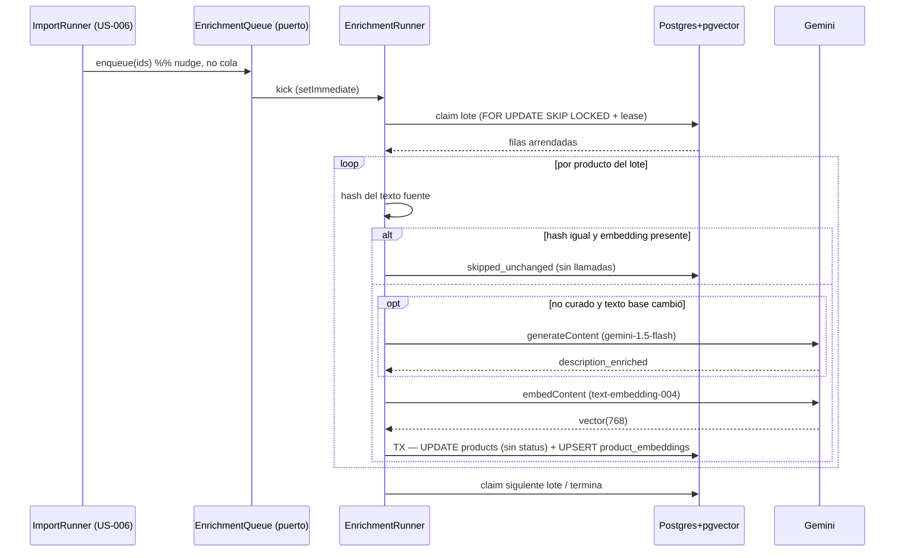

# US-005 Backend — Diseño

## Contexto

El pipeline que este change construye está **completamente decidido en su qué**: ADR-0003 fija
proveedor y modelos, ADR-0002 fija el datastore y la dimensión (768), el E2E §9.3 dibuja la
secuencia y el DER §8 declara `PRODUCT_EMBEDDINGS`. Este diseño no re-arquitectura nada de eso.

Lo que sí requiere diseño es el **cómo se ejecuta** y el **cómo se decide qué producto tocar**,
porque ahí es donde el plan choca con la realidad AS-BUILT del repo:

1. **No hay cola.** `REDIS_URL` existe en `docker-compose.yml` y en `.env.example`, pero el
   add-on gestionado no está aprovisionado (US-019 T1.3 abierta) y `apps/worker/` es un README.
   ADR-0012 ya resolvió esto para el import y dejó explícito que el enriquecimiento esperaría a
   la cola. **ADR-0014** (T0.1) revisa esa espera.
2. **El costo es dinero real por producto.** Cada llamada a Gemini se paga. La diferencia entre
   "re-enriquecer cuando algo cambió" y "re-enriquecer en cada corrida" es la diferencia entre
   centavos y una factura, y es exactamente lo que AC-6 pide.
3. **Hay dos autores del texto**: la IA y el dueño. AC-7 exige que el segundo gane. Eso no es
   una condición en un `if`: es una columna, porque el sistema tiene que **recordar** quién
   escribió el texto que está viendo.

## Objetivos

- Dejar `product_embeddings` poblada y consultable por kNN sobre índice HNSW, de modo que
  US-004 sólo tenga que escribir la query de búsqueda.
- Que el pipeline sea **reanudable**: la cola es `SELECT ... WHERE enrichment_done = false`, así
  que un reinicio, un deploy o una caída de Gemini no pierden trabajo ni requieren re-encolar.
- Que el gasto en IA sea **proporcional al cambio real del catálogo** (AC-6), no al número de
  corridas.
- Que la cobertura del catálogo sea un número consultable (AC-3), no una impresión.
- Que el fallo del proveedor degrade a "producto sin embedding, navegable por categoría"
  (AC-5) y nunca a "producto con embedding basura".

## No objetivos

- No se construye el endpoint de búsqueda ni el umbral de relevancia (US-004).
- No se despliega un worker ni se aprovisiona Redis (US-019 / ADR-0014 criterio de migración).
- No se expone la descripción enriquecida en el storefront (OQ-BE-3).
- No se construye UI: la curación de AC-7 se habilita por API, la pantalla es FE.
- No se re-tunea el HNSW contra datos reales (US-004, con la batería de relevancia en la mano).

## Enfoque

### Estructura del módulo

```
apps/api/src/enrichment/
  enrichment.module.ts
  enrichment.controller.ts            # 2 endpoints admin
  enrichment.service.ts               # matriz de decisión por producto
  enrichment.runner.ts                # lotes, concurrencia, cooldown
  enrichment.repository.ts            # único punto de ORM/SQL crudo del pipeline
  source-text.ts                      # texto fuente + hash (puro, testeable solo)
  backoff.ts                          # backoff exponencial + jitter (puro)
  dto/enrichment.dto.ts
  ports/
    ai-enricher.port.ts               # AI_ENRICHER  (token + interfaz)
    ai-embedder.port.ts               # AI_EMBEDDER  (token + interfaz)
    enrichment-queue.port.ts          # el puerto que US-006 inyecta (nudge)
  ai/
    gemini-http.client.ts             # REST + timeouts + validación + redacción
    rate-limiter.ts                   # tope de RPM del proveedor
    disabled-ai.provider.ts           # sin GEMINI_API_KEY → falla explícito, no falso
    ai.providers.ts                   # factory por config (patrón del mailer de US-014)
```

La ubicación del puerto `EnrichmentQueue` es una **decisión de coordinación**: US-006 lo
planificó bajo `src/imports/enrichment/`, pero su dueño natural es el consumidor. Vive en
`src/enrichment/ports/`, y `ImportRunner` lo importa desde ahí. Si US-006 se ejecuta primero y
lo crea en su ruta, T3.5 lo **mueve** (un import cambiado, sin cambio de comportamiento).

### Matriz de decisión por producto (el corazón de AC-6 + AC-7)

`EnrichmentService.processProduct` decide con dos datos: si el texto es curado y si el hash del
texto fuente cambió respecto de `enrichment_source_hash`.

| Estado del producto | Llamada al LLM | Llamada al embedder | Resultado |
|---|---|---|---|
| Nuevo / `description_raw` cambió, no curado | **sí** | sí | `description_enriched` nueva, embedding nuevo, `enrichment_done=true`, hash actualizado |
| Curado (`description_curated=true`), texto curado cambió | **no** (AC-7) | sí | embedding regenerado sobre el texto curado, hash actualizado |
| Hash igual y embedding presente | no | no | `skipped_unchanged` — no se gasta un centavo (AC-6) |
| Hash igual pero **sin** embedding (fallo previo) | no | sí | sólo se completa el vector faltante |
| `description_raw` vacía y sin curar | **sí** (sobre `name` + categoría) | sí | el caso real del catálogo pobre: el nombre y el rubro son el único insumo |

Un cambio de **precio** o **stock** no altera el texto fuente ⇒ el hash no cambia ⇒ cero
llamadas. Ese es el test que hace verificable AC-6 (T3.1/T6.2).

### Ejecución: claim por lease, sin tabla de jobs ni reaper

El estado del trabajo ya vive en `products` (US-006 puso `enrichment_done` ahí, siguiendo el
DER). Agregar una tabla `enrichment_jobs` duplicaría ese estado en dos lugares, así que el
control se queda en la fila del producto. El **claim** se hace con el propio
`enrichment_next_attempt_at`:

```sql
-- claim atómico de un lote: selecciona pendientes vencidos, los "arrienda" empujando su
-- próximo intento al futuro y devuelve las filas arrendadas en la misma sentencia.
UPDATE products SET enrichment_next_attempt_at = now() + $lease
WHERE id IN (
  SELECT id FROM products
  WHERE enrichment_done = false
    AND (enrichment_next_attempt_at IS NULL OR enrichment_next_attempt_at <= now())
    AND enrichment_attempts < $maxAttempts
  ORDER BY enrichment_next_attempt_at NULLS FIRST, created_at
  LIMIT $batch
  FOR UPDATE SKIP LOCKED
)
RETURNING id, name, description_raw, description_enriched, description_curated,
          enrichment_source_hash, enrichment_attempts, category_id;
```

Tres propiedades que esto compra y que en el diseño de US-006 costaron tasks separadas:

- **Dos runs concurrentes no pisan el mismo producto** (`SKIP LOCKED` + lease en el futuro),
  así que la corrección no depende de que haya una sola réplica en Railway.
- **No hace falta reaper**: un proceso que muere a mitad de un lote deja las filas arrendadas;
  al vencer el lease vuelven a ser elegibles solas. El "trabajo huérfano" se auto-cura.
- **El backoff sobrevive al reinicio**, porque es una fecha en la base y no un temporizador en
  memoria — la crítica que ADR-0012 se hace a sí misma queda cubierta acá.

El runner corre **un lote a la vez** con `ENRICHMENT_CONCURRENCY` productos en paralelo dentro
del lote y `await` entre lotes, `per backend-node-standards.md §8 — nunca bloquear el event
loop`. Un `POST /runs` con un run en curso devuelve **409** (misma semántica que el import de
US-006), no encola un segundo.

### Resiliencia por llamada al proveedor

| Control | Valor | Por qué |
|---|---|---|
| Timeout enriquecer | 20 s (`AbortSignal.timeout`) | `gemini-1.5-flash` generando ~80 palabras; más allá de eso conviene reintentar |
| Timeout embeddear | 10 s | llamada corta; un timeout largo sólo alarga la cola |
| Reintentos in-process | 3, backoff 1 s/4 s/9 s + jitter | absorbe el 429 esporádico sin devolver el producto a la cola |
| `Retry-After` | respetado cuando viene | pelearle al proveedor por su propia ventana es cómo se gana un bloqueo |
| Backoff durable | 1 m / 5 m / 25 m / 2 h / 10 h | fallo persistente; `enrichment_attempts` es el índice |
| Abandono | a los 5 intentos | AC-5: conserva descripción base, queda `error_code`, re-habilitable con `force` |
| Tope de RPM | `GEMINI_MAX_RPM=15` | free tier de `gemini-1.5-flash` (ADR-0003 eligió el proveedor por su tier gratuito) |
| Cooldown del runner | 5 min tras 5 fallos consecutivos | circuit-breaker mínimo, sin sumar `opossum`: si Gemini está caído, seguir llamando sólo quema cuota |

Los errores del proveedor se clasifican en **transitorio** (429, 5xx, timeout, red) y
**permanente** (400, 401/403, respuesta malformada). El permanente no reintenta: cuenta un
intento y suele significar clave inválida o prompt rechazado, y ahí el reintento es ruido.

### Validación de la respuesta (no confiar en el proveedor)

Un vector de dimensión distinta a 768 **no se persiste**: rompería el tipo de la columna y, si
la columna lo aceptara, envenenaría el kNN. Se valida longitud, que todos los componentes sean
finitos y que la norma no sea cero, `per security-standards.md §6 — validar toda entrada,
incluida la que viene de un tercero de confianza`. La descripción enriquecida se valida por
longitud (tope configurable) y se guarda como texto plano — nunca se interpreta ni se ejecuta,
que es el mismo argumento anti-prompt-injection que US-004 aplica del lado de la consulta.

### Secuencia (hereda E2E §9.3)



## Persistencia

> Producida con el skill `data-architecture-patterns` (caso trivial: dos migraciones aditivas,
> sin movimiento de datos, sin datastore nuevo). No se invocó `data-architect` Mode B.

### `products` — 6 columnas nuevas (todas aditivas, ninguna existente cambia)

| Columna | Tipo | Default | Para qué | ¿En el DER? |
|---|---|---|---|---|
| `description_enriched` | `TEXT NULL` | — | el texto que la IA escribe y que alimenta el embedding (AC-1) | **sí** (E2E §8) |
| `description_curated` | `BOOLEAN NOT NULL` | `false` | el dueño escribió este texto; la IA no lo pisa (AC-7) | no — **desviación** |
| `enrichment_source_hash` | `TEXT NULL` | — | SHA-256 del texto fuente usado en el último enriquecimiento (AC-6) | no — **desviación** |
| `enrichment_attempts` | `INTEGER NOT NULL` | `0` | índice del backoff y disparador del abandono (AC-4/AC-5) | no — **desviación** |
| `enrichment_next_attempt_at` | `TIMESTAMP(3) NULL` | — | backoff durable **y** lease del claim (AC-4) | no — **desviación** |
| `enrichment_error_code` | `TEXT NULL` | — | último fallo, para que "queda registrado" sea verdad (AC-5) | no — **desviación** |

`enrichment_done` **ya existe** (US-006 T0.2) y conserva su semántica: `false` = pendiente.

**Por qué las cinco desviaciones y no una tabla aparte.** La relación con el producto es 1:1 y
el estado ya empezó a vivir en `products` por decisión del DER (`enrichment_done`). Partirlo en
`product_enrichment_state` obligaría a un JOIN en la query más caliente del pipeline (el claim)
y dejaría el estado en dos lugares —el fallo de diseño que ADR-0012 evitó a propósito con la
marca durable—. El costo aceptado es que `products` crece a 6 columnas de control; se declara
acá para que el próximo que lea el DER no lo tome como drift silencioso.

### `product_embeddings` — tabla nueva (1:1 con producto, del DER §8)

| Columna | Tipo | Restricción |
|---|---|---|
| `product_id` | `UUID` | **PK** + FK → `products(id)` `ON DELETE CASCADE` |
| `embedding` | `vector(768)` | `NOT NULL` |
| `model_version` | `TEXT` | `NOT NULL` (AC-8) |
| `generated_at` | `TIMESTAMP(3)` | `NOT NULL DEFAULT now()` |

- **`ON DELETE CASCADE`**: borrar un producto no puede dejar un vector huérfano rankeando en la
  búsqueda. (En la práctica el catálogo archiva en vez de borrar, pero la FK no se apoya en eso.)
- **Prisma no tiene tipo `vector`**: el modelo se declara con
  `embedding Unsupported("vector(768)")` para que `prisma migrate` administre la tabla, y toda
  lectura/escritura del vector va por `$queryRaw` / `$executeRaw`, `per E2E §16 — ORM Prisma,
  kNN por $queryRaw`. La columna queda fuera de los tipos generados: no hay forma de leerla por
  accidente con el client tipado.
- **Índice HNSW**: `USING hnsw (embedding vector_cosine_ops) WITH (m = 16, ef_construction = 64)`
  — SQL a mano en la migración (Prisma no lo expresa). `vector_cosine_ops` porque la distancia
  es la coseno del E2E §8.
- **Índice parcial de pendientes**:
  `products (enrichment_next_attempt_at) WHERE enrichment_done = false` — hace que el claim no
  escanee el catálogo completo cuando el 99% ya está enriquecido, que es el estado estable.

### Orden y reversibilidad

Una sola migración (`add_enrichment_and_embeddings`): `ALTER TABLE products ADD COLUMN` ×6 →
`CREATE TABLE product_embeddings` → `CREATE INDEX ... hnsw` → `CREATE INDEX ... partial`.
Hacia atrás es segura (la versión vieja del código ignora columnas y tabla nuevas). El `down`
es el inverso; el HNSW se reconstruye en minutos a esta escala.

## NFRs cuantificados

> Con el skill `nfr-quantification` sobre E2E §17 y §21.

| NFR | Número | Cómo se sostiene / dónde se verifica |
|---|---|---|
| Cobertura del catálogo enriquecido | **≥ 90%** (PRD §1.4) | consulta de cobertura + `/status`; ejercido en T6.4 con 5% de fallo inyectado |
| Ventana de enriquecimiento inicial | **≈ 5,5 h** para 5.000 SKUs a 15 RPM | OQ-BE-2 / **Q-4 del E2E §23**. Es techo del proveedor, no del código: subir la cuota es la única palanca real |
| p95 de lectura del storefront durante una corrida | **< 300 ms** (E2E §17, sin regresión) | el runner es I/O-bound y cede el event loop entre ítems; T3.4 lo verifica con `/v1/health` respondiendo durante el proceso |
| Latencia por producto | ~1,5–3 s (enriquecer + embeddear) | dos llamadas secuenciales; con `ENRICHMENT_CONCURRENCY=2` el techo efectivo lo pone el RPM, no la latencia |
| Vector | **768 dims** exactas | validado antes de persistir; una dimensión distinta es error permanente |
| Reintentos | 3 in-process + 5 durables | tabla de resiliencia arriba |
| Rate-limit de `POST /runs` | 6 / min por IP | superficie que gasta dinero; `per security-standards.md §7.3` |

**Gatillo de revisión declarado**: si el catálogo pasa de ~10.000 SKUs o el import se automatiza
(deja de ser una acción ocasional del dueño), la corrida in-process deja de ser aceptable y se
ejecuta el criterio de migración de ADR-0014.

## Seguridad

> STRIDE acotado a lo que este change agrega (skill `threat-modeling-lite`), sobre E2E §14.

| Amenaza | Superficie | Control |
|---|---|---|
| **Information disclosure** | `GEMINI_API_KEY` | viaja en el header `x-goog-api-key`, **nunca** como `?key=` en la URL: cualquier log de error que incluya la URL filtraría la clave. El adapter redacta headers al loguear y sólo registra status + código, `per security-standards.md §5`. Test dedicado (T5.2) que falla si la clave aparece en un log |
| **Elevation of privilege** | `/v1/admin/enrichment/*` | `AdminGuard` (`role=admin`, ADR-0009) en el controller completo; sin token es 401, con token de cliente 403 |
| **Cost abuse / DoS económico** | `POST /runs` | admin-only + throttler `enrichment` (6/min) + un solo run concurrente (409) + tope de RPM. Un bucle de re-disparo no multiplica llamadas a Gemini |
| **Tampering** | respuesta del proveedor | vector validado (768 dims, finitos, norma ≠ 0); texto validado por longitud y guardado como texto plano, nunca interpretado |
| **Repudiation / silencio** | fallo del proveedor | `enrichment_error_code` + evento `provider_unavailable`; el `/status` lo muestra en vez de esconderlo |
| **Spoofing** (no aplica) | — | no se agrega ningún endpoint público ni webhook |

Un dato que conviene dejar escrito: el texto que se manda a Gemini es **catálogo de ferretería**,
no PII. No hay dato de comprador cruzando la frontera del proveedor de IA, así que la
consideración de la Ley 25.326 (E2E §23 Q-3) no se mueve por este change.

## Observabilidad

Eventos de negocio vía `EnrichmentEventsService`, mismo patrón que `CatalogEventsService`
(log pino estructurado + contador en memoria como stand-in de métrica):
`enrichment.run_started`, `.product_enriched`, `.embedding_generated`, `.skipped_unchanged`,
`.skipped_curated`, `.retried`, `.abandoned`, `.provider_unavailable`, `.run_finished`.

- **Cardinalidad acotada**: los contadores son por nombre de evento, no por producto. El
  `product_id` va en el log, no en la métrica, `per observability-standards.md §9`.
- **Costo aproximado**: `.product_enriched` lleva la longitud del prompt y de la respuesta en
  caracteres — insumo suficiente para estimar gasto sin instrumentar tokens reales, que la
  API no siempre devuelve.
- **Lo que alimenta el runbook** (E2E §18.5): "Gemini caído / rate-limited" se diagnostica con
  `provider_unavailable` + el estado `cooldown` en `/status`; "cobertura de catálogo
  enriquecido" es literalmente el payload de `/status`.
- **Prohibido**: la clave, la URL completa, el prompt entero y la respuesta entera (se loguean
  longitudes, no contenidos).

## Trade-offs

- **Ejecutor in-process vs esperar BullMQ.** Elegido in-process (ADR-0014). Esperar bloquea el
  diferenciador del producto detrás de US-019, que depende de cuentas externas sin fecha. El
  costo —competir con el request path— es menor que en el import porque el trabajo es
  I/O-bound, y el criterio de migración deja la puerta abierta con un cambio de una pieza.
- **`fetch` + REST vs SDK `@google/generative-ai`.** Elegido REST. El SDK sumaría una
  dependencia con su propia política de reintentos peleando con la nuestra, y necesitamos
  control fino de timeout por llamada (`AbortSignal.timeout`) y de dónde viaja la clave. Node 22
  trae `fetch` global. El costo: si Gemini cambia el shape de la respuesta, lo absorbe nuestro
  parser — mitigado porque validamos la respuesta de todas formas.
- **Estado de enriquecimiento en `products` vs tabla `enrichment_jobs`.** Elegidas las columnas
  (ver §Persistencia). Una tabla de jobs daría historial de corridas —que nadie pidió— a cambio
  de un JOIN en la query del claim y estado duplicado.
- **Lease-como-claim vs columna `claimed_at` + reaper.** Elegido el lease. Una columna menos y
  un job menos, con la misma propiedad de auto-curación. El costo: el lease vencido re-elige el
  producto aunque el proceso original siga vivo y colgado en una llamada — por eso el lease
  (2 min) es holgado frente al timeout máximo (20 s + reintentos).
- **Adapter "dev" que devuelve vectores falsos vs runner deshabilitado.** Elegido deshabilitado.
  Un embedding falso hace que la búsqueda "funcione" devolviendo basura, y eso se descubre en la
  demo. Sin clave, el `/status` dice `disabled` y los productos quedan navegables por categoría
  (AC-5). El fake determinista existe **sólo** en tests.
- **Auto-aplicar la descripción enriquecida vs cola de revisión del dueño.** Auto-aplicada, por
  regla de negocio ya confirmada en la US §10. El dueño corrige después (AC-7), y esa corrección
  es la que el sistema respeta para siempre.

## Decisiones

| Id | Decisión | Fundamento |
|---|---|---|
| D1 | Ejecutor in-process en `apps/api`, contrato durable en Postgres, criterio de migración a BullMQ | ADR-0014 (T0.1), decidido por el Arquitecto el 2026-08-22; extiende ADR-0012 y enmienda ADR-0004 |
| D2 | La cola es `WHERE enrichment_done = false`; el "encolado" de US-006 es un **nudge** | US-006 design.md §306-309 ya lo dejó así: un evento perdido no pierde trabajo |
| D3 | Texto fuente = `name` + nombre de categoría + (curado ∥ enriquecido ∥ base) | OQ-BE-1. "Mecha widia 8" sin el rubro es casi ruido para el embedder |
| D4 | `description_curated` como columna, no como heurística | AC-7 necesita memoria de autoría; inferirla de `updated_at` sería adivinar |
| D5 | Clave del proveedor en header, nunca en la URL | AC-9; el `?key=` de los ejemplos de Gemini es un leak esperando un log de error |
| D6 | Sin clave ⇒ `disabled`, y en producción el arranque falla | precedente `RESEND_API_KEY` en `env.validation.ts`: una feature que "funciona" sin hacer nada es peor que un arranque roto |
| D7 | 2 endpoints admin, ninguno público | AC-3 necesita ser observable; el storefront no tiene nada que hacer acá |
| D8 | `PATCH /admin/products/{id}` acepta `description_enriched` | sin un camino de curación, AC-7 no es verificable de punta a punta. La pantalla es FE (diferida) |

## Preguntas abiertas

Ninguna bloquea el arranque; las cinco están implementadas con el default de la tabla de
`proposal.md` §Preguntas abiertas. Se listan acá con lo que el PO debería mirar:

- **OQ-BE-1** (texto fuente): si el PO quiere que la marca o el atributo técnico pesen más, se
  ajusta el armado del texto y hay que re-embeddear. Cambio de una función pura + una corrida.
- **OQ-BE-2 / Q-4 del E2E** (ventana): 5,5 h para el catálogo completo con el tier gratuito. Si
  eso no alcanza para el día de la carga inicial, la palanca es la cuota de Gemini.
- **OQ-BE-3** (mostrar el texto enriquecido en la ficha): decisión de producto con impacto SEO.
  Hoy el texto existe y no se muestra; exponerlo es un cambio de DTO en el storefront.
- **OQ-BE-4** (tuning HNSW): defaults razonables para ~5.000 vectores; re-tunear con la batería
  de relevancia de US-004 en la mano.
- **OQ-BE-5** (5 intentos): el techo protege la cuota; si el PO prefiere insistir más, es una
  variable de entorno.

## Consideraciones de despliegue

**Recomendación: sí planificar despliegue** (`/plan-deployment US-005`) — hay migración de
esquema, secreto nuevo y un workload de fondo nuevo en el proceso de la API. Razones concretas:

- **Migración**: aditiva, hacia atrás segura, pero el `CREATE INDEX ... hnsw` sobre una tabla
  vacía es instantáneo **sólo si se corre antes de poblar**. Orden: migrar → desplegar → correr.
- **Secreto nuevo**: `GEMINI_API_KEY` en las variables de Railway (el slot ya está previsto en
  US-019 T2.x). Sin él, staging arranca `disabled`; producción **no arranca** (D6). Eso es
  intencional y hay que decirlo en el runbook para que nadie lo lea como una caída.
- **Primera corrida**: es la ventana de ~5,5 h de OQ-BE-2. Conviene dispararla fuera del
  horario de más tráfico del storefront, aunque el runner ceda el event loop.
- **Rollback**: redeploy del commit verde anterior. Las columnas y la tabla quedan (aditivas, no
  molestan); si hay que revertir la migración, el `down` es limpio y el HNSW se reconstruye.
- **Flag operativo**: `ENRICHMENT_ENABLED=false` apaga el runner sin desplegar, para el caso
  "Gemini nos está cobrando algo raro" o "el import de hoy no debe gastar".

## References

- User story: [`docs/user-stories/US-005-enriquecimiento-ia-embeddings.md`](../../../docs/user-stories/US-005-enriquecimiento-ia-embeddings.md) (AC-1..AC-10, §9 NFRs, §10 reglas de negocio confirmadas)
- E2E: [`docs/product/design-e2e.md`](../../../docs/product/design-e2e.md) §6.1, §8 (DER + notas de pgvector/Prisma), §9.3 (secuencia heredada), §14 (frontera de IA), §16 (stack: Prisma + `$queryRaw`), §17, §18/§18.5, §21, §22, §23 Q-4
- PRD: [`docs/product/prd.md`](../../../docs/product/prd.md) §1.4, §2.1 capacidad 3, §3.2
- ADRs: `0002` (pgvector, 768 + HNSW), `0003` (Gemini, modelos), `0004` (BullMQ — enmendado), `0012` (precedente in-process), **`0014` (este change, T0.1)**
- Standards citados: `backend-node-standards.md` §2/§3/§4/§5/§6/§7/§8/§9 · `api-standards.md` §2/§5/§8/§10/§12 · `security-standards.md` §5/§6/§7.1/§7.3 · `observability-standards.md` §9 · `testing-standards.md` §14 · `data-standards.md` · `documentation-standards.md` §8/§11.1
- Skills aplicados: `openspec-workflow`, `data-architecture-patterns` (caso trivial, sin Mode B), `nfr-quantification`, `observability-patterns`, `threat-modeling-lite`, `api-contract-completeness`
- Changes de referencia: `US-006-import-masivo-inventario-backend` (runner por lotes, puerto `EnrichmentQueue`, marca durable), `US-014-registro-login-backend` (puerto + adapter por config, secreto exigido en producción, throttler nombrado)
