# US-007 Frontend Web — Design

## Context

Casi todo lo visual está resuelto arriba: el design-system §7.11 fija el carrito, el
mini-cart y el stepper acotado al stock; §7.4 fija el formato de precio; §10.1 el estado
vacío. Y el contrato del backend ya existe y está publicado, así que la forma de los datos
no se negocia acá.

Lo que queda por decidir son cuatro cosas, y tres salen de restricciones que el repo ya
se impuso:

1. **Dónde se renderiza el carrito.** No es una preferencia: `client.ts` **lanza** si una
   llamada con sesión sale del servidor.
2. **Cómo llegan las cookies del carrito al navegador en producción.** ADR-0013 ya
   resolvió el mecanismo y nombró a US-007 como heredero.
3. **Cómo convive un segundo sujeto de CSRF** con el que US-014 dejó atado a una cookie.
4. **Optimista o pesimista** en el stepper — la única de las cuatro que es genuinamente
   una decisión de producto (OQ-FE-1).

## Goals

- Agregar, editar y quitar productos del carrito, con el total siempre igual al que
  calcula el servidor (AC-1, AC-2, AC-3).
- Que el carrito sobreviva al cierre del navegador sin que el frontend administre la
  cookie (AC-4).
- Mostrar disponibilidad y tope de stock **sin prometerlos** (AC-5, AC-6, AC-8).
- Que la topología de cookies funcione **igual en local y en producción** (ADR-0013).
- Estado vacío, precios vigentes y 404 indistinguible (AC-7, AC-9, AC-10).

## Non-goals

- Checkout, datos del comprador y pago (US-008/US-009).
- Buscador del top-nav (US-004) ni fusión carrito↔cuenta (fuera de v1).
- Renderizar el carrito en el servidor o soportar no-JS (ver D1 y OQ-FE-5).

## Approach

### D1 — El carrito es una vista de cliente (forzado, no elegido)

`src/lib/http/client.ts` tiene este guard:

```ts
if (init.session === 'customer' && isServer) {
  throw new AppErrorException({ kind: 'server', message: 'La sesión del cliente es sólo de navegador (design.md D3)' });
}
```

No es defensivo por gusto: existe para que un dato personalizado no entre a la Data Cache
de Next y se le sirva a otra persona. El carrito es dato personalizado por definición, así
que **hereda el guard** — `session: 'cart'` lanza en servidor igual que `'customer'`.

Consecuencias, todas asumidas:

| Consecuencia | Por qué está bien |
|---|---|
| `/carrito` es un Client Component; se ve un skeleton en la primera carga | No hay nada que indexar: un carrito no es contenido público |
| Se agrega `noindex` por Metadata API | Es la contraparte correcta de lo anterior |
| El badge del top-nav es una **isla cliente** dentro de un layout servidor | El layout sigue siendo servidor (lo necesita `CategoryNav` para el SEO de US-002); sólo el badge hidrata |
| El badge parpadea de vacío a su valor en la primera pintura | Se mitiga renderizándolo sin número hasta que resuelve, en vez de con un `0` que sería **incorrecto** |
| Sin JS no hay carrito | OQ-FE-5. Soportarlo exigiría Server Actions y relajar el guard |

La alternativa —renderizar en servidor reenviando `cookies()`— se descarta explícitamente:
obligaría a abrir una excepción en el único lugar que impide una fuga de datos entre
personas, y esa clase de excepción se cuela después en otra pantalla.

### D2 — El rewrite same-origin se extiende al carrito (ADR-0013)

ADR-0013 cierra diciendo: *«Inherited by: US-007 (cart, if it moves to a
cookie-authenticated surface)»*. Lo es. Hoy `next.config.mjs` rewritea sólo
`/v1/auth/:path*`; se agrega `/v1/cart/:path*` al mismo array.

Sin esto el carrito **funciona en local y está roto en producción**: `up.railway.app` está
en la Public Suffix List, el sitio y el API son sitios distintos, y `dsm_cart` nunca
vuelve. El defecto es invisible hasta el deploy, que es exactamente por qué ADR-0013 se
verifica con un E2E contra la app **construida** y no con un test unitario —
`auth-topology.spec.ts` es el precedente y este change lo replica para el carrito.

Sigue siendo configuración declarativa: **no agrega un `fetch`**, así que la regla de un
solo cliente HTTP (F48) queda intacta.

### D3 — Dos sujetos de CSRF, un solo lector

`csrf.ts` es hoy «el único lector de `document.cookie` de toda la app», con la cookie
hardcodeada:

```ts
export const CSRF_COOKIE = 'dsm_csrf';
export function readCsrfToken(): string | null { … }
```

El carrito trae `dsm_cart_csrf`. La tentación es parsear la cookie donde se necesite; el
comentario del propio archivo explica por qué no («si cada llamada parseara
`document.cookie` por su cuenta, el día que cambie el nombre habría que encontrar todos los
lugares, y el que se olvide falla con un 403 que parece otra cosa»).

Se agrega el **sujeto**, no un segundo lector:

```ts
export const CSRF_COOKIES = { session: 'dsm_csrf', cart: 'dsm_cart_csrf' } as const;
export type CsrfSubject = keyof typeof CSRF_COOKIES;
export function readCsrfToken(subject: CsrfSubject = 'session'): string | null { … }
```

Y `client.ts` mapea `session: 'customer' → 'session'` y `session: 'cart' → 'cart'`. El
default preserva el comportamiento actual, así que **ningún test de US-014 se toca** — si
hubiera que tocarlos, el refactor está mal.

**Fail closed** se mantiene tal cual: si la cookie no está, la llamada sale sin header y el
403 se propaga. Inventar un valor sólo cambiaría el 403 por un error más confuso.

### D4 — Estado: unión discriminada + reemplazo, no reconciliación

```mermaid
stateDiagram-v2
    [*] --> idle
    idle --> loading: montar /carrito o el badge
    loading --> ready: 200 con CartView
    loading --> error: network / 5xx / 429
    ready --> ready: mutación OK (reemplaza el CartView completo)
    ready --> mutating: PUT o DELETE en vuelo (por línea)
    mutating --> ready: 200 con el carrito nuevo
    mutating --> conflict: 409 (stock insuficiente → muestra available_quantity)
    mutating --> gone: 404 (producto ya no disponible)
    conflict --> ready: la persona ajusta la cantidad
    gone --> ready: la línea se marca; la persona la quita
    error --> loading: reintentar
```



La clave es que **las tres operaciones del backend devuelven el carrito completo**. Eso
permite que cada mutación **reemplace** el estado en vez de parchearlo: no hay un cálculo
local de totales que pueda divergir del servidor, y AC-9 (precios vigentes) sale gratis.
Es también la razón por la que el estado no necesita un store global nuevo — un hook con
`useReducer` y un contexto liviano alcanzan, y el badge se suscribe al mismo.

`mutating` es **por línea**, no global: cambiar la cantidad de un ítem no puede congelar el
resto del carrito.

### D5 — Componentes

```
src/features/cart/
├─ cartService.ts        ← repositorio: envuelve el cliente generado (§3.3, lógica a mano)
├─ useCart.ts            ← unión discriminada + reducer; expone add/setQuantity/remove
├─ CartProvider.tsx      ← contexto para que el badge y la página compartan un solo estado
├─ CartPage.tsx          ← composición de los 4 estados (§11.9)
├─ CartItemRow.tsx       ← imagen, nombre, PriceTag, stepper, subtotal, avisos
├─ QuantityStepper.tsx   ← acotado a max_quantity, operable por teclado
├─ CartSummary.tsx       ← total + CTA «Ir al pago» (deshabilitado si has_blocking_issues)
├─ CartEmptyState.tsx    ← §10.1
├─ MiniCart.tsx          ← §7.11: baja desde arriba, role="status", NO redirige
├─ CartBadge.tsx         ← isla cliente en el layout del storefront
└─ AddToCartButton.tsx   ← usado por ProductPurchase (ficha) y ProductCard (listado)
```

`app/(storefront)/carrito/page.tsx` monta `CartPage` y declara `robots: { index: false }`.

**Tres archivos ya entregados se modifican** — es la parte del plan que toca superficie
viva, y por eso cada task exige que los tests existentes corran **sin editarse**:

| Archivo | Cambio | De quién era |
|---|---|---|
| `app/(storefront)/layout.tsx` | agrega `CartProvider` + `CartBadge` al header | US-002/US-018 |
| `src/features/storefront/ProductPurchase.tsx` | el botón deja de estar `disabled` y pasa a usar `AddToCartButton` | US-003 |
| `src/features/storefront/ProductCard.tsx` | agrega «Agregar» (OQ-FE-2) | US-002 |

El test de `ProductPurchase` que hoy asserta `disabled` **sí** hay que reescribirlo: es un
test de un cartel de roadmap, y este change apaga el cartel. Es la única excepción, y está
nombrada.

### D6 — Lo que la UI muestra de cada estado del contrato

| Campo del `CartView` | Qué hace la UI |
|---|---|
| `availability: 'available'` | línea normal, entra en el total |
| `availability: 'insufficient_stock'` | badge «quedan N» (§7.7) + acciones «ajustar a N» / «quitar»; **no** entra en el total (el backend ya lo excluye) |
| `availability: 'unavailable'` | badge «ya no disponible» + «quitar»; no entra en el total |
| `has_blocking_issues: true` | CTA «Ir al pago» **deshabilitado** con el motivo visible (AC-6) |
| `price_changed` + `previous_unit_price_ars_cents` | aviso «cambió de $X a $Y» — visible, no silencioso (AC-9) |
| `max_quantity` | tope duro del stepper (AC-5) |
| `total_ars_cents` | `Intl.NumberFormat('es-AR')` vía el helper existente `lib/format/currency.ts` — **el mismo en server y client** (§7.4, evita hydration mismatch) |
| `id: null` + `items: []` | estado vacío (AC-7) |

### D7 — Errores

Se consume el `AppError` existente; **no se agrega un `kind` nuevo**:

| Situación | `AppError.kind` | Qué ve la persona |
|---|---|---|
| Slug inexistente o no publicado | `notFound` | «Ese producto ya no está disponible» — **sin** distinguir los dos casos (AC-10) |
| Cantidad por encima del stock | `conflict` | «Quedan N unidades» + acción para ajustar |
| CSRF ausente/incorrecto | `forbidden` | «Recargá la página e intentá de nuevo» |
| Rate-limit | `rateLimited` | «Esperá unos segundos» con `retryAfterSeconds` — **no** es un fallo |
| Red o 5xx | `network` / `server` | error recuperable con «reintentar»; el carrito previo se mantiene a la vista |

### D8 — Accesibilidad (WCAG 2.1 AA, US §9)

- **Stepper**: dos botones con `aria-label` que nombran el producto («Sumar una unidad de
  Taco Fischer SX 8mm»), más un input numérico con `aria-valuemax = max_quantity`.
  Operable con `Tab`/flechas.
- **Total**: contenedor con `aria-live="polite"` — recalcular el total tiene que anunciarse
  sin interrumpir.
- **Mini-cart**: `role="status"` (no `alert`: agregar algo no es un error) y **sin robar el
  foco**. El design-system §7.11 es explícito en que no interrumpe la navegación.
- **Línea bloqueada**: el motivo va en texto, no sólo en color (§7.7 — «nunca color como
  único indicador»).
- **Estado vacío**: encabezado real + enlace a rubros, navegable.

### D9 — Observabilidad

Cinco eventos por el módulo `lib/observability` existente, **sin PII** y sin dimensión por
producto (cardinalidad): `cart.item_added`, `cart.quantity_changed`, `cart.item_removed`,
`cart.viewed`, `cart.blocked_checkout`. El último es el interesante para el dueño: mide
**demanda perdida por falta de stock**, la misma señal que el backend emite del otro lado.

### D10 — NFRs

- **p95 de escritura < 500 ms** (E2E §17, US §9): la llamada es same-origin a través del
  rewrite, así que suma **un hop por el server de Next** (costo declarado en ADR-0013,
  «immaterial para una tienda de este tamaño»). El presupuesto se mide sobre la operación
  del carrito, no sobre la pintura.
- **Sin caché**: la superficie del carrito no se cachea en ningún nivel — es cliente, y el
  backend manda `no-store`.
- **Bundle**: el carrito es la primera isla cliente del storefront público; se mide que no
  degrade el LCP de las páginas indexables (el badge es lo único que entra en el layout
  compartido, y es diminuto).

## Trade-offs

**Pesimista vs optimista en el stepper.** El optimista se siente más rápido, pero el
backend es la autoridad del stock: mostrar 5 unidades y que el servidor conteste «quedan 2»
obliga a retroceder el número justo cuando la persona descubre que no hay stock. Se elige
pesimista con debounce de 400 ms y el stepper deshabilitado mientras vuela. Costo aceptado:
un pequeño retardo perceptible por clic sostenido. Ver OQ-FE-1.

**Contexto liviano vs store global (Zustand/Redux).** El carrito lo comparten dos
consumidores (la página y el badge) y el servidor devuelve el estado completo en cada
mutación. Un store global sería infraestructura para un problema que no existe
(`base-standards.md` §1 — YAGNI). Costo: si mañana hay cinco consumidores conviene migrar.

**Extender el rewrite vs un Route Handler propio.** ADR-0013 ya rechazó el handler
—reintroduce un cliente HTTP escrito a mano— y no hay razón nueva para reabrirlo. Se
extiende el rewrite, que es una línea.

**Tocar `ProductCard` (OQ-FE-2).** Agregar «Agregar» al listado es lo único que modifica
una superficie entregada por otra US más allá del wiring. AC-1 lo nombra explícitamente, así
que se incluye; el riesgo se acota exigiendo que los tests de US-002 corran sin editarse.

## Deployment considerations

**No hace falta `/plan-deployment` propio**, pero hay **una variable de entorno que ya
existe y se vuelve más crítica**: `API_INTERNAL_ORIGIN`. Hoy la necesita el rewrite de
`/v1/auth/*`; con este change también la necesita el carrito, así que un deploy sin ella
rompe **dos** superficies en vez de una. Ya falla ruidoso al arrancar (`next.config.mjs` lo
valida), así que no hay trabajo nuevo — sólo conviene que quede dicho en el plan de
despliegue de US-008/US-009.

Sin secretos nuevos, sin migraciones, sin feature flag. **Rollback**: revertir el deploy
del web alcanza; el backend del carrito ya está en producción y no depende de esto.

## Riesgos

| Riesgo | Prob. | Impacto | Mitigación |
|---|---|---|---|
| El rewrite se olvida y el carrito rompe **sólo en producción** | media | alto | T0.3 + el E2E de topología contra la app construida (precedente `auth-topology.spec.ts`), que asserta sobre `context.cookies()` y no sobre el DOM |
| Regresión en la sesión de US-014 al tocar `csrf.ts` | media | alto | el default del parámetro preserva el comportamiento; los specs de US-014 corren **sin editarse** o el refactor está mal |
| Otra sesión trabajando en `apps/web` | media | medio | pre-requisito P1: working tree de `apps/web` limpio antes de empezar |
| `ProductCard` toca superficie de US-002 | baja | medio | tests de US-002 sin editar; OQ-FE-2 permite cortar el alcance si el PO prefiere |
| El badge parpadea en la primera pintura | alta | bajo | se renderiza **sin número** hasta resolver, nunca con un `0` que sería incorrecto |

## Open questions

Las cinco viven en `proposal.md` §Preguntas abiertas con su default implementado.
**Ninguna bloquea el arranque.** La que conviene decidir antes de ejecutar es **OQ-FE-2**,
porque es la única que cambia el alcance (si es «no», caen dos tasks y no se toca
`ProductCard`).

## References

- ADR-0013 (rewrite same-origin — **heredado por este change**), ADR-0008 (stock al aprobar
  el pago), ADR-0010 (namespace de URLs)
- Design system §7.4, §7.6, §7.7, §7.10, **§7.11**, §10.1, §10.2
- E2E §6.2, §17, §18, §19
- Contrato: `apps/api/docs/api/openapi.yaml` → `/cart`, `/cart/items/{slug}`
- Change hermano: [`../US-007-carrito-compra-backend/design.md`](../US-007-carrito-compra-backend/design.md)
- Standards: `frontend-standards.md` §3, §11, §12 · `frontend-next-standards.md` (overlay)
  · `api-standards.md` §5, §8, §10, §12 · `security-standards.md` §6, §7 ·
  `qa-frontend-standards.md` §19, §23 · `testing-standards.md` §14
