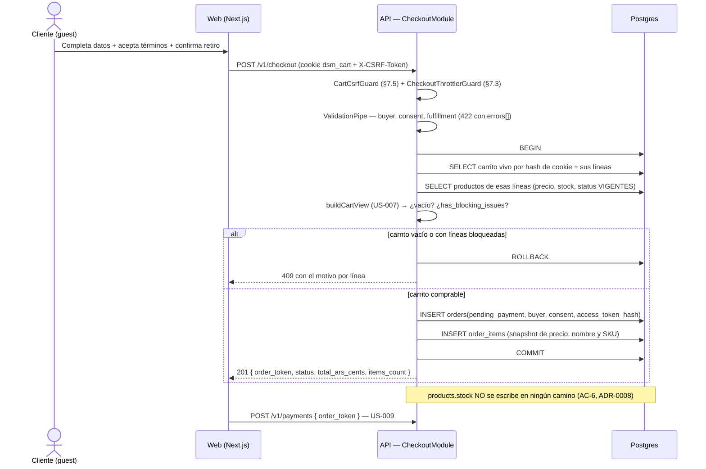

# US-008 Backend — Design

## Context

Casi todo lo importante de esta US ya está decidido arriba. ADR-0008 fija que el stock
no se toca hasta que el pago se apruebe —y descartó explícitamente reservar con TTL, así
que no hay nada que discutir sobre reservas—. El DER del E2E §8 declara `ORDERS` y
`ORDER_ITEMS` con sus columnas. La FSM del §12 fija que la orden nace en
`pending_payment`. US-007 ya construyó la identidad del invitado y la función pura que
sabe de precios y disponibilidad.

Lo que queda por decidir son cuatro cosas, y ninguna es cosmética:

1. **Cómo se refiere un invitado a su propia orden.** No tiene sesión, y el change de
   US-009 —ya escrito— quedó bloqueado esperando exactamente esta respuesta (su
   OQ-BE-1).
2. **Qué se congela en el snapshot.** El DER dice precio y cantidad. La pregunta es si
   eso alcanza para que la orden siga siendo legible cuando el catálogo cambie.
3. **Cómo se registra un consentimiento que sirva legalmente**, dado que el DER lo
   modela como un booleano y AC-8 pide marca temporal y trazabilidad.
4. **Qué pasa con el doble submit**, sabiendo que cualquier forma de reuso de la orden
   pendiente acopla este change con el de pagos.

Y hay un hecho nuevo que atraviesa todo: **es la primera PII en reposo del proyecto**.
`customers` tiene datos de gente que se registró a propósito y puede pedir su borrado
(US-020). Acá entran nombre, email y teléfono de alguien que no tiene cuenta ni vía de
borrado. Eso convierte a `observability-standards.md` §9 en trabajo real —el módulo
tiene que estar construido para que la PII no pueda llegar a un log— y saca a la luz un
hueco de producto que no es de este plan resolver (OQ-BE-5).

## Goals

- Convertir un carrito válido en una orden `pending_payment` con su snapshot de precios,
  en una sola transacción (AC-1, AC-2).
- Rechazar con motivo claro todo lo que no puede convertirse: carrito vacío, línea no
  disponible, datos faltantes, consentimiento no dado (AC-3, AC-4, AC-5).
- Dejar la orden **inerte**: sin stock retenido, sin plata, invisible para el dueño
  (AC-6).
- Registrar el consentimiento de forma que sirva ante un requerimiento legal (AC-8).
- Entregar el seam que US-009 espera, con la forma exacta de su contrato.
- No dejar que la PII del comprador salga por un log, una métrica o un mensaje de error.

## Non-goals

- Iniciar el pago, crear `payments`, hablar con MercadoPago (US-009).
- Confirmar la orden, decrementar stock, transicionar a `new` (US-010).
- Mandar emails (US-011), mostrar el panel (US-012), vincular cuentas (US-015).
- Purgar o anonimizar órdenes viejas — hueco declarado, no diseñado acá (OQ-BE-5).

## Approach

### Flujo



**Todo dentro de una transacción**, incluida la lectura de precios y stock: el snapshot
tiene que ser de lo que se leyó, no de lo que había un momento antes. Read committed
(el default de Postgres) alcanza: la definición de «precio al momento de la compra» es
justamente el precio que la transacción vio.

### 1. Identidad de la orden — el seam que US-009 pide

Token opaco de 256 bits (CSPRNG) cuyo SHA-256 vive en `orders.access_token_hash`
(UNIQUE); el claro se devuelve **una vez** en el 201 y no se persiste. Se reusan
`newToken` / `hashToken` de `auth/tokens/opaque-token.ts` — es la tercera vez que el
proyecto necesita «un identificador de sesión que no se puede adivinar y que una fuga de
base no vuelve usable»: refresh tokens (ADR-0011), carrito (US-007) y ahora la orden.
Duplicar la primitiva sería inventar una cuarta.

**Por qué no el UUID de la orden.** Un UUID v4 tampoco se adivina, pero terminaría en la
URL o el cuerpo de las llamadas siguientes y de ahí en logs de acceso y en el `Referer`
que el navegador manda **a MercadoPago** al redirigir. Con un token separado del
identificador interno, el `order_id` nunca sale a la red y la superficie no tiene nada
que enumerar. Es la misma decisión que US-007 tomó para el carrito, por la misma razón.

El resultado es exactamente el contrato que `US-009-pago-mercadopago-backend` declara en
sus §Pre-requisitos: tabla `orders`, columna `access_token_hash`, y `order_token` en el
201. **OQ-BE-1 de US-009 queda resuelta.**

### 2. Persistencia

Dos tablas nuevas, aditivas (`backend-node-standards.md` §5). Ninguna existente se
modifica.

#### `orders`

| Columna | Tipo | Notas |
|---|---|---|
| `id` | uuid PK | `gen_random_uuid()`. **No se expone** a la red |
| `access_token_hash` | text UNIQUE | **Deviación** ↓ (1) |
| `customer_id` | uuid NULL FK → `customers` | `ON DELETE SET NULL`. Del DER; **sin escritor** en esta US (US-015) |
| `buyer_name` | text | PII |
| `buyer_email` | text | PII. Normalizado con `normalizeEmail` de US-014 antes de persistir |
| `buyer_phone` | text | PII |
| `fulfillment` | text | `CHECK IN ('pickup')` — sucursal única |
| `status` | text | `CHECK IN ('pending_payment','new','preparing','ready','delivered','cancelled')` — los seis de la FSM §12. Nace en `pending_payment` |
| `total_ars_cents` | int | `CHECK >= 0`. Suma de los subtotales del **snapshot** (§5.5) |
| `consent_accepted` | boolean | `CHECK (consent_accepted = true)` — **deviación** ↓ (2) |
| `consent_accepted_at` | timestamptz | **Deviación** ↓ (2) |
| `consent_terms_version` | text | **Deviación** ↓ (3) |
| `created_at` | timestamptz | `now()` |
| `updated_at` | timestamptz | **Deviación** ↓ (4) |
| `delivered_at` | timestamptz NULL | Del DER; **sin escritor** en esta US (US-012) |

**Índices**: `UNIQUE(access_token_hash)`, `orders(status, created_at)` (nombrado en el
E2E §8; lo consumen el panel de US-012 y la limpieza de US-010), `orders(customer_id)`.

#### `order_items`

| Columna | Tipo | Notas |
|---|---|---|
| `id` | uuid PK | |
| `order_id` | uuid FK → `orders` | `ON DELETE CASCADE` |
| `product_id` | uuid FK → `products` | `ON DELETE RESTRICT` — un producto con venta registrada no se borra (el catálogo archiva, no borra) |
| `quantity` | int | `CHECK >= 1` |
| `unit_price_ars_cents` | int | `CHECK >= 0`. **La instantánea del precio pactado** |
| `product_name` | text | **Deviación** ↓ (5) |
| `product_sku` | text | **Deviación** ↓ (5) |
| `created_at` | timestamptz | |

**Índices**: `order_items(order_id)`, `UNIQUE(order_id, product_id)` (una línea por
producto, igual que `cart_items`).

#### Las cinco deviaciones del DER (E2E §8), declaradas

1. **`orders.access_token_hash`** — el DER no modela cómo un invitado se refiere a su
   orden, porque el DER no baja a la superficie HTTP. Sin esta columna, o el UUID sale a
   la red (ver arriba) o el pago no puede autorizarse. Es el seam que US-009 pide.
2. **`consent_accepted_at`** + el `CHECK` sobre `consent_accepted` — el DER modela sólo
   el booleano. **AC-8 pide explícitamente «con su marca temporal»** y trazabilidad
   legal: un booleano sin fecha no prueba nada ante un requerimiento de la Ley 25.326. Y
   el `CHECK (consent_accepted = true)` hace que la base no pueda contener una orden sin
   consentimiento, ni por un bug ni por un `INSERT` manual — AC-4 deja de depender de
   que el código lo valide.
3. **`consent_terms_version`** — un registro que dice «aceptó» sin decir **qué** aceptó
   es débil: los textos legales de US-017 van a cambiar. Se llena desde
   `LEGAL_TERMS_VERSION` (configuración) para no acoplar este change a los textos.
4. **`orders.updated_at`** — toda tabla del esquema la tiene, y las transiciones de la
   FSM (US-010, US-012) la van a necesitar. Crearla ahora evita una migración después.
5. **`order_items.product_name` + `product_sku`** — el DER guarda precio y cantidad. Es
   el mismo razonamiento que justifica el snapshot de precio, extendido: la orden es un
   **registro comercial**, y si el dueño renombra un producto o cambia su SKU, el email
   de confirmación (US-011) y el panel (US-012) mostrarían un nombre que el comprador
   nunca vio. El `RESTRICT` de la FK garantiza que la fila del producto exista, no que su
   nombre sea el de la venta.

**Lo que NO tienen las tablas, a propósito**: ninguna columna capaz de alojar un PAN,
CVV, titular o token de tarjeta (AC-7 — ADR-0006 pone el pago íntegramente en el
checkout hosted de MercadoPago). El test de T5.2 compara el conjunto de columnas contra
una lista negra y **falla si aparece una**, así que la garantía no depende de que nadie
agregue mañana un `card_last4` «para el comprobante».

### 3. Capas y wiring

`apps/api/src/checkout/` como módulo propio (ADR-0007), espejando `cart/`:

```
checkout/
├─ checkout.module.ts
├─ checkout.controller.ts        ← POST /v1/checkout
├─ checkout.service.ts           ← caso de uso transaccional; no toca Prisma
├─ orders.repository.ts          ← único punto de ORM de `orders` + `order_items`
├─ order-draft.ts                ← FUNCIÓN PURA: snapshot + total (sin framework, sin DB)
├─ order-token.service.ts        ← emisión del token opaco de la orden
├─ checkout-errors.ts            ← errores de dominio del módulo
├─ checkout-throttler.guard.ts   ← espejo de CartThrottlerGuard (§12)
└─ dto/                          ← create-checkout.dto.ts · checkout-created.dto.ts
```

`order-draft.ts` es deliberadamente **puro**, igual que `cart-view.ts` de US-007: recibe
la vista del carrito y los datos del comprador y devuelve las líneas a insertar más el
total. Es donde vive el dinero, y así se puede ejercer sin HTTP ni Postgres.

**Un cambio de wiring en `CartModule`**: hoy exporta sólo `CartEventsService`. El
checkout necesita `CartTokenService` (para resolver el carrito de la cookie) y
`CartsRepository` (para leer sus líneas). Se agregan a los `exports`; **no** se duplica
la lógica de resolución del carrito ni se crea un segundo acceso al ORM de `carts`.
Igual para `ProductsRepository`, que sigue siendo el único punto de ORM de `products`
(§5): el checkout lee precios y stock por ahí.

### 4. Doble submit — por qué no hay idempotencia

`api-standards.md` §10.1 pide que un `POST` que crea recursos acepte `Idempotency-Key`.
Este endpoint **no lo hace**, y es una deviación consciente que conviene mirar de frente,
porque las alternativas son peores:

| Opción | Problema |
|---|---|
| Máquina completa de `Idempotency-Key` (§10.2) | Una tabla de respuestas almacenadas + comparación de cuerpos, para un recurso **inerte**. El riesgo que §10 protege es el doble cobro, y acá no hay cobro |
| Índice único parcial `orders(cart_id) WHERE pending_payment` + reuso | Obliga a decidir qué pasa cuando el carrito cambió después de crear la orden. Si se re-snapshotea el total y US-009 ya creó la preferencia con el importe anterior, **MercadoPago cobra un número y la orden dice otro**. Es un bug de plata |
| Lo mismo, pero sin re-snapshotear | La orden queda desactualizada respecto del carrito y el comprador paga lo que ya no quiere comprar |
| **No hacer nada (elegida)** | Dos «Ir al pago» crean dos órdenes. Ambas inertes: sin stock retenido, sin plata, invisibles para el dueño. La abandonada la cancela la limpieza de US-010 |

Cualquier forma de reuso exigiría que US-008 sepa **si US-009 ya inició un pago**, lo que
acopla los dos changes en ambos sentidos (US-009 ya declara que no escribe `orders`, y
US-008 no puede leer `payments`). La opción elegida deja los dos changes independientes y
paga con filas cosméticas que un job ya planificado limpia. El throttler `checkout` y el
botón deshabilitado del FE cubren el caso accidental. Ver OQ-BE-1.

### 5. Errores (RFC 7807, `api-standards.md` §8)

En `checkout/checkout-errors.ts`, extendiendo `DomainError` como hace `auth-errors.ts`
(no se toca `common/errors/domain-errors.ts`, cuyos `type` llevan el prefijo
`dsm:catalog/`):

| Situación | Status | `type` |
|---|---|---|
| Sin cookie de carrito, o carrito vencido, o sin líneas | `409` | `dsm:checkout/cart-empty` |
| Alguna línea despublicada, archivada o sin stock suficiente | `409` | `dsm:checkout/cart-not-purchasable` (con `errors[]`: slug + motivo por línea) |
| Datos del comprador inválidos, `consent` distinto de `true`, `fulfillment` fuera del enum | `422` | (lo produce el `ValidationPipe` global) |
| CSRF: `X-CSRF-Token` ausente/incorrecto u `Origin` fuera de la allowlist | `403` | `CsrfError` existente de US-014 |

**Sin cookie se responde `409 cart-empty`, no `404`**: es la misma indistinguibilidad que
US-007 fijó para el `GET /v1/cart` (una cookie con token inexistente se trata igual que
no tener cookie). El borde no informa *por qué* no hay carrito.

### 6. Threat model (STRIDE — filas nuevas sobre E2E §14)

| Amenaza | Superficie | Control |
|---|---|---|
| **T**ampering — crear una orden con un total elegido por el cliente | `POST /v1/checkout` | El cuerpo **no acepta** ítems, precios ni total: todo sale del carrito y del catálogo leídos en la transacción. `forbidNonWhitelisted` rechaza con 422 cualquier intento de inyectar `total_ars_cents` |
| **T**ampering — checkout disparado desde otro sitio | `POST /v1/checkout` | La escritura se autoriza con la cookie `dsm_cart`, que es credencial **ambiente** → §7.5 es *Mandatory*: `CartCsrfGuard` (double-submit HMAC + `Origin` de la allowlist) además de `SameSite=Lax` |
| **I**nformation disclosure — PII del comprador en logs | logs, métricas, errores | `CheckoutEventsService` no acepta email/nombre/teléfono en su firma; test que barre **todas** las líneas de log del flujo buscando los valores sembrados (T4.2) |
| **I**nformation disclosure — leer la orden de otro | `orders.access_token_hash` | Token opaco de 256 bits hasheado; el `order_id` nunca sale a la red. Este change no expone ninguna lectura de orden (la primera es `GET /v1/payments/latest` de US-009) |
| **D**oS — inundar la base de órdenes con PII | `POST /v1/checkout` | Throttler `checkout` (10 / 10 min por IP), cubo independiente de `auth`, `storefront` y `cart` |
| **R**epudiation — «yo no acepté los términos» | `orders` | `consent_accepted` + `consent_accepted_at` + `consent_terms_version`, con `CHECK` que impide una orden sin consentimiento |
| **E**levation of privilege | — | No se agrega superficie admin. La orden nace invisible para el panel (`pending_payment`) |

### 7. Observabilidad (E2E §18, `observability-standards.md` §9)

`CheckoutEventsService`, calcado de `CartEventsService`: contador **por nombre de evento**
(nunca una dimensión por orden ni por email) y el identificador sólo en la línea de log.

| Evento | Cuándo | Para qué |
|---|---|---|
| `checkout.order_created` | orden creada | el «checkout iniciado» que pide la US §9; numerador de conversión de US-016 |
| `checkout.rejected_empty_cart` | 409 | señal de bug en el FE (no debería llegar) |
| `checkout.rejected_blocking_issues` | 409 | **demanda perdida por falta de stock** — señal de negocio para el dueño |
| `checkout.rejected_consent` | 422 | fricción del checkbox legal |
| `checkout.validation_failed` | 422 | fricción del formulario, sin decir qué campo (podría ser el email) |

**La regla dura de este módulo**: la firma de `emit` acepta `orderId` y nada más. Ni
email, ni nombre, ni teléfono, **ni hasheados** — un hash de email es reversible por
diccionario, así que sigue siendo el dato con un paso extra (la misma nota que
`AuthEventsService` ya dejó escrita en US-014).

### 8. NFRs (E2E §17 + US §9)

- **p95 de escritura < 500 ms**: se cumple sin asteriscos. Una transacción corta, dos
  `INSERT`, dos `SELECT` indexados, **cero llamadas salientes**. A diferencia de
  `POST /v1/payments` (US-009, que tuvo que declarar un presupuesto de 2 s por contener
  un tercero), acá el presupuedo del E2E aplica tal cual.
- **PII mínima**: nombre, email, teléfono. Ni un campo más de lo que la US §10 justifica.
- **TLS en tránsito**: del borde (Railway/Cloudflare), no de este change.
- **Consentimiento con marca temporal**: ver §2, deviación (2).

## Trade-offs

**`buildCartView` reusado vs una validación propia del checkout.** Reusarlo acopla el
checkout a una función de otro módulo, pero la alternativa es reimplementar las reglas de
precio vigente, disponibilidad y stock — es decir, tener dos lugares donde vive la misma
regla de dinero y esperar que no divergan. Se reusa, y el costo aceptado es que un cambio
en `cart-view.ts` puede afectar al checkout: por eso T5.4 prueba el invariante del
snapshot de forma independiente de esa función.

**Snapshot de nombre y SKU vs sólo precio.** Dos columnas más por línea, para siempre, y
el DER no las pide. Se agregan porque el email de US-011 y el panel de US-012 van a
renderizar esas líneas, y un producto renombrado les haría mostrar algo que el comprador
nunca vio. El costo es almacenamiento irrelevante; el beneficio es que la orden se explica
sola sin depender del estado actual del catálogo.

**`CHECK (consent_accepted = true)` vs sólo validar en el código.** El `CHECK` hace
imposible una fila sin consentimiento, y también hace imposible modelar en el futuro una
orden que no requiera consentimiento (por ejemplo una orden creada por el dueño desde el
panel, que no está en ninguna US). Se acepta: hoy toda orden nace del checkout público y
la garantía legal vale más que la flexibilidad hipotética. Si aparece ese caso, es una
migración de un `ALTER`.

**Módulo propio `checkout/` vs extender `cart/`.** El E2E §6.1 declara `CheckoutModule`
como componente separado, y además `cart/` ya tiene 888 líneas. Módulo propio, con
`CartModule` exportando lo que el checkout consume.

## Deployment considerations

**No hace falta `/plan-deployment` por sí solo**, pero sí conviene coordinarlo con US-009,
que sí lo necesita. Gatillos de este change:

1. **Migración de esquema** (`orders` + `order_items`), aditiva. **Es la que desbloquea
   el change de US-009**, así que el orden de despliegue es US-008 → US-009.
2. **Variables nuevas**: `CHECKOUT_RATE_LIMIT_TTL_MS`, `CHECKOUT_RATE_LIMIT_MAX`,
   `LEGAL_TERMS_VERSION`. Ningún secreto nuevo.
3. **Superficie pública nueva con PII en reposo** — es el cambio de perfil de riesgo del
   proyecto. Vale mencionarlo en el plan de despliegue de US-009 aunque no requiera
   canary.
4. **Sin feature flag**: el checkout no tiene forma de apagarse sin redeploy. No hace
   falta —hasta que US-009 exista, la orden no lleva a ninguna parte— pero queda dicho.

**Rollback**: la migración es aditiva y ningún camino existente la lee; revertir el
deploy de la API alcanza y las tablas pueden quedar. **Con una salvedad**: si ya se
crearon órdenes con PII y se revierte, esas filas quedan en la base sin superficie que
las lea ni proceso que las purgue (OQ-BE-5).

## Spec delta (para `/archive-change`)

`POST /v1/checkout` no pertenece a la capacidad `catalogo` ni a `carrito`. Al archivar,
`/archive-change` crea `openspec/specs/checkout/contracts/openapi.yaml` (raíz viva) con
`openapi/paths/checkout-create.yaml` a partir del draft de este change, más `README.md`,
`requirements.md` y `decisions.md` (link a ADR-0008 y ADR-0006).

## Open questions

Las cinco viven en `proposal.md` §Preguntas abiertas con su default implementado.
**Ninguna bloquea el arranque.** Las dos que conviene decidir antes de ejecutar son
**OQ-BE-4** (el número legible de pedido — agregarlo después es una migración con
`sequence`, y US-011/US-012 casi seguro lo van a querer) y **OQ-BE-5** (la retención de
la PII del comprador invitado, que es exposición legal y no deuda técnica).

## References

- ADR-0008 (stock al aprobar), ADR-0006 (hosted, sin datos de tarjeta), ADR-0011 (tokens
  opacos hasheados), ADR-0007 (monolito modular), ADR-0010 (namespace de URLs)
- E2E: §6.1, §8 (DER), §9.2, §12 (FSM), §14 (STRIDE), §17 (NFRs), §18, §19
- Change de US-009: [`../US-009-pago-mercadopago-backend/proposal.md`](../US-009-pago-mercadopago-backend/proposal.md)
  — **este plan resuelve su OQ-BE-1**
- Contrato draft: [`contracts/openapi/checkout-create.yaml`](contracts/openapi/checkout-create.yaml)
- Standards: `backend-node-standards.md` §2–§9 · `api-standards.md` §2, §3, §5, §8, §10,
  §12 · `security-standards.md` §2, §6, §7 · `observability-standards.md` §9 ·
  `testing-standards.md` §14
