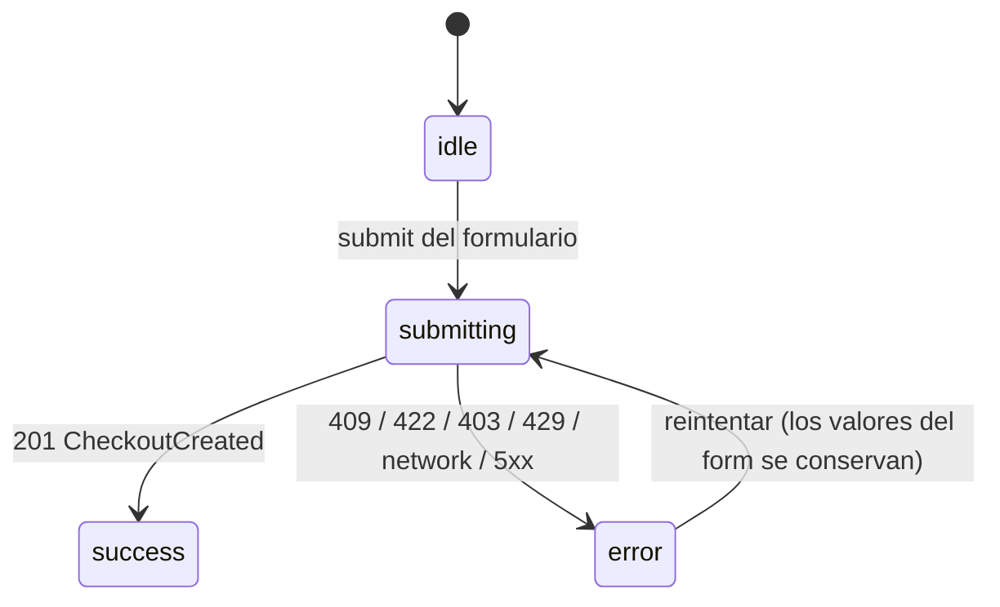

# US-008 Frontend Web — Design

## Contexto AS-BUILT

Seis hechos del repo enmarcan el diseño (verificados leyendo código, 2026-08-30):

1. **El backend ya está construido y el cliente ya está regenerado.** `POST /v1/checkout` vive en
   `apps/api/docs/api/openapi.yaml` (mergeado a `main` vía PR #11) y `apps/web/src/api/generated/`
   ya tiene `createGuestCheckout`, `CreateGuestCheckoutBody`/`CreateGuestCheckoutResponse` (Zod) y
   `getCreateGuestCheckoutMockHandler` (MSW) — commit `67c70a3` ya en `main`. No hay tarea de
   "wirear codegen": orval ya está configurado (`orval.config.ts`, un solo config DTOs+Zod+MSW) y
   ya corrió sobre el contrato con checkout adentro. Lo que este change sí debe hacer es **verificar
   que sigue fresco** al planificar sobre él (regenerar produce cero diff) — la garantía de
   `frontend-codegen-fresh` no es "correr una vez", es que el gate siga pasando.
2. **El CTA del carrito ya está deshabilitado a propósito, con el marcador exacto.**
   `CartSummary.tsx:16-24` declara `checkoutAvailable?: boolean` con default `false` y el
   comentario `Deferred: US-008 — owner: FE`. `CartSummary.test.tsx` tiene 3 casos que dependen de
   ese flag (`"sin bloqueos pero sin checkout, el CTA sigue deshabilitado con OTRO motivo"`, etc.)
   — son el análogo exacto del `ProductPurchase.test.tsx` que US-007 tuvo que reescribir.
3. **El seam de consentimiento de US-017 está construido y guardado.** `LEGAL_ROUTES`/
   `CONSENT_COPY` en `apps/web/src/features/legal/routes.ts`, con un guard
   (`routes.test.ts`) que recorre `apps/web/src` + `apps/web/app` con `node:fs` y falla si el
   literal `'/legales/` aparece fuera de ese archivo. `LEGAL_TERMS_VERSION` vive en
   `content.ts` y `versionContract.test.ts` (US-017) ya lo verifica contra el backend en cada CI.
   Este change **no** toca ninguno de los dos archivos de `features/legal/` — sólo los importa.
4. **El carrito ya resuelve el problema de topología, y este change lo hereda idéntico.**
   `session: 'cart'` en `client.ts` ya cubre same-origin (ADR-0013), `credentials: include`,
   `cache: no-store` y el sujeto de CSRF `dsm_cart_csrf` — exactamente lo que
   `CartCsrfGuard` reusado por el backend de checkout exige. **Cero cambios en `client.ts` ni
   `csrf.ts`.** Lo único que falta es la entrada del rewrite same-origin
   (`next.config.mjs`) para `/v1/checkout/:path*`: hoy sólo cubre `/v1/auth/*` y `/v1/cart/*`.
5. **`CartProvider` ya envuelve todo `(storefront)`.** `layout.tsx` monta `<CartProvider>` una
   sola vez; `/checkout`, al vivir bajo el mismo route group, tiene `useCartContext()` disponible
   sin wiring adicional — mismo estado que ve `/carrito`, sin una segunda fuente de verdad.
6. **El patrón de formulario con RHF + Zod + `Field`/`Input` + mapeo de `AppError` ya existe**
   (US-014 `RegisterForm.tsx`). Se reusa la forma, pero **no** el patrón de "schema Zod escrito a
   mano": ahí no existía un schema generado para el endpoint (`register` no tiene Zod generado
   hoy); acá **sí existe** (`CreateGuestCheckoutBody`), así que hand-escribir un segundo schema
   con las mismas constraints (minLength 2, maxLength 120, el regex de teléfono) sería exactamente
   el "hand-written mirror of the contract" que `frontend-standards.md` §3.2 prohíbe. Ver
   Decisión D3.

## Goals

- Formulario de una pantalla (nombre, email, teléfono, consentimiento, retiro fijo) que crea la
  orden vía `POST /v1/checkout` (AC-1, AC-3, AC-4).
- Bloquear la entrada al checkout si el carrito está vacío o tiene líneas no comprables, y manejar
  el 409 si cambia entre la carga y el submit (AC-5).
- Consumir el seam de consentimiento de US-017 tal cual — cero texto ni ruta legal hand-written.
- Un-deferir el CTA "Ir al pago" del carrito.
- Persistir el `order_token` del 201 para que la futura pantalla de pago (US-009 FE) lo consuma,
  sin exponerlo en la URL.
- Todo tipo/validación derivado del contrato sale del cliente **generado** — cero DTOs ni schemas
  hand-written que dupliquen `CreateCheckoutRequest`/`CheckoutCreated`.

## Non-goals

- Iniciar el pago, redirigir a MercadoPago o al simulado (US-009 — sin plan de FE).
- Seleccionar sucursal (una sola existe).
- Redactar copy legal o rutas `/legales/*` (US-017, ya construido).
- Recalcular precios o el total en el cliente (el servidor es la única autoridad — AC-2).
- Reescribir `CartSummary.tsx`/`CartPage.tsx` más allá de lo estrictamente necesario para
  un-deferir el CTA.

## Approach

### D1 — El checkout es, igual que el carrito, una vista de cliente forzada

`customFetch` lanza si `session: 'cart' | 'customer'` sale del servidor (US-014 design.md D3,
heredado por el carrito en US-007 design.md D1). El checkout **hereda la misma restricción**
porque usa el mismo sujeto: `/checkout` es Client Component, con `noindex` como contraparte
(igual razonamiento que `/carrito` — un formulario con PII del comprador no es contenido
público). El `page.tsx` sigue el patrón exacto de `carrito/page.tsx`: Server Component que sólo
exporta `metadata` y compone `<CheckoutPage />` (la metadata sólo se puede exportar desde un
Server Component en el App Router).

### D2 — El rewrite same-origin se extiende a `/checkout` (ADR-0013, heredado otra vez)

Una línea en `next.config.mjs`:

```js
{ source: '/v1/checkout/:path*', destination: `${apiOrigin()}/v1/checkout/:path*` },
```

Sin esto el checkout funciona en local y está roto en producción, exactamente el defecto que
US-007 documentó para el carrito (`up.railway.app` en la Public Suffix List → sitio y API son
sitios distintos → la cookie `dsm_cart` nunca vuelve si la llamada sale del origen del API). Se
verifica con un E2E contra la app **construida**, espejo de `cart-topology.spec.ts` — el mismo
motivo: ningún test unitario puede detectar un rewrite ausente.

### D3 — Validación: el schema generado es el resolver, un mapa de mensajes traduce la UX

`CreateGuestCheckoutBody` (generado, `src/api/generated/zod.ts`) ya declara exactamente las
constraints que el backend valida: `buyer.name` (2-120), `buyer.email` (formato), `buyer.phone`
(el regex `^\+?[0-9 ()-]{8,20}$`), `consent` (literal `true`), `fulfillment` (enum `pickup`). Zod
por defecto produce mensajes en inglés y genéricos ("String must contain at least 2 character(s)")
— inutilizables para la UX en español que pide `design-system.md` §10.2.

**La solución no es escribir un segundo schema** (eso sería exactamente el mirror prohibido por
§3.2) — es un resolver custom que corre `CreateGuestCheckoutBody.safeParse` y **traduce** los
issues a copy en español por *path*, sin redeclarar ninguna constraint:

```ts
// checkoutFieldMessages.ts — traduce, no redeclara
const MESSAGES: Record<string, string> = {
  'buyer.name': 'Ingresá tu nombre (al menos 2 caracteres).',
  'buyer.email': 'Ingresá un email válido.',
  'buyer.phone': 'Ingresá un teléfono válido (ej. +54 9 11 5555 5555).',
  'consent': 'Tenés que aceptar los términos para continuar.',
};

export function friendlyMessage(path: (string | number)[]): string {
  return MESSAGES[path.join('.')] ?? 'Revisá este campo.';
}
```

```ts
// checkoutResolver.ts — Resolver de react-hook-form, sin zodResolver directo
export const checkoutResolver: Resolver<CheckoutFormValues> = async (values) => {
  const result = CreateGuestCheckoutBody.safeParse(values);
  if (result.success) return { values: result.data, errors: {} };
  const errors: FieldErrors = {};
  for (const issue of result.error.issues) {
    const key = issue.path.join('.');
    if (!errors[key]) errors[key] = { type: 'manual', message: friendlyMessage(issue.path) };
  }
  return { values: {}, errors };
};
```

Esto deja `fulfillment: 'pickup'` como valor fijo del form (no hay control que lo edite — D6) y
usa el **mismo** contrato que valida el servidor: si el backend cambia una constraint (ej. sube
`maxLength` de `name`), la próxima regeneración cambia el comportamiento del formulario sin tocar
este archivo — exactamente la garantía que §3.2 promete.

**Precedente que NO se replica**: `RegisterForm.tsx` (US-014) escribe su propio `z.object({...})`
porque el endpoint de registro no tenía Zod generado al planificar esa US. No es una inconsistencia
nueva del proyecto — es que hoy, para *este* endpoint, sí existe el artefacto generado y usarlo es
lo que el estándar exige.

### D4 — Estado: unión discriminada de una sola operación (más simple que el carrito)



A diferencia del carrito (`useCart.ts`, mutaciones por línea + reemplazo del `Cart` completo),
acá hay **una sola operación** con **un solo consumidor** (`CheckoutForm`), así que un
`useReducer` de 4 casos alcanza — no hace falta contexto compartido ni `mutatingSlugs` por línea.

```ts
export type CheckoutState =
  | { kind: 'idle' }
  | { kind: 'submitting' }
  | { kind: 'success'; order: CheckoutCreated }
  | { kind: 'error'; error: AppError };
```

El estado de **entrada** (¿puede este carrito ir a checkout?) es un chequeo **separado**, hecho por
`CheckoutPage` sobre el `CartState` que ya expone `useCartContext()` — no se duplica en
`CheckoutState`: mezclar "¿el carrito es válido?" con "¿la orden se está creando?" en la misma
unión obligaría a modelar transiciones que no existen (nunca se pasa de `error` de checkout a
`blocked` de carrito sin pasar por `idle`).

### D5 — Mapeo de errores: reutiliza el catálogo existente, sin un `kind` nuevo

| Situación | `AppError.kind` | Discriminador | Qué ve la persona |
|---|---|---|---|
| Campo inválido | `validation` | `fieldErrors[].field` (`buyer.email`, `consent`, …) | error inline por campo (`setError`) + banner "Revisá los campos marcados" |
| Carrito vacío | `conflict` | `problemType === 'dsm:checkout/cart-empty'` | banner "Tu carrito está vacío" + link a `/carrito` |
| Carrito con líneas bloqueadas | `conflict` | `problemType === 'dsm:checkout/cart-not-purchasable'` | banner "Tu carrito cambió, revisalo antes de continuar" + link a `/carrito` (el detalle por línea ya lo muestra `/carrito`, D6 de US-007 — no se duplica acá) |
| CSRF ausente/incorrecto | `forbidden` | — | "Recargá la página e intentá de nuevo" (mismo copy que el carrito, D7 de US-007) |
| Rate-limit | `rateLimited` | `retryAfterSeconds` | "Esperá unos segundos e intentá de nuevo" |
| Red / 5xx | `network` / `server` | — | error recuperable con "reintentar"; **los valores del formulario no se pierden** (RHF conserva el estado; sólo se limpia en `success`) |

No se agrega ningún `kind` a `errors.ts` — los seis ya cubren checkout íntegramente. La única
pieza que checkout necesita y el carrito no tenía es el discriminador `problemType` sobre 409, que
`mapProblemToAppError` **ya propaga** (lo usa hoy para `dsm:cart/insufficient-stock` vs
`dsm:cart/too-many-items`).

### D6 — El retiro es información fija, no un control (OQ-FE-21)

`fulfillment` tiene un único valor posible en todo el sistema (`enum: [pickup]`, backend §7.13
design-system). Modelarlo como un checkbox "confirmo que retiro en el local" sería una casilla sin
decisión real detrás — fricción sin señal (`base-standards.md` §1, KISS). El formulario muestra la
dirección y el horario como texto fijo (reusa el copy que `TrustSignals`/`SiteFooter` ya declaran)
y envía `fulfillment: 'pickup'` como valor constante del form. El **acto de enviar el formulario**
es la confirmación que AC-1 pide.

### D7 — `order_token`: dónde vive hasta que exista la pantalla de pago (OQ-FE-19)

El backend lo entrega **una sola vez** en el 201 y de ahí en más "lo maneja el frontend" (cita
literal de `US-008-checkout-guest-backend/design.md` §2 y del proposal de `US-009-…-backend`
§OQ-BE-1: *"el FE puede conservarlo del 201 del checkout"*).

**No va en la URL.** El backend mismo evitó exponer el `order_id` en la URL por la misma razón que
aplica acá con más fuerza — el `order_token` **es** la credencial, no un identificador: si viajara
en un `?order_token=...` de `/checkout/confirmacion`, quedaría en el historial del navegador, en
logs de acceso de cualquier proxy intermedio y en el header `Referer` que el navegador manda al
click de un link saliente (`security-standards.md` — manejo de tokens).

Se persiste en `sessionStorage` (`orderToken.ts`, clave `dsm_order_token`) — alcance de pestaña,
se borra al cerrarla, nunca se envía automáticamente a ningún servidor (a diferencia de una
cookie). Es lectura exclusiva de la futura pantalla de pago; este change sólo lo **escribe**, con
el mismo patrón `Deferred:` que ya usa el proyecto:

```ts
// apps/web/src/features/checkout/orderToken.ts
/**
 * Persistencia del order_token entre la confirmación del checkout y el inicio
 * del pago. `Deferred: US-009 — owner: FE` — hoy nada lo lee.
 *
 * sessionStorage, NUNCA la URL: el order_token es la credencial de la orden, no
 * un identificador — un querystring queda en el historial, en logs de proxies
 * intermedios y en el Referer que el navegador manda al salir del sitio (mismo
 * razonamiento que el backend aplicó para no exponer order_id en la URL).
 */
const KEY = 'dsm_order_token';
export function saveOrderToken(token: string): void {
  sessionStorage.setItem(KEY, token);
}
```

### D8 — Confirmación in-place, sin ruta nueva (OQ-FE-20)

Al 201, `CheckoutPage` renderiza `CheckoutConfirmation` **en el mismo `/checkout`** (no navega a
`/checkout/confirmacion`). Es el mismo criterio de US-007 con "Ir al pago": mostrar el siguiente
paso deshabilitado en el lugar donde el usuario ya está, en vez de inventar una URL que el futuro
plan de US-009 FE podría preferir diseñar distinto (una ruta `/pago?...` con su propio contrato de
query params, por ejemplo). Costo aceptado: un refresh del navegador tras confirmar pierde la
pantalla de confirmación y vuelve a mostrar el formulario (el carrito sigue intacto —
`OQ-BE-3` del backend: no se vacía al crear la orden — así que no es un estado roto, es
simplemente "puede volver a intentar", que además es honesto: hasta que exista US-009 no hay nada
más que hacer con esa orden).

### D9 — Componentes

```
apps/web/src/features/checkout/
├─ checkoutService.ts        ← repositorio: createGuestCheckout + session:'cart' (§3.3, a mano)
├─ useCheckout.ts             ← unión discriminada (D4)
├─ checkoutResolver.ts        ← Resolver de RHF sobre el schema GENERADO (D3)
├─ checkoutFieldMessages.ts   ← traducción de issues Zod → copy es-AR (D3)
├─ checkoutCopy.ts            ← banners por AppError.kind (D5), tono §10.2
├─ orderToken.ts              ← sessionStorage, Deferred: US-009 (D7)
├─ checkoutMetadata.ts        ← noindex (mismo patrón que cartMetadata.ts)
├─ CheckoutPage.tsx           ← composición: blocked | idle/submitting/error | success
├─ CheckoutBlocked.tsx        ← carrito vacío o con líneas no comprables (AC-5, entrada)
├─ CheckoutForm.tsx           ← RHF + Field/Input existentes + ConsentCheckbox
├─ ConsentCheckbox.tsx        ← consume CONSENT_COPY/LEGAL_ROUTES (US-017), NO las reescribe
├─ OrderSummary.tsx           ← ítems + total del Cart ya cargado (formatArs, sin recalcular)
└─ CheckoutConfirmation.tsx   ← order_number + total + CTA deshabilitado (Deferred: US-009)
```

`app/(storefront)/checkout/page.tsx` monta `CheckoutPage` y declara `metadata = checkoutMetadata`.

**Dos archivos ya entregados se modifican** (mismo patrón que dejó explícito US-007 design.md D5):

| Archivo | Cambio | De quién era |
|---|---|---|
| `src/features/cart/CartSummary.tsx` | quita `checkoutAvailable`/`MOTIVO_PENDIENTE`; el CTA se habilita salvo `has_blocking_issues` | US-007 |
| `src/features/cart/CartPage.tsx` | pasa `onCheckout={() => router.push('/checkout')}` | US-007 |

`CartSummary.test.tsx` es la **única excepción nombrada** al "tests existentes sin editar": sus 3
casos que dependen de `checkoutAvailable`/`MOTIVO_PENDIENTE` se reescriben — es un test de un
cartel de roadmap y este change apaga el cartel (mismo criterio que `ProductPurchase.test.tsx` en
US-007).

### D10 — Accesibilidad (WCAG 2.1 AA, US §9)

- **Formulario**: cada campo con `Field`/`Input` existentes (`label` asociado, `aria-describedby`
  al error). Foco al primer campo con error al fallar la validación (design-system §11 — "foco
  gestionado al cambiar de paso").
- **Banner de error**: `role="alert"`.
- **Checkbox de consentimiento**: `aria-describedby` a su mensaje de error cuando se intenta
  enviar sin marcar.
- **Confirmación**: heading propio (`<h1>` o `<h2>` según jerarquía de la página) para que el foco
  tenga dónde ir al cambiar de estado dentro de la misma ruta.
- **Botón deshabilitado "Continuar al pago"**: el motivo va en texto visible siempre (mismo
  criterio que `CartSummary` — un botón mudo erosiona confianza).

### D11 — Observabilidad

Cinco eventos nuevos en `lib/observability/events.ts` (`BusinessEvent` + `PUBLIC_EVENTS` — es
superficie de invitado, sin `operator_id`), sin PII y sin el `order_token`:

| Evento | Cuándo | Props (no-PII) |
|---|---|---|
| `checkout_started` | click en "Ir al pago" del carrito | — |
| `checkout_blocked` | `/checkout` se abre con carrito vacío o bloqueado | `reason: 'empty' \| 'not_purchasable'` |
| `checkout_submitted` | submit intentado | — |
| `checkout_succeeded` | 201 | `order_number` (no es PII — es un contador público, igual criterio que en la respuesta del backend) |
| `checkout_failed` | error del submit | `error_kind: AppError['kind']` |

### D12 — NFRs

- **p95 de escritura < 500ms** (E2E §17, US §9): la llamada es same-origin vía el rewrite (D2),
  mismo costo declarado y aceptado en ADR-0013 para el carrito.
- **Sin caché**: el backend manda `Cache-Control: no-store` en toda la superficie `/v1/checkout`.
- **Bundle**: segunda isla cliente pública del storefront (después del carrito); no se mide
  degradación de LCP en páginas indexables porque `/checkout` no lo es.

## Trade-offs

**Resolver custom vs `zodResolver(CreateGuestCheckoutBody)` directo.** `zodResolver` directo sería
menos código, pero deja los mensajes de Zod en inglés y genéricos — inaceptable para
`design-system.md` §10.2 (voz "práctico y confiable", en español). El resolver custom agrega ~15
líneas y preserva la garantía de §3.2 sin escribir un segundo schema. Costo aceptado.

**In-place vs ruta de confirmación (D8).** Se pierde la confirmación al refrescar. Alternativa
descartada: `/checkout/confirmacion?order_token=...` — más persistente, pero pone la credencial en
la URL (D7) y le precompromete a US-009 FE (sin plan todavía) una forma de ruta que quizás no
quiera. Se prefiere no decidir por una US que no está planificada.

**`sessionStorage` vs mantener el `order_token` sólo en memoria de React (D7).** Memoria pura se
pierde en cualquier refresh o navegación, incluso sin querer volver a `/checkout`; `sessionStorage`
sobrevive un refresh accidental sin sobrevivir el cierre de la pestaña (ni viajar a otro dominio).
Es el punto medio correcto para un dato que un futuro flujo de pago todavía no consume.

**No agregar un `kind` de `AppError` para "carrito cambió" (D5).** El `problemType` que ya viaja en
`conflict` alcanza para discriminar los dos 409 de checkout sin tocar `errors.ts` — cualquier
cambio ahí es superficie compartida con `useCart.ts`/`RegisterForm.tsx` y no hace falta.

## Deployment considerations

**No hace falta `/plan-deployment` propio**, pero conviene coordinarlo con el de US-009 (igual
recomendación que dejó `US-008-checkout-guest-backend`): el orden de despliegue no negociable es
backend US-008 → frontend US-008 → (backend + frontend) US-009. Sin variables de entorno nuevas
del lado web, sin secretos, sin feature flag. **Rollback**: revertir el deploy del web alcanza — el
backend de checkout ya está en producción y no depende de esta pantalla.

**Recordatorio heredado de US-017**: US-017 se declaró a sí misma como *gate legal* que bloquea el
despliegue de US-008/US-009 mientras el texto de `/legales/*` siga provisional (marcadores
`[PENDIENTE: …]` visibles en la página, sin gate automático — decisión del PO, OQ-FE-17 (a)). Este
change no cambia esa recomendación: **si el texto legal sigue provisional, este checkout no debería
salir a producción**, aunque el código esté completo.

## Risks and mitigations

| Riesgo | Prob. | Impacto | Mitigación |
|---|---|---|---|
| Se olvida extender el rewrite y el checkout rompe **sólo en producción** | media | alto | T0.2 + E2E de topología contra la app construida (espejo de `cart-topology.spec.ts`) |
| El texto legal sigue provisional al desplegar | media-alta (US-017 ya lo marcó como riesgo abierto) | alto | Heredado de US-017: marcadores visibles en la página + gate humano del DoD; este change no lo re-mitiga, lo hereda |
| Colisión de working tree con otra sesión sobre `apps/web` | alta (histórico en este repo — 3 veces) | medio | Pre-requisito P1: `git status --porcelain -- apps/web` vacío antes de empezar |
| `CartSummary.test.tsx` se edita y alguien lo lee como regresión | baja | bajo | Declarado como excepción nombrada en D9 y en tasks.md, con el mismo criterio que `ProductPurchase.test.tsx` de US-007 |
| El `order_token` se pierde si el usuario cierra la pestaña antes de que exista pago | alta (por diseño — no hay a dónde ir todavía) | bajo | Es el estado esperado hasta US-009: el `order_number` queda visible en pantalla y la orden persiste en el backend (`pending_payment`), recuperable por soporte manual si hiciera falta — no hay AC que pida recuperación automática |

## ADR triggers

**Ninguno.** Verificado contra los 8 ADR vigentes citados en el E2E §20: ninguna decisión de este
change contradice ni extiende una decisión de arquitectura. La persistencia del `order_token` en
`sessionStorage` es una decisión de diseño de este change (D7), no una decisión de plataforma —
queda documentada acá y abierta a ratificación (OQ-FE-19), no amerita ADR propio.

## References

- US: `docs/user-stories/US-008-checkout-guest.md` (AC-1..AC-8, §7 nota de US-017, §9 NFRs)
- PRD: `docs/product/prd.md` §2.1 capacidades 4 y 10
- E2E: `docs/product/design-e2e.md` §6.2 (componente "Carrito + Checkout"), §9.2 (secuencia),
  §17 (NFRs), §20 (ADR triggers — ninguno nuevo)
- Design system: `docs/product/design-system.md` §7.2 (Input), §7.13 (CheckoutStepper/Form — el
  paso 1+2 se colapsan en una pantalla, D6), §10.2 (voz/tono), §11 (a11y checklist)
- Backend hermano: `openspec/changes/US-008-checkout-guest-backend/design.md` — fuente del shape
  exacto de `POST /v1/checkout`, no restatado acá
- Seam consumido: `openspec/changes/US-017-paginas-legales-consentimiento-frontend-web/design.md`
  (D3 — fuente única de rutas) + `apps/web/src/features/legal/routes.ts`/`content.ts` (código)
- Precedente de cambio de superficie entregada: `openspec/changes/US-007-carrito-compra-frontend-web/design.md`
  D1/D2/D3/D5/D7 (topología, CSRF por sujeto, unión discriminada, excepción de test nombrada)
- Estándares: `frontend-standards.md` §3, §11, §12 · `frontend-next-standards.md` §1, §2, §6 ·
  `api-standards.md` §5.5, §8 · `security-standards.md` (manejo de tokens) ·
  `qa-frontend-standards.md` §19, §23, §24 · `testing-standards.md` §14
