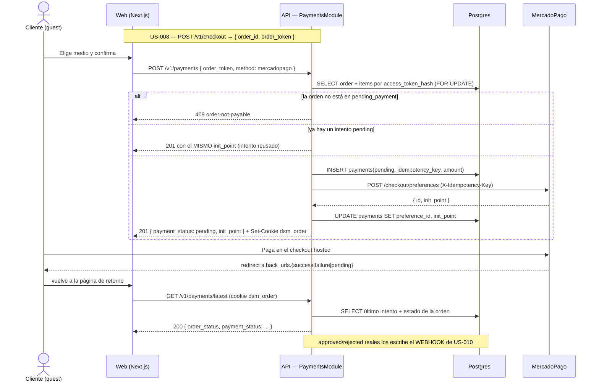

# US-009 Backend — Design

## Context

ADR-0006 ya eligió **qué** (MercadoPago Checkout Pro hosted) y **por qué** (fuera de
alcance PCI), y ADR-0008 ya eligió **cuándo se toca el stock** (al aprobar el pago, en
la transacción del webhook). Este documento no re-abre ninguna de las dos: decide las
cosas que quedan abiertas cuando se baja a implementación y que el E2E declara,
explícitamente, que **no** fija.

Esa declaración importa porque hay una tensión aparente. El E2E §9.2 dibuja
`POST /checkout` haciendo todo de un tirón —crear la orden, crear la preferencia,
devolver el `init_point`—, mientras que US-009 AC-1 arranca con **«Given una orden en
estado pendiente de pago (US-008)»**, es decir con la orden ya creada. La contradicción
se resuelve leyendo la nota que el propio E2E pone al cierre de §6:

> «este E2E define los **límites y endpoints** a nivel componente. El **contrato
> OpenAPI detallado** se produce por endpoint en la **planificación de tickets de
> backend**. No es parte del E2E **por diseño**.»

El diagrama de §9.2 es un flujo, no una descomposición de endpoints; la descomposición
es de este plan. Y las dos US son consistentes entre sí: US-008 §7 describe su task de
backend como «crear orden pendiente **y handoff al inicio de pago**», y US-009 §7 como
«crear preferencia asociada a la orden + manejo del retorno». **Dos pasos.** Se
implementa en dos endpoints, en dos changes, sin que US-009 tenga que editar el
controller de US-008.

Lo demás que este documento decide viene de un hecho nuevo para el repo: **es la
primera llamada saliente a un tercero en el camino crítico**. `apps/api` hoy no tiene
un solo timeout, reintento ni breaker (el único adaptador externo, `ResendMailer` de
US-014, corre fuera del camino de respuesta). Eso hace que `backend-node-standards.md`
§8 pase de letra a trabajo real, y que el presupuesto de latencia del E2E §17 haya que
re-derivarlo en vez de heredarlo.

## Goals

- Iniciar un pago real contra MercadoPago y devolver el punto de checkout hosted, sin
  que un solo dato de tarjeta entre al sistema (AC-1, AC-6).
- Dar un medio simulado que apruebe sin cobrar y que recorra **el mismo camino de
  confirmación** que un pago real, y que sea **imposible** de encender en producción
  (AC-3, AC-7).
- Dejar el estado del pago **autoritativo del lado del servidor**, de modo que ninguna
  URL de retorno pueda mentir (AC-2, AC-5, AC-8).
- Hacer que un intento de pago sólo pueda apuntar a una orden propia y pagable (AC-9).
- Absorber la caída, la lentitud y los errores de MercadoPago sin colgar la API ni
  perder el asiento del intento.

## Non-goals

- Confirmar la orden, decrementar stock, mandar emails o reembolsar. Todo eso cuelga
  del `PaymentConfirmationPort` y lo implementan US-010 / US-011 / US-013.
- Crear `orders` / `order_items` (US-008) ni validar el carrito (US-007/US-008).
- Reconciliar webhooks perdidos ni limpiar órdenes abandonadas (US-010).
- Modelar cuotas, medios de pago específicos ni descuentos: la preferencia se crea con
  los ítems y el total, y MercadoPago ofrece lo que su cuenta tenga habilitado.

## Approach

### Descomposición de endpoints



El medio simulado corta el diagrama a la altura del `INSERT`: no habla con
MercadoPago, marca el intento `approved` e invoca `PaymentConfirmationPort.confirm()`
— el **mismo** método que el webhook de US-010 invocará. AC-3 se verifica sobre ese
puerto (un espía asserta que el payload es idéntico al de un pago real aprobado), no
por inspección de código.

### Por qué el `order_token` va en el cuerpo y el retorno por cookie

Tres transportes posibles para «qué orden estoy pagando», y los tres fallan distinto:

| Transporte | Problema |
|---|---|
| `order_id` UUID en el path | Queda en logs de acceso, en métricas por ruta y —lo peor— en el header `Referer` que el navegador manda **a MercadoPago** al redirigir. Un identificador que da acceso no puede vivir en una URL |
| `order_token` en query string | Idéntico problema |
| Sólo cookie, sin token | El comprador que abre el checkout en otra pestaña o vuelve de MercadoPago con la cookie caída se queda sin camino |

De ahí el reparto: **el token opaco viaja en el cuerpo** del `POST` (los cuerpos no se
loguean y no van en el `Referer`) y **el camino de retorno usa una cookie `httpOnly`**
(`dsm_order`, `SameSite=Lax`, 2 h — OQ-BE-3), porque el retorno es una navegación
`GET` de nivel superior desde otro sitio y `Lax` sí la acompaña. Ningún identificador
de orden aparece nunca en una URL, así que la superficie no se puede enumerar y no
depende de que alguien recuerde escribir el chequeo de propiedad — la misma disciplina
que US-007 aplicó al carrito.

La comparación del token es **en tiempo constante** sobre el hash
(`crypto.timingSafeEqual`) y el fallo es **un solo 404** para «token inexistente»,
«token de otra orden» y «orden borrada»: distinguirlos convertiría el endpoint en un
oráculo (AC-9).

### Persistencia

Tabla nueva `payments` (única escritura de esquema de este change). **Aditiva**: no se
altera ninguna tabla existente, per `backend-node-standards.md` §5.

| Columna | Tipo | Notas |
|---|---|---|
| `id` | uuid PK | `gen_random_uuid()`, como el resto del esquema |
| `order_id` | uuid FK → `orders` | `ON DELETE RESTRICT` — un pago nunca queda huérfano; las órdenes no se borran (E2E §8) |
| `provider` | text | `CHECK IN ('mercadopago','simulated_dsm')` |
| `external_id` | text NULL UNIQUE | `payment_id` de MercadoPago. **Nulo acá**: lo escribe US-010. Postgres admite varios NULL en un UNIQUE, así que N intentos sin resolver conviven |
| `status` | text | `CHECK IN ('pending','approved','rejected','refunded')` |
| `amount_ars_cents` | int | `CHECK >= 0`. Copia del total de la orden al momento del intento (§5.5 dinero en centavos) |
| `idempotency_key` | text UNIQUE | UUID generado al crear el intento; se manda a MercadoPago como `X-Idempotency-Key` y US-010 lo usa para cortocircuitar |
| `processed_at` | timestamptz NULL | Lo escribe quien resuelve (US-010 / el medio simulado) |
| `preference_id` | text NULL UNIQUE | **Deviación del DER** ↓ |
| `init_point` | text NULL | **Deviación del DER** ↓ |
| `created_at` | timestamptz | `now()` |
| `updated_at` | timestamptz | **Deviación del DER** ↓ |

**Índices**: `UNIQUE(idempotency_key)`, `UNIQUE(external_id)`,
`UNIQUE(preference_id)`, `payments(order_id)`, `payments(external_id)` (nombrado en el
E2E §8), `payments(status, created_at)` (insumo de la reconciliación de US-010) y el
**índice único parcial** `payments_one_pending_per_order ON payments(order_id) WHERE
status = 'pending'`.

**Tres deviaciones del DER (E2E §8), declaradas:**

1. **`preference_id`** — el DER sólo tiene `external_id` (el `payment_id`), que no
   existe hasta que alguien paga. Sin guardar el id de la **preferencia** no hay forma
   de correlacionar un webhook temprano con su intento, ni de saber si la preferencia
   ya se creó cuando un reintento de red nos deja en duda.
2. **`init_point`** — se guarda para poder devolver **la misma** URL cuando el intento
   se reusa, en vez de crear una segunda preferencia en MercadoPago por cada clic.
3. **`updated_at`** — el DER sólo declara `processed_at`. Toda tabla del esquema
   existente lleva `updated_at`; sin ella no se puede ordenar «último intento» de
   forma estable ni auditar cuándo se tocó una fila que todavía no se procesó.

**Una deviación de cardinalidad**: el DER dibuja `ORDERS ||--o| PAYMENTS` (0..1). Acá
es **0..N intentos con a lo sumo uno `pending`** (OQ-BE-2). La razón es de negocio: un
rechazo del banco es normal y frecuente en Argentina, y con 1:1 el comprador se queda
sin recurso salvo que sobrescribamos la fila —perdiendo el rastro del intento
rechazado, que es justo lo que hace falta para explicar una venta perdida. El índice
único parcial mantiene la garantía que el DER buscaba (no hay dos pagos vivos por
orden) sin borrar historia.

**Lo que NO tiene la tabla, a propósito**: ninguna columna capaz de alojar un PAN, un
CVV, un nombre de titular o un token de tarjeta (AC-6). El test de esquema compara el
conjunto de columnas contra la lista literal y **falla si sobra una**, así que la
garantía no depende de que nadie agregue una columna «por si acaso».

### Capas y wiring

`apps/api/src/payments/` como módulo propio (ADR-0007, monolito modular), espejando la
forma de `auth/` y `storefront/`:

```
payments/
├─ payments.module.ts            ← registra el controller simulado SOLO con el flag
├─ payments.controller.ts        ← POST /v1/payments · GET /v1/payments/latest
├─ payments-simulate.controller.ts ← POST /v1/payments/simulate (montaje condicional)
├─ payments.service.ts           ← caso de uso; no toca Prisma
├─ payments.repository.ts        ← único punto de ORM de `payments` (§5)
├─ orders-read.repository.ts     ← lectura de `orders`/`order_items` por token (US-008)
├─ payments-throttler.guard.ts   ← espejo de StorefrontThrottlerGuard (§12)
├─ order-cookie.ts              ← emisión/lectura de `dsm_order`
├─ dto/                          ← create-payment.dto.ts · payment-status.dto.ts
├─ confirmation/
│  ├─ payment-confirmation.port.ts   ← interfaz + token de DI
│  └─ noop-payment-confirmation.ts   ← adaptador interino (US-010 lo reemplaza)
└─ mercadopago/
   ├─ mercadopago.client.ts      ← puerto + tipos
   ├─ http-mercadopago.client.ts ← fetch + timeout + retry + breaker
   ├─ fake-mercadopago.client.ts ← para tests
   └─ circuit-breaker.ts         ← breaker mínimo, sin dependencia
```

El servicio **no** llama a Prisma (§2/§5) y **no** conoce `fetch`: recibe
`MercadoPagoClient` por token de DI (§3), lo que permite probar el timeout, el
reintento, el breaker y el mapeo de errores sin red.

### Resiliencia de la llamada saliente (`backend-node-standards.md` §8)

Números, no adjetivos — `nfr-quantification`:

| Control | Valor | Por qué ese valor |
|---|---|---|
| Timeout por intento | **4 000 ms** (`AbortSignal.timeout`) | El p95 documentado de creación de preferencia está en cientos de ms; 4 s da margen de cola larga sin acercarse al timeout del navegador |
| Reintentos | **2** (3 llamadas máx.) | Sólo ante error de red o `5xx`. Un `4xx` es determinista: reintentarlo es quemar presupuesto |
| Backoff | **250 ms × 2ⁿ ± 50 ms jitter** | 250 / 500 ms. El jitter evita que 50 compradores simultáneos reintenten en fase |
| Presupuesto total peor caso | **4 000 + 250 + 4 000 + 500 + 4 000 ≈ 12,75 s** | Cota superior explícita; el breaker es lo que evita que sea el caso común |
| Circuit breaker | **5 fallos consecutivos → abierto 30 s**, luego half-open con 1 sonda | Con MercadoPago caído, el sexto comprador falla en **~1 ms** en vez de esperar 12 s |
| Idempotencia hacia MercadoPago | `X-Idempotency-Key = payments.idempotency_key` | Un reintento nuestro tras un timeout **no** crea dos preferencias |

**Presupuesto de latencia — deviación declarada del E2E §17.** §17 fija p95 de
escritura < 500 ms para «carrito/orden». `POST /v1/payments` **no puede** cumplirlo:
contiene una llamada a un tercero. El presupuesto de este endpoint es **p95 < 2 000 ms
end-to-end**, descompuesto en **≤ 120 ms de trabajo propio** (una transacción corta:
leer orden + insertar intento) **+ la latencia de MercadoPago**, acotada por el
timeout. La parte que es nuestra sí respeta §17. Los otros dos endpoints
(`GET /v1/payments/latest` y el simulado) no salen de la red y mantienen el
presupuesto original: **p95 < 300 ms** y **< 500 ms** respectivamente.

### Feature flag del medio simulado — dos capas

El E2E §14 clasifica el medio simulado como **Tampering** y ADR-0006 lo llama
explícitamente «risk surface». Un `if (flag)` dentro del handler no alcanza: deja la
ruta existiendo, respondiendo distinto, y a un solo bug de configuración de aprobar
pagos gratis. Por eso:

1. **Zod + `superRefine`**: `PAYMENTS_SIMULATED_ENABLED=true` con
   `NODE_ENV=production` **hace fallar el arranque**. Es el mismo mecanismo que
   US-014 usó para las credenciales de Resend, y el sentido es idéntico: un deploy mal
   configurado **no levanta** en vez de levantar haciendo algo peligroso en silencio.
2. **Montaje condicional**: con el flag apagado, `PaymentsModule` no incluye
   `PaymentsSimulateController` en su array de `controllers`. La ruta no existe para el
   router de Nest → `404` idéntico al de cualquier URL inventada. No hay handler que
   auditar, no hay guard que puentear.

La combinación hace que AC-7 sea verificable de dos formas independientes: el test de
`env.validation` prueba que el arranque falla, y el test e2e prueba que la ruta
devuelve 404 con el flag apagado.

### Errores (RFC 7807, `api-standards.md` §8)

Se agregan errores de dominio en `payments/payments-errors.ts`, extendiendo
`DomainError` como hace `auth-errors.ts` — no se toca `domain-errors.ts` (sus `type`
llevan el prefijo `dsm:catalog/`, que no corresponde acá):

| Situación | Status | `type` |
|---|---|---|
| `order_token` desconocido / de otra orden | `404` | `dsm:payments/order-not-found` |
| Orden que no está en `pending_payment` (ya pagada, cancelada) | `409` | `dsm:payments/order-not-payable` |
| Ya se alcanzó el tope de intentos de la orden | `409` | `dsm:payments/attempt-limit-reached` |
| MercadoPago no responde, responde `5xx` o el breaker está abierto | `502` | `dsm:payments/provider-unavailable` |
| MercadoPago rechaza la preferencia (`4xx`) | `502` | `dsm:payments/provider-rejected` |
| Cookie `dsm_order` ausente o vencida en `GET /latest` | `404` | `dsm:payments/order-not-found` |
| Cuerpo inválido / `method` fuera del enum | `422` | (lo produce el `ValidationPipe` global) |

**El cuerpo de error de MercadoPago no se reenvía nunca** (§8.6 — nada de detalles
internos en la respuesta): se loguea con el `trace_id` y al cliente le llega el
`detail` genérico. Un mensaje del proveedor puede traer identificadores de cuenta.

### Threat model (STRIDE — filas nuevas sobre E2E §14)

| Amenaza | Superficie | Control |
|---|---|---|
| **T**ampering — aprobar un pago sin cobrar | `POST /v1/payments/simulate` | Ruta **no montada** con el flag apagado + arranque **falla** con el flag encendido en producción. Verificado por dos tests independientes |
| **S**poofing — pagar la orden de otro | `POST /v1/payments` | `order_token` opaco de 256 bit, hash en base, comparación en tiempo constante, un único 404 para todos los fallos |
| **I**nformation disclosure — fuga del token de MercadoPago | adaptador HTTP + logs | `MP_ACCESS_TOKEN` sólo en el header `Authorization` del adaptador; test que asserta que no aparece en ninguna línea de log ni en ningún cuerpo de error |
| **I**nformation disclosure — estado de una orden ajena | `GET /v1/payments/latest` | Se resuelve **sólo** por cookie `httpOnly`; no acepta parámetro alguno. `Cache-Control: no-store` para que ningún CDN comparta la respuesta |
| **D**oS / abuso de costo — inundar MercadoPago de preferencias | `POST /v1/payments` | Throttler `payments` (10 / 5 min por IP) + tope de 5 intentos por orden + reuso del intento `pending` |
| **R**epudiation — «yo pagué» sin rastro | tabla `payments` | Cada intento queda persistido con `idempotency_key`, `provider`, `amount_ars_cents` y timestamps; nada se sobrescribe |
| **E**levation of privilege | — | No se agrega superficie admin. Ningún endpoint de este change escribe el estado de la orden |

**Por qué no hay guard de CSRF.** `security-standards.md` §7.5 es *Mandatory* para
escrituras **autenticadas por cookie**: el riesgo es que el navegador adjunte la
credencial ambiente a una petición que la víctima no quiso. Acá la autorización es un
`order_token` en el cuerpo, que un sitio atacante no puede conocer; la cookie
`dsm_order` **sólo** habilita una lectura (`GET`, método seguro) y no autoriza
ninguna escritura. Agregar un double-submit no cerraría ningún vector y sumaría un
guard que después hay que mantener. Queda escrito para que la ausencia se lea como
decisión.

### Observabilidad (E2E §18, `observability-standards.md` §9)

`PaymentEventsService`, calcado de `AuthEventsService`: contador **por nombre de
evento** (nunca una dimensión por orden — 5 000 órdenes serían 5 000 series) y el
identificador **sólo** en la línea de log.

| Evento | Cuándo | Para qué |
|---|---|---|
| `payment.intent_created` | intento real creado | denominador de la tasa aprobado/rechazado (E2E §18) |
| `payment.intent_reused` | segundo clic en «Pagar» | mide fricción del checkout |
| `payment.simulated_approved` | medio simulado | **señal de alarma si aparece en producción** |
| `payment.status_read` | `GET /latest` | cuántos vuelven a mirar el resultado |
| `payment.provider_error` | fallo de MercadoPago tras reintentos | alerta de §18 «picos de rechazo» |
| `payment.provider_degraded` | breaker abre | síntoma del runbook §18.5 |
| `payment.attempt_cap_reached` | tope de 5 | abuso o comprador atascado |
| `payment.order_not_payable` | 409 | insumo de la limpieza de US-010 |

**Nada de PII**: ni `buyer_email`, ni `buyer_name`, ni `buyer_phone` (son columnas de
`orders`, y el servicio de eventos no las recibe). Se loguean `order_id`,
`payment_id`, `provider` y `trace_id`.

## Trade-offs

**Endpoint separado vs plegar el pago en `POST /v1/checkout`.** Plegarlo daría un
viaje de red menos y calcaría el diagrama del E2E §9.2. Se rechaza porque obligaría a
US-009 a **editar el controller de US-008** —dos changes escribiendo el mismo archivo,
con el precedente fresco de la colisión de sesiones de US-007— y porque haría que un
fallo de MercadoPago se comiera la creación de la orden, perdiendo los datos del
comprador que acaba de tipear. Separados, un `502` del proveedor deja la orden intacta
y el comprador reintenta con un clic. El costo aceptado es un round-trip extra.

**Adaptador sobre `fetch` vs SDK oficial `mercadopago`.** El SDK ahorraría el mapeo de
la preferencia, pero §8 exige control explícito de timeout, reintentos y breaker, y el
SDK los envuelve con su propia política —difícil de instrumentar y de probar sin red.
Un adaptador propio son ~120 líneas, **cero dependencias nuevas** (Node 20 trae
`fetch` y `AbortSignal.timeout`), y un `FakeMercadoPagoClient` que hace los tests
deterministas. El costo aceptado: si MercadoPago cambia el contrato de preferencias,
lo absorbemos a mano — aceptable para dos campos de request y dos de response.

**Idempotencia natural vs máquina de `Idempotency-Key`.** `api-standards.md` §10.1
pide `Idempotency-Key` en `POST` que crean recursos, y §10.2 pide almacenar la
respuesta 24 h. Acá el efecto se consigue **sin la máquina**: el índice único parcial
garantiza un solo intento vivo por orden, y el segundo `POST` devuelve el `init_point`
guardado. Es el mismo resultado observable con una tabla menos y sin comparación de
cuerpos (§10.5 en espíritu; KISS de `base-standards.md` §1). Se documenta como
deviación consciente de §10.1 en vez de fingir que no aplica.

**Un intento vs N intentos por orden.** N (con uno vivo) desvía del DER 1:1 y agrega
un índice parcial; se elige igual porque perder el rastro de un rechazo es perder la
única evidencia de por qué se cayó una venta. Ver OQ-BE-2.

**`PaymentConfirmationPort` con adaptador no-op vs esperar a US-010.** El no-op deja
un camino que, hoy, aprueba el pago y **no** confirma la orden — un estado
intermedio incómodo. La alternativa (esperar a US-010) haría inejecutable a US-009 y
dejaría a AC-3 sin forma de verificarse. Con el puerto, AC-3 se prueba donde se puede
probar —«el simulado invoca el mismo puerto con el mismo payload que un pago real
aprobado»— y US-010 sólo cambia la implementación registrada. El estado intermedio se
declara en `tasks.md` §Pre-requisitos y en el runbook.

## Deployment considerations

**Se recomienda `/plan-deployment US-009`.** Seis gatillos simultáneos:

1. **Secreto nuevo**: `MP_ACCESS_TOKEN` (credencial de producción de MercadoPago).
   Provisión = `INFRA-US-009`, variables de entorno de Railway (E2E §13).
2. **Feature flag**: `PAYMENTS_SIMULATED_ENABLED`. ADR-0006 §Validation criteria lo
   pone como **gate de release**: verificar que está apagado en producción. Acá el gate
   es automático (el arranque falla), pero el deploy debe probar ese fallo *antes* de
   promover.
3. **Migración de esquema**: `payments`, aditiva, y **dependiente de que `orders` ya
   exista** (US-008). El orden de migraciones no es negociable.
4. **Superficie pública nueva** con escritura y dinero.
5. **Dependencia externa nueva** en el camino crítico: MercadoPago tiene que ser
   alcanzable desde la red de salida de Railway.
6. **URL pública HTTPS del webhook** (`API_PUBLIC_BASE_URL`): la preferencia la
   incluye como `notification_url`, así que tiene que estar resuelta **antes** del
   primer pago real, aunque el handler sea de US-010.

Variables nuevas (todas validadas por Zod, `backend-node-standards.md` §7):
`MP_ACCESS_TOKEN`, `MP_API_BASE_URL`, `MP_TIMEOUT_MS`, `MP_MAX_RETRIES`,
`MP_BREAKER_FAILURE_THRESHOLD`, `MP_BREAKER_OPEN_MS`, `MP_PREFERENCE_TTL_HOURS`,
`PAYMENTS_SIMULATED_ENABLED`, `PAYMENTS_MAX_ATTEMPTS_PER_ORDER`,
`PAYMENTS_RATE_LIMIT_TTL_MS`, `PAYMENTS_RATE_LIMIT_MAX`, `ORDER_COOKIE_TTL_HOURS`,
`WEB_PUBLIC_BASE_URL`, `API_PUBLIC_BASE_URL`.

**Rollback**: la migración es aditiva y ningún camino existente la lee, así que
revertir el deploy de la API basta; la tabla puede quedar. Apagar el cobro sin
redeploy no es posible por diseño (no hay flag para el pago real: el flag existe sólo
para el simulado, que es el peligroso).

## Spec delta (para `/archive-change`)

Los tres endpoints **no** pertenecen a la capacidad `catalogo`: forman una capacidad
nueva. Al archivar, `/archive-change` crea
`openspec/specs/pagos/contracts/openapi.yaml` (raíz viva) con
`openapi/paths/payments-create.yaml`, `payments-simulate.yaml` y
`payments-latest.yaml` a partir de los drafts de `contracts/openapi/` de este change,
más `README.md`, `requirements.md` y `decisions.md` (link a ADR-0006 y ADR-0008).

## Open questions

Las seis viven en `proposal.md` §Preguntas abiertas con su default implementado.
**Ninguna bloquea el arranque.** La que más conviene resolver antes de ejecutar es
**OQ-BE-1**, porque es una obligación que este plan le pone a US-008 (todavía sin
planificar) y es más barato ratificarla ahora que rehacer el seam después.

## References

- ADR-0006 (MercadoPago hosted + simulado), ADR-0008 (stock al aprobar),
  ADR-0011 (tokens opacos hasheados), ADR-0007 (monolito modular),
  ADR-0010 (namespace de URLs)
- E2E: §6.1, §8 (DER), §9.2, §12 (FSM), §14 (STRIDE), §17 (NFRs), §18 + §18.5, §19, §20
- Contratos draft: [`contracts/openapi/payments-create.yaml`](contracts/openapi/payments-create.yaml),
  [`payments-simulate.yaml`](contracts/openapi/payments-simulate.yaml),
  [`payments-latest.yaml`](contracts/openapi/payments-latest.yaml)
- Standards: `backend-node-standards.md` §2–§10 · `api-standards.md` §2, §3, §5, §8,
  §10, §12 · `security-standards.md` §2, §5, §6, §7 · `observability-standards.md` §9 ·
  `performance-standards.md` · `testing-standards.md` §14
