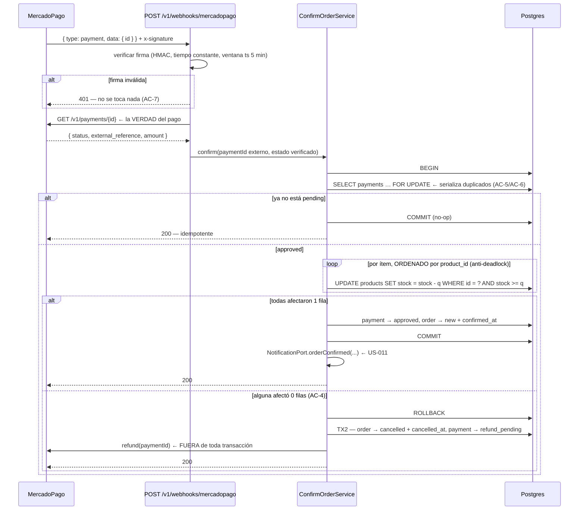

# US-010 Backend — Design

## Context

ADR-0008 ya decidió lo esencial y no se reabre: el stock se decrementa **al aprobarse el
pago**, con `UPDATE` condicional atómico e idempotencia por identificador de pago, y la
alternativa de reservar con TTL quedó descartada. ADR-0006 fijó que la verdad del pago es el
**webhook verificado con re-consulta**, y que el medio simulado recorre el mismo camino. El
E2E §9.2 dibuja la secuencia completa, incluida la rama de compensación, y §12 la FSM.

Este documento decide las cosas que quedan cuando eso se baja a código, y todas giran
alrededor de una sola pregunta: **cómo se garantiza «exactamente una vez» cuando el mundo
manda el mismo mensaje dos veces, tarde, y a veces falso.**

## Goals

- Confirmar la orden y decrementar stock exactamente una vez por pago aprobado (AC-1, AC-5,
  AC-6).
- No creerle nada al payload del webhook (AC-7).
- Que el stock no pueda quedar negativo ni bajo concurrencia real (AC-8).
- Que un pago cobrado y no cumplible termine reembolsado, sin perder el reembolso ante un
  fallo transitorio (AC-4).
- Recuperarse de un webhook que nunca llega (AC-10) y limpiar lo abandonado (AC-11).
- Que el medio simulado y el pago real compartan **un solo** camino de confirmación (AC-9).

## Non-goals

- Entregar emails (US-011), panel del dueño (US-012), cancelación a pedido con reintegro de
  stock (US-013), métricas (US-016).
- Crear preferencias o el medio simulado (US-009).
- Un motor genérico de FSM: seis estados y dos transiciones propias no lo justifican.

## Approach

### D1 — La secuencia completa, con la compensación



**Por qué el reembolso va fuera de la transacción**: es una llamada a un tercero con
timeout de segundos. Mantener una transacción abierta esperándola bloquea las filas de
`products` involucradas y convierte un problema de una orden en una degradación de todo el
catálogo.

### D2 — Idempotencia: por la base, no por un `if`

El error clásico acá es *check-then-act*: leer el estado, ver que está `pending`, y decidir.
Entre la lectura y la escritura entra el duplicado. Con dos webhooks concurrentes —que es
exactamente lo que hace un proveedor que reintenta— el stock se decrementa dos veces.

La garantía se apoya en tres cosas, en este orden:

1. **`SELECT … FOR UPDATE`** sobre la fila de `payments` **dentro** de la transacción. El
   segundo webhook **se bloquea** hasta que el primero commitee, y entonces lee el estado ya
   actualizado.
2. **Sólo la transición `pending → approved` hace trabajo.** Cualquier otro estado de
   partida es un no-op que devuelve 200. Eso cubre el duplicado, el tardío y el fuera de
   orden (AC-5, AC-6) con una sola regla en vez de tres casos especiales.
3. **`payments.external_id` UNIQUE** (de US-009) como red: si por un camino imprevisto se
   intentara crear un segundo asiento para el mismo `payment_id` de MP, la base lo rechaza.

No hace falta una tabla de idempotencia ni almacenar respuestas (`api-standards.md` §10.2):
la fila del pago **es** la clave de idempotencia, y su estado es el registro de si ya se
aplicó.

### D3 — Decremento atómico y el deadlock que nadie ve venir

```sql
UPDATE products SET stock = stock - $q, updated_at = now()
 WHERE id = $id AND stock >= $q;
-- se exige rowCount === 1; 0 significa "no hay stock" → compensación
```

El `WHERE stock >= $q` es lo que hace la operación segura sin `SELECT … FOR UPDATE` sobre
`products`: es un compare-and-set. El `CHECK (stock >= 0)` del esquema es la red de la base,
no el mecanismo.

**Los ítems se recorren ordenados por `product_id`.** Sin eso, dos órdenes que comparten los
productos A y B en orden inverso se bloquean mutuamente y una muere por deadlock — un fallo
que aparece sólo bajo concurrencia, en producción, y que en los logs se ve como un error de
Postgres sin relación aparente con el negocio. Ordenar es gratis y lo elimina.

### D4 — Persistencia: dos adiciones sobre tablas de otras US

| Tabla | Cambio | Por qué |
|---|---|---|
| `payments` | el `CHECK` de `status` gana **`refund_pending`** | Hace **durable** el reembolso de AC-4. Sin un estado persistido, un fallo del refund vive en memoria y se pierde en el próximo deploy — con plata de un cliente adentro |
| `orders` | **`confirmed_at`** y **`cancelled_at`** (timestamptz, nullable) | La FSM del §12 tiene seis estados y el DER sólo modela `delivered_at`. Sin `confirmed_at` no hay forma de reconstruir cuándo se vendió (insumo de US-016); sin `cancelled_at` no se distingue una cancelación por abandono de una por falta de stock |

**Deviación del DER (E2E §8)**, declarada: tres columnas y un valor de `CHECK`. Ninguna es
un dato nuevo del negocio — son marcas temporales de transiciones que la FSM ya declara.

**Obligación cruzada**: las dos tablas son de US-009 y US-008. La migración es aditiva y no
cambia ninguna columna existente, pero el orden de despliegue no es negociable:
**US-008 → US-009 → US-010**.

### D5 — Verificación de la firma (AC-7)

MercadoPago firma un manifiesto (`id:{data.id};request-id:{x-request-id};ts:{ts};`) con el
secreto del webhook. La verificación tiene tres partes y las tres importan:

1. **HMAC recalculado y comparado en tiempo constante** (`timingSafeEqual`). Una comparación
   con `===` filtra información por tiempo.
2. **Ventana de tolerancia sobre el `ts`** (5 min, OQ-BE-5). Sin esto, un webhook legítimo
   capturado se puede reproducir para siempre — la firma sigue siendo válida.
3. **Re-consulta del pago a la API de MP.** Es la que manda: incluso con firma válida, el
   cuerpo no se usa para decidir. Sólo se toma de él el **id** del pago.

`MP_WEBHOOK_SECRET` es un **secreto nuevo** (US-009 sólo necesitaba `MP_ACCESS_TOKEN`).

**El webhook no lleva throttler.** Es una decisión, no un olvido: limitar por IP la
superficie por la que entra el dinero significa **descartar pagos** cuando el proveedor
reintenta en ráfaga. La protección es la firma —rechazar cuesta un HMAC— y el hecho de que
un cuerpo no verificado nunca llega a la base. Tampoco lleva CSRF: no hay cookie, la
autenticación es la firma.

**Siempre 200 salvo firma inválida.** MercadoPago reintenta ante cualquier respuesta que no
sea 2xx; devolver 500 por un error nuestro genera una tormenta de reintentos justo cuando el
sistema está mal. Un pago que no se pudo procesar por una causa transitoria queda para la
reconciliación (AC-10), que es el mecanismo pensado para eso.

### D6 — El puerto de MercadoPago se extiende, no se duplica

US-009 declaró `MercadoPagoClient` con `createPreference` sobre un adaptador que ya tiene
timeout, reintentos con jitter y circuit breaker. Se agregan dos métodos:

```ts
getPayment(paymentId: string): Promise<{ status: PaymentStatus; externalReference: string; amountArs: number }>;
refund(paymentId: string, amountArs?: number): Promise<{ refundId: string }>;
```

`getPayment` es una **lectura** y se reintenta con la política existente. `refund` es una
**escritura con dinero**: se manda con `X-Idempotency-Key` derivado del `payments.id` para
que un reintento nuestro no genere dos devoluciones.

Los specs de US-009 tienen que pasar **sin editarse**: si hay que tocarlos, la extensión
cambió comportamiento y está mal. **Efecto colateral favorable**: US-013 (cancelación y
reembolso a pedido) encuentra la capacidad de reembolso ya construida y probada.

### D7 — Notificaciones sin cola (AC-2)

Cuarta vez que el proyecto se topa con que Redis no está aprovisionado (ADR-0012, ADR-0014,
el caché de US-004, y ahora esto). Mismo patrón: `NotificationPort` (token de DI) con
`LoggingNotificationAdapter` que registra la invocación; **US-011 registra la
implementación real sin tocar este archivo**.

AC-2 se verifica **sobre el puerto**: «la confirmación invoca el puerto una vez con el
payload de la orden confirmada». Es lo que se puede probar hoy, y es la garantía que
importa — que el enganche existe y se llama en el lugar correcto.

La invocación va **después del COMMIT**, nunca dentro de la transacción: un email no puede
hacer fallar una venta ya cobrada.

### D8 — Los trabajos periódicos, sin planificador

No hay `@nestjs/schedule` ni ninguna dependencia de scheduling en `apps/api`. Se reusa el
patrón de runner en proceso de US-005/US-006 (intervalo + cooldown + no reentrante), y
**además** cada trabajo expone un endpoint admin:

| Trabajo | Qué hace | Disparo |
|---|---|---|
| **Reconciliación** (AC-10) | Toma las órdenes `pending_payment` con un pago `pending` de más de N minutos, consulta su estado a MP y las procesa por **el mismo `ConfirmOrderService`** | runner cada 15 min + `POST /v1/admin/payments/reconcile` |
| **Limpieza** (AC-11) | `pending_payment` con más de 48 h (OQ-BE-1) → `cancelled` + `cancelled_at` | runner cada 60 min + `POST /v1/admin/orders/cleanup-abandoned` |

Que la reconciliación use el **mismo servicio** que el webhook es la decisión que la vuelve
segura: es idempotente por construcción, así que reconciliar un pago que el webhook ya
procesó es un no-op. No hay una segunda implementación que pueda divergir.

Los endpoints admin no son un lujo: el runbook del E2E §18.5 los pide textualmente
(«reconciliar consultando estado a la API de MP (job/endpoint manual idempotente)»).

### D9 — Capas

**La dirección de las dependencias entre módulos es acíclica y hay que elegirla a
propósito.** `ConfirmOrderService` orquesta tres cosas: la fila del pago
(`PaymentsRepository`), el stock (`StockRepository`) y la orden (`OrdersRepository`), y
además necesita `MercadoPagoClient.refund`. Si viviera en `src/orders/`, `PaymentsModule`
tendría que importar `OrdersModule` para registrarlo como `PAYMENT_CONFIRMATION` **y**
`OrdersModule` tendría que importar `PaymentsModule` para acceder al repositorio de pagos y
al cliente de MP: **ciclo**, que en NestJS se tapa con `forwardRef` y deja el problema
adentro.

Por eso vive en **`src/payments/`**: la confirmación se dispara por un evento de pago y su
identidad es el pago. La dirección queda `payments → orders` y `payments → stock`, en un
solo sentido. **Ningún `forwardRef` en este change** — si aparece uno, la dirección se
eligió mal.

```
src/orders/                        ← no importa payments
├─ orders.module.ts                  (exporta OrdersRepository)
├─ orders.repository.ts           ← ORM de orders (transiciones + lecturas de la FSM)
├─ order-state.ts                 ← puro: transiciones válidas de la FSM §12
└─ ports/notification.port.ts     ← + logging.notification.adapter.ts (US-011 lo reemplaza)
src/stock/
├─ stock.module.ts
└─ stock.repository.ts            ← el UPDATE condicional; único punto que escribe products.stock
src/payments/                     ← (de US-009, se extiende)
├─ confirm-order.service.ts       ← la transacción; implementa PaymentConfirmationPort
├─ webhooks.controller.ts         ← POST /v1/webhooks/mercadopago
├─ webhook-signature.ts           ← puro: HMAC + ventana de ts
├─ reconcile.service.ts + reconcile.runner.ts
├─ refund.service.ts + refund.runner.ts
├─ cleanup-abandoned.service.ts + .runner.ts
└─ admin-jobs.controller.ts       ← los 2 endpoints admin
```

`order-state.ts` y `webhook-signature.ts` son **puros**: la FSM y la criptografía son las
dos cosas que hay que poder ejercer sin HTTP ni base.

`stock.repository.ts` queda como **único** punto del repo que escribe `products.stock` — el
invariante de ADR-0008 se defiende en un archivo, no en una convención.

### D10 — Threat model (STRIDE — la fila más crítica del E2E §14)

| Amenaza | Superficie | Control |
|---|---|---|
| **Spoofing / Tampering** — un falso «approved» | `POST /v1/webhooks/mercadopago` | Firma HMAC en tiempo constante + ventana de `ts` + **re-consulta a MP**. El cuerpo sólo aporta el id. Probado con cuerpo válido y firma inválida: 401 y **cero** cambios en base |
| **Replay** — reproducir un webhook legítimo | idem | Ventana de 5 min sobre el `ts` + idempotencia (el segundo es no-op de todos modos) |
| **Tampering** — decrementar de más | `stock.repository` | `UPDATE … WHERE stock >= q` + `CHECK (stock >= 0)` + un solo escritor de la columna |
| **DoS** — inundar el webhook | idem | Sin throttler **a propósito** (limitar la entrada del dinero descarta pagos); el costo de rechazar es un HMAC. La cota real es que nada no verificado llega a la base |
| **Elevation of privilege** — disparar los jobs | `/v1/admin/*` | `AdminGuard` existente + `no-store` del borde. Los jobs son idempotentes: dispararlos de más no rompe nada |
| **Repudiation** — «no me devolvieron» | `payments` | `refund_pending` persistido + evento `refund.failed` + reintentos con backoff. Un reembolso no se pierde en memoria |
| **Information disclosure** | logs | La orden trae PII del comprador (US-008). El servicio de eventos **no acepta** email/nombre/teléfono; se loguean `order_id`, `payment_id` y montos |

### D11 — NFRs

- **Respuesta del webhook**: p95 < 800 ms. La re-consulta a MP es el tramo dominante
  (timeout 4 s heredado de US-009); la transacción propia es ≤ 80 ms. MercadoPago reintenta
  si tardamos demasiado, y un reintento es inofensivo (idempotencia) pero ruidoso.
- **La transacción es corta por diseño**: sin llamadas externas adentro, sin locks de tabla.
- **Concurrencia**: probada con Postgres real y N confirmaciones simultáneas sobre la última
  unidad.

## Trade-offs

**`SELECT … FOR UPDATE` vs una tabla de idempotencia.** La tabla (que es lo que
`api-standards.md` §10.2 describe) sirve cuando la clave la trae el cliente. Acá la clave es
el pago, que ya tiene fila propia: agregar una tabla sería un segundo lugar donde vive la
misma verdad. Costo aceptado: el lock serializa duplicados del mismo pago, lo que es
deseable, pero exige que la transacción sea corta — y por eso el reembolso y las
notificaciones quedan fuera.

**Sin throttler en el webhook.** Es contraintuitivo para una superficie pública y hay que
decirlo en voz alta: limitar por IP la puerta por la que entra el dinero significa descartar
pagos cuando el proveedor reintenta en ráfaga. Se acepta el riesgo de DoS —mitigado porque
rechazar cuesta un HMAC y nada no verificado toca la base— a cambio de no perder ventas.

**Siempre 200 salvo firma inválida.** Esconde nuestros errores del proveedor, que es
exactamente lo que se quiere: sus reintentos no arreglan un bug nuestro, y la reconciliación
sí. El costo es que un fallo nuestro no genera presión externa — lo compensa el evento
`payment.webhook_received` sin `order.confirmed` correspondiente, que es la alerta real.

**Runner en proceso + endpoint admin, en vez de agregar `@nestjs/schedule`.** El patrón ya
existe dos veces en el repo y no suma dependencia. Costo: con varias instancias de la API
los runners se duplicarían; hoy hay una, y la idempotencia lo vuelve inofensivo.

## Deployment considerations

**Se recomienda `/plan-deployment` conjunto para US-008 + US-009 + US-010**: son una sola
unidad de valor y sus migraciones tienen orden obligatorio.

1. **Secreto nuevo**: `MP_WEBHOOK_SECRET`. Sin él la verificación no puede correr, así que
   el arranque **falla** en producción (mismo mecanismo que `MP_ACCESS_TOKEN` en US-009).
2. **URL pública HTTPS del webhook**: `INFRA-US-009` la provisiona y US-009 la incluye en la
   preferencia como `notification_url`. **Este change es el que la contesta**: si no está
   bien configurada, los pagos se cobran y las órdenes no se confirman — el defecto se ve
   como «vendí y no me apareció el pedido».
3. **Migración** aditiva, dependiente de US-008 y US-009.
4. **Variables nuevas**: `MP_WEBHOOK_TOLERANCE_SEC` (300), `ORDER_ABANDON_HOURS` (48),
   `RECONCILE_INTERVAL_MS` (900 000), `RECONCILE_MIN_AGE_MS` (300 000),
   `CLEANUP_INTERVAL_MS` (3 600 000), `REFUND_MAX_ATTEMPTS` (5),
   `REFUND_RETRY_BASE_MS` (60 000).
5. **Gate de release**: verificar en staging que un pago simulado confirma la orden y
   decrementa stock **de punta a punta**. Es el smoke test que el runbook del E2E §18.5 ya
   describe para el restore.

**Rollback**: la migración es aditiva y se puede dejar. Pero **atención**: revertir este
deploy con pagos ya aprobados en MercadoPago deja órdenes cobradas sin confirmar. La
reconciliación las recupera al volver a desplegar — es justamente el escenario para el que
existe.

## Spec delta (para `/archive-change`)

El webhook y los dos endpoints admin se suman a la capacidad `pagos` que crea US-009
(`openspec/specs/pagos/`), y las transiciones de orden inauguran
`openspec/specs/ordenes/` con `requirements.md` (la FSM) y `decisions.md` (ADR-0008).

## Open questions

Las cinco viven en `proposal.md` con su default. Ninguna bloquea el arranque; la que más
conviene cerrar antes de ejecutar es **OQ-BE-1** (el plazo de abandono), porque interactúa
con el vencimiento de 24 h de la preferencia de MercadoPago que fijó US-009.

## References

- **ADR-0008** (decremento al aprobar — gobierna todo), **ADR-0006** (webhook verificado +
  simulado), ADR-0012 / ADR-0014 (patrón en proceso)
- E2E §6.1, §8, **§9.2**, **§12**, **§14**, §17, §18, **§18.5**, §19, §22
- Changes: [`../US-009-pago-mercadopago-backend/design.md`](../US-009-pago-mercadopago-backend/design.md)
  (puerto extendido + `PaymentConfirmationPort`),
  [`../US-008-checkout-guest-backend/design.md`](../US-008-checkout-guest-backend/design.md)
  (crea `orders`)
- Contratos draft: [`contracts/openapi/webhook-mercadopago.yaml`](contracts/openapi/webhook-mercadopago.yaml),
  [`admin-jobs.yaml`](contracts/openapi/admin-jobs.yaml)
- Standards: `backend-node-standards.md` §2–§9 · `api-standards.md` §3, §8, §10 ·
  `security-standards.md` §2, §5, §6, §7 · `observability-standards.md` §9 ·
  `testing-standards.md` §14
