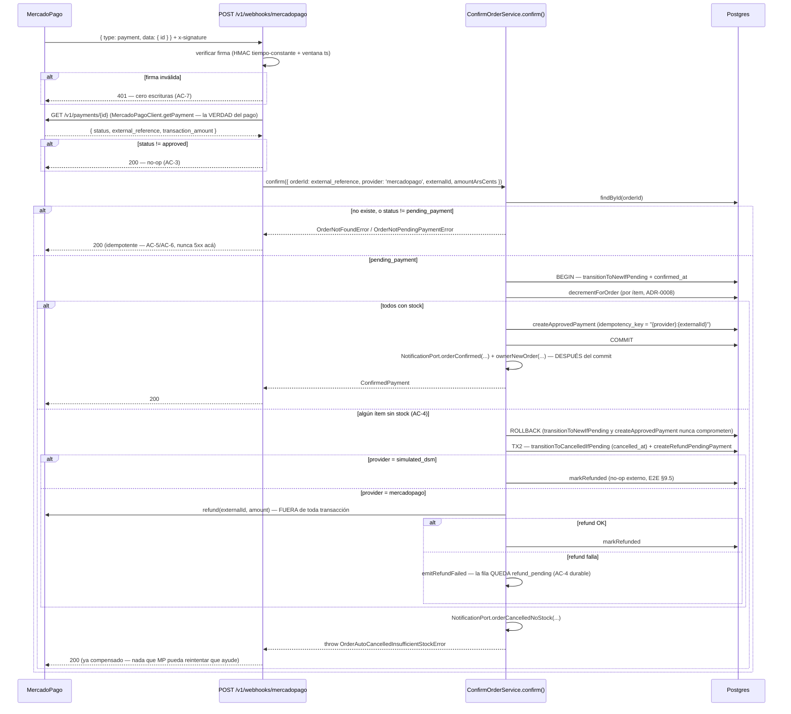

# US-010 Backend — Design

## Context

**Este documento reemplaza la versión del 2026-08-22** (respaldada en
`openspec/changes/_backups/2026-09-05-US-010-orden-webhook-stock-backend/`). La base sobre
la que planificaba ya no existe: asumía que `src/orders/` no existía todavía y que **US-009
construía un `MercadoPagoClient` y un `PaymentConfirmationPort` no-op** que este change sólo
tenía que completar. Ninguna de las dos cosas es cierta hoy.

**Lo que cambió, verificado leyendo el código real:**

- `src/orders/` **existe y está mergeado** (US-012, panel del dueño): `orders.module.ts`,
  `orders-admin.service.ts`, `order-state.ts` (FSM propia de **4 estados activos**:
  `new/preparing/ready/delivered`), `ports/notification.port.ts` +
  `LoggingNotificationAdapter`. Su propio docstring es explícito: *"`pending_payment → new`
  es responsabilidad de `payments/` (US-023); `* → cancelled` es de US-013. Ninguna
  transición hacia o desde esos dos estados existe acá."* Este change no toca esa FSM.
- `US-009` sigue `Blocked` (sin credenciales de MercadoPago) y **`MercadoPagoClient` no
  existe en el repo** — no hay nada que "extender".
- `US-023-pago-manual-offline-backend` **está mergeado a main** y construyó exactamente el
  seam que esta US necesita: `payments/payment-confirmation.port.ts` declara
  `PaymentConfirmationPort` con `ConfirmPaymentInput { orderId, provider: 'manual',
  confirmedBy }`, y su docstring dice **literalmente**: *"US-010 amplía este mismo contrato
  para el webhook de MercadoPago (`provider: 'mercadopago' | 'simulated_dsm'`, con
  `externalId` en vez de `confirmedBy`) — sin renombrar nada"*. `ConfirmOrderService`
  implementa ese puerto hoy para `provider: 'manual'`: transacción Prisma que hace
  `orders.transitionToNewIfPending` (guardada por `WHERE status='pending_payment'`) →
  `stock.decrementForOrder` (atómico condicional, ADR-0008, revierte todo si falta stock en
  cualquier línea) → `payments.createManualPayment`.
- La tabla `payments` (migración de US-023, `20260830143351_add_payments`) **ya tiene**
  `provider CHECK IN ('mercadopago','simulated_dsm','manual')`, `external_id` (nullable) e
  `idempotency_key` UNIQUE — anticipando esta US a propósito. `payments.status` hoy es
  `CHECK IN ('pending','approved','rejected','refunded')` — **no** incluye `refund_pending`
  todavía.
- `orders` (migración de US-008) ya tiene el `CHECK` con los **seis** estados de la FSM
  completa (`pending_payment,new,preparing,ready,delivered,cancelled`) — sólo faltan las
  columnas `confirmed_at`/`cancelled_at` para poder reconstruir cuándo ocurrió cada
  transición.
- **No existe ningún patrón de scheduler** en `apps/api` (ni `@nestjs/schedule`, ni
  `setInterval`). Lo que sí existe, dos veces (`import-runner.ts`, `enrichment.runner.ts`),
  es: trabajo disparado **por evento** (`kick()`/`schedule()` con `setImmediate`) +
  **endpoint admin** que lo dispara a pedido + barrido en `onApplicationBootstrap`. No hay
  ningún `setInterval` real en el repo pese a que ambos archivos se llaman "runner". Este
  change sigue ese patrón real, no el de la versión anterior (que proponía "runner cada 15
  min" sin ese precedente).
- ADR-0006 fija, con nombre literal, `POST /checkout/simulate` (provider `simulated_dsm`,
  feature flag apagado en producción) como el mecanismo del medio simulado — **no depende
  de que exista `MercadoPagoClient.createPreference`**. Es buildable y verificable hoy.

ADR-0008 y ADR-0006 no se reabren. Lo que este documento decide es cómo se baja eso a
código **con la base real de hoy**, no con la de hace dos meses.

## Goals

- Confirmar la orden y decrementar stock exactamente una vez por pago aprobado (AC-1, AC-5,
  AC-6), **reusando la transacción y los guards que US-023 ya construyó y probó** — no un
  camino paralelo.
- No creerle nada al payload del webhook (AC-7).
- Que el stock no pueda quedar negativo ni bajo concurrencia real (AC-8), con el mismo
  `stock.decrementForOrder` que ya usa el pago manual.
- Que un pago cobrado y no cumplible termine reembolsado, sin perder el reembolso ante un
  fallo transitorio (AC-4) — **sólo para los proveedores automáticos** (`mercadopago`,
  `simulated_dsm`); el pago manual no cambia su comportamiento.
- Recuperarse de un webhook que nunca llega (AC-10) y limpiar lo abandonado (AC-11), con el
  patrón de disparo real del repo (evento + endpoint admin), no uno nuevo.
- Que el medio simulado y el pago real compartan **un solo** camino de confirmación (AC-9),
  y que ese camino sea **ejercitable hoy**, sin credenciales de MercadoPago.
- Dejar explícito, en cada pieza, qué se puede construir y probar **hoy con mocks** y qué
  necesita el account real de MercadoPago para tráfico en producción.

## Non-goals

- Entregar emails de verdad (US-011), panel del dueño (US-012, ya construido), cancelación
  **a pedido del dueño** con reintegro de stock (US-013), métricas (US-016).
- Tocar la FSM de 4 estados de `src/orders/order-state.ts` — las dos transiciones que este
  change escribe (`pending_payment → new`, `pending_payment → cancelled`) son guardadas
  directamente en `checkout/orders.repository.ts`, igual que ya hace US-023.
- Construir `MercadoPagoClient.createPreference` ni la redirección a Checkout Pro — eso
  sigue siendo US-009 cuando existan credenciales. Este change construye **sólo**
  `getPayment`, `searchByExternalReference` y `refund`, que es lo que las AC de esta US
  necesitan.
- Un motor genérico de scheduling (`@nestjs/schedule`, BullMQ) — Redis sigue sin
  aprovisionar (ADR-0012/0014, cuarta instancia del mismo desvío).

## Approach

### D1 — Qué se reusa de US-023 tal cual, y qué se amplía

| Pieza (US-023, mergeada) | Este change |
|---|---|
| `PaymentConfirmationPort` / `ConfirmPaymentInput` | **Amplía** a unión discriminada: agrega `ConfirmWebhookPaymentInput { orderId, provider: 'mercadopago' \| 'simulated_dsm', externalId, amountArsCents }` junto al `ConfirmManualPaymentInput` existente (renombrado sólo en el tipo interno, el literal `provider: 'manual'` no cambia). |
| `ConfirmOrderService.confirm()` | **Amplía la misma clase y el mismo método** — no se crea un servicio hermano. Es lo que mantiene AC-9 estructural: hay un solo método, con una rama que sólo corre para `manual` (sin cambios de comportamiento) y otra que sólo corre para `mercadopago`/`simulated_dsm` (nueva). |
| `orders.transitionToNewIfPending` | Sin cambios de contrato; gana `confirmed_at: new Date()` en el `data` del `UPDATE` (columna nueva, aditiva). |
| `stock.decrementForOrder` | **Sin ningún cambio.** Se reusa exactamente. |
| `payments.createManualPayment` | Sin cambios. Se **agregan** `createApprovedPayment`/`createRefundPendingPayment`/`markRefunded` al lado, para los proveedores automáticos. |
| `PaymentsEventsService` | Se agregan eventos nuevos; los dos existentes (`payments.manual_confirmed`/`_rejected`) no cambian de nombre ni de semántica — **importante**: si `emitConfirmed()` se reusara tal cual para `mercadopago`/`simulated_dsm`, el evento emitido diría `payments.manual_confirmed` para un pago que no es manual. Se agrega `emitProviderConfirmed(orderId, provider)` en vez de forzar el existente. |

Nada de esto rompe `confirm-order.service.spec.ts` ni `e2e-payments-*.spec.ts` de US-023: la
rama `provider === 'manual'` queda exactamente como estaba, línea por línea. Es el criterio
de aceptación implícito de todo este change — si un test de US-023 necesita tocarse, algo se
diseñó mal.

### D2 — La transacción ampliada, con la rama de compensación



**Por qué el reembolso va fuera de la transacción**: es una llamada a un tercero con timeout
de segundos; mantener una transacción abierta esperándola bloquearía las filas de `products`
y `orders` involucradas.

**Por qué el webhook siempre responde 200 salvo firma inválida**: MercadoPago reintenta ante
cualquier respuesta que no sea 2xx. Un 500 por un bug nuestro desata una tormenta de
reintentos justo cuando el sistema está mal; un fallo que no pudo procesarse por una causa
transitoria queda para la reconciliación (AC-10), que es el mecanismo pensado para eso. Esto
incluye `OrderNotFoundError` (un `external_reference` huérfano no debería generar un loop de
reintentos de MP) — se loguea como anomalía, nunca se propaga como error HTTP.

**El endpoint de simulación NO comparte esta política de "siempre 200".** `POST
/v1/checkout/simulate-payment` es una superficie de test/demo, invocada directamente por el
comprador (o por un test E2E) — no por un proveedor con retry storm. Devuelve 409
(`dsm:payments/auto-cancelled-insufficient-stock`) cuando la compensación de AC-4 se
dispara, para que quien la llama sepa qué pasó.

### D3 — Idempotencia: el guard de la orden, no `SELECT … FOR UPDATE`

La versión anterior de este design proponía `SELECT … FOR UPDATE` sobre la fila del pago
como mecanismo de idempotencia bajo concurrencia. **US-023 ya resolvió esto distinto, y ya
está probado en producción de código real**: `transitionToNewIfPending` es un `UPDATE …
WHERE id=$id AND status='pending_payment'` — un compare-and-set, no un lock explícito.

Bajo dos webhooks concurrentes para el mismo pago:

1. Ambas transacciones intentan el mismo `UPDATE`. Postgres serializa las dos en el nivel de
   fila: la primera que llega toma el lock implícito de la fila, la segunda **espera**.
2. Cuando la primera comitea, la segunda continúa su `UPDATE` — pero ya no hay ninguna fila
   con `status='pending_payment'` para ese `id` (la primera la dejó en `new`). Afecta **cero
   filas**, devuelve `null`, y `confirm()` lanza `OrderNotPendingPaymentError` — que el
   webhook traduce a 200 idempotente.

No hace falta una tabla de idempotencia separada (`api-standards.md` §10.2 la describe para
cuando la clave la trae el cliente): acá la clave es la orden, que ya tiene fila propia.
`payments.idempotency_key` UNIQUE (`{provider}:{externalId}`) es la **segunda red**, defensa
en profundidad para el caso hipotético de que dos filas de `payments` se intenten crear para
el mismo pago externo — igual que el comentario de `PaymentsRepository.createManualPayment`
ya documenta para el caso manual.

**Se descarta reintroducir el `SELECT … FOR UPDATE`** de la versión anterior: agregaría una
segunda forma de lograr lo mismo que el guard de `orders` ya logra, con más superficie para
que las dos diverjan.

### D4 — Decremento atómico: sin cambios, se reusa tal cual

`stock.decrementForOrder` (US-023) ya implementa `UPDATE products SET stock = stock - q
WHERE id = ? AND stock >= q`, corta al primer ítem sin stock, y como corre dentro del `tx` de
`ConfirmOrderService`, un rollback deshace también los decrementos previos de la misma orden.
Este change no le agrega nada — es exactamente lo que AC-8 necesita, ya construido y ya
probado con Postgres real (`stock.repository.spec.ts`).

### D5 — Verificación de firma (AC-7) — pieza nueva, construible hoy sin cuenta real

MercadoPago firma un manifiesto `id:{data.id};request-id:{x-request-id};ts:{ts};` con el
secreto del webhook (`x-signature: ts=...,v1=...`). `src/payments/mercadopago/
webhook-signature.ts` (puro, sin HTTP ni DB):

1. Parsea el header `ts=…,v1=…`.
2. Recalcula el HMAC-SHA256 sobre el manifiesto con `MP_WEBHOOK_SECRET` y compara con `v1`
   en **tiempo constante** (`timingSafeEqual`, mismo patrón que `cart-csrf.guard.ts` — largo
   igual antes de comparar, nunca `===`).
3. Verifica que `ts` esté dentro de una ventana de tolerancia (`MP_WEBHOOK_TOLERANCE_SEC`,
   default 300s) — sin esto, un webhook legítimo capturado se podría reproducir para
   siempre.

Es **100% testeable hoy**: la función es pura, recibe el secreto por parámetro y no llama a
ningún servicio externo. El secreto real (`MP_WEBHOOK_SECRET` de producción) sólo hace falta
para tráfico en vivo — en tests y en CI se usa un secreto de prueba fijo.

**El webhook no lleva throttler**, a propósito: limitar por IP la superficie por la que entra
dinero significa descartar pagos legítimos cuando el proveedor reintenta en ráfaga. El costo
de rechazar es un HMAC, y nada no verificado toca la base.

### D6 — `MercadoPagoClient`: se construye AHORA, con alcance mínimo — y la dependencia se invierte

La versión anterior de este design asumía que US-009 construía `MercadoPagoClient` primero
(con `createPreference`) y que US-010 sólo le agregaba `getPayment`/`refund`. Esa cadena ya
no existe: **US-009 sigue bloqueada y el cliente no existe**. Este change lo construye, con
el alcance mínimo que sus propias AC necesitan:

```ts
export interface MercadoPagoPayment {
  id: string;
  status: 'pending' | 'approved' | 'rejected' | 'refunded' | 'cancelled';
  externalReference: string;
  amountArsCents: number;
}

export interface MercadoPagoClient {
  getPayment(paymentId: string): Promise<MercadoPagoPayment>;
  searchByExternalReference(orderId: string): Promise<MercadoPagoPayment | null>;
  refund(paymentId: string, amountArsCents?: number): Promise<{ refundId: string }>;
}
```

**Deliberadamente NO incluye `createPreference`** — eso es lo que el buyer necesita para ser
redirigido a Checkout Pro, y sigue siendo responsabilidad de US-009 cuando existan
credenciales. **La dirección de la dependencia entre las dos US se invierte respecto al plan
anterior**: en vez de "US-009 construye el cliente, US-010 lo extiende", ahora es "US-010
construye el cliente mínimo (lectura + reembolso), y US-009 lo extiende con
`createPreference` cuando se retome". Esto se documenta explícitamente porque es la
diferencia estructural más importante de este regenerate.

**Qué necesita credenciales reales y qué no** (la pregunta central de este regenerate):

| Pieza | Construible y testeable HOY (mocks) | Necesita cuenta MP real |
|---|---|---|
| `getPayment`/`searchByExternalReference`/`refund` — transporte, timeout, retry, mapeo de errores | ✅ (`fetch` mockeado, contrato de respuesta documentado por MP) | — |
| Verificación de firma (`webhook-signature.ts`) | ✅ (función pura, secreto de test) | — |
| `ConfirmOrderService` para `mercadopago`/`simulated_dsm`, con AC-1/3/4/5/6/7/8/9 | ✅ (integration tests con Postgres real + `MercadoPagoClient` mockeado en el DI) | — |
| El endpoint `POST /v1/checkout/simulate-payment` (AC-9 real, no sólo estructural) | ✅ — no llama a MercadoPago nunca | — |
| Reconciliación (AC-10) contra un pago real | ✅ con mock del cliente | Sólo el **smoke test en vivo** en staging necesita la cuenta real |
| Tráfico real de producción (`POST /v1/webhooks/mercadopago` recibiendo un webhook real) | — | ✅ — cuenta MP + `MP_ACCESS_TOKEN`/`MP_WEBHOOK_SECRET` reales + webhook URL configurada en el dashboard de MP |
| `POST /v1/payments` (crear preferencia, redirigir al comprador) | — (sigue siendo US-009) | ✅ (US-009) |

Conclusión: **todo el código, los tests unitarios, los tests de integración con Postgres
real y los tests E2E del medio simulado se construyen y se verifican en este change, hoy**.
Lo único detrás de un gate real es el tráfico **en vivo** contra MercadoPago — eso se
documenta en "Deployment considerations" como responsabilidad de `/plan-deployment` cuando
exista la cuenta.

**Resiliencia** (`backend-node-standards.md` §8): timeout por request
(`MP_HTTP_TIMEOUT_MS`, default 4000ms) vía `AbortSignal.timeout`, reintentos con backoff +
jitter sobre 429/5xx/timeout (mismo patrón puro que `enrichment/ai/backoff.ts`, copiado a
`payments/mercadopago/backoff.ts` con su propio `MercadoPagoTransientError` — **duplicación
chica y deliberada** para no acoplar `payments` a un tipo de error de `enrichment`, ver
Trade-offs), y un circuit-breaker in-process simple (cooldown tras N fallos consecutivos,
mismo estilo que `EnrichmentRunner`, sin librería nueva).

### D7 — El medio simulado: `POST /v1/checkout/simulate-payment`, autorizado por `order_token`

ADR-0006 lo nombra literal: *"el medio simulado (`POST /checkout/simulate`, provider
`simulated_dsm`) es gateado por un feature flag que debe estar apagado en producción"*. No
depende de MercadoPago en absoluto — su única razón de ser es SALTAR MercadoPago.

**Autorización**: igual que el patrón que `checkout/README.md` ya documenta para
`POST /v1/payments` (US-009, todavía no construido) — el comprador presenta el
`order_token` (hex de 64, devuelto una sola vez por `POST /v1/checkout`) en el **cuerpo**, no
en una cookie. Se hashea (`hashToken`, reusado de `auth/tokens/opaque-token.ts`) y se busca
con `OrdersRepository.findByTokenHash` — método que ya existe en `checkout/orders.
repository.ts`, exportado desde `CheckoutModule` desde que US-023 lo dejó listo, **y hasta
ahora sin ningún consumidor real**. Este change es su primer consumidor.

```
POST /v1/checkout/simulate-payment
{ "order_token": "<64 hex>" }
→ ConfirmOrderService.confirm({
    orderId: orden.id,
    provider: 'simulated_dsm',
    externalId: `sim_${randomUUID()}`,
    amountArsCents: orden.total_ars_cents,
  })
```

**El flag es un gate de arranque, no sólo un checklist de release**: `env.validation.ts`
agrega `PAYMENTS_SIMULATED_ENABLED` (default `'false'`) y un `superRefine` que **hace fallar
el arranque** si `NODE_ENV=production` y `PAYMENTS_SIMULATED_ENABLED='true'` — mismo patrón
que ya usa el archivo para `RESEND_API_KEY`/`GEMINI_API_KEY`. ADR-0006 pide verificar esto
"como release gate"; acá se aplica en código, no sólo en un checklist humano.

Cuando el flag está apagado, el endpoint responde **404** (no 403): no hay razón para
confirmarle a quien prueba en producción que la ruta existe.

**Rate limit propio** (`PAYMENTS_SIMULATE_RATE_LIMIT_MAX`/`_TTL_MS`, mismo criterio que
`CheckoutThrottlerGuard`): superficie pública, aunque de bajo riesgo real (apagada en
producción por diseño), no queda sin ningún límite.

### D8 — Reconciliación (AC-10) y limpieza de abandonadas (AC-11): sin scheduler, con el patrón real del repo

Verificado con `grep`: no hay `setInterval` en ningún lado de `apps/api/src`, pese a que
`import-runner.ts` y `enrichment.runner.ts` se llamen "runner". El patrón real es: trabajo
disparado por evento (`kick()`, `setImmediate`) **más** endpoint admin a pedido, y barrido en
`onApplicationBootstrap` para lo que puede esperar al próximo arranque. Este change sigue
ese patrón, no el de "runner cada 15 min" de la versión anterior (que no tenía precedente en
el código real):

| Servicio | Qué hace | Cómo se dispara |
|---|---|---|
| `ReconcilePaymentsService.reconcile()` | Toma hasta `RECONCILE_BATCH_SIZE` órdenes `pending_payment` con más de `RECONCILE_MIN_AGE_MS` de antigüedad, llama `MercadoPagoClient.searchByExternalReference(orderId)` y, si encuentra un pago `approved`, lo procesa por **el mismo** `ConfirmOrderService.confirm()` — es lo que lo vuelve seguro: idempotente por construcción, reconciliar un pago que el webhook ya procesó es un no-op | `POST /v1/admin/payments/reconcile` (AdminGuard) — el runbook del E2E §18.5 pide textualmente "job/endpoint manual idempotente" |
| `CleanupAbandonedOrdersService.cleanupAbandoned()` | `pending_payment` con `created_at` más viejo que `ORDER_ABANDON_HOURS` (default 48h) → `cancelled` + `cancelled_at`, en un solo `updateMany` | `POST /v1/admin/orders/cleanup-abandoned` (AdminGuard) |
| `RefundRetryService.retryPending()` | `payments` en `refund_pending` con `provider='mercadopago'` (simulado nunca se atasca — no hay llamada externa) → reintenta `MercadoPagoClient.refund` hasta `REFUND_RETRY_BATCH_SIZE` | `POST /v1/admin/payments/retry-refunds` (AdminGuard) — AC-4 durable: **nunca se cierra un `refund_pending` como fallido definitivo**, es plata de un cliente |

**Disparo periódico real** (correr estos tres endpoints cada N minutos) es una decisión de
**infraestructura** (Railway Cron Job / GitHub Actions scheduled workflow pegándole al
endpoint admin), no de código de aplicación — se documenta como recomendación en "Deployment
considerations" para `deployment-planner`, no se construye un scheduler en `apps/api` para
no introducir una dependencia que el resto del repo evitó tres veces antes (ADR-0012/0014).

### D9 — Notificaciones (AC-2): se reusa el `NotificationPort` de `orders/`, no se crea uno paralelo

`src/orders/ports/notification.port.ts` ya existe, con `LoggingNotificationAdapter` (US-012)
y el precedente explícito de que **US-011 lo reemplaza sin tocar el resto del código**. Se
evaluaron dos caminos:

1. Crear un `PaymentNotificationPort` propio en `payments/` — evita una dependencia nueva
   entre módulos, pero deja a US-011 con **dos** puertos que implementar para el mismo
   concepto de negocio ("avisar algo sobre una orden"), y duplica el patrón puerto+adaptador
   de log sin necesidad real.
2. **Ampliar el `NotificationPort` existente** con `orderConfirmed`, `orderCancelledNoStock`
   y `ownerNewOrder`, e importar `OrdersModule` desde `PaymentsModule`.

Se elige **(2)**. La dirección `payments → orders` es coherente con lo ya establecido:
`orders` no importa `payments` (verificado, `orders.module.ts` importa sólo
`Prisma/Auth/Checkout`), así que agregar esta dependencia no genera un ciclo. El costo es
una modificación aditiva a `OrdersModule` (agregar `NOTIFICATION_PORT` a su array
`exports`, hoy vacío) y a la interfaz del puerto (3 métodos nuevos, ninguno rompe
`orderReadyForPickup` ni al adapter existente, que gana 3 implementaciones más siguiendo su
propio criterio: **nunca loguear `buyerName`/`buyerEmail`**, sólo IDs).

Las notificaciones se invocan **después del commit**, nunca dentro de la transacción — un
fallo del `NotificationPort` no puede revertir una venta ya cobrada. Se verifican **sobre el
puerto** (AC-2 se prueba como "se invoca una vez con el payload correcto"), no sobre un envío
real — la entrega real es US-011.

### D10 — Capas y dirección de dependencias

```
src/checkout/orders.repository.ts    ← gana 2 métodos: transitionToCancelledIfPending,
                                         cancelAbandonedPending. Sin cambios de contrato en
                                         los existentes (transitionToNewIfPending gana
                                         confirmed_at en su `data`, no en su firma).
src/orders/                          ← NO importa payments. Gana NOTIFICATION_PORT en
                                         `exports` y 3 métodos en NotificationPort +
                                         LoggingNotificationAdapter.
src/stock/stock.repository.ts        ← SIN CAMBIOS. Se reusa tal cual.
src/payments/                        ← (de US-023, se amplía)
├─ payment-confirmation.port.ts        ← unión discriminada
├─ confirm-order.service.ts            ← el mismo método, ramas nuevas
├─ payments.repository.ts              ← + createApprovedPayment/createRefundPendingPayment/markRefunded
├─ payment-confirmation-errors.ts      ← + OrderAutoCancelledInsufficientStockError, SimulatedPaymentDisabledError
├─ payments.module.ts                  ← importa OrdersModule (nuevo), registra controllers/services nuevos
├─ mercadopago/
│  ├─ mercadopago-client.ts            ← NUEVO — getPayment/searchByExternalReference/refund
│  ├─ backoff.ts                       ← NUEVO — puro, duplicación chica y deliberada de enrichment/ai/backoff.ts
│  └─ webhook-signature.ts             ← NUEVO — puro
├─ webhooks/mercadopago-webhook.controller.ts   ← NUEVO
├─ simulate-payment.controller.ts               ← NUEVO
├─ reconcile-payments.service.ts                ← NUEVO
├─ cleanup-abandoned-orders.service.ts           ← NUEVO
├─ refund-retry.service.ts                       ← NUEVO
└─ admin-jobs.controller.ts                      ← NUEVO (los 3 endpoints admin)
```

`payments → orders` (nuevo, por `NOTIFICATION_PORT`), `payments → checkout`,
`payments → stock` (ambos ya existían) — todo en un solo sentido, **sin `forwardRef`**. Si
alguno apareciera, la dirección se eligió mal.

### D11 — Threat model (STRIDE lite, per skill `threat-modeling-lite` — superficie "webhook público" + "endpoint simulado" + "admin")

| Superficie | Amenaza | Vector específico | Control |
|---|---|---|---|
| `POST /v1/webhooks/mercadopago` | Spoofing/Tampering — falso "approved" | Body falsificado con `status: approved` | Firma HMAC en tiempo constante + ventana de `ts` + **re-consulta a MP** (el body sólo aporta el `id`). Probado: body válido + firma inválida → 401, cero cambios en base |
| idem | Replay | Reproducir un webhook legítimo capturado | Ventana de 5 min sobre `ts`; y aunque pasara, la idempotencia (D3) lo vuelve no-op |
| idem | DoS | Flood al endpoint | Sin throttler **a propósito** (D5) — el costo de rechazar es un HMAC, nada no verificado toca la base |
| idem | Information disclosure | Logs con PII del comprador | `PaymentsEventsService` sólo loguea `order_id`/`payment_id`/`provider`, nunca `buyerName`/`buyerEmail`/`amountArsCents` en campos indexables (`observability-standards.md` §9) |
| `POST /v1/checkout/simulate-payment` | Tampering — uso en producción | Feature flag `PAYMENTS_SIMULATED_ENABLED=true` en prod | `superRefine` de `env.validation.ts` **hace fallar el arranque** — no es sólo un checklist (D7) |
| idem | Spoofing — adivinar `order_token` ajeno | Fuerza bruta sobre 256 bits de espacio | Espacio de token igual al de `POST /v1/payments` (US-009, ya especificado); rate limit propio |
| `POST /v1/admin/payments/reconcile` \| `/cleanup-abandoned` \| `/retry-refunds` | Elevation of privilege | Disparar los jobs sin ser admin | `AdminGuard` existente + `Cache-Control: no-store` del middleware de `/v1/admin/*`. Los tres son idempotentes: dispararlos de más no rompe nada |
| `payments.refund_pending` | Repudiation — "no me devolvieron" | Un reembolso se pierde en memoria | Estado **persistido** (D6/D8) + `RefundRetryService` + evento `payments.refund_failed`; nunca se marca fallido definitivo (AC-4 durable) |

### D12 — NFRs `[propuesto — confirma Ops]`

- **Webhook**: p95 < 800ms — la re-consulta a MP domina (timeout 4s, típicamente < 300ms
  real); la transacción propia es corta (sin llamadas externas adentro).
- **Simulate-payment**: p95 < 200ms — no hay llamada externa en absoluto.
- **Reconciliación**: hasta `RECONCILE_BATCH_SIZE` (50) órdenes por corrida; tiempo total
  acotado por `MP_HTTP_TIMEOUT_MS × batch`, aceptable para un endpoint admin de bajo tráfico.
- **Concurrencia probada**: N confirmaciones simultáneas sobre la última unidad de stock, con
  Postgres real (Testcontainers) — no con mocks.

## Trade-offs

**Duplicar `backoff.ts` en vez de generalizar el de `enrichment/ai/`.** El archivo de
`enrichment` está acoplado a `AiTransientError`. Generalizarlo a un tipo compartido en
`common/` tocaría un módulo que esta US no tiene por qué modificar (riesgo de romper
`enrichment.runner.spec.ts` para un cambio que no le aporta nada). Se acepta ~35 líneas
duplicadas, con su propio `MercadoPagoTransientError`. Es una extracción legítima para un
follow-up (`common/backoff.ts` compartido), no bloqueante acá.

**Reusar `NotificationPort` de `orders/` en vez de crear uno propio.** Introduce una
dependencia nueva `payments → orders` que no existía. Se acepta porque es acíclica y porque
evita que US-011 tenga que implementar dos puertos para el mismo concepto de negocio.

**Sin `SELECT … FOR UPDATE`.** La versión anterior lo proponía como mecanismo central de
idempotencia. Se descarta porque US-023 ya resolvió el mismo problema con un `UPDATE`
condicional (D3), que es más simple, ya está probado, y agregar el lock explícito sería una
segunda forma de lograr lo mismo sin necesidad.

**Sin `setInterval`/`@nestjs/schedule`.** Ídem ADR-0012/0014: cuarta vez que el proyecto
evita agregar un scheduler mientras Redis no esté aprovisionado. El costo es que reconciliar
y limpiar dependen de un disparo externo (endpoint admin + cron de infraestructura) — el
mismo costo que ya paga el resto del repo, no uno nuevo.

**`POST /v1/checkout/simulate-payment` se construye en este change, no en US-009.** Es un
cambio de alcance respecto a lo que la US menciona en "out of scope" ("Iniciar el pago /
crear la preferencia — US-009"). El endpoint de simulación no inicia nada con MercadoPago —
lo salta por completo — así que no es la misma responsabilidad; y sin él, AC-9 sólo se podría
probar de forma estructural (mismo código, nunca ejercitado por HTTP), lo cual es
insuficiente dado que ADR-0006 lo declara nombrándolo literal (`POST /checkout/simulate`).

## Deployment considerations

**Ya no hace falta `/plan-deployment` conjunto con US-008/US-009.** La cadena "US-008 → US-009
→ US-010" de la versión anterior se rompe: `orders` y `payments` ya existen (US-008, US-023),
y este change no depende de que US-009 exista. Se recomienda `/plan-deployment` **propio**
para este change quando esté listo para producción.

1. **Secretos nuevos, requeridos sólo en producción** (mismo patrón fail-fast que
   `RESEND_API_KEY`/`GEMINI_API_KEY`): `MP_ACCESS_TOKEN`, `MP_WEBHOOK_SECRET`. En
   development/test, opcionales — el arranque no falla, pero `MercadoPagoClient` real no
   podría llamar a nada (los tests usan un cliente mockeado en el DI, no el HTTP real).
2. **Gate real explícito para producción** (no bloquea este plan, bloquea el *tráfico en
   vivo*): cuenta de MercadoPago + `MP_ACCESS_TOKEN` real + webhook configurado en el
   dashboard de MP apuntando a `https://{host}/v1/webhooks/mercadopago` + `MP_WEBHOOK_SECRET`
   coincidiendo con esa configuración. Sin esto, el código completo (webhook, firma,
   reconciliación, medio simulado) queda construido, testeado y verificado en CI, pero **no
   puede recibir pagos reales**.
3. **Migración aditiva**, sin orden de despliegue obligatorio con ningún otro change: `orders`
   y `payments` ya existen.
4. **Variables nuevas** (todas con default seguro salvo los dos secretos):
   `MP_HTTP_TIMEOUT_MS` (4000), `MP_WEBHOOK_TOLERANCE_SEC` (300), `MP_MAX_RETRIES` (2),
   `PAYMENTS_SIMULATED_ENABLED` (`false`), `PAYMENTS_SIMULATE_RATE_LIMIT_MAX` (10),
   `PAYMENTS_SIMULATE_RATE_LIMIT_TTL_MS` (600000), `ORDER_ABANDON_HOURS` (48),
   `RECONCILE_MIN_AGE_MS` (300000), `RECONCILE_BATCH_SIZE` (50),
   `REFUND_RETRY_BATCH_SIZE` (50).
5. **Recomendación de infraestructura** (no bloquea este change): un cron externo (Railway
   Cron Job o GitHub Actions scheduled workflow) pegándole a los 3 endpoints admin cada N
   minutos, ya que no hay scheduler in-process (D8).
6. **Gate de release** (ADR-0006, ahora también enforced en código por D7): verificar que
   `PAYMENTS_SIMULATED_ENABLED=false` en producción — el arranque ya falla si no lo es,
   así que este gate es defensa en profundidad, no la única línea.
7. **Smoke test real** (cuando exista la cuenta de MP): un pago de prueba en sandbox confirma
   la orden y decrementa stock de punta a punta. Hasta entonces, el smoke test de staging usa
   el medio simulado (`POST /v1/checkout/simulate-payment`), que sí es 100% real hoy.

**Rollback**: migración aditiva, se puede dejar. Revertir con webhooks de MP ya configurados
apuntando a una versión sin este endpoint dejaría pagos aprobados sin confirmar — la
reconciliación (una vez reestablecido el deploy) los recupera; es exactamente el escenario
para el que existe.

## Spec delta (para `/archive-change`)

El webhook, el endpoint simulado y los tres endpoints admin se suman a la capacidad `pagos`
(nueva raíz `openspec/specs/pagos/`, primera vez que se materializa — ni US-009 ni US-023
llegaron a archivarse todavía). Las transiciones `pending_payment → new` / `→ cancelled`
amplían `openspec/specs/ordenes/requirements.md` (si ya existe por US-012) o lo crean.

## Open questions

| Id | Pregunta | Default implementado | Si se decide distinto |
|---|---|---|---|
| OQ-BE-1 | Plazo de abandono (AC-11) | **48h** — igual que el plan anterior, sigue siendo razonable: cubre a quien vuelve al otro día | Interactúa con la vigencia de 24h de la preferencia de MP (cuando US-009 exista); con 48h el comprador reintenta con un `order_token` nuevo si su preferencia venció |
| OQ-BE-2 | ¿Retry de reembolsos con tope de intentos, o para siempre? | **Para siempre** (`refund_pending` no se cierra solo) — es plata de un cliente | Un tope automático oculta una deuda real; el runbook humano decide cuándo escalar |
| OQ-BE-3 | ¿El endpoint `simulate-payment` vive bajo `v1/checkout` o `v1/payments`? | **`v1/checkout`** — coherente con el naming literal de ADR-0006 (`POST /checkout/simulate`) y con que autoriza igual que `POST /v1/checkout` (token de la orden, no JWT) | Si US-009 define su propio prefijo `v1/payments` antes de que este change se ejecute, unificar ahí |
| OQ-BE-4 | Ventana de tolerancia de `ts` de la firma | **5 minutos** | Más angosta rechaza webhooks legítimos con reloj desfasado; más ancha agranda la ventana de replay |
| OQ-BE-5 | ¿Reconciliar también pagos `rejected`/`cancelled` para limpiar la orden antes? | **No en este change** — `cleanupAbandoned` (AC-11) ya cubre el caso por tiempo, sin necesitar consultar a MP | Podría cerrar el ciclo antes en vez de esperar las 48h, a costa de una llamada a MP adicional por reconciliación |

Ninguna bloquea el arranque de este change.

## References

- User story: [`docs/user-stories/US-010-orden-webhook-stock.md`](../../../docs/user-stories/US-010-orden-webhook-stock.md)
- PRD: [`docs/product/prd.md`](../../../docs/product/prd.md) §2.1 capacidad 6
- E2E: [`docs/product/design-e2e.md`](../../../docs/product/design-e2e.md) §8 (DER), **§9.2**
  (secuencia + compensación), §9.5 (reintegro — US-013, no este change), **§12** (FSM),
  **§14** (STRIDE), §17, §18, **§18.5** (runbook), §22
- **ADR-0008** — decremento al aprobar el pago, gobierna todo el change
- **ADR-0006** — webhook verificado + medio simulado, con el nombre literal del endpoint
  simulado que este change implementa
- ADR-0012 / ADR-0014 — patrón sin scheduler mientras Redis no exista (D8)
- Change del que se **reusa** código real (no "del que depende"):
  [`US-023-pago-manual-offline-backend`](../US-023-pago-manual-offline-backend/design.md) —
  `PaymentConfirmationPort`, `ConfirmOrderService`, `stock.decrementForOrder`,
  `payments.createManualPayment`, `orders.transitionToNewIfPending`
- Change del que se reusa código real:
  [`US-012-panel-ordenes-dueno-backend`](../US-012-panel-ordenes-dueno-backend/design.md) —
  `NotificationPort` + `LoggingNotificationAdapter`
- Change del que se reusa la orden y el `order_token`:
  [`US-008-checkout-guest-backend`](../archive/US-008-checkout-guest-backend/design.md) (archivado)
- Changes relacionados (ya no bloqueantes): US-009 (retomará `MercadoPagoClient` con
  `createPreference`), US-011 (implementa `NotificationPort` de verdad), US-013 (reintegro de
  stock en cancelación a pedido), US-016 (consume `confirmed_at`)
- Versión anterior de este plan (insumo, no verdad):
  [`_backups/2026-09-05-US-010-orden-webhook-stock-backend/`](../_backups/2026-09-05-US-010-orden-webhook-stock-backend/)
- Contratos draft: [`contracts/openapi/`](contracts/openapi/)
- Standards: `backend-node-standards.md` §2–§9 · `api-standards.md` §3, §8, §10 ·
  `security-standards.md` §2, §5, §6, §7 · `observability-standards.md` §9 ·
  `testing-standards.md` / `qa-backend-standards.md` §14
