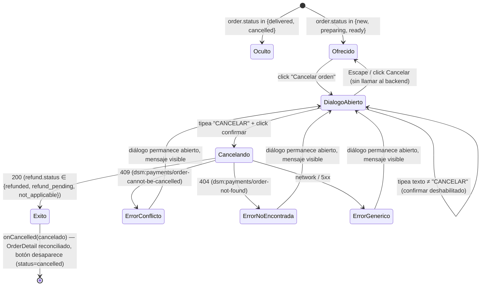

# US-013 Frontend-web — Design

## Context

Leído antes de diseñar (per instrucción del orquestador):

- `openspec/changes/US-013-cancelacion-reembolso-backend/proposal.md` +
  `design.md` — contrato exacto: `POST /v1/admin/orders/{id}/cancel`, sin
  body, 200 devuelve `CancelOrderResponse` (self-contained, D6 — mismo shape
  que `AdminOrderDetail` + `refund: {status, provider}`), 401/403 (`AdminGuard`),
  404 (`dsm:payments/order-not-found` — inexistente o `pending_payment`), 409
  (`dsm:payments/order-cannot-be-cancelled` — `delivered` o carrera perdida).
  Idempotente (AC-8, estructural del lado del backend): repetir la llamada
  sobre una orden ya `cancelled` responde 200 con el mismo shape.
- `apps/web/src/features/orders/` completo (US-012, archivado):
  `ordersService.ts` (repositorio, patrón `parseContract` + operaciones
  generadas), `OrderDetail.tsx` (pantalla de detalle, ya monta
  `OrderStatusActions` + `OrderAnonymizeAction`), `OrderStatusActions.tsx`
  (UI optimista + reconciliación con la respuesta del backend, sin segundo
  `GET`), `OrderAnonymizeAction.tsx` (confirmación de dos pasos +
  refetch-on-success — patrón DISTINTO al de `OrderStatusActions` porque su
  endpoint devuelve un shape parcial), `OrderStatusBadge.tsx`,
  `OrderStatusHistory.tsx` (ya renderiza `status_history` sin cambios
  necesarios), `orderStatus.ts` (FSM proyectada, 4 estados activos).
- `apps/web/src/components/ui/ConfirmDialog.tsx` — diálogo de confirmación
  destructiva de dos pasos, genérico (title/description/confirmWord/
  confirmLabel/onConfirm/onCancel/busy). Ya tiene 2 consumidores:
  `apps/web/src/features/products/ProductActions.tsx` (`archive`,
  `confirmWord="ARCHIVAR"`) y `OrderAnonymizeAction.tsx`
  (`confirmWord="ANONIMIZAR"`, más el prop `busy` que deshabilita el confirm
  mientras la mutación está en curso — F51, idempotencia visual).
- `apps/web/src/api/generated/` — cliente ya regenerado por el orquestador
  antes de este plan: `endpoints.ts` tiene `cancelOrder(id, options?)`
  (`POST`, sin body, mismo shape que `anonymizeOrder(id)`);
  `model/cancelOrderResponse*.ts` declara `CancelOrderResponse` (self-contained,
  no `$ref` a `AdminOrderDetail`); `zod.ts` declara el schema
  `CancelOrderResponse` (mismo nombre que el tipo del model — colisión de
  nombres a resolver con un alias de import, ver §Approach).
- `apps/web/app/(admin)/admin/ordenes/[id]/page.tsx` — ya monta
  `<OrderDetail id={id} />` sin props adicionales; este change no toca la
  página.
- `apps/web/app/(admin)/layout.tsx` — `AdminGuard` ya gatea todo el route
  group `(admin)`; AC-9 (sólo admin) queda cubierto sin trabajo nuevo, tanto
  en la superficie FE (redirect a `/admin/acceso` sin sesión) como en el
  backend (`AdminGuard` de NestJS, ya construido).
- `docs/product/design-system.md` §7.5 — cita literalmente "confirmación de
  'cancelar orden' (destructive, dos pasos)" como uno de los dos usos
  canónicos del Modal/Dialog del sistema. No hay Figma (`figma-frames: []`
  en la US) — el design-system es la fuente de verdad visual, por
  `fe-design-without-figma`.

## Goals

- Ofrecer la acción "Cancelar orden" desde el detalle de una orden
  `new`/`preparing`/`ready`, gateada detrás de una confirmación explícita de
  dos pasos (AC-6), sin inventar un componente de confirmación nuevo.
- Reconciliar el estado local de `OrderDetail` con la respuesta completa que
  el backend ya devuelve (self-contained), mostrando un resultado de
  reembolso distinto según `refund.status`.
- Distinguir el único error que el backend señaló como necesitando un
  mensaje propio (409 — orden ya no cancelable) del resto (genérico).
- Mantener el mismo nivel de pirámide de pruebas que el resto del panel de
  órdenes (Vitest + RTL + MSW + axe-core, sin Playwright E2E nuevo).

## Non-goals

- Diseñar un componente de confirmación nuevo — `ConfirmDialog` se reusa sin
  modificar.
- Cambiar `OrderStatusActions`/`orderStatus.ts` (FSM de fulfillment,
  4 estados activos) — `cancelled` sigue siendo una transición que esa FSM
  nunca ofrece (US-013 vive fuera de su alcance, igual que documentó el
  backend en `order-state.ts`).
- Ofrecer "Cancelar orden" desde `OrdersList` (el listado) — sólo desde el
  detalle, mismo criterio que `OrderAnonymizeAction`.
- Cobertura Playwright E2E — ver `proposal.md` "Out of scope".
- Tocar el README de `apps/web` — ver `proposal.md` "Out of scope".

## Approach

### D1 — Colisión de nombres `CancelOrderResponse` (Zod vs tipo del model)

`orval` genera un tipo `CancelOrderResponse` en `model/cancelOrderResponse.ts`
Y un schema Zod con el MISMO nombre en `zod.ts` — a diferencia de
`AnonymizeOrderResponse` (donde el tipo de dominio expuesto se llama distinto,
`OrderAnonymizationResult`), acá ambos se llaman igual porque el endpoint no
tiene un tipo de dominio propio con otro nombre. Se resuelve con un alias de
import, sin tocar ningún archivo generado:

```ts
import { cancelOrder } from '@/api/generated/endpoints';
import { CancelOrderResponse as CancelOrderResponseSchema } from '@/api/generated/zod';
import type { CancelOrderResponse } from '@/api/generated/model';

async cancel(id: string): Promise<CancelOrderResponse> {
  const res = await cancelOrder(id);
  return parseContract(CancelOrderResponseSchema, res.data);
}
```

`res.data` es siempre el shape de éxito en tiempo de ejecución: `customFetch`
(`lib/http/client.ts`) ya lanza `AppErrorException` en cualquier respuesta
no-2xx (interceptor centralizado) — el tipo unión `cancelOrderResponse`
generado (success | error) nunca llega acá como error real, mismo criterio
que el resto de `ordersService.ts` (`list`/`get`/`updateStatus`/`anonymize`).

### D2 — `onCancelled` reconcilia directo, SIN un segundo `GET` (a diferencia de `OrderAnonymizeAction`)

Decisión explícita de shape de retorno (mismo eje que documentó
`OrderAnonymizeAction.tsx` para el caso contrario): `CancelOrderResponse` es
**self-contained** (D6 del backend) — trae TODOS los campos de
`AdminOrderDetail` (`items`, `status_history` con la fila nueva,
`anonymized_at`/`anonymization_reason`, etc.) más `refund`. Es estructuralmente
asignable a `AdminOrderDetail` (el alias `OrderDetail` que expone
`ordersService.ts`): un valor con propiedades de más es asignable a un tipo
que las omite (TypeScript sólo aplica excess-property-check a *literales* de
objeto, no a valores) — no hace falta mapear campo por campo ni castear.

```ts
// OrderCancelAction.tsx
const cancelado = await ordersService.cancel(order.id);
onCancelled(cancelado);   // cancelado: CancelOrderResponse → asignable a OrderDetail
```

Esto sigue el patrón de `OrderStatusActions.onConfirmed` (el `PATCH` de
cambio de estado también devuelve el `AdminOrderDetail` completo, sin
segundo `GET`) — **no** el de `OrderAnonymizeAction` (cuyo `POST /anonymize`
devuelve un shape parcial, `OrderAnonymizationResult`, y por eso SÍ necesita
refetch). La razón de la diferencia está en el contrato de cada endpoint, no
en una preferencia de este change.

### D3 — Gating de visibilidad por estado (superficie, no autoridad)

```ts
// OrderCancelAction.tsx
if (order.status === 'delivered' || order.status === 'cancelled') return null;
```

Mismo criterio que `OrderStatusActions` (`NEXT_STATUS[order.status] ?? null`):
la superficie FE decide qué *ofrecer*, nunca qué *permitir* — el backend
sigue siendo la autoridad real vía 409 (`dsm:payments/order-cannot-be-cancelled`)
aunque este `if` tuviera un bug. `OrderStatus` (el alias expuesto por
`ordersService.ts`) tiene 5 valores (`new`/`preparing`/`ready`/`delivered`/
`cancelled`); no hace falta un objeto de mapeo como `NEXT_STATUS` porque la
decisión es binaria (ofrecer / no ofrecer), no "cuál es el próximo estado".

### D4 — Mensaje de resultado según `refund.status`

```ts
const REFUND_MESSAGE: Record<CancelOrderResponseRefundStatus, string> = {
  refunded: 'Se canceló la orden y se reintegró el pago.',
  refund_pending:
    'Se canceló la orden. El reembolso quedó en curso — el sistema lo reintenta automáticamente.',
  not_applicable: 'Se canceló la orden.',
};
```

`refund_pending` es un resultado **esperado**, no un error (el backend lo
deja así cuando la llamada real a MercadoPago falla transitoriamente y
`POST /admin/payments/retry-refunds` — job ya existente, sin cambios — lo
recoge). El copy lo comunica como progreso, no como fallo — mismo criterio de
tono que usa el resto del panel para estados transitorios esperados (p.ej. el
mensaje de `OrderStatusActions` para `ready`: "Se avisó al cliente que su
pedido está listo").

### D5 — Mapeo de errores: sólo 409 necesita mensaje propio

```ts
setError(
  isAppError(err, 'conflict')
    ? 'La orden ya no puede cancelarse (por ejemplo, si ya fue entregada).'
    : isAppError(err, 'notFound')
      ? 'La orden ya no existe.'
      : 'No se pudo cancelar. Reintentá.',
);
```

El backend declara un solo `problemType` para el 409
(`dsm:payments/order-cannot-be-cancelled`, cubre tanto "ya entregada" como
"carrera perdida" — ver `design.md` D3 del backend) — no hace falta
desambiguar por `problemType` como sí hace `cartService` con
`dsm:cart/insufficient-stock` vs `dsm:cart/too-many-items` (dos causas con
UX distinta). Acá las dos causas del 409 tienen la MISMA reacción correcta
("no se puede, la orden ya cambió") — un solo mensaje alcanza. 404 reusa el
mismo mensaje que `OrderAnonymizeAction` ya usa para su propio 404 ("La orden
ya no existe.") — consistencia de copy entre las dos acciones destructivas
del mismo detalle.

401/403 no se manejan en el componente: los captura el `AdminGuard` de FE
(redirect a `/admin/acceso` antes de que la pantalla se monte) y, si el token
expira a mitad de sesión, el interceptor HTTP centralizado — mismo criterio
que `OrderStatusActions`/`OrderAnonymizeAction`, ninguno de los dos
distingue esos dos casos tampoco.

### D6 — Copy del diálogo (voice/tone, design-system §15)

```tsx
<ConfirmDialog
  open={confirmOpen}
  title="Cancelar orden"
  description="Se reintegra el stock de cada ítem, se gestiona el reembolso del pago y el comprador recibe un aviso por email. Esta acción no se puede deshacer."
  confirmWord="CANCELAR"
  confirmLabel="Cancelar orden"
  onConfirm={() => void confirm()}
  onCancel={() => setConfirmOpen(false)}
  busy={busy}
/>
```

`confirmWord="CANCELAR"` sigue el mismo patrón que `"ARCHIVAR"`/`"ANONIMIZAR"`
(verbo en mayúsculas, español, sin puntuación). La descripción enumera las
3 consecuencias observables (stock, reembolso, aviso) ANTES del disclaimer de
irreversibilidad — mismo orden que usa `OrderAnonymizeAction`
("Se van a reemplazar... Esta acción no se puede deshacer.").

### D7 — Componente completo

```tsx
'use client';

import { useState } from 'react';
import { Button } from '@/components/ui/Button';
import { ConfirmDialog } from '@/components/ui/ConfirmDialog';
import { isAppError } from '@/lib/http/errors';
import { track } from '@/lib/observability/events';
import { ordersService, type OrderDetail, type OrderStatus } from './ordersService';

const REFUND_MESSAGE = { /* D4 */ };

export function OrderCancelAction({
  order,
  onCancelled,
}: {
  order: { id: string; status: OrderStatus };
  onCancelled: (updated: OrderDetail) => void;
}) {
  const [confirmOpen, setConfirmOpen] = useState(false);
  const [busy, setBusy] = useState(false);
  const [message, setMessage] = useState<string | null>(null);
  const [error, setError] = useState<string | null>(null);

  if (order.status === 'delivered' || order.status === 'cancelled') return null;

  async function confirm(): Promise<void> {
    setBusy(true);
    setError(null);
    track('order_cancel_attempted', { order_id: order.id });
    try {
      const cancelado = await ordersService.cancel(order.id);
      setConfirmOpen(false);
      setMessage(REFUND_MESSAGE[cancelado.refund.status]);
      track('order_cancel_succeeded', { order_id: order.id });
      onCancelled(cancelado);
    } catch (err) {
      track('order_cancel_failed', { order_id: order.id });
      setError(/* D5 */);
    } finally {
      setBusy(false);
    }
  }

  return (
    <div className="flex flex-col gap-2">
      {error && <div role="alert">{error}</div>}
      {message && <div role="status">{message}</div>}
      <Button variant="destructive" onClick={() => setConfirmOpen(true)} loading={busy}>
        Cancelar orden
      </Button>
      <ConfirmDialog {/* D6 */} />
    </div>
  );
}
```

Estructura idéntica a `OrderAnonymizeAction.tsx` (mismo orden: gate de
visibilidad → estado local → `confirm()` → JSX con alert/status/botón/
diálogo) — un desarrollador que ya leyó ese archivo no encuentra sorpresas
acá.

### D8 — Wiring en `OrderDetail.tsx`

Se agrega junto a `OrderStatusActions` (ambas acciones controlan
`order.status`), reusando el mismo `onConfirmed` que ya reconcilia el estado
local:

```tsx
<OrderStatusActions
  order={{ id: order.id, status: order.status }}
  onOptimisticUpdate={onOptimisticUpdate}
  onConfirmed={onConfirmed}
/>
<OrderCancelAction
  order={{ id: order.id, status: order.status }}
  onCancelled={onConfirmed}
/>
```

Sin UI optimista para cancelar (a diferencia de `OrderStatusActions`): el
resultado incluye una llamada externa (MercadoPago) cuyo desenlace importa
mostrar (`refund.status`) — optimismo acá escondería justo el dato que el
copy necesita comunicar. Mismo criterio que ya rechaza optimismo en pagos/
datos críticos (`frontend-resilience-patterns` #4).

## Component breakdown

```
OrderDetail (existente, modificado)
├─ OrderStatusBadge (sin cambios)
├─ OrderStatusActions (sin cambios)
├─ OrderCancelAction (NUEVO)
│   ├─ Button (existente, variant="destructive")
│   └─ ConfirmDialog (existente, SIN modificar)
├─ [tabla de ítems] (sin cambios)
├─ [sección de contacto] (sin cambios)
├─ OrderAnonymizeAction (sin cambios)
└─ OrderStatusHistory (sin cambios — ya renderiza status_history)
```

**`OrderCancelAction` — props**:

| Prop | Tipo | Descripción |
|---|---|---|
| `order.id` | `string` | UUID de la orden. |
| `order.status` | `OrderStatus` (5 valores) | Gate de visibilidad (D3). |
| `onCancelled` | `(updated: OrderDetail) => void` | Reconciliación tras éxito (D2) — se pasa el mismo `onConfirmed` de `OrderDetail`. |

**A11y**: hereda de `ConfirmDialog` (focus trap, `Escape` cierra, foco entra
al input al abrir, `role="dialog"` + `aria-modal`) sin trabajo adicional —
mismos tests que ya cubren `OrderAnonymizeAction` se replican para este
componente (T4.x de `tasks.md`).

## State diagram



## Test plan

Mismo nivel de pirámide que el resto de `features/orders/` — Vitest + React
Testing Library + MSW (mock por-test, `server.use(...)`) + `jest-axe`. Sin
Playwright E2E nuevo (ver `proposal.md` "Out of scope"). Detalle de casos en
`tasks.md` Fase 3-6.

## Riesgos y mitigaciones

| Riesgo | Probabilidad | Impacto | Mitigación |
|---|---|---|---|
| Colisión de nombres `CancelOrderResponse` (Zod vs model) causa un import equivocado silencioso (usa el schema donde se esperaba el tipo, o viceversa) | Baja | Medio — error de compilación inmediato, no error silencioso en runtime | `tsc --noEmit` en el `Verify:` de la task de servicio (T1.1) detecta cualquier uso equivocado al toque |
| Un desarrollador futuro agrega `refund` como si fuera parte de `AdminOrderDetail` en otro lugar, pensando que siempre está presente | Baja | Bajo | El tipo `OrderDetail`/`AdminOrderDetail` sigue sin declarar `refund` — un acceso a `order.refund` fuera de `OrderCancelAction` falla en compilación |
| El copy de `refund_pending` genera falsa sensación de urgencia/error en el dueño | Baja | Bajo | D4 — mensaje redactado como progreso ("se reintenta automáticamente"), no como fallo; validar tono con PO si hay feedback real de uso |

## References

- Backend (change hermano): `openspec/changes/US-013-cancelacion-reembolso-backend/design.md`
  (D3 algoritmo, D5 contrato HTTP, D6 self-contained response)
- Precedentes directos: `apps/web/src/features/orders/OrderAnonymizeAction.tsx`,
  `apps/web/src/features/orders/OrderStatusActions.tsx`,
  `apps/web/src/features/products/ProductActions.tsx`,
  `apps/web/src/components/ui/ConfirmDialog.tsx`
- Design-system: `docs/product/design-system.md` §7.5, §7.6, §7.7, §15
- Standards: `frontend-standards.md` §3, §11.2-§11.5, §11.8, §11.bis.4/§11.bis.5,
  §12 · `api-standards.md` §8, §10 · `qa-frontend-standards.md` §23
