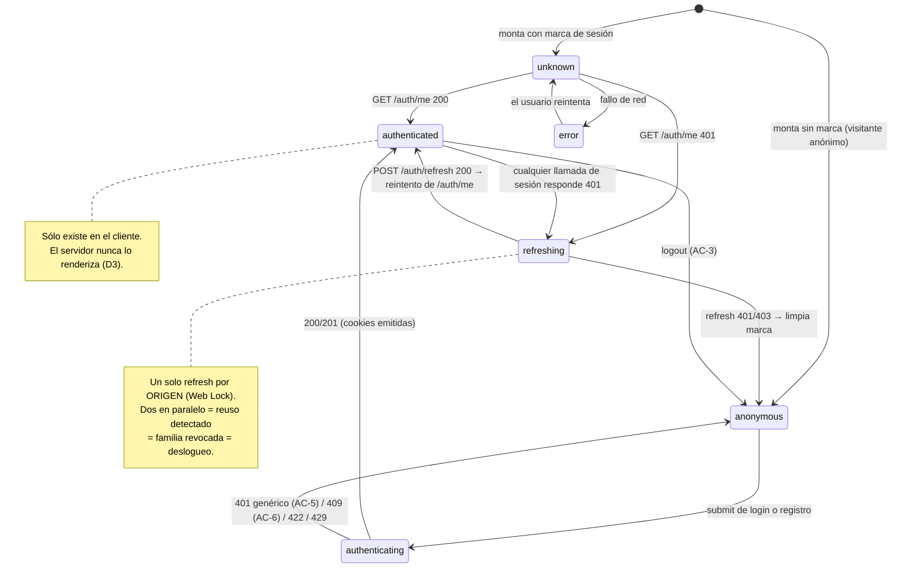

# US-014 Frontend Web — Design

## Contexto

El backend cerró (44/44) con una superficie de sesión **por cookies `HttpOnly`**. El frontend
que la tiene que consumir fue construido, en US-001, alrededor de un modelo distinto: un token
en memoria (`src/lib/http/authToken.ts`) inyectado como `Authorization: Bearer` por
`customFetch`, y **sólo en el navegador** — US-003 volvió el cliente isomorfo y decidió
deliberadamente no inyectar `authorization` ni `traceparent` en servidor, porque un header
aleatorio por render entra en la clave de la Data Cache de Next y anula `revalidate`/`tags`.

Las dos cosas no se encuentran por casualidad: se contradicen en tres puntos concretos.

1. Una cookie `HttpOnly` **no es legible por JS**, así que la sesión del cliente no puede pasar
   por `authToken`.
2. Un Server Component **no recibe** las cookies de otro host, y Next no reenvía nada por sí
   solo.
3. La caché que hace rápido al storefront es **compartida entre visitantes**. Cualquier render
   servidor que contenga datos de una persona y termine en esa caché es una fuga de datos, no un
   bug de rendimiento.

Este diseño resuelve los tres, y ordena las decisiones por riesgo: primero la topología (sin la
cual nada funciona en producción), después la convivencia de modelos, después las pantallas.

## Objetivos

- Consumir el contrato tal como está publicado, sin pedirle cambios al backend.
- Hacer que **la fuga de contenido personalizado a una caché compartida sea imposible por
  construcción**, no evitada por disciplina.
- No degradar en un solo byte el camino del panel (US-001) ni el del catálogo (US-002/US-003).
- Que el frontend no arruine la indistinguibilidad que el backend garantiza (AC-5/AC-6/AC-11).
- Que el refresh rotado de un solo uso no se convierta en un mecanismo de auto-deslogueo.

## No-objetivos

- Renderizar contenido personalizado en el servidor (D3, decisión explícita).
- Migrar el panel a cookies (`proposal.md` §Out of scope).
- Área de cuenta / historial (`Deferred: US-015`).
- Reintentos automáticos de operaciones no idempotentes (D10).

---

## Decisiones

### D1 — El navegador habla con **un solo origen**: `rewrite` same-origin para `/v1/auth/*`

**El problema, verificado y no hipotético.** El backend emite cookies host-only (sin `Domain`,
OQ-BE-6). El despliegue vigente usa `*.up.railway.app`, y ese sufijo está en la Public Suffix
List (`curl -s https://publicsuffix.org/list/public_suffix_list.dat | grep -n railway` →
`up.railway.app`). Para el navegador, web y API son **sitios distintos**: las cookies
`SameSite=Lax` no viajan en XHR, y `document.cookie` no puede leer `dsm_csrf` para armar el
header `X-CSRF-Token` que el `CsrfGuard` exige. En local ambos son `localhost` (las cookies
ignoran el puerto) ⇒ **el defecto es invisible hasta el despliegue**.

**Opciones consideradas**

| Opción | Veredicto |
|---|---|
| `credentials: 'include'` + CORS y nada más | **No alcanza**: CORS autoriza al servidor a responder, no convierte una cookie cross-site en enviable. Es la trampa: el código "se ve bien" y falla en producción |
| `Domain=.dsm.com.ar` en el backend | Reabre un change cerrado, revierte OQ-BE-6 y **no arregla el hoy** (en `*.up.railway.app` siguen siendo sitios distintos) |
| Route Handler propio que haga de proxy | Necesita un `fetch` crudo fuera del mutator ⇒ rompe F48 y suma un endpoint no declarado por ningún contrato |
| **`rewrites()` de Next, acotado a `/v1/auth/:path*`** | **Elegida** |

**Decisión.** `next.config.mjs` declara un rewrite de `/v1/auth/:path*` hacia
`${API_INTERNAL_ORIGIN}/v1/auth/:path*`, con `API_INTERNAL_ORIGIN` **server-only** (sin prefijo
`NEXT_PUBLIC_`, next-standards §8). Sólo el navegador usa el rewrite; los Server Components del
catálogo siguen llamando al origen absoluto como hoy.

**Por qué el alcance es exactamente `/v1/auth/*`**: mover todo el tráfico al proxy tocaría
US-001/002/003 (y el harness E2E que inyecta `NEXT_PUBLIC_API_BASE_URL` en build). Acotarlo deja
el radio de impacto en **cero** para lo ya entregado.

**Consecuencias, incluidas las incómodas**

- La cookie `dsm_access` tiene `Path=/` ⇒ una vez logueado, **viaja al servidor de Next en cada
  navegación**. No la leemos nunca (ninguna página llama `cookies()`), así que las rutas
  estáticas siguen siendo estáticas; pero es una propiedad que hay que **proteger con un
  guard**, no asumir (T3.2).
- `dsm_refresh` tiene `Path=/v1/auth`, que bajo el rewrite calza exacto con
  `/v1/auth/refresh` en el origen del sitio. Funciona sin tocar el backend.
- El `CsrfGuard` valida `Origin` contra `CORS_ALLOWED_ORIGINS`. Bajo el rewrite el `Origin` que
  llega es el del sitio ⇒ **la env del backend debe incluir el origen del storefront** (queda
  declarado en las notas de despliegue, T5.3).
- **Riesgo abierto y aislado**: que un rewrite externo de Next propague el `Set-Cookie` de la
  respuesta. Es la única premisa no verificada de todo el plan, así que **T0.3 la prueba antes
  de que se construya nada encima**, con una aserción real sobre `context.cookies()` del
  navegador. Si falla, el plan se detiene ahí y OQ-FE-1 se re-decide con evidencia — no se
  descubre en la Fase 4.

**¿Dispara ADR?** Sí, condicionado: si OQ-FE-1 se ratifica como (a), la decisión "el navegador
sólo habla con el origen del sitio para la superficie de sesión" es arquitectónica y transversal
(US-007 y US-015 la heredan) ⇒ **ADR-0013** propuesto en T0.3.

### D2 — Un solo punto de red, dos modelos de auth, discriminados por una marca explícita

`customFetch` es el único `fetch` crudo del frontend (F48, `.consumer-contract-allow`). Tiene
que servir a dos modelos sin que ninguno contamine al otro.

**Descartado: inferir el modelo desde la URL.** Ramificar por `url.startsWith('/v1/auth')`
dentro del mutator lo ata a un contrato que él no conoce y rompe el día que aparezca
`/v1/me/*`. El mutator recibe la URL que armó el cliente generado; no la interpreta.

**Decisión.** `FetchInit` gana un campo opcional:

```ts
export type FetchInit = RequestInit & {
  next?: { revalidate?: number | false; tags?: string[] };
  /** Marca de superficie: activa el modelo de sesión por cookie del cliente. */
  session?: 'customer';
};
```

Comportamiento del mutator:

| Condición | Comportamiento |
|---|---|
| Sin `session` (panel, catálogo) | **Idéntico a hoy**: base URL absoluta, `Bearer` desde `authToken` sólo en browser, sin credenciales |
| `session: 'customer'` en el navegador | URL **same-origin** (sin prefijo de base), `credentials: 'include'`, `X-CSRF-Token` en métodos no seguros, refresh single-flight ante `401` |
| `session: 'customer'` **en servidor** | **Lanza** `AppErrorException({kind:'server'})` con mensaje explícito |

Ese último renglón es la pieza clave y se explica en D3.

**Por qué `credentials: 'include'` si la llamada es same-origin** (donde `same-origin` bastaría):
es la única línea que sobrevive intacta si mañana la topología cambia a dominio propio con
subdominios. Cuesta nada y evita un defecto silencioso futuro.

### D3 — Nada personalizado se renderiza en el servidor (y por lo tanto nada personalizado se puede cachear)

**El riesgo, dicho sin eufemismos**: un `/mi-cuenta` renderizado en servidor y servido desde la
Data Cache o el Full Route Cache a otro visitante **es una fuga de datos personales**, no un
bug de performance. US-003 dejó el storefront con `revalidate` + tags por buenas razones; ese
mismo mecanismo es el que convierte un descuido en incidente.

**Opciones**

| Opción | Veredicto |
|---|---|
| SSR de contenido personalizado + `dynamic = 'force-dynamic'` + `no-store` por fetch | Funciona **mientras nadie se olvide**. Es una garantía por disciplina: la primera página nueva que omita el flag filtra. Además exige reenviar cookies a mano desde cada Server Component |
| SSR + lectura de `cookies()` y reenvío explícito | Vuelve dinámica toda la rama del árbol y necesita que el rewrite exista igual; suma complejidad sin ganar nada que el cliente no dé |
| **Todo el contenido con sesión es cliente; el servidor sólo produce el shell anónimo** | **Elegida** |

**Decisión.** Toda UI que dependa de la sesión es Client Component. El HTML servido es siempre
el shell anónimo, para todo el mundo, siempre. No hay contenido personalizado que pueda entrar
a una caché compartida **porque no se genera nunca en el servidor**.

Y no se apoya en la disciplina: el mutator **lanza** si alguien intenta un llamado con
`session: 'customer'` desde el servidor. Un Server Component que quiera personalizar falla de
inmediato y ruidosamente, en vez de renderizar silenciosamente como anónimo (o peor, cachearse).

**Consecuencias aceptadas**

- El header no sabe si hay sesión hasta que el cliente hidrata. Se mitiga con la marca no-secreta
  de OQ-FE-4: el anónimo (la mayoría) ve "Ingresar" desde el primer frame, sin parpadeo; el
  autenticado ve un placeholder del mismo ancho durante un instante — sin CLS.
- `/mi-cuenta` no tiene SEO. Es lo correcto: lleva `noindex` (OQ-FE-3).
- Cuando US-015 necesite SSR del historial, **esta decisión hay que reabrirla** con datos. Queda
  declarado, no escondido.
- **Prohibición explícita, verificable**: ninguna página de `(storefront)` llama `cookies()` ni
  `headers()`. T3.2 lo verifica con un grep acotado a `apps/web/app` (F57: el plan vive en
  `openspec/`, fuera del alcance del grep).

Regla heredada que se mantiene: **cero `loading.tsx` en el route group `(storefront)`** (F59 —
haría que Next confirme un 200 antes de poder emitir un 404 real).

### D4 — Refresh rotado: single-flight con Web Locks, un reintento, cero bucles

**El problema.** ADR-0011 hace el refresh **de un solo uso con rotación**, y presentar un token
ya rotado se trata como **robo**: el backend revoca la familia entera y responde `401`. Si el
frontend dispara dos refresh en paralelo (dos peticiones que expiran a la vez, o dos pestañas),
el segundo llega con el token viejo y **el propio frontend fuerza el deslogueo del usuario
legítimo**. Es un auto-sabotaje, y es el modo de falla más probable de esta US en producción.

**Opciones**

| Opción | Veredicto |
|---|---|
| No refrescar: cualquier `401` ⇒ a login | Con access de 15 min, expulsa al usuario varias veces por sesión. Inaceptable |
| Refresco proactivo por timer | El frontend no puede leer la expiración (cookie `HttpOnly`); tendría que adivinar el TTL. Y no resuelve el caso multi-pestaña |
| Single-flight sólo dentro del módulo (promesa compartida) | Resuelve un tab. **Dos pestañas siguen matándose entre sí** — y dos pestañas es el caso normal de un e-commerce |
| **Single-flight con `navigator.locks` + fallback a promesa de módulo** | **Elegida** |

**Decisión.** Un único refresh a la vez por **origen** (no por pestaña), usando la Web Locks API
(`navigator.locks.request('dsm-auth-refresh', …)`), que es cross-tab por definición. Donde no
exista la API (navegador viejo, jsdom en tests) se degrada a una promesa a nivel de módulo, que
es lo que `frontend-standards` §11.2 pide como mínimo. Dentro del lock se re-verifica si otra
pestaña ya renovó, para no rotar dos veces sin necesidad.

Reglas duras:

- **Un** reintento por petición, marcado en la propia request. Nunca un bucle
  (`frontend-standards` §13, anti-pattern 22).
- El refresh **no se intenta** para peticiones sin `session: 'customer'`: un `401` del panel
  sigue su camino de siempre.
- Refresh fallido ⇒ se limpia el estado local de sesión, se borra la marca, y se redirige a
  `/ingresar?next=…` (`frontend-standards` §4.4). El `next` se **sanea a ruta relativa del
  mismo origen** — un `next=https://evil.tld` es un open redirect.
- El `POST /auth/refresh` **jamás** se reintenta ante error de red: reintentar un token de un
  solo uso es exactamente lo que dispara la detección de reuso.

**Consecuencia declarada**: si dos pestañas quedan sin conexión y vuelven a la vez, el lock
serializa; la segunda encuentra la sesión ya renovada y no rota. Si aun así el backend detecta
reuso (p. ej. una cookie realmente robada), el frontend hace lo correcto: desloguea y manda a
login. No intenta "recuperarse" — un reuso detectado **debe** terminar en re-login.

### D5 — CSRF: leer `dsm_csrf` y reenviarlo, sólo donde el backend lo exige

`/logout` y `/refresh` exigen `X-CSRF-Token` (double-submit firmado, `security-standards` §7.5);
`register`, `login` y los de reset **no** (no hay sesión que secuestrar). El frontend replica
exactamente ese recorte: el mutator adjunta el header **sólo** en métodos no seguros de llamadas
con `session: 'customer'`. Un helper de lectura de cookie no-`HttpOnly` (`dsm_csrf`), en un solo
lugar, sin regex sobre `document.cookie` desperdigadas.

Si la cookie no está (sesión inexistente o topología rota), la llamada sale sin el header y el
backend responde `403` — que es el comportamiento correcto: **fail closed**, y el síntoma es
diagnosticable en vez de silencioso.

### D6 — Capa de servicio: `accountService`, hand-written sobre operaciones generadas

`frontend-standards` §3.3: lo único escrito a mano es la lógica de servicio. Los DTOs, los
schemas Zod y los mocks MSW se **generan** desde `apps/api/docs/api/openapi.yaml` (§3.1/§3.2,
skill `openapi-client-codegen`). Hoy el codegen está **desactualizado**: el contrato declara las
7 operaciones de auth y `src/api/generated/endpoints.ts` no tiene ninguna
(`grep -c loginCustomer` → `0`). El gate `frontend-codegen-fresh` no lo atrapó porque está
filtrado por paths de PR y este repo integra por rama, sin PR por change. T0.1 regenera y deja
el gate verde.

`src/features/account/accountService.ts` expone métodos tipados de dominio (`register`, `login`,
`logout`, `me`, `requestReset`, `confirmReset`), pasa `{ session: 'customer' }` y valida en el
borde con `parseContract` + el schema Zod generado. Los componentes **no** importan
`@/api/generated/*` (§11.5, anti-pattern 17).

### D7 — Estado de sesión como unión discriminada, en un provider de cliente

`frontend-standards` §9.2/§11.4: nada de `isLoggedIn: boolean` + `user | null`, que permite
representar estados imposibles.

```ts
export type SessionState =
  | { kind: 'unknown' }                        // aún no se resolvió (sólo si hay marca)
  | { kind: 'anonymous' }
  | { kind: 'authenticating' }                 // login/registro en vuelo
  | { kind: 'authenticated'; customer: Customer }
  | { kind: 'error'; error: AppError };        // /auth/me falló por red, no por 401
```

`kind: 'error'` existe a propósito y es distinto de `anonymous`: si `/auth/me` falla por red, el
usuario **no** es anónimo — mostrarle "Ingresar" lo empujaría a re-loguearse por un problema de
conectividad. El header muestra un estado neutro con reintento (design-system §10.1: los errores
explican y ofrecen acción).

El `SessionProvider` es un Client Component que envuelve `{children}` dentro del layout
`(storefront)`, que **sigue siendo Server Component** (next-standards §2: `use client` en las
hojas; los children pasados como prop se siguen renderizando en servidor).

### D8 — El guard del cliente **no** es `AdminGuard`

`AdminGuard` (`src/features/auth/guard.tsx`) restaura un token de `sessionStorage` y decide
sincrónicamente. Nada de eso aplica: no hay token que leer y la respuesta es asíncrona. Tampoco
se generaliza el componente existente — generalizar un guard para dos modelos de auth distintos
produce un componente con dos ramas que nadie entiende, y el precio es tocar la superficie del
panel ya entregada.

`CustomerGuard` (nuevo, en `src/features/account/`) consume el `SessionState`:
`unknown` → placeholder; `anonymous` → `router.replace('/ingresar?next=…')`; `authenticated` →
children; `error` → mensaje con reintento. **No es autoridad**: la autoridad es el
`CustomerGuard` del backend. Es UX, igual que `AdminGuard` declara de sí mismo.

### D9 — AC-5: la indistinguibilidad se puede romper desde el frontend, así que se protege desde el frontend

El backend garantiza respuesta y latencia idénticas para contraseña incorrecta, cuenta
inexistente y cuenta bloqueada. El frontend tiene **cuatro** formas de arruinarlo:

1. Renderizar `problem.detail` tal cual (si algún día difiere, la UI lo publica).
2. Marcar un campo (`setError('email', …)`) en un caso y no en otro.
3. Redirigir distinto (p. ej. "cuenta bloqueada" a una página propia).
4. Emitir un evento de telemetría con una propiedad que los distinga.

**Decisión.** Ante `kind: 'unauthorized'` el formulario de login usa **una constante de copy**
—nunca `error.message`—, no llama `setError` de ningún campo, no navega, y emite
`login_failed` **sin** ninguna propiedad derivada de la respuesta.

**Cómo se prueba de forma que falle si se rompe** (T3.1): tres handlers MSW que devuelven los
tres `401` del backend con `detail` distintos; se renderiza, se envía, y se compara el
`innerHTML` del contenedor entre los tres casos — deben ser **idénticos**. Un `setError`, un
copy derivado del `detail` o un banner extra rompen la igualdad y el test falla. Se agrega la
misma comparación sobre las propiedades capturadas del sink de telemetría.

Es deliberadamente un test de igualdad y no tres asserts de texto: tres asserts pasan igual
aunque la UI distinga, mientras el copy esperado esté bien escrito en cada rama.

### D10 — Resiliencia: qué se reintenta y qué no

Skill `frontend-resilience-patterns` aplicado con criterio, no en bloque:

| Patrón | Decisión |
|---|---|
| Retry con backoff | **No** en `login`/`register`/`reset` (no idempotentes; además cada intento consume presupuesto de rate-limit y de lockout). **No** en `refresh` (token de un solo uso) |
| Deduplicación in-flight | **Sí**, y es el corazón de D4 |
| UI optimista | **No**. Nunca en credenciales |
| Debounce | **No** en submit (anti-pattern del propio skill) |
| Cancelación | Timeout de 15 s ya vive en el mutator; se hereda |
| Honrar `Retry-After` | **Sí** (AC-10): el `429` muestra el tiempo de espera y **no** reintenta solo |
| Error boundary | El `(storefront)` no tiene `error.tsx` propio; las páginas de auth manejan el error dentro del formulario (banner con `role="alert"`), que es la forma que ya usa `ProductForm` |

**Nota de reconciliación (2026-08-20, durante este planning)**: el plan iba a diferir el manejo
tipado del `429` porque `AppError` no lo distinguía (caía en `kind: 'server'`). Mientras se
escribía este diseño, **otra sesión landeó el caso** en el sustrato compartido: `AppError` ahora
tiene `{ kind: 'rateLimited'; message; retryAfterSeconds? }` y el mutator ya lee el header
`retry-after` (`src/lib/http/errors.ts`, `src/lib/http/client.ts`). El deferral **se cancela**:
AC-10 se resuelve consumiendo `kind: 'rateLimited'` directamente, sin ampliar nada.

Consecuencia de secuencia, no cosmética: esos dos archivos son **exactamente** los que modifica
la Fase 0 (T0.4/T0.5/T0.6) y al cierre de este planning están **sin commitear** en el working
tree. P1 se endurece en consecuencia.

### D11 — Rutas, indexabilidad y el token en la URL

| Ruta | Grupo | Indexable | Nota |
|---|---|---|---|
| `/ingresar` | `(storefront)` | sí (OQ-FE-3) | `?next=` saneado a ruta relativa |
| `/crear-cuenta` | `(storefront)` | sí | superficie de conversión |
| `/recuperar` | `(storefront)` | sí | siempre la misma confirmación (AC-11) |
| `/recuperar/confirmar` | `(storefront)` | **no** (`robots: { index: false }`) | **ruta fijada por el backend**; el token viaja en query |
| `/mi-cuenta` | `(storefront)` | **no** | contenido personal |

Van en `(storefront)` y no en `(auth)` a propósito: son páginas públicas del sitio y deben
llevar el chrome público (header, `CategoryNav`, footer de US-018). El grupo `(auth)` existe hoy
sólo para `/admin/acceso`, que es superficie privada del panel.

**El token de reset se borra de la URL** apenas se lee (`history.replaceState`), para que no
quede en el historial, no viaje en `Referer` (aunque la política ya es
`strict-origin-when-cross-origin`) y no llegue a ninguna herramienta de analítica.

### D12 — Observabilidad: eventos públicos, sin una sola pieza de PII

Se extiende `BusinessEvent` y **todos** los nuevos entran a `PUBLIC_EVENTS` — si no,
`track()` les pega `operator_id: 'admin'` y la métrica del dueño (US-016) contaría cada login de
cliente como acción suya.

| Evento | Cuándo | Propiedades |
|---|---|---|
| `account_registered` | alta OK | ninguna |
| `login_succeeded` | login OK | ninguna |
| `login_failed` | `401` de login | **ninguna** (D9: una propiedad distintiva reabre AC-5) |
| `logout` | logout OK | ninguna |
| `password_reset_requested` | `202` | ninguna |
| `password_reset_completed` | confirm OK | ninguna |
| `session_expired` | refresh falló ⇒ re-login | ninguna |

Regla dura (`observability-standards` §9 + skill `observability-patterns` §9.5.6): **jamás**
email, nombre, contraseña, token de reset ni valor de cookie. Ni siquiera hasheados. El
`customer_id` tampoco se emite: el frontend no lo necesita para nada y el backend ya correlaciona
por `trace_id`.

### D13 — Seguridad de formularios

- `type="password"` + `autocomplete` correcto (`new-password` en registro y confirmación de
  reset, `current-password` en login, `username` en el email) — es UX y además evita que un
  gestor guarde el campo equivocado.
- El formulario **nunca** hace `GET`: la contraseña jamás puede terminar en una URL (AC-8).
- Validación cliente = UX; el servidor es la seguridad (`frontend-standards` §12.2). El schema
  Zod del cliente replica la política del backend (mínimo 8, máximo **72 bytes** — no 72
  caracteres: el límite de bcrypt es en bytes y una `ñ` ocupa dos) sólo para dar feedback
  inmediato; un `422` del servidor siempre gana y se mapea a los campos.
- Cero `dangerouslySetInnerHTML` (`frontend-standards` §12.1). Todo el copy es literal del
  proyecto; ninguna cadena del backend se renderiza cruda salvo los `fieldErrors` de `422`, que
  React escapa.
- CSP: se agrega `form-action 'self'` al `Content-Security-Policy-Report-Only` existente. Es
  barato y es exactamente la directiva que importa cuando aparecen formularios de credenciales.

## Desglose de componentes

```
apps/web/
├── next.config.mjs                          # MOD — rewrite /v1/auth/* + form-action en CSP
├── src/lib/http/client.ts                   # MOD — FetchInit.session, same-origin, CSRF, refresh
├── src/lib/http/customerSession.ts           # NUEVO — single-flight refresh + Web Lock + hook de expiración
├── src/lib/http/csrf.ts                      # NUEVO — lectura de la cookie dsm_csrf (un solo lugar)
├── src/lib/observability/events.ts           # MOD — 7 eventos nuevos en PUBLIC_EVENTS
├── src/features/account/
│   ├── accountService.ts                     # NUEVO — capa de servicio (§3.3)
│   ├── sessionState.ts                       # NUEVO — unión discriminada + marca no-secreta
│   ├── SessionProvider.tsx                   # NUEVO — 'use client', contexto + bootstrap
│   ├── AccountMenu.tsx                       # NUEVO — 'use client', entrada del header
│   ├── CustomerGuard.tsx                     # NUEVO — 'use client', guard UX
│   ├── RegisterForm.tsx                      # NUEVO
│   ├── LoginForm.tsx                         # NUEVO
│   ├── ResetRequestForm.tsx                  # NUEVO
│   └── ResetConfirmForm.tsx                  # NUEVO
├── app/(storefront)/layout.tsx               # MOD — monta SessionProvider + AccountMenu
├── app/(storefront)/ingresar/page.tsx        # NUEVO
├── app/(storefront)/crear-cuenta/page.tsx    # NUEVO
├── app/(storefront)/recuperar/page.tsx       # NUEVO
├── app/(storefront)/recuperar/confirmar/page.tsx  # NUEVO — noindex
├── app/(storefront)/mi-cuenta/page.tsx       # NUEVO — noindex
└── e2e/support/api-stub.mjs                  # MOD — superficie /v1/auth/* con Set-Cookie real
```

Accesibilidad por componente (design-system §11 + `qa-frontend-standards` §19): cada formulario
es un `<form aria-label>` con `<h1>` único; cada campo con `Field` (label + `aria-describedby`);
banner de error con `role="alert"`; confirmación con `role="status"`; foco al `<h1>` al cambiar
de ruta; botón con `aria-busy` mientras envía; target táctil ≥44px (ya en `Button` `md`).

## Máquina de estados de la sesión



## Plan de test

| Capa | Qué cubre | Herramienta |
|---|---|---|
| Unit | mutator con/sin `session`; throw en servidor; header CSRF; single-flight; saneo de `next=`; marca de sesión; schema Zod del form | Vitest |
| Servicio | `accountService` contra el contrato; validación Zod en el borde; mapeo de `401`/`409`/`422`/`429` | Vitest + MSW (`onUnhandledRequest: 'error'`) |
| Componente | los 5 formularios: happy, validación, error, loading, `aria-busy` | Vitest + RTL + `userEvent` (§23.2) |
| **Garantía** | AC-5 DOM idéntico ×3 + telemetría sin discriminador; nada personalizado en SSR; contraseña no sale del form; token no legible por JS | Vitest (igualdad, no asserts de texto) |
| a11y | jest-axe sobre los 5 formularios + header autenticado | jest-axe (§19.2) |
| E2E | journey registro→logout→login; reset completo + token vencido/usado; **prueba de topología de cookie** | Playwright contra `next build && next start` (§23.4) |

Regla de la casa que se mantiene: las aserciones de estado van contra `response.status()`, nunca
contra el DOM. Y ningún `waitForTimeout` (skill `playwright-stability`).

**Fuera de alcance (QA, `QA-US-014`)**: batería contra la API viva, pruebas de abuso/carga del
login, verificación manual de accesibilidad, regresión visual.

## Cobertura de las declaraciones del diseño (F51)

Cada decisión tiene task(s) que la construye(n) o un `Deferred:` explícito.

| Decisión | Tasks |
|---|---|
| D1 rewrite same-origin + prueba de topología | T0.3 |
| D2 dos modelos en un choke point | T0.4 |
| D3 nada personalizado en servidor | T0.4 (throw), T3.2 (guard) |
| D4 refresh single-flight | T0.6, T3.1 no aplica → G-2 en T0.6 |
| D5 CSRF | T0.5 |
| D6 codegen + accountService | T0.1, T1.1 |
| D7 estado de sesión | T1.2 |
| D8 CustomerGuard | T2.6 |
| D9 indistinguibilidad AC-5 | T2.2 (implementación), T3.1 (prueba) |
| D10 resiliencia / 429 | T2.2, T2.1 |
| D11 rutas + indexabilidad + token fuera de la URL | T2.1…T2.6, T4.2 |
| D12 observabilidad sin PII | T5.1 |
| D13 seguridad de formularios + CSP | T2.1…T2.5, T3.3, T5.2 |
| Secuencia vs US-018 | P1 |
| Sin `loading.tsx` en `(storefront)` | Verification suite-level |
| Documentación / despliegue | T5.3 |

**Diferidos declarados**: ampliar `AppError` con `kind: 'rateLimited'` → `Deferred:` próximo
change que toque el mapeo de errores · migración del panel a cookies →
`Deferred: change de endurecimiento del panel` · SSR de contenido personalizado →
`Deferred: US-015, con esta decisión reabierta explícitamente` · área de cuenta completa →
`Deferred: US-015` · `@axe-core/playwright` (hoy jest-axe alcanza) → `Deferred:` si QA lo pide.

## Riesgos y mitigaciones

| Riesgo | Prob. | Impacto | Mitigación |
|---|---|---|---|
| El rewrite de Next no propaga `Set-Cookie` | Baja | **Bloqueante** | T0.3 lo prueba **primero**, con aserción sobre `context.cookies()`; si falla, se detiene y se re-decide OQ-FE-1 con evidencia |
| `CORS_ALLOWED_ORIGINS` del backend no incluye el origen del storefront ⇒ `403` en logout/refresh | Media | Alto | Declarado en notas de despliegue (T5.3) y ejercitado en E2E contra el stub |
| Dos pestañas se desloguean por reuso detectado | Media sin D4 | Alto | Web Lock cross-tab + un solo reintento (T0.6, prueba G-2) |
| La UI filtra la distinción de AC-5 al agregar copy más adelante | Media | Alto (seguridad) | Test de **igualdad de DOM**, que falla ante cualquier divergencia (T3.1) |
| Una página futura de `(storefront)` lee `cookies()` y vuelve dinámica/personalizada la rama | Media | Alto | Guard con grep en T3.2 + el throw del mutator |
| El codegen queda otra vez desactualizado (el gate está filtrado por paths de PR y el repo integra por rama) | Media | Medio | T0.1 lo regenera y su `Verify:` **re-ejecuta** el codegen exigiendo diff vacío |
| Colisión de working tree con US-018 / QA de US-002 | **Confirmada** | Medio | P1 bloqueante verificable por comando. Al cerrar el planning ya hay cambios sin commitear de otra sesión **en `src/lib/http/client.ts`**, el archivo que modifica toda la Fase 0 |

## ¿Hizo falta `data-architect`?

**No.** Este change no crea ni migra persistencia, no introduce motor de datos y no mueve datos.
El único estado persistido en el cliente es una **marca booleana no-secreta** en `localStorage`
(OQ-FE-4), que no es dato de negocio ni PII: es una pista de UX. La decisión de datos relevante
—tres tablas nuevas en Postgres— la tomó y documentó el change de backend, que también evaluó y
descartó la invocación (`design.md` §Persistencia, paso 6).

## Referencias

- US: `docs/user-stories/US-014-registro-login.md`.
- Backend: `openspec/changes/US-014-registro-login-backend/design.md`; contrato en
  `apps/api/docs/api/openapi.yaml`; código AS-BUILT en `apps/api/src/auth/` (en particular
  `cookies.ts`, `csrf.guard.ts`, `mail/resend-password-reset-mailer.ts`).
- ADRs: `0005`, `0009`, `0010`, `0011`; **ADR-0013 propuesto** (T0.3).
- Standards: los listados en `proposal.md` §Standards consultados.
- Skills: `openspec-workflow`, `openapi-client-codegen`, `msw-setup`, `playwright-stability`,
  `frontend-resilience-patterns`, `observability-patterns`, `fe-design-without-figma`.
- Sustrato reconciliado: `apps/web/src/lib/http/client.ts`, `authToken.ts`, `errors.ts`,
  `contract.ts`, `src/features/auth/*`, `src/features/products/ProductForm.tsx`,
  `src/lib/observability/events.ts`, `app/(storefront)/layout.tsx`, `next.config.mjs`,
  `playwright.config.ts`, `e2e/support/api-stub.mjs`, `orval.config.ts`.
