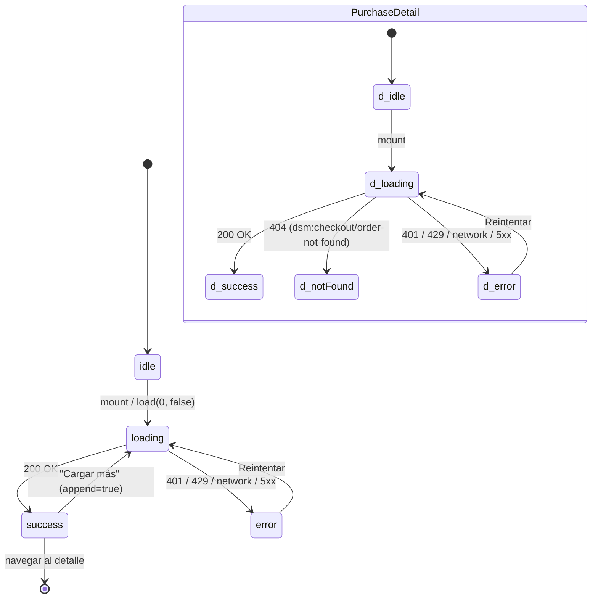

# Design — US-015 Historial de compras del cliente (frontend web)

## Context

El backend de US-015 está mergeado en `main` (PR #70, `9d2d754`) y su contrato ya está publicado
(PR #71, `2a0eb62`, mergeado 2026-09-06 — verificado en vivo al planificar, ver §"Estado del gate
de contrato"). Este change es puramente de consumo: dos pantallas nuevas + un repositorio, sin
tocar backend ni contrato.

El área de cuenta del cliente (`/mi-cuenta`) ya existe (US-014) con un guard de sesión
(`CustomerGuard`) y un panel (`AccountPanel`) que declara explícitamente un placeholder para esta
US ("Tus compras — Próximamente."). El panel admin de órdenes (`apps/web/src/features/orders/`,
US-012/US-013/US-021) ya resuelve un problema estructuralmente similar (listado + detalle +
badge de estado + manejo de `AsyncState`) para una audiencia distinta (el dueño). Este change
reusa lo que es genuinamente compartido (el badge, los helpers de formato) y **no** reusa lo que
es específico de esa audiencia (TanStack Table denso, acciones de cambio de estado/cancelación/
anonimización, filtro por status).

## Estado del gate de contrato (Fase 0 de `tasks.md`)

Al momento de planificar, `git log origin/main` mostraba el HEAD dos commits detrás de esta rama
(`9d2d754`, antes de PR #71). Se corrió `gh pr view 71 --json state,mergedAt` → `MERGED,
2026-09-06T12:23:24Z`, y `git fetch origin main && git merge --ff-only origin/main` trajo el
commit `2a0eb62` a esta rama **antes de escribir este plan** (fast-forward limpio, sin conflictos
— esta rama no tenía commits propios todavía).

Verificado tras el merge:

```
grep -c "operationId: listOrderHistory" apps/api/docs/api/openapi.yaml   # → 1
grep -c "operationId: getOrderHistoryDetail" apps/api/docs/api/openapi.yaml  # → 1
grep -c "OrderHistorySummary\|OrderHistoryDetail" apps/web/src/api/generated/model/index.ts  # → ≥1
```

Consecuencia: **el gate de contrato de la Fase 0 de `tasks.md` es trivial** (ya resuelto) — a
diferencia de `US-021-retencion-datos-ordenes-frontend-web`, donde T0.1 bloqueaba de verdad
porque el PR de publicación todavía no existía. Acá la task equivalente es una verificación, no
un bloqueo real. Se mantiene igual como task explícita (no se omite) porque es el checkpoint que
`/develop-frontend-web` corre antes de tocar código — remover la task sería remover la red de
seguridad, no sólo el trabajo que ya no hace falta.

## Goals

- Listado (AC-1) y detalle (AC-2) de compras del cliente autenticado, dentro del área de cuenta
  ya existente.
- Estado vacío accionable (AC-3).
- Cero lógica de autorización/filtrado de fecha propia en el FE (AC-4/AC-6/AC-7 son del backend).
- Reuso máximo de lo ya construido: `CustomerGuard`, `OrderStatusBadge`, helpers de formato,
  patrón `AsyncState`, patrón de error inline (`role="alert"`/`role="status"`).

## Non-goals

- Reordenar, filtrar o paginar con controles de tabla densa (design-system §7.9 es
  explícitamente "panel del dueño — Backoffice"; esta es una pantalla de cliente).
- Cualquier acción mutante sobre la orden (cancelar, anonimizar, cambiar estado) — eso es del
  panel admin (US-012/US-013/US-021), no de este historial de sólo lectura.
- Vincular compras guest, re-comprar, facturación (US-015 §4 explícito).

## Approach

### Namespace de rutas

`/mi-cuenta/compras` (listado) y `/mi-cuenta/compras/{orderNumber}` (detalle), dentro de
`apps/web/app/(storefront)/mi-cuenta/`. Confirmado contra ADR-0010: el storefront es dueño del
espacio raíz y `/mi-cuenta` ya vive ahí (US-014) — esto no es el panel admin (`/admin/*`), así
que no hay conflicto de namespace que resolver. El identificador de ruta es `order_number`
(entero público, `≥1000`), **nunca el UUID interno** — igual que expone el contrato
(`GET /v1/me/orders/{order_number}`, a diferencia de `GET /admin/orders/{id}` que sí usa el UUID
porque esa es la superficie del dueño).

```
apps/web/app/(storefront)/mi-cuenta/
├── page.tsx                          (existente, US-014)
└── compras/
    ├── page.tsx                      (nuevo — listado)
    └── [orderNumber]/
        └── page.tsx                  (nuevo — detalle)
```

Cada `page.tsx` es un Server Component minimal (mismo patrón que
`app/(admin)/admin/ordenes/[id]/page.tsx`) que sólo desenvuelve `params`/`metadata` y monta el
componente cliente envuelto en `CustomerGuard` — igual que `app/(storefront)/mi-cuenta/page.tsx`
ya hace. Nada se renderiza en servidor con datos de la persona (mismo motivo que documenta ese
archivo: `customFetch` **lanza** si una llamada `session: 'customer'` sale del servidor, así que
esto no es sólo un estilo, es una restricción estructural del mutator — G-1).

```tsx
// apps/web/app/(storefront)/mi-cuenta/compras/page.tsx
export const metadata: Metadata = {
  title: 'Mis compras — DSM',
  robots: { index: false, follow: false },
};

export default function ComprasPage() {
  return (
    <div className="mx-auto flex max-w-2xl flex-col gap-6 p-6">
      <h1 className="text-2xl font-bold">Mis compras</h1>
      <CustomerGuard>
        <PurchaseHistoryList />
      </CustomerGuard>
    </div>
  );
}
```

```tsx
// apps/web/app/(storefront)/mi-cuenta/compras/[orderNumber]/page.tsx
export default async function Page({
  params,
}: {
  params: Promise<{ orderNumber: string }>;
}) {
  const { orderNumber } = await params;
  return (
    <div className="mx-auto flex max-w-2xl flex-col gap-6 p-6">
      <CustomerGuard>
        <PurchaseDetail orderNumber={orderNumber} />
      </CustomerGuard>
    </div>
  );
}
```

`PurchaseDetail` recibe el segmento como `string` y lo convierte a `number` internamente (mismo
motivo que `OrderDetail` admin recibe `id: string` crudo) — un segmento no numérico (`NaN`) se
trata igual que un 404: no hay manera de que exista una orden con ese `order_number`, y
tratarlo distinto sería una fuga de información sobre la forma esperada del identificador.

### Servicio (repository pattern, `frontend-standards.md` §11.5)

```ts
// apps/web/src/features/order-history/orderHistoryService.ts
import { parseContract } from '@/lib/http/contract';
import { listOrderHistory, getOrderHistoryDetail } from '@/api/generated/endpoints';
import { ListOrderHistoryResponse, GetOrderHistoryDetailResponse } from '@/api/generated/zod';
import type {
  OrderHistorySummary,
  OrderHistoryDetail,
  OrderHistorySummaryStatus,
} from '@/api/generated/model';

export type { OrderHistorySummary, OrderHistoryDetail };
export type PurchaseStatus = OrderHistorySummaryStatus;

/** Igual que `accountService`: la llamada tiene que salir con cookies de sesión (ADR-0013). */
const conSesion = { session: 'customer' } as const;

export const orderHistoryService = {
  async list(params: { limit: number; offset: number }, signal?: AbortSignal) {
    const res = await listOrderHistory(params, { ...conSesion, signal });
    return parseContract(ListOrderHistoryResponse, res.data);
  },

  async get(orderNumber: number, signal?: AbortSignal): Promise<OrderHistoryDetail> {
    const res = await getOrderHistoryDetail(orderNumber, { ...conSesion, signal });
    return parseContract(GetOrderHistoryDetailResponse, res.data);
  },
};
```

Sin `sort`/`status` en `list()` — a propósito, el tipo generado `ListOrderHistoryParams` sólo
declara `limit`/`offset` (AC-1: "Sin `sort` ni `status` parametrizables... reglas de negocio, no
opciones del cliente"). Ofrecer esos parámetros en la firma del servicio sería prometer un
control que el contrato no tiene.

### Reuso de `OrderStatusBadge` — verificación de compatibilidad de tipos

`OrderStatusBadge` (`apps/web/src/features/orders/OrderStatusBadge.tsx`) tipa su prop como
`status: OrderStatus`, donde `OrderStatus = AdminOrderSummaryStatus` — unión de 5 literales
(`'new' | 'preparing' | 'ready' | 'delivered' | 'cancelled'`). `OrderHistorySummaryStatus`
(generado para esta US) es la **misma unión de 5 literales**. TypeScript los trata como
estructuralmente idénticos — no hace falta un adaptador ni un cast: `<OrderStatusBadge
status={order.status} />` tipa limpio pasando un `OrderHistorySummaryStatus`. Se reusa el
componente **tal cual**, sin modificarlo (es puro y no importa nada de `(admin)`).

### `PurchaseHistoryList` — composición de estados + "Cargar más"

Mismo esqueleto de `AsyncState` que `OrdersList`/`OrderDetail`, pero sin TanStack Table (Non-
goals) y con acumulación incremental en vez de paginación por offset visible:

```tsx
'use client';

const PAGE_SIZE = 20;

export function PurchaseHistoryList() {
  const [state, setState] = useState<AsyncState<{ items: OrderHistorySummary[]; total: number }>>({
    status: 'idle',
  });
  const [offset, setOffset] = useState(0);
  const vistaRegistrada = useRef(false);

  const load = useCallback(async (nextOffset: number, append: boolean) => {
    setState((prev) =>
      append && prev.status === 'success' ? prev : { status: 'loading' },
    );
    try {
      const page = await orderHistoryService.list({ limit: PAGE_SIZE, offset: nextOffset });
      setState((prev) => ({
        status: 'success',
        data: {
          items:
            append && prev.status === 'success'
              ? [...prev.data.items, ...page.data]
              : page.data,
          total: page.pagination.total,
        },
      }));
    } catch (err) {
      setState({
        status: 'error',
        error: err instanceof AppErrorException ? err.appError : networkError(),
      });
    }
  }, []);

  useEffect(() => {
    void load(0, false);
  }, [load]);

  useEffect(() => {
    if (state.status !== 'success' || vistaRegistrada.current) return;
    vistaRegistrada.current = true;
    track('order_history_shown', { item_count: state.data.items.length });
  }, [state]);

  if (state.status === 'idle' || state.status === 'loading') {
    return (
      <p role="status" aria-live="polite" aria-busy="true">
        Cargando tus compras…
      </p>
    );
  }

  if (state.status === 'error') {
    return (
      <div role="alert" className="flex flex-col gap-2">
        <p>No pudimos cargar tus compras.</p>
        <Button variant="secondary" onClick={() => void load(offset, false)}>
          Reintentar
        </Button>
      </div>
    );
  }

  if (state.data.items.length === 0) {
    return <PurchaseHistoryEmptyState />;
  }

  const puedeCargarMas = state.data.items.length < state.data.total;

  return (
    <div className="flex flex-col gap-3">
      <ul className="flex flex-col divide-y divide-border">
        {state.data.items.map((order) => (
          <li key={order.order_number}>
            <Link
              href={`/mi-cuenta/compras/${order.order_number}`}
              className="flex items-center justify-between gap-3 py-3 focus:outline-none focus-visible:shadow-focus"
            >
              <div className="flex flex-col">
                <span className="font-medium">Pedido #{order.order_number}</span>
                <span className="text-sm text-muted">{formatDateTime(order.created_at)}</span>
              </div>
              <div className="flex items-center gap-3">
                <OrderStatusBadge status={order.status} />
                <span className="font-medium tabular-nums">{formatArs(order.total_ars_cents)}</span>
              </div>
            </Link>
          </li>
        ))}
      </ul>
      {puedeCargarMas && (
        <Button
          variant="secondary"
          onClick={() => {
            const next = offset + PAGE_SIZE;
            setOffset(next);
            track('order_history_load_more_clicked');
            void load(next, true);
          }}
        >
          Cargar más
        </Button>
      )}
    </div>
  );
}
```

### `PurchaseHistoryEmptyState` (AC-3)

Mismo patrón que `CartEmptyState.tsx` (estructura, tono, CTA a `/categorias`), copy propio del
dominio:

```tsx
export function PurchaseHistoryEmptyState() {
  return (
    <div className="flex flex-col items-start gap-4 py-12">
      <h2 className="text-xl font-semibold">Todavía no compraste nada</h2>
      <p className="text-sm text-muted">
        Cuando hagas tu primera compra logueado, la vas a ver acá.
      </p>
      <Link
        href="/categorias"
        className="inline-flex min-h-[44px] items-center rounded-md bg-primary px-4 text-sm font-medium text-primary-foreground hover:bg-primary-dark focus:outline-none focus-visible:shadow-focus"
      >
        Ver rubros
      </Link>
    </div>
  );
}
```

### `PurchaseDetail` (AC-2)

Mismo esqueleto de `AsyncState` + foco gestionado al cargar (patrón de `OrderDetail` admin,
`headingRef.current?.focus()`), sin ninguna de las acciones mutantes del panel admin:

```tsx
'use client';

export function PurchaseDetail({ orderNumber }: { orderNumber: string }) {
  const parsed = Number(orderNumber);
  const [state, setState] = useState<AsyncState<OrderHistoryDetail>>({ status: 'idle' });
  const headingRef = useRef<HTMLHeadingElement>(null);

  const load = useCallback(async () => {
    if (!Number.isInteger(parsed)) {
      setState({ status: 'error', error: { kind: 'notFound', message: 'Pedido no encontrado' } });
      return;
    }
    setState({ status: 'loading' });
    try {
      const order = await orderHistoryService.get(parsed);
      setState({ status: 'success', data: order });
    } catch (err) {
      setState({
        status: 'error',
        error: err instanceof AppErrorException ? err.appError : networkError(),
      });
    }
  }, [parsed]);

  useEffect(() => { void load(); }, [load]);
  useEffect(() => {
    if (state.status === 'success') headingRef.current?.focus();
  }, [state.status]);

  useEffect(() => {
    if (state.status === 'success') {
      track('order_detail_shown', { order_number: state.data.order_number });
    } else if (state.status === 'error' && state.error.kind === 'notFound') {
      track('order_detail_not_found', { order_number: parsed });
    }
  }, [state, parsed]);

  if (state.status === 'idle' || state.status === 'loading') {
    return (
      <p role="status" aria-live="polite" aria-busy="true">
        Cargando pedido…
      </p>
    );
  }

  if (state.status === 'error') {
    const noEncontrado = state.error.kind === 'notFound';
    return (
      <div role="alert" className="flex flex-col gap-2">
        <p>
          {noEncontrado
            ? 'No encontramos ese pedido.'
            : 'No pudimos cargar el pedido.'}
        </p>
        {!noEncontrado && (
          <Button variant="secondary" onClick={() => void load()}>
            Reintentar
          </Button>
        )}
        <Link href="/mi-cuenta/compras" className="text-sm underline">
          Volver a mis compras
        </Link>
      </div>
    );
  }

  const order = state.data;

  return (
    <div className="flex flex-col gap-6">
      <div className="flex items-center gap-3">
        <h1
          ref={headingRef}
          tabIndex={-1}
          className="text-xl font-semibold focus:outline-none focus-visible:shadow-focus"
        >
          Pedido #{order.order_number}
        </h1>
        <OrderStatusBadge status={order.status} />
      </div>

      <section aria-labelledby="pedido-items-heading">
        <h2 id="pedido-items-heading" className="font-medium">Ítems</h2>
        <table className="w-full text-left text-sm">
          <thead>
            <tr>
              <th className="p-2 font-medium text-muted">Producto</th>
              <th className="p-2 font-medium text-muted">Cantidad</th>
              <th className="p-2 font-medium text-muted">Precio unitario</th>
              <th className="p-2 font-medium text-muted">Subtotal</th>
            </tr>
          </thead>
          <tbody>
            {order.items.map((item, i) => (
              <tr key={`${item.product_sku}-${i}`} className="border-t border-border">
                <td className="p-2">{item.product_name}</td>
                <td className="p-2">{item.quantity}</td>
                <td className="p-2">{formatArs(item.unit_price_ars_cents)}</td>
                <td className="p-2">{formatArs(item.subtotal_ars_cents)}</td>
              </tr>
            ))}
          </tbody>
        </table>
        <p className="mt-2 text-right font-medium">Total: {formatArs(order.total_ars_cents)}</p>
      </section>

      <section aria-labelledby="pedido-retiro-heading">
        <h2 id="pedido-retiro-heading" className="font-medium">Retiro</h2>
        <p className="text-sm">
          {order.fulfillment === 'pickup' ? 'Retiro en sucursal' : order.fulfillment}
        </p>
      </section>
    </div>
  );
}
```

`404` se mapea a `kind: 'notFound'` por `mapProblemToAppError` (ya existente, sin cambios) —
el mensaje genérico "No encontramos ese pedido" es correcto para las tres causas que el backend
colapsa a propósito (inexistente / ajena / fuera de retención, AC-4/AC-6/AC-7): distinguirlas en
la UI sería reintroducir la fuga que el backend decidió cerrar.

### `AccountPanel` — cierre del placeholder

```tsx
// reemplaza el bloque "Próximamente" (líneas 40-45 actuales)
<section className="rounded-md border border-border p-4">
  <h2 className="text-sm font-medium text-fg">Tus compras</h2>
  <Link href="/mi-cuenta/compras" className="text-sm underline focus:outline-none focus-visible:shadow-focus">
    Ver historial de compras
  </Link>
</section>
```

## Trade-offs

### Decisión 1: lista simple + "Cargar más" vs. TanStack Table con paginación por offset

- **Opciones consideradas**: (a) reusar `OrdersList` tal cual con TanStack Table; (b) lista
  simple con botón "Cargar más"; (c) lista simple con Anterior/Siguiente (mismo control visual
  que `OrdersList` pero sin la tabla).
- **Elegido**: (b).
- **Rationale**: design-system §7.9 declara la Table explícitamente "panel del dueño —
  Backoffice" (densidad alta, sorting/filtro, encabezado sticky) — es la herramienta para una
  grilla de gestión, no para una lista de cliente que sólo lee. AC-1 además prohíbe sort/filtro
  interactivo (son reglas de negocio fijas), así que el 80% de lo que TanStack Table aporta
  (orden por columna, filtro) no aplica acá. "Cargar más" es más simple de implementar, más
  mobile-first que Anterior/Siguiente (sin cálculo de página/cambio de layout) y es el patrón que
  ya usa el resto del storefront para contenido incremental.
- **ADR triggered?**: no — es una elección de composición de UI dentro de patrones ya
  establecidos en el design-system (§10.1 loading/empty), no una decisión arquitectónica nueva.

### Decisión 2: `PurchaseHistoryEmptyState` nuevo vs. reusar `CartEmptyState`

- **Opciones consideradas**: (a) reusar `CartEmptyState` literal (mismo componente, mismo copy);
  (b) nuevo componente con el mismo patrón estructural pero copy propio del dominio.
- **Elegido**: (b).
- **Rationale**: el copy de `CartEmptyState` ("Tu carrito está vacío... Todavía no agregaste
  nada") es específico del carrito y no tiene sentido en el historial ("Todavía no compraste
  nada logueado" es un mensaje distinto — el cliente puede haber comprado como invitado, que es
  justo lo que AC-6 aclara que no cuenta). El *patrón* (estructura, CTA a `/categorias`, tono
  §10.2) se reusa al 100%; el *copy* no podía ser el mismo sin ser confuso o falso.
- **ADR triggered?**: no.

### Decisión 3: 401 a mitad de sesión — sin refresh automático en estas pantallas

- **Opciones consideradas**: (a) invocar `refreshOnce()` (`lib/http/customerSession.ts`) desde
  `orderHistoryService` ante un 401 y reintentar una vez; (b) tratarlo como cualquier otro error
  — inline, con reintento manual del usuario.
- **Elegido**: (b).
- **Rationale**: ninguna otra pantalla del storefront hace este manejo por-servicio hoy —
  `refreshOnce()` lo dispara `SessionProvider`/el mutator en los puntos donde ya está cableado;
  agregarlo acá sería una excepción de alcance sin precedente y sin AC que lo pida. `CustomerGuard`
  ya resuelve AC-5 (sin sesión desde el arranque). Un 401 a mitad de sesión es el mismo caso que
  `OrderDetail` (admin) no maneja especialmente — se documenta como decisión explícita en vez de
  un gap silencioso.
- **ADR triggered?**: no.

## Patterns applied

- Repositorio sobre cliente generado (`frontend-standards.md` §11.5) — `orderHistoryService.ts`.
- Estado como unión discriminada, sin flags booleanos (`frontend-standards.md` §11.4) —
  `AsyncState<T>` reusado tal cual.
- Guard de sesión reusado sin duplicar el chequeo (`CustomerGuard`).
- Validación runtime del contrato en el borde de red (`parseContract` + schemas Zod generados).
- Mapeo de errores a `AppError` tipado, ya existente (`mapProblemToAppError`) — sin cambios.
- Foco gestionado al navegar al detalle (design-system §11 / `frontend-standards.md` §11.bis).
- Eventos de negocio sin PII, en `PUBLIC_EVENTS` (superficie de cliente, no de operador) —
  mismo criterio que `cart_viewed`/`checkout_started`.

## Component breakdown

```
apps/web/src/features/order-history/
├── orderHistoryService.ts       — repositorio (list, get)
├── PurchaseHistoryList.tsx      — listado + "Cargar más" + composición de estados (AC-1)
├── PurchaseHistoryEmptyState.tsx — estado vacío (AC-3)
└── PurchaseDetail.tsx           — detalle (AC-2)

apps/web/app/(storefront)/mi-cuenta/
└── compras/
    ├── page.tsx                 — Server Component, monta CustomerGuard + PurchaseHistoryList
    └── [orderNumber]/page.tsx   — Server Component, monta CustomerGuard + PurchaseDetail
```

Props:

- `PurchaseHistoryList()` — sin props, lee su propio estado.
- `PurchaseHistoryEmptyState()` — sin props.
- `PurchaseDetail({ orderNumber: string })` — recibe el segmento crudo de la URL.

A11y:

- Listado: cada fila es un `<Link>` completo (área táctil ≥44px con `py-3` + el ancho del `<li>`),
  navegable por teclado, sin depender de color para comunicar estado (`OrderStatusBadge` ya
  cumple esto — texto + color).
- Detalle: heading enfocado al cargar (mismo patrón que `OrderDetail` admin); tabla semántica con
  headers (`<th>`).
- Error/empty: `role="alert"` (error) / `role="status"` (loading), consistente con el resto del
  panel de cuenta.

## State diagram



## Test plan

Ver `tasks.md` Fase 5-6 para el detalle cerrado por task. Resumen de la pirámide:

- **Unit**: `orderHistoryService.test.ts` (list/get llaman a los endpoints generados con
  `session: 'customer'` y parsean con los schemas Zod correctos).
- **Component (RTL + MSW)**: `PurchaseHistoryList.test.tsx` (loading/success/error/empty/"cargar
  más"), `PurchaseDetail.test.tsx` (loading/success/404/error genérico), `AccountPanel.test.tsx`
  (regresión: el link a `/mi-cuenta/compras` reemplaza el placeholder).
- **Eventos**: extensión de un test de eventos dedicado (mismo patrón que
  `apps/web/src/features/orders/orders.events.test.tsx`) verificando que ningún evento de esta
  familia lleva PII (nombre/email/teléfono del comprador — que ni siquiera están en el shape de
  `OrderHistorySummary`/`OrderHistoryDetail`, así que es estructuralmente imposible filtrarlos,
  pero el test lo deja explícito igual que hace el precedente).
- **A11y (axe-core)**: extensión de `apps/web/src/features/orders/a11y.test.tsx` o un archivo
  dedicado del feature nuevo — casos con listado con datos, listado vacío, y detalle.
- **E2E**: no se agrega un spec de Playwright nuevo — mismo nivel de pirámide que el resto de
  `features/orders/` (Vitest + RTL + MSW + axe-core cubre toda la lógica de cliente; la garantía
  de autorización real ya la prueba el backend con datos reales, no un E2E de UI que la
  simularía con mocks).

## Risks and mitigations

| Risk | Likelihood | Impact | Mitigation |
|---|---|---|---|
| El merge `--ff-only` de PR #71 a esta rama se pierde si otra sesión pushea a la rama antes del primer commit propio | Baja | Media (habría que re-mergear) | La rama todavía no tiene commits propios ni fue pusheada — se documenta en `design.md` para que `/develop-frontend-web` no repita el diagnóstico. |
| `OrderStatusBadge` deja de ser estructuralmente compatible si un cambio futuro en el panel admin lo re-tipa con un branded type | Baja | Baja (error de compilación, no runtime) | El typecheck del propio change lo detectaría de inmediato; no requiere mitigación adicional. |
| Un cliente pega un `order_number` de otro cliente en la URL manualmente (IDOR por UI) | Media (comportamiento esperado, no un bug) | Ninguno — es exactamente AC-4/AC-6, y el backend responde el mismo 404 | Ninguna acción del FE: es la garantía que el backend ya implementa en el `WHERE`. |

## References

- Ticket: `docs/user-stories/US-015-historial-compras.md`
- Backend (mergeado): `openspec/changes/archive/US-015-historial-compras-backend/` (verificar
  ruta exacta al momento de desarrollar — puede seguir activo si aún no se archivó)
- Contrato: `apps/api/docs/api/openapi.yaml` (paths `/me/orders`, `/me/orders/{order_number}`)
- ADRs: ADR-0010 (namespace storefront vs admin), ADR-0013 (topología de sesión de cliente,
  referenciada por `client.ts`)
- Precedente estructural (gate de contrato + estructura de tasks): `openspec/changes/archive/US-021-retencion-datos-ordenes-frontend-web/`
- Design-system: `docs/product/design-system.md` §7.7, §7.9, §10.1, §10.2
