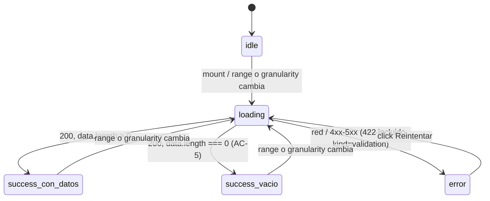

# Design — Panel de métricas del dueño (frontend-web)

## Context

El backend hermano (`US-016-panel-metricas-backend`, PR #55) ya publica 6
endpoints de sólo lectura (3 datasets + sus 3 export CSV) detrás de
`AdminGuard`. Este change decide cómo el panel del dueño consume ese contrato:
qué componentes, qué estado, qué librería de charts (ya resuelta por
`design-system.md` §9, `Approved`) y cómo se comportan las 3 zonas grises que
la US deja explícitamente abiertas — período sin datos (AC-5), rango acotado
por retención (AC-9) y exportación de datos crudos (AC-6).

## Goals

- Un dashboard que se sienta parte del mismo panel que catálogo/import/órdenes
  (mismo `AdminGuard`, mismo patrón de tabla, mismo patrón de estado).
- Cada widget resuelve su propio ciclo de vida async — una falla en un widget
  no tira abajo a los otros dos.
- Transparencia cuando el backend recorta el rango pedido (AC-9) — nunca un
  recálculo silencioso.
- Cero superficie de red nueva: todo pasa por el cliente generado + el mutator
  único (F48).

## Non-goals

- No se re-decide la librería de charts (ya `Approved` en design-system §9).
- No se construye un nav/sidebar del panel admin.
- No se sincroniza el rango a la URL (ver Decisión 3).
- No se re-planifica el backend.

## Decisiones

### Decisión 1 — Nombre de la feature: `metrics` (FE) vs `reports` (BE)

- **Opciones consideradas**: (a) espejar el nombre del módulo backend
  (`src/features/reports/`); (b) usar el nombre de la pantalla tal como la
  nombra la US y el E2E ("panel de métricas").
- **Elegido**: (b) — `src/features/metrics/`.
- **Racional**: no hay colisión de ningún tipo en el frontend (a diferencia
  del backend, que sí tenía una clase `MetricsService` de Prometheus ya
  ocupada en `observability/`). El nombre de la feature FE puede seguir la
  intención de la pantalla sin heredar la restricción de naming que forzó al
  backend a `Reports*`. `metricsService.ts` consume operaciones cuyo path es
  `admin/reports/*` — la asimetría de nombres es intencional y queda
  documentada acá para que no se lea como un error.
- **ADR triggered?**: no — decisión de nomenclatura de feature, no
  arquitectónica.

### Decisión 2 — Un solo chart (Sales); tabla y tarjetas para los otros dos

- **Opciones consideradas**: (a) chart en los 3 widgets; (b) chart sólo en
  ventas (serie temporal), tabla para el ranking, tarjetas para el resumen.
- **Elegido**: (b).
- **Racional**: AC-1 pide explícitamente "un gráfico de la evolución" (serie
  temporal — la forma natural de un chart). AC-2 pide "ver el ranking" — una
  tabla ordenable comunica un ranking con más precisión que una barra
  (permite ver SKU, cantidad y monto en la misma fila, ordenar por cualquier
  columna). AC-3 pide "totales" — tarjetas son el patrón estándar para KPIs
  puntuales, no series. Forzar un chart en los 3 sería inflar la superficie
  de Recharts sin ganancia de legibilidad, y contradice `frontend-standards.md`
  §11.bis.7 (las tablas son el default en backoffice para datos tabulares).
- **ADR triggered?**: no.

### Decisión 3 — Rango en estado de cliente, no en `searchParams`

- **Opciones consideradas**: (a) sincronizar `{from, to}` a la URL (como hace
  `admin/ordenes?tab=...`); (b) estado de cliente puro (como el filtro de
  `status` de `OrdersList`, que tampoco sincroniza a la URL).
- **Elegido**: (b).
- **Racional**: `OrdersList` ya es el precedente de un filtro que NO se
  sincroniza a la URL en este panel (su `statusFilter`/`sorting`/`offset` son
  `useState` puro); `admin/ordenes?tab=...` sólo sincroniza el **tab**
  (fulfillment vs pendientes de pago), una decisión de qué componente montar,
  no un filtro de datos. Seguir el patrón de `OrdersList` es más consistente
  que introducir un segundo mecanismo de estado en el mismo panel.
- **Trade-off aceptado**: no se puede compartir un link con un rango
  específico ya aplicado. Reversible: si el PO lo pide, es un cambio acotado a
  `MetricsDashboard` (leer/escribir `useSearchParams`/`router.replace`) sin
  tocar los 3 widgets, que ya reciben el rango como prop.
- **ADR triggered?**: no.

### Decisión 4 — Aplicación explícita del rango; granularidad inmediata

- **Opciones consideradas**: (a) fetch en cada `onChange` de los inputs de
  fecha; (b) debounce; (c) botón "Aplicar" explícito.
- **Elegido**: (c) para el rango (2 inputs acoplados); `onChange` inmediato
  para la granularidad (1 `<select>` discreto, igual que el filtro de estado
  de `OrdersList`).
- **Racional**: un `<input type="date">` puede pasar por estados
  intermedios inválidos mientras el dueño escribe (o el date-picker nativo
  aún no cerró); disparar 3 fetches por cada estado intermedio es ruido
  evitable sin necesitar debounce (`frontend-resilience-patterns` skill §6 —
  "debounce en submit" es igual de anti-patrón que la falta de debounce acá:
  la solución correcta es una acción explícita). La granularidad es un valor
  discreto sin estados intermedios inválidos — igual riesgo cero que el
  `<select>` de estado en `OrdersList`, así que aplica de inmediato.
- **ADR triggered?**: no.

### Decisión 5 — Transparencia del rango acotado (AC-9): un helper puro compartido

- **Opciones consideradas**: (a) cada widget calcula su propio texto de "rango
  acotado"; (b) un helper puro compartido (`rangeClampNote.ts`) que los 3
  widgets llaman con su propio `{requested, effective}`.
- **Elegido**: (b).
- **Racional**: los 3 datasets comparten exactamente el mismo cálculo de
  clamp en el backend (`parseReportsRange`), así que sus 3 respuestas
  `range.from` serán idénticas para el mismo rango pedido — pero cada widget
  puede fallar/cargar independientemente (Decisión de resiliencia, abajo), así
  que la nota se calcula por widget con el `range` que ESE widget recibió, no
  con un estado compartido. Un helper puro evita 3 copias divergentes del
  mismo texto ("Mostrando desde…").
- **ADR triggered?**: no.

### Decisión 6 — Extract Method del export CSV, compartido con `imports`

- **Opciones consideradas**: (a) copiar la lógica de `imports/reportDownload.ts`
  3 veces dentro de `metrics/`; (b) extraer 2 helpers puros
  (`filenameFromContentDisposition`, `downloadCsv`) a `src/lib/http/`,
  reusados por `imports` (refactor) y por `metrics` (3 usos nuevos).
- **Elegido**: (b).
- **Racional**: la lógica es idéntica byte a byte entre `imports` y los 3
  export de `metrics` — divergir sería la misma clase de duplicación que el
  backend evitó extrayendo `csvCell` a un utilitario compartido
  (`US-016-panel-metricas-backend` design.md §D3). Es un Extract Method
  behavior-preserving: `refactoring-discipline` skill exige tests verdes antes
  y después sin tocar los asserts existentes — cumplido porque
  `importsService.test.ts`/`reportDownload.test.ts` (imports) quedan
  intocados en sus expectativas, sólo cambia de dónde importan la función.
- **ADR triggered?**: no.

### Decisión 7 — Versión de Recharts: `^3.9.0`

- **Opciones consideradas**: (a) Recharts 2.15.x (primera 2.x con React 19
  declarado como peer compatible); (b) Recharts 3.9.0+ (soporte nativo a
  React 19 sin necesitar overrides de `react-is`).
- **Elegido**: (b).
- **Racional**: verificado 2026-09-05 — Recharts 3.9.0+ declara
  `peerDependencies` `react: ^16.8.0 || ^17.0.0 || ^18.0.0 || ^19.0.0` sin
  necesitar el override de `react-is` que sí requieren builds 2.x más viejas.
  El repo ya usa `pnpm.overrides` para un caso similar (`multer`), así que si
  igual apareciera un conflicto de peer-deps al instalar, el patrón de
  resolución ya existe — pero se prueba primero sin él.
- **ADR triggered?**: no — elección de versión dentro de una librería ya
  `Approved` a nivel arquitectura.

### Decisión 8 — Aislamiento de fallas por widget (resiliencia)

- **Opciones consideradas**: (a) un único `AsyncState` para los 3 datasets
  (un fetch combinado, un solo error posible); (b) un `AsyncState`
  independiente por widget.
- **Elegido**: (b).
- **Racional**: los 3 endpoints son independientes en el backend (sin
  transacción compartida); si `top-products` está momentáneamente lento o
  falla, no hay razón de negocio para esconder el chart de ventas que sí
  respondió. `frontend-resilience-patterns` skill, patrón #10 (aislar fallas
  por componente) — cada widget tiene su propio "Reintentar", igual que
  `OrdersList`.
- **ADR triggered?**: no.

### Decisión 9 — Sin nav/sidebar nuevo del panel admin

- **Opciones consideradas**: (a) agregar un nav compartido entre las 5
  pantallas del panel (productos/categorías/órdenes/import/métricas); (b)
  dejar `/admin/metricas` alcanzable por URL directa, igual que sus hermanas.
- **Elegido**: (b).
- **Racional**: verificado — ninguna de las pantallas admin existentes se
  enlaza a otra hoy (`admin/ordenes`, `admin/importar`, `admin/productos` son
  islas independientes, alcanzadas por URL directa desde que se creó cada
  una). Agregar un nav compartido es un cambio transversal al panel completo,
  no específico de esta US, y tocaría las 5 pantallas para mantener
  consistencia — fuera de alcance sin pedido explícito del PO.
- **ADR triggered?**: no (documentado como Out of scope, no como decisión
  arquitectónica).

## Patrones aplicados

- HTTP client con interceptores — reusado sin cambios (`frontend-standards.md`
  §11.1, `src/lib/http/client.ts`).
- Error mapping — reusado sin cambios (`errors.ts`); 422
  `dsm:reports/invalid-range` → `AppError.kind === 'validation'`.
- Discriminated-union state — §11.4/§11.9, `AsyncState<T>` por widget.
- Repository pattern — §11.5, `metricsService.ts`.
- Loading-state composition — §11.9: `idle`/`loading`/`success con datos`/
  `success vacío`/`error con reintento` son 5 ramas de render distinguibles
  por widget (AC-5 es una rama de `success`, nunca de `error`).
- Backoffice extensions — §11.bis.7 (TanStack Table en `TopProductsTable`),
  §11.bis.2 (empty-state accionable, error con detalle operador-friendly).
- F48 (`openapi-client-codegen` skill) — toda llamada de `metrics` sale de
  operaciones generadas → mutator único; cero `fetch`/`axios` crudo.
- Extract Method (`refactoring-discipline` skill) — helpers de CSV
  compartidos entre `imports` y `metrics`.
- Resiliencia patrón #10 (`frontend-resilience-patterns` skill) — aislamiento
  de fallas por widget; patrón #12 (skeleton loading) — el `next/dynamic` del
  chart muestra un skeleton dimensionado a la forma final, no un spinner
  genérico.
- `observability-patterns` skill §9.5 — eventos por pantalla:
  `metrics_shown` (vista), `metrics_range_changed` (acción),
  `metrics_export_downloaded` (acción, dimensión acotada `dataset`).

## Component breakdown

```
apps/web/app/(admin)/admin/metricas/page.tsx        (Server Component)
 └─ MetricsDashboard.tsx                             ('use client')
     │  estado: appliedRange { from?, to? }
     ├─ RangeFilterForm.tsx
     │    props: { appliedRange, onApply(range) }
     │    estado: draft { from, to }, validación from<=to
     ├─ SalesChart.tsx
     │    props: { range: appliedRange }
     │    estado: AsyncState<SalesResponse>, granularity
     │    └─ charts/SalesComposedChart.tsx   (dynamic, ssr:false)
     │         props: { rows: SalesRow[] } — puro
     ├─ TopProductsTable.tsx
     │    props: { range: appliedRange }
     │    estado: AsyncState<TopProductsResponse>
     └─ SummaryCards.tsx
          props: { range: appliedRange }
          estado: AsyncState<SummaryResponse>

Compartido:
 - metricsService.ts               (repository, §11.5)
 - rangeClampNote.ts                (helper puro, AC-9)
 - formatPeriod.ts                  (helper puro, formato de fecha por granularidad)
 - reportDownload.ts (en metrics)   (dataset-aware: llama downloadCsv + track)
 - src/lib/http/downloadCsv.ts      (extraído, compartido con imports)
 - src/lib/http/contentDisposition.ts (extraído, compartido con imports)
```

## State diagram (por widget — ejemplo `SalesChart`)



`TopProductsTable` y `SummaryCards` siguen el mismo diagrama, sin la
transición por `granularity` (no aplica a esos dos datasets).

## Test plan

Ownership per `qa-frontend-standards.md` §2.1 — todo lo de abajo es
dev-owned (unit/component/integration/smoke E2E); la profundización de
regresión cross-feature y el bug bash quedan en la disciplina QA de la US,
fuera de este change:

- **Unit**: `metricsService` (MSW, 6 endpoints + 422), `rangeClampNote`,
  `formatPeriod`, `contentDisposition`, `downloadCsv`, `events.ts` (3 eventos
  nuevos sin PII).
- **Component** (RTL + MSW): `RangeFilterForm` (validación), `SalesChart`,
  `TopProductsTable`, `SummaryCards` (5 estados cada uno), `MetricsDashboard`
  (aislamiento de fallas entre widgets), route `page.test.tsx`.
- **Accesibilidad**: `jest-axe` sobre `MetricsDashboard` con datos y con los 3
  vacíos (AC-5 también debe ser accesible).
- **E2E** (Playwright, dev-authored smoke): happy path (AC-1/2/3/4), estado
  vacío (AC-5), noindex heredado (AC-7, spec existente sin modificar).
- **Regresión de `imports`**: la suite completa de `imports` debe seguir
  verde tras el Extract Method de Phase 2 — sin tocar sus asserts.

## Risks and mitigations

| Risk | Likelihood | Impact | Mitigation |
|---|---|---|---|
| La API de Recharts v3 difiere de ejemplos v2 que el equipo conoce | Media | Baja | Versión pinneada (`^3.9.0`), Pattern citado en T6.2, test de componente fija la forma renderizada |
| 3 widgets independientes triplican los skeletons en el primer render | Media | Baja | Skeleton dimensionado a la forma final (design-system §10.1); aceptable en una pantalla desktop-first de backoffice |
| El bundle de Recharts se filtra a otras rutas del admin si se importa eager | Baja | Media | `next/dynamic(ssr:false)` confina Recharts al chunk de `/admin/metricas` |
| El refactor de export CSV regresiona `imports` | Baja | Alta | Extract Method con los tests existentes de `imports` verdes y sin tocar sus asserts (T2.1/T2.2 Verify) |
| Los nombres exactos que orval genera para los 6 operationIds/schemas difieren del supuesto | Baja | Baja | T1.1 inspecciona la salida real; `typecheck` (T4.1) revienta de inmediato si el nombre no coincide |

## References

- Ticket: US-016
- Backend hermano: `openspec/changes/US-016-panel-metricas-backend/` (PR #55)
- Standards: `spekode/docs/code/frontend-standards.md` §2, §3, §5, §7, §8, §9,
  §11, §11.bis, §12; `spekode/docs/quality/qa-frontend-standards.md` §2.1,
  §19, §23; `spekode/docs/product/design-system.md` §9, §10.1, §11
- Skills: `openapi-client-codegen`, `msw-setup`, `playwright-stability`,
  `frontend-resilience-patterns`, `refactoring-discipline`,
  `observability-patterns`, `openspec-workflow`
- Related OpenSpec changes: `US-016-panel-metricas-backend`
