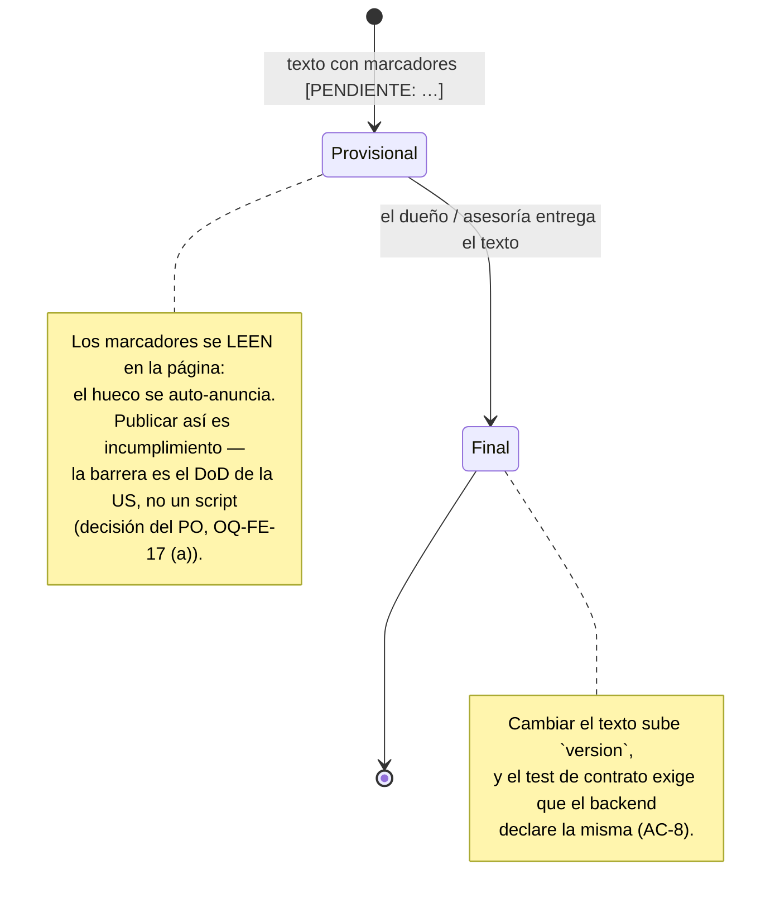

# US-017 Frontend Web — Design

## Contexto AS-BUILT

Cuatro hechos del repo enmarcan el diseño (verificados leyendo el código, 2026-08-22):

1. **El footer existe y tiene el hueco marcado.** `SiteFooter.tsx` (US-018) reserva el lugar de
   los enlaces legales con un comentario que explica por qué está vacío: un enlace legal a `#`
   en producción es peor que no tenerlo. AC-3 es completar ese hueco.
2. **El chrome público se hereda por route group.** Cualquier página bajo `app/(storefront)/`
   recibe header, `CategoryNav` y footer sin tocar el layout.
3. **La nav degrada, el sitio no.** `CategoryNav` devuelve `null` si el árbol de categorías
   falla. Es lo que permite que una página legal viva en `(storefront)` y **siga sirviendo 200
   con la API caída** — propiedad que para una obligación legal no es un lujo.
4. **No hay plugin de tipografía.** `tailwind.config.ts` declara `plugins: []`, así que
   `class="prose"` no existe. El texto largo se compone con utilidades y tokens del
   design-system.

Y un hecho que viene de otra disciplina: **US-008 backend ya decidió el versionado**.
`orders.consent_terms_version` se llena desde `LEGAL_TERMS_VERSION` (config del backend,
default `'2026-06-15'`), explícitamente «para no acoplar ese change a los textos». Este diseño
se subordina a esa decisión: no propone un endpoint de contenido ni mueve el registro del
consentimiento.

## Goals

- Dos páginas públicas, indexables y **sin dependencia del backend** (AC-1, AC-2, AC-7).
- Enlaces desde toda página pública, tomados de una fuente única (AC-3).
- Contenido con los cuatro elementos que la Ley 25.326 exige, **verificado por test** (AC-5).
- Versión publicada y trazable, alineada con la que registra la orden (AC-8).
- Imposible publicar en producción con texto provisional o sin enlaces (AC-6).
- Cero churn en las superficies entregadas (home, categorías, ficha, panel).

## Non-goals

- Servir el contenido por API o desde un CMS (E2E §3: páginas estáticas SSR).
- Construir el checkbox del checkout ni su captura (US-008).
- Redactar el texto legal definitivo (insumo del dueño).
- Instrumentar telemetría en estas páginas (US §9: sin tracking de terceros).

---

## Decisión D1: el contenido legal vive en el repo, como módulo tipado

| Opción | Cómo | Por qué no / por qué sí |
|---|---|---|
| **A. Módulo TS estructurado** (`content.ts` con secciones tipadas) ✅ | Un objeto por documento: `title`, `version`, `effective_date`, `status`, `sections[]` | **Elegida.** Cero dependencias nuevas; el texto es dato tipado, así que un test puede exigir los bloques de la Ley 25.326 (AC-5) y el gate puede leer `status` (AC-6); se renderiza con JSX sin `dangerouslySetInnerHTML` (`frontend-standards` §12) |
| B. MDX | `@next/mdx` + dos `.mdx` | Rechazada: dependencia + configuración de build para dos documentos, y el contenido deja de ser inspeccionable por un test sin parsear Markdown. El día que el dueño edite el texto va a mandar un `.docx`, no un MDX |
| C. Endpoint del backend | `GET /v1/legal/{doc}` | Rechazada: contradice el E2E §3, y ataría una obligación legal a la disponibilidad de la API — la página tiene que existir aunque la API esté caída |
| D. JSX suelto en cada `page.tsx` | El texto embebido en la página | Rechazada: el gate y el test de AC-5 tendrían que leer el JSX, y la versión quedaría duplicada en dos archivos |

**Consecuencia declarada**: cambiar el texto legal es un **deploy**. Para dos documentos que
cambian una vez al año y que exigen versionado auditable, es una propiedad, no un costo: el
cambio queda en el historial de git con autor y fecha, que es exactamente lo que un
requerimiento de la Ley 25.326 va a pedir.

**Sin `dangerouslySetInnerHTML`, nunca** (`frontend-standards` §12): las secciones son
`string[]` de párrafos que el componente mapea a `<p>`. Si algún día el texto necesitara
negritas o enlaces internos, se agrega una variante tipada de nodo, no HTML crudo.

## Decisión D2: dos rutas explícitas, no una ruta dinámica

`app/(storefront)/legales/privacidad/page.tsx` y `…/terminos/page.tsx`, cada una de tres
líneas, compartiendo `LegalDocument` + `legalMetadata`.

- **Alternativa considerada**: `legales/[doc]/page.tsx` con `generateStaticParams`. DRY, pero
  agrega una rama `notFound()` y validación de un parámetro con dos valores conocidos: es la
  maquinaria de un catálogo para un conjunto cerrado de dos. `base-standards` §1.
- **Disparador de cambio declarado**: si aparece un **tercer** documento legal (cambios y
  devoluciones, por ejemplo), promover a ruta dinámica es un refactor de 20 minutos con los
  tests ya escritos. Hasta entonces, dos archivos triviales.
- El prefijo `/legales/` (OQ-FE-15) mantiene la superficie legal agrupada y **fuera del
  namespace raíz** que ADR-0010 reserva a la navegación de catálogo.

## Decisión D3: una sola fuente para las rutas, porque tiene tres consumidores

`src/features/legal/routes.ts` exporta las rutas y el copy del consentimiento. Consumidores:
el footer (acá), las dos páginas (canonical y metadata) y **el checkbox del checkout de US-008**.

El precedente es exacto: en US-018, la URL de `wa.me` se componía inline en un solo lugar y con
el segundo y tercer consumidor se volvió el «hardcodeado disperso» que su AC-5 prohibía. Acá el
tercer consumidor **ya se sabe que viene**, y viene de otra US: si las rutas no tienen fuente
única, el checkout va a nacer con las suyas copiadas —o peor, con el `(#)` que hoy tiene el copy
del design-system §10.2— y nadie lo va a notar hasta que alguien haga clic en producción.

Por eso `routes.ts` exporta también `CONSENT_COPY`: el texto del §10.2 con sus dos destinos
reales. **No** se construye el componente del checkbox: sería UI sin pantalla donde vivir, y la
pantalla es de US-008.

## Decisión D4: Server Components puros, sin fetch y sin telemetría

- **Sin fetch**: el contenido es un import. No hay estados `loading`/`error` que modelar
  (`frontend-standards` §11.9 no aplica: no hay operación asíncrona) y la página no puede
  fallar por una dependencia externa.
- **Sin JS de cliente**: no hay handlers ni estado, así que las páginas no llevan un byte de
  bundle. Es coherente con `frontend-next-standards` §2/§7 y con el objetivo SEO.
- **Sin telemetría, a propósito**: la US §9 dice «sin tracking de terceros en estas páginas», y
  medir cuántas personas leen los términos no cambiaría ninguna decisión de producto. Instrumentar
  exigiría además volverlas Client Components. Es una decisión, no un olvido: el guard de
  T4.2 la vuelve permanente.

## Decisión D5: cómo se verifica la versión (AC-8) sin acoplar los dos apps

`[Resolved: 2026-08-22 — PO, OQ-FE-16 opción (b)]`

La versión vive **en el módulo de contenido** (junto al texto que versiona) y **no** en una env
del frontend. Poner `NEXT_PUBLIC_LEGAL_TERMS_VERSION` habría permitido que un deploy publicara
una versión que no corresponde al texto compilado — precisamente el fallo que AC-8 quiere
evitar, con un mecanismo que lo hace más fácil.

La igualdad con el backend se verifica **en la suite**, no en un script de despliegue:
`versionContract.test.ts` lee el default declarado en `apps/api/.env.example` y lo compara con
`LEGAL_DOCUMENTS.terminos.version`. Al caer el gate de OQ-FE-17 (a), la suite es el único lugar
que corre solo en cada CI — y por eso termina siendo **más fuerte** que la idea original, que
dependía de que US-019 enganchara un script al pipeline.

Consecuencia declarada: esta US agrega **una línea** a `apps/api/.env.example`
(`LEGAL_TERMS_VERSION=2026-06-15` + comentario apuntando a US-008), porque un contrato con un
solo extremo declarado no se puede verificar. Es aditivo y sin código. Lo que el test **no**
cubre —que el valor configurado en Railway coincida— queda `Deferred: US-019`.

## Decisión D6: el texto provisional no tiene gate automático

`[Resolved: 2026-08-22 — PO, OQ-FE-17 opción (a)]`

Se evaluó bloquear el despliegue con un `status: 'draft'` en el módulo de contenido leído por un
script (`check-legal-content.mjs`, hermano del gate del número de WhatsApp). **El PO eligió no
construirlo**, y el argumento se sostiene: el script no correría hasta que US-019 enganche el
pipeline, así que sería protección de papel; y el DoD de la US ya tiene el gate donde el riesgo
se decide —«texto legal final provisto y revisado por el dueño / asesoría legal»—.

Consecuencias, escritas para que nadie las descubra después:

- **Cae el campo `status`** del tipo de documento: sin lector, sería dato muerto (`AGENTS.md`
  §1.2). El módulo queda con `version` + `effective_date`, que sí tienen lectores (la página y
  el test de contrato).
- **El texto provisional se auto-anuncia**: los `[PENDIENTE: …]` van dentro del texto, así que
  se **leen en la página**. Quien esté por publicar y abra `/legales/terminos` ve el hueco.
- **Riesgo residual aceptado**: si alguien despliega antes de que llegue el texto final, el
  sitio publica legales incompletos. Es incumplimiento con apariencia de cumplimiento, y la
  única barrera es humana. Queda en el checklist de despliegue de `Deferred: US-019` y en el
  README (T6.1).

## Approach

### Estructura

```
apps/web/src/features/legal/
├── content.ts             # documentos tipados: version, effective_date, status, sections
├── routes.ts              # fuente única de rutas + CONSENT_COPY (seam de US-008)
├── LegalDocument.tsx      # Server Component presentacional (h1 + versión + secciones)
└── legalMetadata.ts       # title/description/canonical por documento

apps/web/app/(storefront)/legales/
├── privacidad/page.tsx    # 3 líneas: metadata + <LegalDocument doc={privacy} />
└── terminos/page.tsx      # idem
```

Fuera del feature, tres extensiones acotadas de código existente:

- `src/features/contact/SiteFooter.tsx` — los dos enlaces reemplazan el comentario `Deferred:`.
- `src/features/storefront/sitemap.ts` — las dos URLs legales, **antes** de la rama de
  degradación (hoy un fallo del árbol devuelve sólo la home; las páginas legales no dependen del
  árbol, así que no tienen por qué desaparecer del sitemap cuando la API falla).
- `apps/api/.env.example` — **una línea**: `LEGAL_TERMS_VERSION=2026-06-15` con un comentario que
  apunta a US-008. Cruza la frontera de disciplina a propósito y por lo mínimo: un contrato con
  un solo extremo declarado no se puede verificar (D5).

### Forma del contenido

```ts
export interface LegalSection {
  /** Encabezado de la sección — se renderiza como <h2>. */
  heading: string;
  /** Párrafos. Texto plano: nunca HTML (frontend-standards §12). */
  paragraphs: string[];
}

export interface LegalDocument {
  slug: 'privacidad' | 'terminos';
  title: string;
  /** Fecha ISO. Es la MISMA que registra `orders.consent_terms_version` (US-008). */
  version: string;
  effective_date: string;
  /** Bloques obligatorios de la Ley 25.326 — el test de AC-5 los exige por clave. */
  required: {
    controller: LegalSection;   // responsable del tratamiento
    purpose: LegalSection;      // finalidad del uso de datos
    rights: LegalSection;       // derechos del titular
    contact: LegalSection;      // canal de contacto
  };
  extra: LegalSection[];
}
```

Modelar los cuatro bloques **como claves** y no como elementos de un array es lo que hace el
test de AC-5 fuerte: no comprueba «hay al menos cuatro secciones», comprueba que **cada** bloque
que la ley exige existe y tiene contenido. Un texto final que se olvide de los derechos del
titular no compila el test.

### Jerarquía y estilo del documento

- `<h1>` único con el título; `<h2>` por sección (`design-system` §11: headings en orden).
- Ancho de lectura acotado (`max-w-prose`, que **sí** existe como utilidad de Tailwind core) y
  tokens del design-system para color y espaciado. Sin `class="prose"`: el plugin no está.
- La versión se muestra bajo el `<h1>` en un `<p>` con `<time datetime>`: legible por humanos y
  por máquinas, y es la mitad visible de AC-8.

### Metadata (AC-1, AC-2)

Espeja `metadata.ts` de US-003: `title` con `SITE_NAME`, `description` acotada a 160,
**canonical absoluta** desde `NEXT_PUBLIC_SITE_URL`. Sin `noindex`: las páginas legales son
públicas e indexables a propósito (la US lo pide explícitamente en §9), y `robots.ts` ya
permite `/`.

Sin JSON-LD: no hay tipo de `schema.org` que aporte algo a un documento legal, y el objetivo SEO
del PRD es que se encuentren los **productos**.

## Mapa de estados de UI

No hay operación asíncrona, así que no hay máquina de estados de datos. Los estados que sí
existen son de **contenido**, y su transición es humana (D6: sin gate automático):



Estado de error de la **página**: no existe uno propio. Sin fetch no hay 5xx que manejar, y un
slug inexistente bajo `/legales/` cae en el `not-found` de Next sin código nuestro. El único
modo de falla real es que la API esté caída, y ahí la página sirve 200 igual (D1 + AS-BUILT 3).

## Testing (dev-owned; `qa-frontend-standards` §2.1)

| Capa | Qué cubre | Dónde |
|---|---|---|
| **Unit** (Vitest) | los 4 bloques de la Ley 25.326 por documento (schema Zod que **rechaza** un documento incompleto); forma de `version` (ISO) e igualdad con `effective_date`; **igualdad con `LEGAL_TERMS_VERSION` del backend** (AC-8); rutas de fuente única; `CONSENT_COPY` sin `#`; metadata (canonical absoluta, título, longitud de description); sitemap con las dos URLs **incluso degradando** | `src/features/legal/*.test.ts`, `src/features/storefront/sitemap.test.ts` |
| **Componente** (RTL) | `LegalDocument`: `<h1>` único, un `<h2>` por sección, versión visible con `<time>`; `SiteFooter` con los dos enlaces y sus nombres accesibles | `LegalDocument.test.tsx`, `SiteFooter.test.tsx` |
| **A11y** (axe) | las dos páginas sin violaciones; jerarquía de headings | `legalA11y.test.tsx` |
| **Guards** | sin `fetch`/cliente HTTP, sin `'use client'`, sin telemetría en el camino legal | `noBackendNoTracking.test.tsx` |
| **E2E** (Playwright) | las dos rutas devuelven **200 con el contenido en el HTML servido** y sin cookies (AC-7); el footer de cualquier página pública las enlaza (AC-3); aparecen en `/sitemap.xml`; el panel no las enlaza en su chrome | `e2e/legal-pages.spec.ts` |

Fuera de esta capa: la revisión del contenido legal por el dueño/asesoría (no es test
automatizable y **es el gate de producción** tras la decisión OQ-FE-17 (a)), el BDD de
aceptación cross-stack y la verificación del checkbox del checkout (pertenece a US-008) — van a
`/plan-qa`.

## Trade-offs

| Decisión | Se gana | Se paga |
|---|---|---|
| Contenido en el repo (D1) | Cero infra, versionado auditable en git, testeable, sirve con la API caída | Cambiar una coma del texto legal es un deploy |
| Dos rutas explícitas (D2) | Sin rama `notFound()` ni parámetro que validar; type safety total | Metadata y page duplicadas (3 líneas cada una); un tercer documento pide refactor |
| Versión en el código, no en env (D5) | Imposible publicar una versión que no corresponda al texto compilado | Subir la versión exige tocar dos lugares (el módulo del FE y el `.env.example` del BE) — el test de contrato lo caza en CI |
| Sin telemetría (D4) | Cero JS de cliente en las páginas; cumple US §9 | No se sabrá cuánta gente lee los términos (nadie va a decidir nada con ese dato) |
| **Sin gate automático del texto provisional** (D6, OQ-FE-17 (a)) | Cero maquinaria que nadie invoca; el gate vive donde se decide publicar (DoD de la US) | **Si alguien despliega antes del texto final, el sitio publica legales incompletos.** Mitigación: los `[PENDIENTE: …]` se leen en la página + checklist de US-019 |
| El test de contrato toca `apps/api/.env.example` (una línea) | AC-8 queda verificado hoy, no cuando US-008 esté construida | Cruza la frontera de disciplina; conflicto de una línea si US-008 lo agrega en paralelo |

**Deuda declarada**: mientras el texto sea provisional, el sitio **no debería** ir a producción —
la US lo pide (AC-6) y su DoD lo lista como gate. Tras la decisión OQ-FE-17 (a) esa barrera es
**humana**: no hay script que la haga cumplir. La deuda no es técnica (es un insumo de negocio
pendiente, con dueño), pero el riesgo de que alguien la saltee sí es real y queda escrito acá,
en el README y en el checklist de despliegue de US-019.

## Recomendación de despliegue

**Sí correr `/plan-deployment`, aunque el change sea chico**, y ahora con un motivo más:

1. **Es un gate legal, no una feature.** El despliegue de US-008/US-009 (cobrar) no puede
   ocurrir antes que esto. El orden importa y conviene que quede escrito.
2. **El gate del texto provisional es humano** (OQ-FE-17 (a)): el checklist de despliegue es el
   **único** lugar donde esa verificación puede vivir. Si no entra ahí, no existe.
3. **Un guard sigue esperando enganche**: `check-whatsapp-configured.mjs` (US-018). Mismo job.

No hay migración, ni variable de entorno nueva en el web, ni cambio de contrato de API: el riesgo
de despliegue es cero en lo técnico y alto en lo legal.

## Riesgos y mitigaciones

| Riesgo | Prob. | Impacto | Mitigación |
|---|---|---|---|
| **Se publica el texto provisional** | **media-alta** (ya no hay gate automático) | **alto** (incumplimiento con apariencia de cumplir) | Marcadores `[PENDIENTE: …]` **visibles en la página** + gate humano del DoD + checklist de despliegue de `Deferred: US-019` + README (T6.1). Decisión consciente del PO (OQ-FE-17 (a)), no un olvido |
| La versión publicada difiere de `LEGAL_TERMS_VERSION` del BE | media | alto (AC-8 se vuelve falso) | `versionContract.test.ts` en la suite (T4.3): corre en cada CI, no depende de que nadie lo invoque |
| Conflicto con la sesión de US-008 sobre `apps/api/.env.example` | media | bajo | Una línea aditiva; el conflicto es trivial y visible. Alternativa declarada: dejar T4.3 `Gated:` |
| El checkout de US-008 nace con `href="#"` (el copy del §10.2 lo tiene así) | media | medio | `routes.ts` + `CONSENT_COPY` como seam, documentado en el README y en la matriz de AC como deferral con dueño |
| Alguien agrega `class="prose"` asumiendo el plugin | baja | bajo | Declarado en AS-BUILT y en D-Jerarquía; el test de componente fija las clases estructurales |
| Colisión de working tree con otra sesión (`apps/web` compartido) | **alta** | medio | P1 bloqueante: `git status --porcelain -- apps/web` vacío antes de empezar. Ya pasó tres veces en este repo |
| Un tercer documento legal aparece a mitad de camino | baja | bajo | Disparador de refactor declarado en D2 |

## ADR triggers

**Ninguno.** Verificado contra los 14 ADR vigentes: ninguna decisión de este change contradice
ni extiende una decisión de arquitectura.

| Decisión de este change | ADR que la gobierna | ¿Desvía? |
|---|---|---|
| Páginas legales en la superficie pública | ADR-0010 (namespace storefront vs admin) | No |
| Contenido en el repo, sin endpoint | E2E §3 capacidad 10 (no hay ADR: no es decisión de plataforma) | No |
| Versionado del consentimiento por configuración del backend | decisión de `US-008-checkout-guest-backend` | No — la hereda |

## Delta de contrato

**Ninguno.** No se consume ni se modifica `apps/api/docs/api/openapi.yaml`; el cliente generado
no cambia y el gate `frontend-codegen-fresh` no aplica.

## References

- US: `docs/user-stories/US-017-paginas-legales-consentimiento.md` (AC-1..AC-8, §9 NFRs, §10 notas)
- PRD: `docs/product/prd.md` §2.1 cap. 10 · §6 (retención) · §246 (base legal)
- E2E: `docs/product/design-e2e.md` §3 fila 10 · §8 (`ORDERS.consent_accepted`) · §23 Q-3
- Design system: `docs/product/design-system.md` §7.10 (footer) · §10.2 (copy del consentimiento) · §11 (WCAG AA) · §12 (SSR/SEO)
- ADR-0010 — namespace de URLs storefront vs admin
- Changes relacionados: `US-018-contacto-whatsapp-frontend-web` (el footer y el patrón de gate),
  `US-008-checkout-guest-backend` (`LEGAL_TERMS_VERSION`, `consent_terms_version`),
  `US-002-storefront-navegacion-categorias-frontend-web` (sitemap, metadata, harness E2E)
- Estándares: `frontend-standards` §2.1/§7/§10/§12 · `frontend-next-standards` §1/§2/§6/§7/§8 ·
  `qa-frontend-standards` §19/§23.2/§23.4/§23.6 · `testing-standards` §14 · `base-standards` §1
