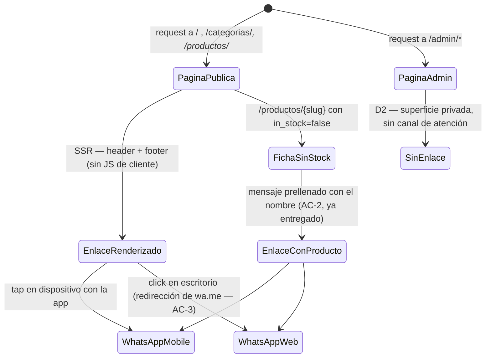

# US-018 Frontend Web — Design

## Contexto

US-018 llega **después** de que US-003 ya entregara el canal de WhatsApp en la ficha sin
stock. El diseño de este change no arranca de cero: arranca de un inventario de lo que existe
(ver `proposal.md` §"Lo que ya está construido") y decide sólo sobre el hueco. Las decisiones
de forma del enlace —ícono + texto, `target="_blank"` + `rel="noopener noreferrer"`, ≥44px,
copy §10.2— **ya están tomadas y validadas por axe en browser real**; acá no se re-deciden,
se **generalizan** a una pieza reutilizable para no re-implementarlas mal en dos lugares más.

El único cambio de arquitectura es la aparición de una **feature transversal nueva**
(`src/features/contact/`) y del **primer footer del sitio**.

## Objetivos

- Un enlace de WhatsApp presente en **toda** página pública, sin tocar ninguna página.
- **Una sola** definición de qué es "el enlace de WhatsApp de DSM" (AC-5).
- Convertir AC-4 de propiedad verdadera en propiedad **protegida**.
- Cero JS de cliente adicional en las páginas públicas.

## No-objetivos

- Re-construir AC-2 (ya entregado).
- Detección de dispositivo para AC-3 (ver D4).
- `TrustSignals` completo, páginas legales, horarios (ver `proposal.md` §Out of scope).

---

## Decisiones

### D1 — Un módulo `contact` con el href como función pura; el componente no compone URLs

**Decisión.** Nace `src/features/contact/` (package-by-feature, `frontend-standards.md` §2.1)
con dos piezas y una frontera clara entre ellas:

- `whatsapp.ts` — **función pura** `whatsappHref(message?)` + el catálogo de mensajes
  prellenados. Es el **único** lugar del repo donde se construye la URL `https://wa.me/`
  (el token suelto `wa.me` aparece además en un comentario de `env.ts`, que es correcto — por
  eso el gate busca el literal de la URL, no la palabra).
- `WhatsAppLink.tsx` — componente presentacional que **consume** el href; no lo construye.

**Alternativas consideradas.**

- *(A)* Dejar la composición en cada consumidor (statu quo extendido a 3 lugares). Es lo que
  AC-5 prohíbe con nombre y apellido ("no está duplicado/hardcodeado disperso por el código").
  Descartada.
- *(B)* Sólo el componente compartido, sin helper: cada consumidor pasa un mensaje y el
  componente arma la URL. Cubre los tres casos de hoy, pero deja el `wa.me` atado a React —
  un futuro `mailto`-style share, un `sitemap`, un JSON-LD `contactPoint` o un test de
  contrato no podrían reusarlo sin renderizar. Y el gate de AC-5 (un único archivo con el
  literal) queda igual de fácil con helper que sin él.
- *(C)* Helper + componente (elegida). El costo es un archivo más; el beneficio es que la
  **regla de AC-5 se vuelve verificable con una línea**: "ningún archivo fuera de
  `whatsapp.ts` menciona `wa.me`".

**Por qué la función es pura y no un hook.** No hay estado, ni efecto, ni ciclo de vida: es
`(string?) => string` leyendo una env inlineada en build. Un hook obligaría a que todo
consumidor fuera Client Component y tiraría por la borda D3.

**ADR disparado**: no. Es organización interna de una feature, reversible en minutos
(`base-standards.md` §1 — reversibilidad).

### D2 — El enlace vive en el layout `(storefront)`; el panel NO lo lleva

**Decisión.** El header y el footer con WhatsApp se montan en
`apps/web/app/(storefront)/layout.tsx`. Los route groups `(admin)` y `(auth)` **no** los
reciben.

**Por qué es una decisión y no una omisión.** ADR-0010 partió el espacio de URLs: el
storefront se quedó con la raíz pública y el panel se mudó a `/admin/*`. Esa partición no es
sólo de URLs — es de **audiencia**. `(admin)` es la superficie privada del dueño de DSM: él
*es* el que atiende el WhatsApp. Ofrecerle un botón para escribirse a sí mismo es ruido, y
peor: convierte una señal de confianza pensada para un comprador anónimo en un elemento
decorativo del backoffice, donde §7.9 pide densidad de datos, no señales de venta. Además
`/admin/*` ya sirve `X-Robots-Tag: noindex` — es explícitamente territorio no público.

**Consecuencia verificable**: T2.1 assert que el HTML servido de `/admin/productos` **no**
contiene `wa.me`. Sin ese assert, un futuro refactor que suba el footer a `app/layout.tsx`
(el raíz, compartido) pasaría desapercibido.

### D3 — Server Components: el footer y el header no llevan un byte de JS al cliente

**Decisión.** `WhatsAppLink` y `SiteFooter` se escriben **sin** `"use client"`
(`frontend-next-standards.md` §2: Server Components por defecto, `"use client"` empujado a
las hojas).

Son un `<a>` con un `<svg>`: no tienen estado, ni handlers, ni APIs de browser. Meterlos en
el bundle del cliente costaría JS en **todas** las páginas públicas —las que tienen
presupuesto de LCP y son las que Google mide— a cambio de nada.

**Detalle no obvio**: `ProductPurchase` **sí** es `'use client'` (tiene `onAddToCart`), y al
importar `WhatsAppLink` lo arrastra al bundle del cliente en esa ruta. Es correcto y
esperado: el módulo no tiene código server-only (nada de `fs`, secretos ni acceso a datos —
`frontend-next-standards.md` §2), sólo lee `publicEnv`, que Next inlinea en build. Lo que
**no** puede pasar es lo inverso: que `whatsapp.ts` importe algo server-only. T3.1 lo cubre.

### D4 — AC-3 (escritorio) se **verifica**, no se construye

**Decisión.** No se escribe ni una línea de detección de dispositivo. `wa.me` es un servicio
de redirección de la propia WhatsApp: resuelve del lado de ellos si mandar al usuario a la
app móvil, a WhatsApp Web o a la app de escritorio. Un `<a href="https://wa.me/{dígitos}">`
**es** el mecanismo canónico.

**Alternativa descartada**: rama por User-Agent (`web.whatsapp.com` en desktop, `wa.me` en
mobile). Sería más código, más frágil (el UA sniffing se rompe con cada release y con cada
navegador nuevo), y **peor**: duplicaría una decisión que WhatsApp toma con más información
que nosotros — y que además cambia sin avisarnos. Es el anti-patrón exacto que
`base-standards.md` §1 (KISS/YAGNI) señala.

**Lo que sí se hace**: blindar la **forma** del href, porque es la forma lo que hace que la
redirección funcione. Dos maneras conocidas de romperla sin darse cuenta: escribir el número
con `+` o con guiones (`wa.me` espera sólo dígitos — ya lo protege el regex de Zod en
`env.ts`), y usar `api.whatsapp.com/send?phone=` en vez de `wa.me/`. T1.1 fija la forma
canónica con un test y T4.1 la verifica sobre el HTML **servido**.

### D5 — AC-4: la ausencia de red se prueba con un espía, no con un grep

**Decisión.** El guard de AC-4 (`noBackend.test.tsx`) espía `globalThis.fetch` mientras
renderiza el footer, el header y la ficha sin stock, y **falla si fue llamado ni una vez**.

**Por qué así y no de otra forma.** El criterio de AC-4 es *comportamental* ("el contacto se
resuelve sin llamar al backend"), y un `grep` de `fetch` en los archivos nuevos es
*estructural*: pasaría en verde si alguien importara un servicio que internamente llama a
`customFetch` — que es precisamente cómo se rompería en la práctica (nadie escribe `fetch(`
a mano en este repo; F48 lo prohíbe y el choke point es `customFetch`). El espía sobre
`globalThis.fetch` está **por debajo** de `customFetch`, así que atrapa cualquier ruta:
directa, vía servicio, vía cliente generado, vía Server Action.

MSW ya corre con `onUnhandledRequest: 'error'` (`src/test/setup.ts`), lo que da una segunda
red — pero sólo para endpoints **no** mockeados; si alguien llamara a un endpoint que ya
tiene handler, MSW lo dejaría pasar en silencio. Por eso el espía es el assert primario y
MSW el complemento.

**La otra mitad de AC-4 — "no expone datos sensibles"** — se prueba con dos asserts sobre el
href: (1) el único parámetro de query es `text`, y (2) el mensaje decodificado no contiene
precio, SKU, id ni nada del comprador. Ambos fallarían el día que alguien "mejore" el mensaje
prellenado con el carrito o el email del cliente.

### D6 — El mensaje se codifica siempre; hay un caso real que lo rompe

**Decisión.** `whatsappHref` aplica `encodeURIComponent` al mensaje, **sin excepción**, y hay
un test con un nombre de producto adversarial.

No es paranoia teórica: el catálogo es de **ferretería y refrigeración**, donde los nombres
reales llevan comillas y ampersands (`Caño 1/2" & codo #3`, `Perfil L 3/4"`). Sin codificar:

- el `#` corta la URL — WhatsApp recibiría un mensaje truncado a la mitad;
- el `&` **inyecta un parámetro de query nuevo** en la URL de un tercero;
- la `"` rompe el atributo HTML al serializar.

El test hace round-trip: construir → `decodeURIComponent` → comparar contra el original, y
además assert que la URL tiene **exactamente un** parámetro de query. El `ProductPurchase`
actual ya codifica; el refactor de T1.3 no puede perderlo, y este test es la garantía.

### D7 — El refactor de `ProductPurchase` es *behavior-preserving*, con red previa

**Decisión.** T1.3 es un **Extract + Move** en vocabulario Fowler (`refactoring-discipline`):
el bloque que arma `message`/`href` se va a `whatsapp.ts` y el `<a>` se reemplaza por
`<WhatsAppLink>`. **Nada observable cambia**: mismo texto, mismo href, mismas clases, mismo
`rel`.

La red de seguridad **ya existe y es buena**: los 5 tests de `ProductPurchase.test.tsx` + el
de `a11y.test.tsx` + el E2E `pdp-ssr.spec.ts` fijan exactamente el comportamiento externo.
Por eso el criterio de salida de T1.3 es *"los tests de US-003 pasan sin ser modificados"* —
si hay que tocarlos, no fue un refactor. Los cinco checks de revisión de
`refactoring-discipline` aplican al diff, en especial el 4 (los comentarios que explican el
**por qué** —el del contraste `text-gray-600` vs `-500`, medido con axe— son oro y no se
borran) y el 3 (nada de nombres genéricos tipo `getLink`).

**Riesgo asumido y acotado**: si el refactor rompiera algo, rompe una superficie **ya
entregada** de US-003. Mitigación: T1.3 va después de T1.1/T1.2 (la pieza nueva ya probada
por su cuenta) y su `Verify` corre la suite **completa** de la ficha, no sólo los tests
nuevos.

### D8 — El layout no gana un `loading.tsx` (F59, restricción heredada)

**Restricción heredada, no decisión nueva.** US-003 `design.md` D1.bis midió que un
`loading.tsx` en el route group `(storefront)` envuelve la ruta en una boundary de Suspense;
Next entonces transmite el shell con **status 200 ya comprometido**, y un `notFound()`
posterior ya no puede fijar un 404 real — llega como fallback de streaming dentro de un 200.
Es el soft-200 que AC-7/AC-8 de US-003 prohíben.

Este change **toca el layout de ese route group**, así que la restricción lo alcanza de
lleno: **no se agrega `loading.tsx` en ningún nivel de `(storefront)`**. Tampoco hace falta:
el footer es estático, no espera ningún dato. El chequeo suite-level lo verifica de forma
acotada al route group (el `(admin)` sí tiene su `loading.tsx` y debe seguir teniéndolo).

### D9 — Guard del placeholder fuera del build (OQ-FE-12, opción c)

**Decisión (pendiente de ratificación).** Script `apps/web/scripts/check-whatsapp-configured.mjs`
que sale con código ≠ 0 si `NEXT_PUBLIC_WHATSAPP_PHONE` falta o es el placeholder de fábrica,
invocado **sólo desde el job de despliegue**.

El razonamiento completo y las alternativas están en `proposal.md` §Preguntas abiertas
(OQ-FE-12). El punto de diseño clave: un guard **dentro de `env.ts`** —la opción intuitiva—
mataría la suite E2E, porque el `webServer` de Playwright corre un build de producción real
(`pnpm build && pnpm start`) sin esa env. Poner el gate en el pipeline separa "el código está
bien" de "esta publicación está lista", que son dos preguntas distintas y merecen dos gates
distintos.

**El enganche al pipeline es `Deferred: US-019`** (infra es dueña del deploy). Declarado, no
silencioso — F51.

### D10 — Telemetría acotada a la ficha (OQ-FE-13, opción c) — **gated**

**Decisión (pendiente de ratificación).** Un único evento `whatsapp_click` con
`{ context: 'pdp_out_of_stock' }`, emitido desde `ProductPurchase` (que ya es Client
Component → costo marginal en bytes: **cero**), registrado en el set `PUBLIC_EVENTS` de
`src/lib/observability/events.ts`.

**El detalle que importa**: `track()` inyecta `operator_id: 'admin'` por defecto a todo evento
que no esté en `PUBLIC_EVENTS`. Un `whatsapp_click` de un comprador anónimo etiquetado como
acción del dueño ensuciaría las métricas de US-016 exactamente igual que habría pasado con
`pdp_shown`. Va en `PUBLIC_EVENTS`, y el test lo verifica.

**Sin PII** (`observability-patterns` §8): el evento lleva `context` y `product_slug`; nunca
el mensaje, ni el número, ni nada del visitante.

Si OQ-FE-13 se ratifica como (a) "sin evento", T5.2 se elimina y la matriz de trazabilidad se
actualiza — no queda como deuda muda.

### D11 — Secuencia: este change **espera** a que US-002 FE cierre

**No es una nota al pie: es un pre-requisito con condición verificable** (P1 en `tasks.md`).

Otra sesión estuvo ejecutando `/develop-frontend-web US-002` en **el mismo working tree**
durante esta sesión de planning.

**Radio de colisión medido**, archivo por archivo:

| Archivo que US-018 necesita | ¿US-002 lo toca? | Al **abrir** el planning | Al **cerrar** el planning |
|---|---|---|---|
| `app/(storefront)/layout.tsx` | **Sí** (T3.1 — `CategoryNav`) | committed, fuera de `git status` | committed |
| `apps/web/README.md` | **Sí** (T8.1) | **modificado sin commitear** | committed |
| `apps/web/e2e/` + `e2e/support/api-stub.mjs` | **Sí** (T7.2–T7.4) | committed, fase abierta | committed, fase cerrada |
| `src/features/contact/*` (todo nuevo) | No | libre | libre |
| `src/features/storefront/ProductPurchase.tsx` | No | libre | libre |

**La ventana se cerró mientras se planificaba**: al cerrar, US-002 FE no tiene ninguna task
abierta y `git status --porcelain -- apps/web` está vacío (`9da1e86`). Eso **no elimina el
pre-requisito**, lo vuelve barato: siguen activas otras dos sesiones (US-014 y US-006, ambas
en `apps/api`) sobre el mismo árbol, y P1 se corre igual al empezar la ejecución. Un
pre-requisito que se da por cumplido "porque lo estaba al planificar" es exactamente cómo se
pierde trabajo.

**Decisión: US-018 espera** (y a esta altura la espera ya se consumió sola). No se scopea "a
los archivos que US-002 no toca", porque los dos que sí comparte —`layout.tsx` y
`README.md`— son justamente donde vive el grueso de AC-1 y la documentación obligatoria. Un
scope parcial dejaría AC-1 sin cerrar.

**Por qué esperar y no "coordinar sobre la marcha".** El modo de falla no es un merge
conflict —eso Git lo grita—, sino el silencioso: un `git add -A` de una sesión barre archivos
sin commitear de la otra. Ya ocurrió **tres veces** en este repo. La espera cuesta horas; el
barrido cuesta trabajo perdido que además se descubre tarde.

**Condición de salida, verificable y sin juicio humano**: (1) `git status --porcelain -- apps/web`
vacío, y (2) `tasks.md` de US-002 FE sin ninguna task `- [ ]` abierta. Ambas en el `Verify`
de P1. Si P1 falla, `/develop-frontend-web` **para** — no negocia.

---

## Árbol de componentes

```
app/(storefront)/layout.tsx                  [Server]  ← MODIFICADO
├── <header>
│   ├── <Link href="/">  DSM …               (existente)
│   ├── <WhatsAppLink variant="ghost" …/>    [Server]  ← NUEVO (AC-1 header)
│   └── <CategoryNav/>                       (existente, US-002)
├── <main>{children}</main>
│   └── … /productos/[slug] → <ProductDetail>
│         └── <ProductPurchase>              [Client]  ← REFACTORIZADO (AC-2, sin cambio observable)
│               └── <WhatsAppLink variant="accent" message={product(name)}/>
└── <SiteFooter/>                            [Server]  ← NUEVO (AC-1 footer)
      └── <WhatsAppLink variant="accent" message={general}/>

src/features/contact/
├── whatsapp.ts        función pura: whatsappHref(message?) + WHATSAPP_MESSAGES   ← única fuente (AC-5)
└── WhatsAppLink.tsx   presentacional: ícono + texto, target/rel, ≥44px, focus ring
```

**Contrato de `WhatsAppLink`**

| Prop | Tipo | Default | Nota |
|---|---|---|---|
| `label` | `string` | — | **obligatorio**: es el nombre accesible. Sin él no hay componente (§7.14: nunca sólo ícono) |
| `message` | `string \| undefined` | `undefined` | sin mensaje → href sin query |
| `variant` | `'accent' \| 'ghost'` | `'accent'` | mapea a los tokens de `Button` (`bg-accent-strong` / transparente) |
| `className` | `string \| undefined` | — | vía `cn`, para el layout del contenedor; nunca para pisar color o tamaño táctil |

**A11y** (design-system §11, `qa-frontend-standards.md` §19): el ícono va `aria-hidden`, el
nombre accesible sale del texto; `min-h-[44px]`; `focus-visible:shadow-focus`; contraste del
`accent-strong` sobre blanco ya verificado en §2.4 del design-system. El footer es un
`<footer>` nativo → landmark `contentinfo` sin `role` explícito.

## Estados de UI

Este change **no tiene estados asíncronos**: no hay fetch, ni mutación, ni carga
(`frontend-standards.md` §11.9 aplica por vacío — y esa ausencia *es* AC-4). Los únicos ejes
de variación son:

| Eje | Estados | Resolución |
|---|---|---|
| Superficie | pública `(storefront)` / privada `(admin)`, `(auth)` | enlace presente / **ausente** (D2) |
| Stock de la ficha | con stock / sin stock | CTA de compra / canal humano (ya entregado, US-003) |
| Mensaje | genérico (header, footer) / referido al producto (ficha) | `WHATSAPP_MESSAGES.general` / `.product(name)` |
| Número | configurado / placeholder de fábrica | dev: funciona igual · deploy: **bloqueado** (D9) |
| Viewport | mobile / desktop | footer apila en columna; el destino lo resuelve `wa.me` (D4) |



## Plan de pruebas

| Capa | Qué prueba | Dónde |
|---|---|---|
| Unit | forma canónica del href, uso de la env, encoding adversarial, un solo query param | `whatsapp.test.ts` |
| Componente (RTL) | nombre accesible, `target`/`rel`, ícono `aria-hidden`, variantes, ≥44px | `WhatsAppLink.test.tsx`, `SiteFooter.test.tsx` |
| Guard AC-4 | `globalThis.fetch` nunca llamado; sin datos sensibles en la URL | `noBackend.test.tsx` |
| A11y (axe) | header + footer sin violaciones | `contactA11y.test.tsx` |
| No-regresión | los 5 tests de `ProductPurchase.test.tsx` + a11y de US-003, **sin modificar** | existentes |
| E2E (Playwright) | enlace en el HTML **servido** de `/` y de un rubro; ausente en `/admin/*` | `e2e/site-contact.spec.ts` |
| E2E existente | ficha sin stock con `wa.me` (AC-2) | `e2e/pdp-ssr.spec.ts` (ya verde) |
| Gate estructural | ningún archivo fuera de `whatsapp.ts` construye `https://wa.me/` (AC-5) | `Verify` de T1.3 |

**Lo que NO se prueba**: la navegación real a WhatsApp. Es un servicio de terceros; un test
que lo visite sería lento, no determinista y estaría probando a WhatsApp, no a DSM. El límite
del sistema es el `<a href>` correcto en el HTML servido.

## Riesgos y mitigaciones

| Riesgo | Prob. | Impacto | Mitigación |
|---|---|---|---|
| Colisión en el working tree compartido (US-002 cerró; siguen activas US-014 y US-006 en `apps/api`) | Media | **Alto** (trabajo perdido en silencio; ocurrió 3×) | P1 bloqueante con condición verificable (D11), re-corrido al empezar; `/develop` para si falla |
| El refactor de T1.3 rompe AC-2, superficie ya entregada | Media | Alto | Tests de US-003 **sin modificar** como criterio de salida (D7); T1.3 después de T1.1/T1.2 |
| El placeholder llega a producción → canal de contacto muerto | Media | **Alto** (peor que no ofrecerlo) | D9 + recomendación de despliegue explícita |
| El footer se sube al `app/layout.tsx` raíz en un refactor futuro y aparece en el panel | Baja | Medio | Assert E2E de ausencia en `/admin/*` (D2) |
| Nombre de producto con `&`/`#`/`"` rompe la URL | Media (catálogo de ferretería) | Medio | `encodeURIComponent` + test de round-trip adversarial (D6) |
| Alguien enruta el contacto por la API "para trackear" | Baja | Medio | Espía de `fetch` (D5) |
| Un `loading.tsx` futuro en `(storefront)` reintroduce el soft-200 | Baja | Alto (SEO) | D8 + chequeo suite-level acotado al route group |

## Cobertura de las decisiones (F51)

Toda declaración de este diseño tiene task que la construye o `Deferred:` explícito:

| Decisión | Task | |
|---|---|---|
| D1 helper + componente | T1.1, T1.2 | |
| D2 layout `(storefront)`, panel excluido | T2.1, T2.2, T4.1 | |
| D3 Server Components sin JS de cliente | T2.1 (`Verify` incluye la ausencia de `"use client"`) | |
| D4 AC-3 verificado, no construido | T1.1, T4.1 | |
| D5 guard de red | T3.1 | |
| D6 encoding adversarial | T1.1 | |
| D7 refactor con red | T1.3 | |
| D8 sin `loading.tsx` | chequeo suite-level | |
| D9 guard del placeholder | T5.1 · enganche al pipeline `Deferred: US-019` | |
| D10 telemetría | T5.2 · `Gated: OQ-FE-13` | |
| D11 secuencia vs US-002 | P1 | |
| A11y §11 | T3.2 | |
| Documentación (`documentation-standards` §11.1) | T6.1 | |
| Legales del footer | — | `Deferred: US-017` |
| Horarios del local | — | `Deferred: OQ-FE-14 (dueño)` |
| Resto del top-nav (buscador/carrito/cuenta) | — | `Deferred: US-004 / US-007 / US-014` |
| `TrustSignals` completo (pago seguro, mapa, retiro) | — | `Deferred: US-008 / US-009` |
| Número real de WhatsApp | — | `Deferred: OQ-FE-3 (PO/cliente)` |

## Recomendación de despliegue

**OQ-FE-3 no bloquea el desarrollo; bloquea la publicación.** La distinción es operativa, no
retórica:

1. **Desarrollo, tests y E2E**: proceden hoy con el placeholder. Todo se cablea contra la env.
2. **Despliegue a producción (US-019)**: **no publicar sin el número real**. Un footer y un
   header que ofrecen "Hablá con nosotros" hacia un número que no existe es **peor que no
   ofrecer el canal**: el visitante escribe, nadie contesta, y la señal de confianza que §7.14
   buscaba construir se convierte en su opuesto exacto — para una tienda cuyo problema
   declarado es no tener reputación.
3. **Cómo se hace cumplir**: D9 / OQ-FE-12 opción (c) — gate en el job de deploy, no en el
   build. El script se entrega acá; el enganche al pipeline es `Deferred: US-019`.
4. **Acción concreta pendiente**: pedirle a DSM el número de WhatsApp de atención en formato
   internacional sin `+` ni separadores (ej. `5491122334455`). **Owner: PO/cliente. Revisit:
   antes del primer deploy (US-019).**

## Referencias

- US: `docs/user-stories/US-018-contacto-whatsapp.md`
- PRD cap. 12 (`docs/product/prd.md:78`) · E2E §55, §92 (`docs/product/design-e2e.md`)
- `docs/product/design-system.md` §7.10, §7.14, §8, §10.2, §11
- `docs/architecture/decisions/0010-url-namespace-storefront-vs-admin.md`
- Changes relacionados: `US-003-ficha-producto-pdp-frontend-web` (AC-2/AC-5 parciales, D1.bis
  del `loading.tsx`), `US-002-storefront-navegacion-categorias-frontend-web` (dueña actual del
  layout — ver D11)
- Estándares: `frontend-standards.md` §2.1/§10/§12, `frontend-next-standards.md` §1/§2/§7/§8,
  `qa-frontend-standards.md` §19/§23, `testing-standards.md` §14, `base-standards.md` §1
- Skills: `fe-design-without-figma` (sin Figma → design-system es la autoridad visual),
  `refactoring-discipline` (D7), `playwright-stability` (T4.1), `observability-patterns` (D10)
</content>
