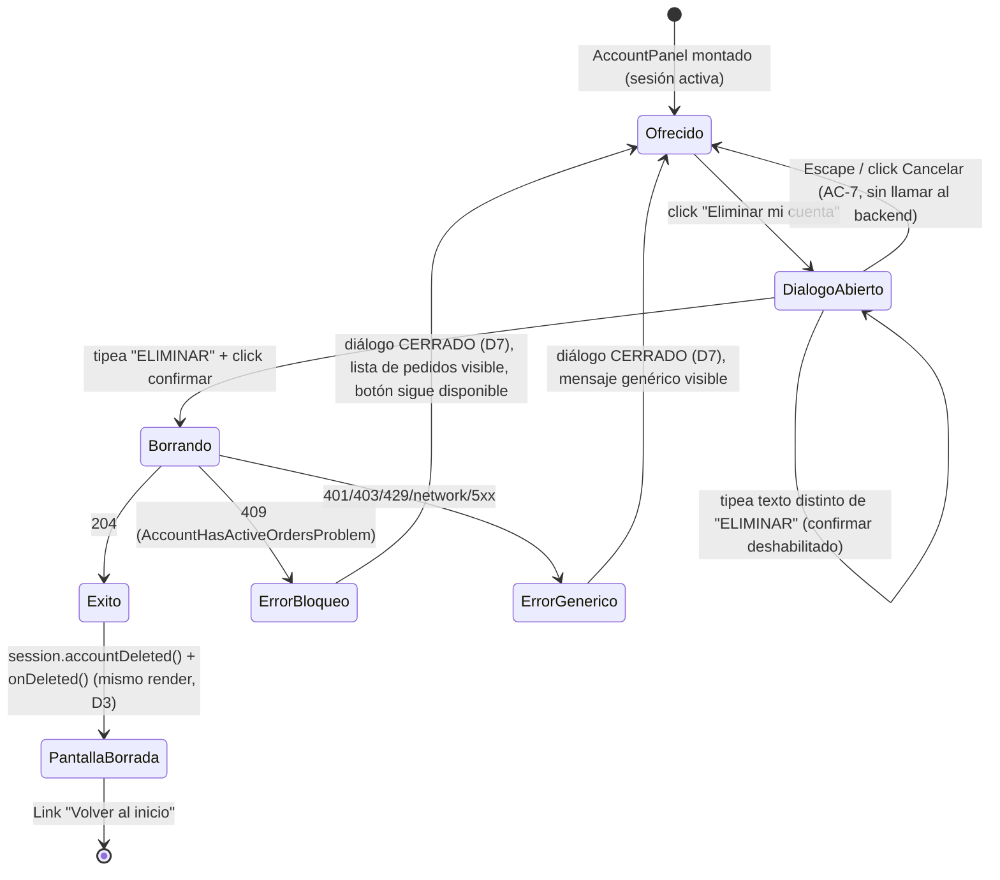

# US-020 Frontend-web — Design

## Context

Leído antes de diseñar (per instrucción del orquestador):

- `docs/user-stories/US-020-borrado-cuenta-datos-personales.md` — 15 AC, 5
  decisiones de producto cerradas por el PO en §10 (`[Resolved]`, ninguna
  reabierta acá): anonimizar (no borrar), email liberado, inmediato e
  irreversible sin ventana de gracia, autoservicio, órdenes en curso bloquean.
- `openspec/changes/US-020-borrado-cuenta-datos-personales-backend/proposal.md`
  + `design.md` (mergeado, PR #93) — contrato exacto: `DELETE /v1/me`, gateado
  por `CustomerGuard`+`CsrfGuard` (mismo par que `logout`), `204` sin cuerpo
  (éxito **e** idempotencia — AC-15), `401`/`403` sin cuerpo de negocio,
  `409` (`AccountHasActiveOrdersProblem.blocking_orders`, AC-4/AC-9), `429`
  rate-limited. Al `204` el backend limpia las cookies de sesión del propio
  dispositivo, igual que `logout`.
- `apps/api/docs/api/openapi.yaml` (publicado, líneas 950-984 y 2203-2229) —
  **hallazgo de drift de contrato** (ver D2 abajo): `blocking_orders` reusa
  literalmente el schema `OrderHistorySummary` de US-015, cuyo enum de
  `status` es `[new, preparing, ready, delivered, cancelled]` — **no incluye
  `pending_payment`**, que es uno de los 4 estados que
  `OrdersRepository.listBlockingForCustomer` (`BLOCKING_ORDER_STATUSES =
  ['pending_payment', 'new', 'preparing', 'ready']`) puede legítimamente
  devolver. El contrato publicado, tal como está, **no declara un valor que
  el backend puede emitir de verdad** en la superficie más común de bloqueo
  (un pedido recién iniciado, sin pagar todavía).
- `apps/web/src/api/generated/` (ya regenerado por el orquestador antes de
  este plan) — `endpoints.ts` tiene `deleteAccount(options?)` (`DELETE
  /v1/me`, sin parámetros — la autorización sale de la cookie, no de un
  argumento); `model/accountHasActiveOrdersProblem.ts` importa
  `OrderHistorySummary` de `model/orderHistorySummary.ts` (el de US-015, con
  el enum de 5 valores de arriba); `zod.ts` declara `DeleteAccountResponse =
  zod.void()` (sin schema para el 409 — el mutator no valida bodies de error
  con Zod, ver abajo).
- `apps/web/src/lib/http/client.ts` (mutator `customFetch`) — **el 409 nunca
  pasa por Zod**: `customFetch` arma el `AppError` con `mapProblemToAppError`
  a partir del JSON crudo de la respuesta de error, **antes** de que un
  service llame `parseContract`. `parseContract` sólo corre sobre el `data`
  de una respuesta 2xx. Esto significa que el drift de enum de arriba **no
  puede tirar una excepción de Zod** en el camino de error — pero sí puede
  producir un `AppError.conflict.blockingOrders[].status` con un valor
  (`pending_payment`) que el tipo TypeScript generado (`OrderHistorySummaryStatus`,
  5 valores) no admite si se lo tipara con ese tipo. Ver D2.
- `apps/web/src/lib/http/errors.ts` — `AppError` es una unión discriminada;
  el caso `conflict` YA lleva **extension members** ad-hoc del 409
  (`availableQuantity`/`maxItems` para el carrito, US-007) — es el precedente
  exacto para agregar `blockingOrders` sin romper nada existente.
- `apps/web/src/features/account/accountService.ts` — repositorio de la
  cuenta (US-014/US-015): TODAS sus llamadas van con `{ session: 'customer'
  } as const` (ADR-0013) — `deleteAccount` sigue exactamente el mismo
  criterio. `logout()` no relanza su propio error (se traga, limpia el
  estado local igual) — precedente de "el cliente ya está deslogueado desde
  su perspectiva, el fallo de red no cambia eso".
- `apps/web/src/features/account/{SessionProvider,sessionState,CustomerGuard,AccountPanel}.tsx`
  — `SessionState` es la unión discriminada canónica (`frontend-standards`
  §11.4/§9.3); `SessionProvider.logout()` hace 2 cosas al final SIEMPRE
  (`setSessionHint(false)` + `setState({kind:'anonymous'})`), sea cual sea el
  resultado del `POST /logout`; `CustomerGuard` retorna `null` en el MISMO
  render en el que `state.kind === 'anonymous'` (antes de que el `useEffect`
  de redirección corra) — este detalle de implementación es el que fuerza la
  decisión D3 de abajo. `AccountPanel` hoy: datos + link a compras + botón
  "Cerrar sesión", nada destructivo todavía.
- `apps/web/src/components/ui/ConfirmDialog.tsx` — diálogo de confirmación
  destructiva de dos pasos, genérico, **2 consumidores ya en producción**
  (`ProductActions.archive`, `OrderAnonymizeAction`/`OrderCancelAction`): foco
  entra al INPUT al abrir (no al botón de confirmar — ya satisface "sin foco
  por defecto en el botón destructivo" sin trabajo adicional), `Escape`
  cancela, sin click-outside-to-close, botón de confirmar deshabilitado hasta
  que el texto coincide.
- `apps/web/e2e/support/api-stub.mjs` + `apps/web/playwright.config.ts` — el
  E2E "dev-owned" de este repo corre contra `next build && next start` (no
  `next dev`), con un stub HTTP mínimo (`node:http`, sin dependencias) que
  reproduce el comportamiento REAL del backend (cookies con los atributos
  reales, CSRF, etc.) para las superficies que cada US necesita. El stub
  **no tiene hoy ninguna ruta bajo `/v1/me`**.
- `apps/web/e2e/{auth,cart,checkout}-topology.spec.ts` — el patrón
  establecido de este repo para el riesgo "el rewrite same-origin funciona
  contra la app CONSTRUIDA" (ADR-0013): un spec Playwright dedicado, dueño de
  la disciplina **frontend-web** (no de QA), que asserta sobre
  `response.status()`/`context.cookies()`, nunca sobre el DOM. **Hallazgo
  crítico al auditar el precedente**: `openspec/changes/archive/
  US-015-historial-compras-frontend-web/tasks.md` **no tiene ninguna task de
  esta familia** (`grep` sin resultados) — es exactamente el hueco que dejó
  pasar a producción el bug real de PR #89 (rewrite de `/v1/me/:path*`
  ausente), encontrado recién por el E2E cross-stack de **QA** (Layer 3,
  commit `6bb6517`), no por un test dev-owned del propio change de FE. Este
  plan **cierra ese hueco explícitamente para US-020** en vez de repetirlo
  (ver D8) — no lo difiere a QA.
- `apps/web/next.config.mjs` — el rewrite `/v1/me/:path*` **ya existe**
  (agregado en PR #89, comentario textual: "El historial de compras hereda el
  mecanismo (US-015)") y `DELETE /v1/me` matchea ese patrón. Esta US no
  necesita agregar ni modificar ninguna entrada del array de `rewrites()` —
  sólo **verificarlo** con el spec de D8, que es justamente el tipo de
  verificación que un test unitario/de componente no puede hacer (corre
  contra código mockeado por URL, nunca contra el rewrite real).
- `docs/product/design-system.md` §7.5 (Modal/Dialog — dos usos canónicos,
  ninguno "borrado de cuenta" explícito pero es el mismo patrón de
  confirmación destructiva de dos pasos), §7.6 (Toast — **no hay librería de
  toast en este código**; lo que el design-system llama "toast" se
  materializa en la práctica como `<div role="alert">`/`<div role="status">`
  inline, sticky porque no hay temporizador de auto-cierre — exactamente el
  patrón de `OrderCancelAction`/`OrderAnonymizeAction`. `MiniCart.tsx` es la
  ÚNICA excepción con auto-cierre a 4s, y es específica del carrito — no
  aplica acá, un borrado de cuenta no es informacional efímero), §10.2 (voz/
  tono — "práctico y confiable", ninguna entrada de la tabla cubre
  literalmente el borrado de cuenta; se sigue el mismo registro), §11
  (accesibilidad — foco gestionado al cambiar de contenido, `aria-live`,
  ≥44×44px, color nunca único portador). No hay Figma (`figma-frames: []` en
  la US) — el design-system es la fuente de verdad visual
  (`fe-design-without-figma`).
- ADR-0013 (mismo-origen para la superficie de sesión) — el rewrite ya
  extendido; esta US no agrega un ADR nuevo, sólo lo verifica (D8).

## Goals

FE-relevant (esta US construye o verifica la superficie):

- AC-1: el cliente dispara el borrado desde `/mi-cuenta`, confirma en dos
  pasos, y al confirmar ve reflejado que su sesión terminó (sin volver a
  pedirle nada al backend que el propio `204` ya resolvió).
- AC-4/AC-9: un 409 con órdenes en curso se muestra con el mismo nivel de
  detalle que el historial propio (US-015) — número, estado, importe, fecha —
  **sin** pre-chequear el estado de las órdenes antes de ofrecer el botón (la
  verificación es responsabilidad del backend, al ejecutar, no antes).
- AC-7: cancelar/cerrar/abandonar el diálogo sin confirmar no dispara ninguna
  llamada de red y no cambia nada.
- AC-11: la copia dice explícitamente "inmediato" e "irreversible" — no hay
  ningún estado "borrado pendiente" en la UI.
- AC-14 (mitad FE): los eventos de telemetría que ESTE change agrega no
  llevan PII (mismo candado que el backend, verificado con un test dedicado).

Backend-owned, la UI sólo consume/refleja sin re-probar (ver "Out of scope"
de `proposal.md`): AC-2, AC-3, AC-5, AC-6, AC-8, AC-10, AC-12, AC-13, AC-15.

## Non-goals

- Diseñar un componente de confirmación, un botón o una librería de toast
  nuevos — se reusa `ConfirmDialog`/`Button`/el patrón `role="alert"`/
  `role="status"` tal cual existen.
- Tocar el backend, el contrato publicado, o resolver el drift de enum de
  D2 — se documenta y se diseña la FE para ser robusta ante él, pero la
  corrección del contrato es un follow-up de backend, fuera de alcance.
- Un ADR nuevo — no hay decisión arquitectónica nueva (mismo mecanismo de
  sesión de ADR-0013, mismo componente de confirmación, ningún estado nuevo
  en el sentido de "nueva librería/patrón").
- Cambiar `README.md` de `apps/web` — evaluado y descartado por el mismo
  motivo que US-013 (`proposal.md` "Out of scope"): ni `OrderAnonymizeAction`
  ni `OrderCancelAction`, los dos precedentes directos de confirmación
  destructiva, están documentados ahí; agregar esta tercera acción sin
  documentar no crea una asimetría nueva.
- Exportación/portabilidad de datos — fuera de alcance de la US entera (§4).

## Approach

### D1 — Colisión de nombres: `deleteAccount` (operación generada) vs
`accountService.deleteAccount` (método del repositorio)

Mismo problema exacto que resolvió `design.md` de US-013 (D1, con
`CancelOrderResponse`), pero acá la colisión es de **función**, no de tipo —
se resuelve igual, con un alias de import:

```ts
import { deleteAccount as deleteAccountRequest } from '@/api/generated/endpoints';

export const accountService = {
  // ...métodos existentes...

  /**
   * AC-1/AC-15: 204 sin cuerpo tanto en el borrado real como en una segunda
   * confirmación sobre una cuenta ya borrada — no hay nada que parsear
   * (mismo criterio que `logout()`). El backend limpia las cookies de sesión
   * DENTRO de esta misma respuesta (design.md del backend, `clearSessionCookies`)
   * — a diferencia de `logout()`, este método NO debe volver a llamar al
   * backend de logout: sería una segunda escritura contra una sesión que el
   * propio 204 ya cerró del lado del servidor.
   */
  async deleteAccount(): Promise<void> {
    await deleteAccountRequest(conSesion);
  },
};
```

`conSesion` ya existe en el archivo (`{ session: 'customer' } as const`) — sin
cambios ahí. Si el 204 llega, `customFetch` no lanza; si llega cualquier
no-2xx, `customFetch` lanza `AppErrorException` antes de que este método
retorne — el `try/catch` vive en el componente, no acá (mismo criterio que
`login`/`register`/`logout`, ninguno atrapa su propio error dentro del
repositorio).

### D2 — `AppError.conflict` gana `blockingOrders`, tipado defensivamente
(drift de contrato documentado, no corregido acá)

**El hallazgo** (Context, arriba): el contrato publicado declara
`AccountHasActiveOrdersProblem.blocking_orders: OrderHistorySummary[]` con el
enum de `status` de US-015 (`new|preparing|ready|delivered|cancelled`), pero
el backend real (`design.md` del backend, `BLOCKING_ORDER_STATUSES`) sólo
puede popular ese array con órdenes en `pending_payment|new|preparing|ready`
— es decir, el valor **más probable** en la práctica (un pedido recién
iniciado sin pagar) **no está en el enum publicado**, y dos valores que SÍ
están (`delivered`/`cancelled`) **nunca van a aparecer ahí** de verdad.

**Por qué no se corrige acá**: es un cambio de contrato (`apps/api/docs/api/openapi.yaml`,
posiblemente un schema `AccountBlockingOrderSummary` dedicado en vez de reusar
`OrderHistorySummary`, o ensanchar el enum existente) — fuera del alcance de
un change FE-only. Se documenta como **recomendación de follow-up de
backend** (`proposal.md` Open questions) y se cierra la brecha del lado FE
con una decisión de tipado defensiva:

```ts
// lib/http/errors.ts
export type AppError =
  | { /* ...validation... */ }
  | {
      kind: 'conflict';
      message: string;
      problemType?: string;
      availableQuantity?: number;
      maxItems?: number;
      /**
       * US-020 AC-4/AC-9. `status` se tipa `string`, NO como el enum
       * generado (`OrderHistorySummaryStatus`, que no declara
       * `pending_payment` — ver design.md §Context, drift de contrato
       * encontrado al planificar): el runtime puede devolver legítimamente
       * un valor que el contrato publicado no admite, y la UI no puede
       * reventar por eso ni mentir mostrando un estado que no es.
       */
      blockingOrders?: {
        order_number: number;
        status: string;
        total_ars_cents: number;
        created_at: string;
      }[];
    }
  | { /* ...resto sin cambios... */ };
```

```ts
// mapProblemToAppError — caso 409
case 409:
  return {
    kind: 'conflict',
    message,
    problemType: p.type,
    ...(typeof p.available_quantity === 'number' ? { availableQuantity: p.available_quantity } : {}),
    ...(typeof p.max_items === 'number' ? { maxItems: p.max_items } : {}),
    ...(Array.isArray(p.blocking_orders) ? { blockingOrders: p.blocking_orders } : {}),
  };
```

`ProblemBody` gana `blocking_orders?: { order_number: number; status: string;
total_ars_cents: number; created_at: string }[]`. No se valida con Zod (el
409 nunca pasó por Zod, ver Context) — se confía en la forma que el propio
backend documenta en su `design.md`, con acceso opcional (`p.blocking_orders`
puede faltar sin romper nada, mismo criterio que `available_quantity`/
`max_items`).

**Por qué NO se reusa `OrderStatusBadge`** (componente ya existente en
`features/orders/`) para pintar estos ítems: su prop `status` está tipado
`OrderStatus` (alias de `AdminOrderSummaryStatus`, el enum ADMIN de 5
valores, sin `pending_payment`) — pasarle un `pending_payment` real sería un
error de compilación, no un bug silencioso, así que ni siquiera compila.
Se define un lookup de etiquetas LOCAL a esta feature, con `string` como
llave y un fallback explícito (D6).

### D3 — Por qué la confirmación post-borrado se levanta a un componente
nuevo (`MiCuentaScreen`), y no se muestra dentro de `AccountPanel`

**El problema concreto**: `CustomerGuard.tsx` día de hoy —

```tsx
if (state.kind === 'anonymous') {
  // Ni un fragmento de los datos mientras la redirección ocurre.
  return null;
}
```

— retorna `null` en el MISMO render en el que `state.kind` pasa a
`'anonymous'`, ANTES de que el `useEffect` de redirección llegue a
ejecutarse. Si el flujo de borrado, al confirmar con éxito, llamara
`session.accountDeleted()` (que pone `state.kind = 'anonymous'`) desde un
componente que vive DENTRO de `<CustomerGuard>` (como sería
`DeleteAccountSection` si colgara de `AccountPanel` sin más), el siguiente
render de React ejecuta `CustomerGuard` con `state.kind==='anonymous'` y
**oculta sus `children` inmediatamente** — el mensaje de éxito que
`DeleteAccountSection` quisiera mostrar nunca llega a pintarse, porque el
árbol que lo contiene ya no se renderiza en esa misma pasada.

**La solución**: levantar el flag "recién borrada" a un componente padre
**hermano** del guard, no hijo — `MiCuentaScreen`:

```tsx
'use client';
import { useState } from 'react';
import { AccountDeletedNotice } from './AccountDeletedNotice';
import { AccountPanel } from './AccountPanel';
import { CustomerGuard } from './CustomerGuard';

export function MiCuentaScreen() {
  const [deleted, setDeleted] = useState(false);
  if (deleted) return <AccountDeletedNotice />;
  return (
    <CustomerGuard>
      <AccountPanel onAccountDeleted={() => setDeleted(true)} />
    </CustomerGuard>
  );
}
```

En el `onConfirm` del borrado, DOS `setState` se disparan en el mismo
manejador síncrono de evento (React 18 los agrupa en un solo render):
`session.accountDeleted()` (en `SessionProvider`, sube el árbol) y
`setDeleted(true)` (llamado vía la prop `onAccountDeleted`, en
`MiCuentaScreen`). React re-renderiza de arriba hacia abajo: `MiCuentaScreen`
se re-evalúa primero, ve `deleted===true`, y su árbol devuelto **ya no
incluye** `<CustomerGuard>` — el guard ni siquiera llega a re-renderizarse
con el nuevo `state.kind`. No hay carrera, no hay parpadeo, no hace falta
tocar `CustomerGuard` ni `SessionState`.

`apps/web/app/(storefront)/mi-cuenta/page.tsx` (Server Component, con
`metadata`) pasa a renderizar `<MiCuentaScreen />` en vez de envolver
`CustomerGuard`/`AccountPanel` directamente — sigue sin poder tener estado
propio (server), así que el estado vive en el nuevo componente cliente.

### D4 — `SessionProvider` gana `accountDeleted()`, NO reusa `logout()`

`logout()` hoy hace dos cosas: llama a `accountService.logout()` (un `POST`
al backend) y, pase lo que pase, limpia el estado local. Para el borrado de
cuenta, el `POST` extra sería una segunda escritura contra una cuenta cuya
sesión el propio `DELETE /v1/me` ya cerró (`design.md` del backend:
`clearSessionCookies` corre en la MISMA respuesta) — en el mejor caso es
redundante, en el peor devuelve un 401 confuso que no aporta nada y que
`DeleteAccountSection` tendría que aprender a ignorar.

```ts
// SessionProvider.tsx
const accountDeleted = useCallback(() => {
  setSessionHint(false);
  setState({ kind: 'anonymous' });
}, []);
```

Se agrega a `SessionContextValue` y al `value` memoizado, junto a
`onAuthenticated`/`logout`. Es, literalmente, el mismo cuerpo que el
`finally` de `logout()` — pero exponerlo como su propia función documenta la
intención ("esto NO llama al backend") en vez de forzar a
`DeleteAccountSection` a llamar `logout()` y a un lector futuro a
preguntarse por qué el borrado dispara dos requests.

### D5 — `DeleteAccountSection`: botón + `ConfirmDialog` reusado, copy
explícito de qué se borra/qué sobrevive

```tsx
'use client';
import { useState } from 'react';
import Link from 'next/link';
import { Button } from '@/components/ui/Button';
import { ConfirmDialog } from '@/components/ui/ConfirmDialog';
import { isAppError } from '@/lib/http/errors';
import { formatArs } from '@/lib/format/currency';
import { formatDateTime } from '@/lib/format/datetime';
import { track } from '@/lib/observability/events';
import { accountService } from './accountService';
import { useSession } from './SessionProvider';

const BLOCKING_STATUS_LABEL: Record<string, string> = {
  pending_payment: 'Pendiente de pago',
  new: 'Nueva',
  preparing: 'Preparando',
  ready: 'Lista para retirar',
};

export function DeleteAccountSection({ onDeleted }: { onDeleted: () => void }) {
  const { accountDeleted } = useSession();
  const [confirmOpen, setConfirmOpen] = useState(false);
  const [busy, setBusy] = useState(false);
  const [error, setError] = useState<string | null>(null);
  const [blocking, setBlocking] = useState<
    { order_number: number; status: string; total_ars_cents: number; created_at: string }[] | null
  >(null);

  async function confirm(): Promise<void> {
    setBusy(true);
    setError(null);
    setBlocking(null);
    track('account_delete_attempted');
    try {
      await accountService.deleteAccount();
      track('account_delete_succeeded');
      accountDeleted();
      onDeleted();
    } catch (err) {
      setConfirmOpen(false); // D7: a diferencia del precedente, SIEMPRE cierra
      if (isAppError(err, 'conflict') && err.appError.blockingOrders?.length) {
        track('account_delete_blocked');
        setBlocking(err.appError.blockingOrders);
        setError('No podés eliminar tu cuenta mientras tengas pedidos sin retirar o sin pagar.');
      } else {
        track('account_delete_failed');
        setError('No se pudo eliminar tu cuenta. Reintentá.');
      }
    } finally {
      setBusy(false);
    }
  }

  return (
    <section className="flex flex-col gap-2 rounded-md border border-error/40 p-4">
      <h2 className="text-sm font-medium text-fg">Eliminar mi cuenta</h2>
      <p className="text-sm text-muted">
        Se borran tu nombre, tu email y tu teléfono. Tu email queda libre para
        registrarte de nuevo cuando quieras. Tu historial de compras se
        conserva, pero sin datos que te identifiquen. Es inmediato y no se
        puede deshacer.
      </p>
      {error && (
        <div role="alert" className="flex flex-col gap-2 text-sm text-error">
          <p>{error}</p>
          {blocking && (
            <ul className="flex flex-col divide-y divide-border">
              {blocking.map((o) => (
                <li key={o.order_number} className="flex items-center justify-between gap-3 py-2">
                  <span>
                    Pedido #{o.order_number} — {BLOCKING_STATUS_LABEL[o.status] ?? o.status}
                  </span>
                  <span className="tabular-nums">{formatArs(o.total_ars_cents)}</span>
                </li>
              ))}
            </ul>
          )}
        </div>
      )}
      <Button
        variant="destructive"
        onClick={() => setConfirmOpen(true)}
        loading={busy}
        className="self-start"
      >
        Eliminar mi cuenta
      </Button>
      <ConfirmDialog
        open={confirmOpen}
        title="Eliminar tu cuenta"
        description="Es inmediato y no se puede deshacer. Se borran tu nombre, tu email y tu teléfono; tu email queda libre para un nuevo registro; tu historial de compras se conserva, sin datos que te identifiquen."
        confirmWord="ELIMINAR"
        confirmLabel="Eliminar mi cuenta"
        onConfirm={() => void confirm()}
        onCancel={() => setConfirmOpen(false)}
        busy={busy}
      />
    </section>
  );
}
```

Nótese que `AC-9` (verificación al EJECUTAR, no al mostrar) se cumple por
**ausencia**: este componente no hace ningún `GET` previo para decidir si
mostrar el botón — siempre lo muestra, y deja que el propio `DELETE` (y su
eventual 409) sea la única fuente de verdad. Pre-chequear introduciría
exactamente la ventana de carrera que el backend documentó cerrar.

### D6 — Lista de `blocking_orders`: texto plano, NO son links

`PurchaseHistoryList` (US-015) linkea cada pedido a
`/mi-cuenta/compras/{order_number}` — pero esa ruta consulta
`orderHistoryService.get()`, cuyo contrato (`OrderHistoryDetail`) hereda el
mismo enum de `OrderHistorySummaryStatus` (5 valores, sin
`pending_payment`) que ya demostró no reflejar todos los estados reales
(D2). No hay evidencia en el contrato publicado de que un pedido
`pending_payment` sea siquiera un caso soportado por el detalle propio de
compras (US-015 diseñó esa pantalla para "compras", y un pedido sin pagar
todavía podría no calificar). Enlazar a una ruta cuyo comportamiento con
este estado no está verificado sería agregar un link que puede romperse —
riesgo evitable. Se listan como texto plano (número, estado, importe), sin
`<Link>`: cumple AC-4 ("mismo nivel de detalle") sin apostar a una
navegación no verificada.

### D7 — Manejo de error: SIEMPRE cierra el diálogo (se aparta del precedente
de `OrderCancelAction`/`OrderAnonymizeAction`, con motivo explícito)

El precedente (`OrderCancelAction`/`OrderAnonymizeAction`) deja el
`ConfirmDialog` ABIERTO tras un error, con el mensaje renderizado como
hermano del diálogo en el DOM — funciona ahí porque el overlay
(`fixed inset-0 bg-black/50`) sólo ATENÚA el contenido detrás (no lo oculta:
un mensaje de una línea se sigue leyendo, apenas oscurecido). Acá el 409
puede traer una LISTA de varios pedidos bloqueantes — atenuar una lista
entera detrás de un overlay semitransparente es una degradación real de
legibilidad que el caso de una sola línea no tenía. Se decide explícitamente
apartarse: en CUALQUIER error (bloqueo o genérico) el diálogo se cierra
(`setConfirmOpen(false)`) y el mensaje/lista se muestra a pantalla completa,
sin overlay encima. El botón "Eliminar mi cuenta" sigue disponible para
reabrir el diálogo y reintentar (p. ej. después de resolver el pedido
pendiente).

### D8 — E2E dev-owned: la topología de `/v1/me` contra la app CONSTRUIDA

Cierra explícitamente el hueco que dejó pasar el bug de PR #89 (Context,
arriba). Dos piezas:

**1. `apps/web/e2e/support/api-stub.mjs`** gana una superficie nueva,
`DELETE /v1/me`, con el mismo criterio que la superficie de auth ya
existente (cookies con atributos reales, CSRF double-submit, un header de
fuerza para simular el 409 sin depender de sembrar órdenes reales):

```js
if (path === '/v1/me' && req.method === 'DELETE') {
  const cookies = leerCookies(req);
  const sesion = sessions.get(cookies.dsm_access);
  if (!sesion) {
    return problem(res, 401, 'dsm:auth/unauthenticated', 'Unauthorized', {});
  }
  const csrfHeader = req.headers['x-csrf-token'];
  if (!req.headers.origin || csrfHeader !== sesion.csrf) {
    return problem(res, 403, 'dsm:auth/csrf-failed', 'Forbidden', {});
  }
  // Header de fuerza: mismo criterio que `x-force-rate-limit` de auth —
  // determinista, sin tener que sembrar una orden real para probar el 409.
  if (req.headers['x-force-blocking-orders'] === '1') {
    return json(res, 409, {
      type: 'dsm:account/active-orders',
      title: 'Conflict',
      status: 409,
      detail: 'Tenés pedidos en curso',
      blocking_orders: [
        { order_number: 1234, status: 'pending_payment', total_ars_cents: 500000, created_at: '2026-01-01T00:00:00Z' },
      ],
    });
  }
  sessions.delete(cookies.dsm_access);
  res.setHeader('Set-Cookie', [
    'dsm_access=; HttpOnly; SameSite=Lax; Path=/; Max-Age=0',
    'dsm_refresh=; HttpOnly; SameSite=Lax; Path=/v1/auth; Max-Age=0',
    'dsm_csrf=; SameSite=Lax; Path=/; Max-Age=0',
  ]);
  res.statusCode = 204;
  return res.end();
}
```

**2. `apps/web/e2e/account-deletion-topology.spec.ts`** (nuevo), espejo
exacto de `auth-topology.spec.ts`/`cart-topology.spec.ts`: asserta sobre
`response.status()`/`context.cookies()`, nunca sobre el DOM. Casos: (a) con
sesión válida, `DELETE /v1/me` desde el origen del sitio responde `204` y
`context.cookies()` deja de tener `dsm_access` — la llamada REALMENTE llegó
al backend a través del rewrite (un rewrite ausente daría `404`, no `204`);
(b) una llamada posterior a `/v1/auth/me` con la cookie vieja da `401` (la
sesión de verdad se cerró, no es un falso positivo del stub); (c) sin CSRF,
`403`, sin tocar la sesión; (d) con `x-force-blocking-orders: 1`, `409` con
`blocking_orders` en el cuerpo.

## Component breakdown

```
app/(storefront)/mi-cuenta/page.tsx (modificado — Server Component, sin estado)
└─ MiCuentaScreen (NUEVO, cliente — levanta el flag "recién borrada")
   ├─ [deleted=false] CustomerGuard (existente, sin cambios)
   │   └─ AccountPanel (modificado — nueva prop `onAccountDeleted`)
   │       ├─ [secciones existentes: datos, link a compras]
   │       ├─ DeleteAccountSection (NUEVO)
   │       │   ├─ Button (existente, variant="destructive")
   │       │   └─ ConfirmDialog (existente, SIN modificar)
   │       └─ [botón "Cerrar sesión", existente, sin cambios]
   └─ [deleted=true] AccountDeletedNotice (NUEVO)
```

**`DeleteAccountSection` — props**:

| Prop | Tipo | Descripción |
|---|---|---|
| `onDeleted` | `() => void` | Notifica a `AccountPanel` (que la reenvía a `MiCuentaScreen`) que el borrado se completó, DESPUÉS de haber llamado `session.accountDeleted()`. |

**`AccountPanel` — prop nueva**:

| Prop | Tipo | Descripción |
|---|---|---|
| `onAccountDeleted` | `() => void` (opcional) | Reenviada tal cual a `DeleteAccountSection.onDeleted`. Opcional para no romper ningún test existente que monte `<AccountPanel />` sin la prop. |

**A11y**: `DeleteAccountSection` hereda de `ConfirmDialog` (focus trap,
`Escape`, foco al input al abrir) sin trabajo adicional. `AccountDeletedNotice`
mueve el foco a su propio `<h2 tabIndex={-1}>` al montar (design-system §11 —
"foco gestionado al cambiar de contenido"), con `role="status"`
`aria-live="polite"` (es una confirmación, no una interrupción).

## State diagram



## Test plan

Vitest + React Testing Library + MSW (mock por-test, `server.use(...)`) +
`jest-axe` — mismo nivel de pirámide que el resto de `features/account/`
(sin Playwright de journey completo; el ÚNICO Playwright de este change es
el topology dev-owned de D8, que es un test de infraestructura de red, no de
journey de usuario). Detalle de casos en `tasks.md`.

## Riesgos y mitigaciones

| Riesgo | Probabilidad | Impacto | Mitigación |
|---|---|---|---|
| Drift de contrato (`OrderHistorySummary.status` no declara `pending_payment`, D2) hace que un consumidor futuro que SÍ tipe estrictamente contra el enum generado rompa en compilación o descarte el dato | Media (ya es real hoy) | Medio — no rompe ESTE change (tipado defensivo con `string`), pero es una trampa para el próximo que toque `blocking_orders` sin leer este documento | Documentado en `proposal.md` como recomendación de follow-up de backend; `blockingOrders` tipado `string` explícitamente con comentario que cita este hallazgo |
| Un desarrollador futuro reusa `OrderStatusBadge` para pintar `blocking_orders` pensando que es el mismo dominio que `OrderStatusHistory` | Baja | Bajo — no compila (`OrderStatus` no incluye `pending_payment`), el error es inmediato | El comentario de D2 explica por qué se usa un lookup local en vez de ese componente |
| El rewrite de `/v1/me/:path*` se rompe en un refactor futuro de `next.config.mjs` sin que ningún test lo detecte | Baja (ya cubierto) | Alto — mismo perfil que PR #89 (invisible hasta producción) | `account-deletion-topology.spec.ts` (D8) corre contra la app construida en cada CI que ejecute `test:e2e` |
| El overlay del `ConfirmDialog` atenúa (no oculta) contenido detrás, y alguien reintroduce el patrón "dialog abierto + mensaje detrás" para este flujo en un cambio futuro | Baja | Bajo — degradación de legibilidad, no de seguridad | D7 documenta explícitamente la decisión de cerrar SIEMPRE el diálogo en error, con el motivo |

## References

- US: `docs/user-stories/US-020-borrado-cuenta-datos-personales.md`
- Backend (change hermano, mergeado): `openspec/changes/US-020-borrado-cuenta-datos-personales-backend/`
  (`proposal.md`, `design.md` — contrato exacto, mecanismo de anonimización,
  las 5 decisiones de producto)
- Contrato publicado: `apps/api/docs/api/openapi.yaml` (líneas 950-984,
  2203-2229 — endpoint + schemas, incluido el drift de D2)
- Precedentes directos de confirmación destructiva de dos pasos:
  `apps/web/src/features/orders/OrderCancelAction.tsx`,
  `apps/web/src/features/orders/OrderAnonymizeAction.tsx`,
  `apps/web/src/components/ui/ConfirmDialog.tsx`
- Precedente de colisión de nombres resuelta con alias de import:
  `openspec/changes/archive/US-013-cancelacion-reembolso-frontend-web/design.md` D1
- Precedente de E2E dev-owned de topología (ADR-0013): `apps/web/e2e/auth-topology.spec.ts`,
  `apps/web/e2e/cart-topology.spec.ts` (US-007 T5.1 — encontró el bug real de
  la caché del navegador), `apps/web/e2e/checkout-topology.spec.ts` (US-008
  FE T7.2)
- Hueco que este change cierra explícitamente: `openspec/changes/archive/US-015-historial-compras-frontend-web/tasks.md`
  (sin task de topología) + commit `6bb6517` (`test(qa): US-015 — E2E
  cross-stack del historial de compras (Layer 3)`, PR #89 — donde el rewrite
  ausente se encontró recién en QA, no en FE)
- `apps/web/src/features/account/` completo (US-014/US-015):
  `accountService.ts`, `SessionProvider.tsx`, `sessionState.ts`,
  `CustomerGuard.tsx`, `AccountPanel.tsx`
- `apps/web/src/lib/http/{errors,contract,client,csrf}.ts`
- `apps/web/src/lib/format/{currency,datetime}.ts`,
  `apps/web/src/features/orders/OrderStatusBadge.tsx` (evaluado y descartado, D2)
- ADR-0013: `docs/architecture/decisions/0013-same-origin-session-surface.md`
- Design-system: `docs/product/design-system.md` §7.5, §7.6, §10.2, §11
- Standards: `frontend-standards.md` §3.1-§3.3, §9.3, §11.2-§11.5, §11.8,
  §11.9, §11.bis.5, §12.2 · `security-standards.md` §3.7 (account lifecycle
  — logout revoca de verdad), §6.3 (output encoding), §7.5 (CSRF), §8.4
  (retención y borrado — "deletion is designed") · `api-standards.md` §8
  (RFC 7807) · `qa-frontend-standards.md` §23
