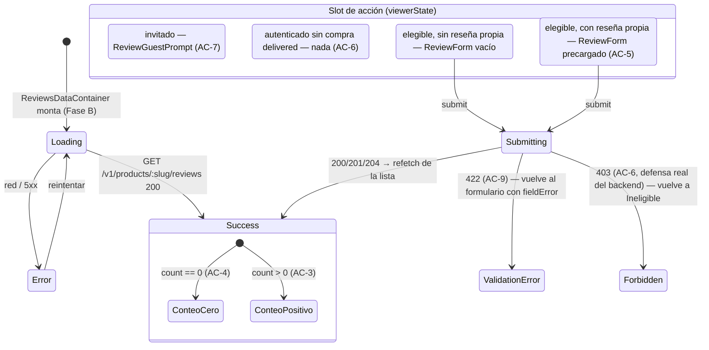

# Design — US-025 Reseñas y calificaciones de productos (frontend web)

## Context

Este es el primer change de frontend-web de este proyecto que se planifica **antes** de que
exista su backend. Todos los precedentes de "trabajo adelantado" encontrados en
`openspec/changes/archive/` (`US-017-paginas-legales-consentimiento-frontend-web` — texto legal
"provisional") tratan sobre **contenido** provisional (copy con marcadores `[PENDIENTE: …]`),
nunca sobre **tipos que deberían derivar de un contrato OpenAPI que todavía no existe**. Una
búsqueda explícita (`grep -rli "provisional\|hand-typed\|hasta que exista el contrato"
openspec/changes/archive/`) no encontró ningún precedente de ese segundo tipo. Esta sección
razona la decisión desde cero, sin apoyarse en un antecedente que no existe.

`frontend-standards.md` §3.2 prohíbe explícitamente el escape hatch "idealmente codegen, si no
a mano": *"A plan/design that says 'ideally codegen, or hand-written mirror if codegen isn't
wired' is a standards violation."* Esa prohibición apunta a un caso concreto: un contrato **ya
existe**, el generador no está armado todavía, y alguien decide tipar a mano "por ahora" en vez
de la única tarea correcta (armar el generador). Ese no es el caso acá — no hay ningún
`openapi.yaml` con endpoints de `reviews` contra el cual generar nada. Wire el generador hoy no
es una opción: no hay insumo. La pregunta real es otra: **¿puede Fase A construir algo útil y
cerrable sin tocar en absoluto la superficie que §3 gobierna?** La respuesta de este diseño es
sí, con una frontera estructural explícita (§D1).

## Goals

- Fase A: componentes presentacionales de reseñas (estrellas, formulario, lista, resumen,
  estado de invitado) construibles, testeables y cerrables **hoy**, sin ningún acoplamiento a
  red ni a un contrato que no existe.
- Fase B: un camino de wiring mecánico y de bajo riesgo el día que el backend publique el
  contrato — nada que Fase A construya se re-escribe desde cero, sólo se re-tipa y se conecta.
- Cerrar el hueco de topología `/v1/me/*` (US-020 §D8) para el nuevo prefijo
  `/v1/me/reviews/:productId` **antes** de que llegue a producción, no después de que QA lo
  encuentre (mismo motivo que originó §D8: el bug real de PR #89 lo encontró QA, no el propio
  change de FE de US-015).

## Non-goals

- Diseñar el schema, el endpoint de elegibilidad o la regla `@@unique` del backend — eso ya lo
  resolvió `US-025-resenas-calificaciones-productos-backend` (archivado, PR #130).
- Construir un panel de moderación cross-producto (tipo `/admin/resenas`, listado de todas las
  reseñas de todos los productos) — el contrato no publica ningún `GET /admin/reviews`; ver §D8.
  La moderación por-producto SÍ es un goal de este change (Fase B).

## Approach

### D1 — Por qué las interfaces de Fase A NO son el escape hatch prohibido por §3.2

Tres garantías estructurales, verificables por grep/test, distinguen esto del patrón prohibido:

1. **Ningún componente de Fase A hace una llamada HTTP.** `ReviewForm`, `ReviewsList`,
   `ReviewsSummary`, `ReviewGuestPrompt`, `ReviewsSection` reciben todo por props — ni un
   `fetch`, ni un `reviewsService`, ni un import de `@/lib/http/*`. El repositorio
   (`reviewsService.ts`) es, por diseño, **una task de Fase B** — no existe hasta que hay un
   contrato del cual generar el cliente que ese repositorio envuelve (§11.5 exige que el
   repositorio use operaciones **generadas**; sin contrato, no hay repositorio, sólo UI).
2. **`types.provisional.ts` no es un espejo del contrato — es un tipo de dominio de UI**, en el
   sentido de §3.4 ("domain models... contienen sólo los campos que la feature realmente usa").
   La diferencia con `Customer`/`OrderHistorySummary` (que también son "tipos de dominio", pero
   derivados de una transformación DTO→dominio) es que hoy no hay ningún DTO del cual derivar —
   así que el tipo de dominio se declara directamente. Esto es exactamente lo que pasaría si el
   feature nunca tocara red (p.ej. un componente puramente visual reusado entre features): la
   diferencia acá es que ESTE dominio eventualmente sí se alimentará de un DTO, así que el
   archivo se marca `@provisional` y lleva una fecha de vencimiento funcional (Fase B lo borra).
3. **El nombre del archivo y su banner son la garantía anti-drift.** `types.provisional.ts`
   (no `types.ts`) hace que cualquier grep de "qué archivos de este feature son provisionales"
   sea trivial, y el banner JSDoc en el archivo dice explícitamente: *"PROVISIONAL — no deriva de
   ningún contrato OpenAPI (todavía no existe uno para reviews). Prohibido: importar este
   archivo desde cualquier código que hable HTTP. Se borra en Fase B (T-B1) cuando
   `US-025-resenas-calificaciones-productos-backend` publique el contrato y el codegen genere
   `apps/web/src/api/generated/model/review*.ts`."*

**Lo que este diseño NO hace, y que sí sería el patrón prohibido**: no declara un
`reviewsService.ts` con un `fetch` a mano "hasta que el codegen esté armado" — eso construiría
la superficie exacta que §3 gobierna (DTOs de red) por fuera del generador, con el riesgo real
de drift que la regla existe para prevenir. Fase A se detiene explícitamente **antes** de esa
línea.

### D2 — Árbol de componentes de Fase A (presentacional puro)

```
ReviewsSection (orquestador, presentacional)
├── ReviewsSummary        — promedio+conteo (AC-3) o "Sin reseñas todavía" (AC-4)
├── ReviewsList
│   └── ReviewListItem[]  — autor, StarRatingDisplay, comentario, fecha, badge "oculta por
│                            moderación" cuando isOwn && hidden
├── (según viewerState)
│   ├── 'guest'           → ReviewGuestPrompt (AC-7)
│   ├── 'ineligible'      → nada (AC-6 — ni control ni mensaje)
│   ├── 'eligible-new'    → ReviewForm (sin valor inicial)
│   └── 'eligible-editing'→ ReviewForm (con la reseña propia precargada, AC-5)
└── StarRatingInput (dentro de ReviewForm)
```

`viewerState` es una unión discriminada (`'guest' | 'ineligible' | 'eligible-new' |
'eligible-editing'`), no un par de booleanos — mismo criterio que `AsyncState`/`SessionState`
del resto del código (`frontend-standards.md` §9.3). En Fase A, `viewerState` y los datos
llegan como props fijas (fixtures de test); en Fase B, `ReviewsDataContainer` los deriva de
`useSession()` + la respuesta real del backend (ver §D5, todavía abierto en cuanto a la forma
exacta).

### D3 — `StarRatingInput`: accesibilidad tal como la fija la US, no re-derivada

La US §8 ya especifica el contrato de accesibilidad: `role="radiogroup"`, cada estrella
`role="radio"`, anunciado como "N de 5 estrellas". Este plan lo toma literal:

```tsx
<div role="radiogroup" aria-label="Calificación">
  {[1, 2, 3, 4, 5].map((n) => (
    <button
      key={n}
      type="button"
      role="radio"
      aria-checked={n === value}
      aria-label={`${n} de 5 estrellas`}
      onClick={() => onChange(n)}
      onKeyDown={handleArrowKeys(n, onChange)}
      className={n <= (hover ?? value) ? 'text-warning' : 'text-muted'}
    >
      ★
    </button>
  ))}
</div>
```

Navegación por flechas (←/→ mueve la selección, mismo patrón WAI-ARIA de un `radiogroup` real —
no basta con que cada `radio` sea tabulable individualmente, el grupo entero debe comportarse
como una sola parada de Tab). `StarRatingDisplay` es la misma marca visual sin interactividad,
`aria-label="Calificación promedio: {n} de 5"` (para el resumen) o `aria-label="{n} de 5
estrellas"` (para un ítem de la lista) — nunca ambas cosas con el mismo componente interactivo,
para no exponer controles falsos de sólo-lectura.

Tokens de color: se reusan `text-warning`/`text-muted` (ya usados por `ProductPurchase.tsx`
para el badge "Pocas unidades" y el copy "Sin stock" respectivamente) — no se inventa un token
nuevo de "amarillo estrella"; el design-system no declara ninguno y agregar uno para un único
componente sería anticipar una paleta que nadie pidió.

### D4 — `ReviewForm`: validación de UX vs. autoridad del servidor (AC-9)

El formulario rechaza en el cliente una calificación fuera de 1-5 (deshabilita el submit sin
selección; `StarRatingInput` sólo puede producir 1-5 por construcción, así que "0 o 6" ni
siquiera es un estado alcanzable desde la UI) — pero esto es UX, no la garantía real. AC-9 la
cierra el backend rechazando con 422 cualquier valor fuera de rango **aunque llegue por fuera
de la UI** (mismo criterio que AC-6, US §9: "la regla de elegibilidad se aplica siempre
server-side"). `ReviewForm` expone un slot de `fieldError` que Fase B alimenta con el mensaje
que el backend devuelva — Fase A lo prueba pasando un `fieldError` fijo por props, sin inventar
la forma exacta del error del backend (esa forma es la de `AppError.kind === 'validation'`, ya
declarada en `@/lib/http/errors.ts`, reusada tal cual en Fase B).

El comentario es texto libre del cliente — se renderiza siempre como texto plano
(`ReviewListItem` nunca usa `dangerouslySetInnerHTML`), mismo criterio que la descripción de
producto en `ProductDetail.tsx` y el charter de XSS que `qa-plan.md` §8 ya declaró
explícitamente para esta misma US.

### D5 — [Resuelto] Lo que Fase B necesita del backend

`US-025-resenas-calificaciones-productos-backend` archivó (PR #130) con la respuesta: **opción
b, endpoint dedicado**. `GET /v1/me/reviews/:productId` → `OwnReviewResponse{eligible: boolean,
review: Review | null}` resuelve las dos preguntas que estaban abiertas de una sola vez:

1. Elegibilidad (AC-6): el campo `eligible` — `true` si el cliente tiene una orden `delivered`
   con este producto. El GET público (`getPublicReviews`) NO lleva ningún campo `viewer` — la
   elegibilidad nunca viaja ahí.
2. Reseña propia para precargar `ReviewForm` en modo edición (AC-5): el campo `review` — no
   `null` si el cliente ya reseñó, **sin importar si está oculta** (`Review.hidden`, AC-8 —
   transparencia hacia el autor, el propio autor siempre ve su reseña real).

`ReviewsDataContainer` (T-B3) llama `getOwnReview(productId)` una vez al montar (junto con
`getPublicReviews(slug)`) para derivar el `ViewerReviewState` completo: sin sesión → `guest`;
con sesión y `eligible === false` y `review === null` → `ineligible`; `review !== null` →
`eligible-editing` (con `initialValue` desde `review`); si no, `eligible-new`.

### D6 — Fase B: E2E dev-owned de topología de `/v1/me/reviews/:productId`

Verificado directamente (`grep -n "'/v1/me/:path\*'" apps/web/next.config.mjs`): el rewrite
`/v1/me/:path*` **ya existe** y **ya cubre** `/v1/me/reviews/:productId` — Next.js resuelve
`:path*` como un segmento multi-parte, así que `/v1/me/reviews/42` matchea el mismo patrón que
`/v1/me/orders/1000` (US-015) o `/v1/me` (US-020). **Este change no agrega ninguna entrada
nueva a `rewrites()`** — mismo criterio que T0.3 de US-020 (verificar, no agregar).

Sin embargo, "el patrón ya cubre el path" no es lo mismo que "alguien ya lo probó contra la app
construida" — US-015 nunca agregó su propio `order-history-topology.spec.ts` (verificado:
`apps/web/e2e/` no tiene ningún archivo con ese nombre), y ese fue precisamente el hueco que
permitió que el bug real de rewrite ausente de PR #89 llegara a producción invisible para todo
excepto QA (US-020 §Context). Este plan no repite esa omisión: Fase B agrega
`reviews-topology.spec.ts`, espejo exacto de `account-deletion-topology.spec.ts`
(`page.evaluate(() => fetch('/v1/me/reviews/42', { method: 'POST', ... }))`, asserts sobre
`response.status()` — nunca sobre el DOM, F59) — es la única forma de detectar un rewrite roto
sin depender de que QA lo encuentre primero.

### D7 — SEO / JSON-LD `aggregateRating`: diferido, no descartado

`ProductJsonLd.tsx` ya emite el schema.org `Product` de la ficha. Agregar `aggregateRating`
(promedio+conteo) mejoraría el rich snippet en buscadores. Confirmado (§D5): el agregado
**no** viaja embebido en la respuesta del producto — sólo existe en `PublicReviewsResponse`
(`GET /products/:slug/reviews`), que se resuelve del lado cliente (`ReviewsDataContainer`, un
componente `'use client'`), mientras que `ProductJsonLd` se emite server-side desde
`ProductDetail.tsx` (Server Component). Conectar ambos requeriría levantar el fetch de reviews
al servidor sólo para el JSON-LD — costo real, beneficio de SEO no pedido por ningún AC. Se
difiere como mejora de SEO fuera de esta US, no como parte de Fase B.

### D8 — Vista admin de moderación (AC-8): por qué vive en `/admin/productos/{id}`, no en un panel propio

El dueño confirmó que la moderación entra en el alcance de este change ("Open questions" #1,
resuelta). La US §7 sugería, por analogía con el panel de órdenes (US-012), un panel dedicado de
reseñas con su propia tabla — pero el contrato de backend archivado (PR #130) sólo publica
`PATCH /v1/admin/reviews/:id` (moderar por id ya conocido); **no existe** ningún `GET
/admin/reviews` que liste reseñas cross-producto. Sin un endpoint de listado, un panel
`/admin/resenas` con su propia tabla no tiene de dónde traer las filas — sería o bien
inventar un endpoint que el backend nunca declaró (fuera de alcance de un change de FE:
`frontend-standards.md` §3 prohíbe inventar contrato), o paginar sobre TODOS los productos
llamando `GET /products/:slug/reviews` por cada uno para armar un listado global (N+1 llamadas,
sin paginación real del lado servidor — mala UX y mal patrón, ninguno de los dos aceptable).

La alternativa que el contrato sí soporta directamente: moderar reseñas **por producto**, desde
la pantalla de edición de ese producto (`/admin/productos/{id}`, ya existe desde US-012). Ahí el
`slug` del producto ya está disponible sin ningún parámetro adicional, `GET
/products/:slug/reviews` trae exactamente las reseñas de ESE producto (paginación real, la que
el contrato ya expone), y `PATCH /admin/reviews/:id` oculta/muestra por fila. Es la única forma
de construir la moderación sin inventar contrato — y es, además, un flujo de trabajo razonable
para el dueño: la ocasión típica de moderar una reseña ofensiva es mientras se está revisando
ESE producto puntual, no navegando un panel global. Si más adelante el volumen de reseñas
justifica un panel cross-producto, es un CR de backend (nuevo `GET /admin/reviews` con
paginación/filtros) seguido de un CR de FE — no algo que este change deba resolver por
adelantado.

`ProductReviewsModeration.tsx` (nuevo, T-B9) reusa `ReviewListItem`/`ReviewsList` de Fase A para
el renderizado (mismo componente que la ficha pública, con una prop adicional
`onToggleHidden?(reviewId, hidden)` que sólo la superficie admin pasa) — no se duplica el
markup de "cómo se ve una reseña" entre storefront y admin.

**Limitación real encontrada y documentada, no silenciada**: `GET /products/:slug/reviews`
filtra `hidden_at: null` **siempre**, sin excepción para admin (verificado directo en
`apps/api/src/reviews/reviews.repository.ts` línea 56 — `where: { product_id, hidden_at: null }`
es incondicional, sin variante admin). Como éste es el único endpoint de listado que existe (no
hay `GET /admin/reviews` — ver arriba), una vez que el dueño oculta una reseña, esa reseña
**desaparece de toda superficie que el FE puede alcanzar** — no hay forma de volver a listarla
para deshacer el ocultamiento, aunque `PATCH /admin/reviews/:id` sí soporta `hidden: false`
técnicamente. Mitigación de este change (sin tocar backend, que está fuera de alcance): el
estado `hidden` se actualiza **de forma optimista en el estado local de React** de
`ProductReviewsModeration` en vez de sacar la fila de la lista o refetchear — así la reseña
recién ocultada sigue visible y accionable (con un botón "Mostrar de nuevo") **durante esa
misma sesión de la pantalla**, pero un refresh de página o volver a entrar a
`/admin/productos/{id}` ya no la va a mostrar (queda oculta para siempre desde la perspectiva
del FE, hasta que exista un endpoint de backend que la traiga). Esto se declara explícitamente
como limitación conocida, no una feature de undo real — si el negocio necesita revertir
ocultamientos de forma confiable más allá de la sesión activa, es un CR de backend (endpoint
admin que incluya `hidden_at` no-nulo), no algo que este change de FE pueda resolver.

## Component breakdown

| Componente | Fase | Props (resumen) | A11y |
|---|---|---|---|
| `StarRatingInput` | A | `value: number`, `onChange(n)`, `disabled?` | `radiogroup`/`radio`, flechas, `aria-label` "N de 5 estrellas" |
| `StarRatingDisplay` | A | `value: number`, `mode: 'average' \| 'item'` | sólo `aria-label`, sin roles interactivos |
| `ReviewForm` | A | `initialValue?`, `onSubmit(input)`, `submitState: AsyncState<void>`, `fieldError?` | label del textarea, botón con `aria-busy` durante envío |
| `ReviewListItem` | A | `review: ReviewViewModel` | badge "oculta por moderación" con texto, no sólo color |
| `ReviewsList` | A | `reviews: ReviewViewModel[]` | `<ul>` semántica |
| `ReviewsSummary` | A | `summary: ReviewsSummaryViewModel` | texto explícito, nunca sólo el número |
| `ReviewGuestPrompt` | A | — (estático) | link con texto descriptivo, no "click acá" |
| `ReviewsSection` | A | `viewerState`, `summary`, `reviews: AsyncState<...>`, `onSubmitReview` | compone los anteriores |
| `reviewsService` | B | — (repositorio) | n/a |
| `ReviewsDataContainer` | B | `productSlug: string` | monta `ReviewsSection` con datos reales |
| `adminReviewsService` | B | — (repositorio, sesión admin) | n/a |
| `ProductReviewsModeration` | B | `productSlug: string` | reusa `ReviewsList`/`ReviewListItem` + `onToggleHidden` por fila |

## State diagram



## Test plan

- **Fase A** (cerrable ahora): RTL + `userEvent` por componente (`StarRatingInput` navegación
  por teclado, `ReviewForm` envío con/sin comentario y con `fieldError`, `ReviewsSummary` los
  dos slots AC-3/AC-4, `ReviewsList` con reseña propia oculta, `ReviewGuestPrompt` links
  correctos, `ReviewsSection` los cuatro `viewerState`), axe-core sobre `ReviewsSection` montado
  con datos de fixture — 0 violaciones serious/critical (mismo criterio que
  `order-history/a11y.test.tsx`). Cero MSW: no hay red que mockear en Fase A.
- **Fase B** (bloqueada): `reviewsService.test.ts` con MSW (`msw-setup` skill) espejando
  `orderHistoryService.test.ts`; `ReviewsDataContainer` integration test con MSW cubriendo
  loading/success/error/submit; `reviews-topology.spec.ts` Playwright (§D6); axe-core repetido
  sobre `ReviewsDataContainer` montado con datos reales (no sólo fixtures).
- **QA** (fuera de este change): `openspec/changes/US-025-resenas-calificaciones-productos-qa/qa-plan.md`
  ya cubre BDD de aceptación, contract testing, E2E cross-stack y a11y — Fase B de este plan
  provee la superficie (`data-testid`/roles) que esos specs necesitan, sin duplicar sus
  escenarios.

## Riesgos y mitigaciones

| Riesgo | Probabilidad | Impacto | Mitigación |
|---|---|---|---|
| El contrato real de backend cambia la forma que `types.provisional.ts` asumió (p.ej. `author_name` no viene embebido, requiere un segundo lookup) | media | bajo — Fase A no depende de la forma real | El archivo se borra por completo en T-B1; nada de Fase A importa DTOs, así que no hay refactor en cascada, sólo re-tipado de `ReviewsDataContainer` |
| Alguien composita `ReviewsSection` en `ProductDetail.tsx` antes de que Fase B exista, usando datos falsos "temporales" | baja | alto (dato falso en producción) | Task T-A8 deja explícito que Fase A **no** toca `ProductDetail.tsx`/`ProductPage.tsx` — el `Verify` de T-A8 es un `git diff --stat` vacío sobre esos archivos |
| El rewrite `/v1/me/:path*` deja de cubrir el nuevo path por un cambio futuro no relacionado | baja | alto (mismo bug que PR #89) | `reviews-topology.spec.ts` (T-B6) corre contra la app construida en cada CI, no sólo una vez |
| Se construye un panel `/admin/resenas` cross-producto que el contrato no puede alimentar de verdad | baja (decisión ya tomada) | alto (feature inutilizable sin `GET /admin/reviews`, retrabajo completo) | §D8 fija la forma como extensión de `/admin/productos/{id}`, no panel propio — la restricción del contrato archivado (sólo `PATCH /admin/reviews/:id`, sin listado) es la razón, no una preferencia de diseño reversible |
| El dueño oculta una reseña por error y espera poder deshacerlo después de recargar la página | media | bajo-medio (frustración del dueño, no pérdida de datos — la fila sigue en DB, sólo inalcanzable por FE) | §D8 documenta la limitación real del contrato (el listado público excluye `hidden_at` incondicionalmente, sin variante admin) + mitiga con estado optimista intra-sesión; el copy de la UI debe dejar claro que ocultar es una acción de la que no hay vuelta atrás desde la pantalla una vez recargada |

## References

- US: `docs/user-stories/US-025-resenas-calificaciones-productos.md`
- QA plan hermano: `openspec/changes/US-025-resenas-calificaciones-productos-qa/qa-plan.md`
- Precedente de topología dev-owned: `openspec/changes/archive/US-020-borrado-cuenta-datos-personales-frontend-web/design.md`
  §D8, `apps/web/e2e/account-deletion-topology.spec.ts`
- Precedente de repository pattern + `AsyncState`: `openspec/changes/archive/US-015-historial-compras-frontend-web/`
- `docs/code/frontend-standards.md` §3 (codegen obligatorio), §3.4 (mapeo DTO↔dominio), §9.3
  (unión discriminada), §11.5 (repository pattern)
- `docs/product/design-system.md` §11 (accesibilidad)
- ADR-0013 (mismo-origen de la superficie de sesión)
