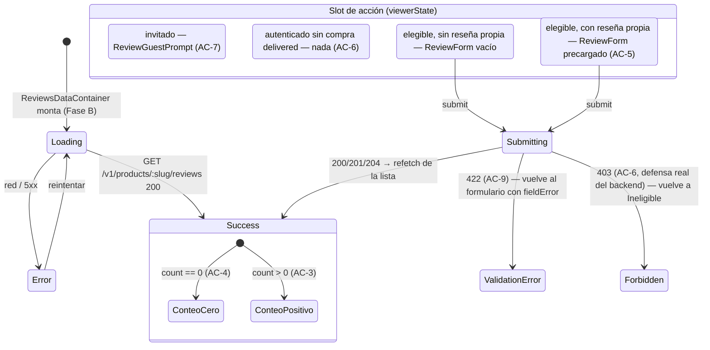

# Design — US-025 Reseñas y calificaciones de productos (frontend web)

## Context

Este es el primer change de frontend-web de este proyecto que se planifica **antes** de que
exista su backend. Todos los precedentes de "trabajo adelantado" encontrados en
`openspec/changes/archive/` (`US-017-paginas-legales-consentimiento-frontend-web` — texto legal
"provisional") tratan sobre **contenido** provisional (copy con marcadores `[PENDIENTE: …]`),
nunca sobre **tipos que deberían derivar de un contrato OpenAPI que todavía no existe**. Una
búsqueda explícita (`grep -rli "provisional\|hand-typed\|hasta que exista el contrato"
openspec/changes/archive/`) no encontró ningún precedente de ese segundo tipo. Esta sección
razona la decisión desde cero, sin apoyarse en un antecedente que no existe.

`frontend-standards.md` §3.2 prohíbe explícitamente el escape hatch "idealmente codegen, si no
a mano": *"A plan/design that says 'ideally codegen, or hand-written mirror if codegen isn't
wired' is a standards violation."* Esa prohibición apunta a un caso concreto: un contrato **ya
existe**, el generador no está armado todavía, y alguien decide tipar a mano "por ahora" en vez
de la única tarea correcta (armar el generador). Ese no es el caso acá — no hay ningún
`openapi.yaml` con endpoints de `reviews` contra el cual generar nada. Wire el generador hoy no
es una opción: no hay insumo. La pregunta real es otra: **¿puede Fase A construir algo útil y
cerrable sin tocar en absoluto la superficie que §3 gobierna?** La respuesta de este diseño es
sí, con una frontera estructural explícita (§D1).

## Goals

- Fase A: componentes presentacionales de reseñas (estrellas, formulario, lista, resumen,
  estado de invitado) construibles, testeables y cerrables **hoy**, sin ningún acoplamiento a
  red ni a un contrato que no existe.
- Fase B: un camino de wiring mecánico y de bajo riesgo el día que el backend publique el
  contrato — nada que Fase A construya se re-escribe desde cero, sólo se re-tipa y se conecta.
- Cerrar el hueco de topología `/v1/me/*` (US-020 §D8) para el nuevo prefijo
  `/v1/me/reviews/:productId` **antes** de que llegue a producción, no después de que QA lo
  encuentre (mismo motivo que originó §D8: el bug real de PR #89 lo encontró QA, no el propio
  change de FE de US-015).

## Non-goals

- Diseñar el schema, el endpoint de elegibilidad o la regla `@@unique` del backend — eso es
  `US-025-resenas-calificaciones-productos-backend`.
- Construir la vista admin de moderación — ver `proposal.md` "Out of scope" y "Open questions" #1.
- Resolver definitivamente la forma exacta del contrato (`operationId`, nombres de campos) —
  Fase B documenta la forma **esperada** mínima (§D5) pero la fuente de verdad es el `openapi.yaml`
  que el backend publique.

## Approach

### D1 — Por qué las interfaces de Fase A NO son el escape hatch prohibido por §3.2

Tres garantías estructurales, verificables por grep/test, distinguen esto del patrón prohibido:

1. **Ningún componente de Fase A hace una llamada HTTP.** `ReviewForm`, `ReviewsList`,
   `ReviewsSummary`, `ReviewGuestPrompt`, `ReviewsSection` reciben todo por props — ni un
   `fetch`, ni un `reviewsService`, ni un import de `@/lib/http/*`. El repositorio
   (`reviewsService.ts`) es, por diseño, **una task de Fase B** — no existe hasta que hay un
   contrato del cual generar el cliente que ese repositorio envuelve (§11.5 exige que el
   repositorio use operaciones **generadas**; sin contrato, no hay repositorio, sólo UI).
2. **`types.provisional.ts` no es un espejo del contrato — es un tipo de dominio de UI**, en el
   sentido de §3.4 ("domain models... contienen sólo los campos que la feature realmente usa").
   La diferencia con `Customer`/`OrderHistorySummary` (que también son "tipos de dominio", pero
   derivados de una transformación DTO→dominio) es que hoy no hay ningún DTO del cual derivar —
   así que el tipo de dominio se declara directamente. Esto es exactamente lo que pasaría si el
   feature nunca tocara red (p.ej. un componente puramente visual reusado entre features): la
   diferencia acá es que ESTE dominio eventualmente sí se alimentará de un DTO, así que el
   archivo se marca `@provisional` y lleva una fecha de vencimiento funcional (Fase B lo borra).
3. **El nombre del archivo y su banner son la garantía anti-drift.** `types.provisional.ts`
   (no `types.ts`) hace que cualquier grep de "qué archivos de este feature son provisionales"
   sea trivial, y el banner JSDoc en el archivo dice explícitamente: *"PROVISIONAL — no deriva de
   ningún contrato OpenAPI (todavía no existe uno para reviews). Prohibido: importar este
   archivo desde cualquier código que hable HTTP. Se borra en Fase B (T-B1) cuando
   `US-025-resenas-calificaciones-productos-backend` publique el contrato y el codegen genere
   `apps/web/src/api/generated/model/review*.ts`."*

**Lo que este diseño NO hace, y que sí sería el patrón prohibido**: no declara un
`reviewsService.ts` con un `fetch` a mano "hasta que el codegen esté armado" — eso construiría
la superficie exacta que §3 gobierna (DTOs de red) por fuera del generador, con el riesgo real
de drift que la regla existe para prevenir. Fase A se detiene explícitamente **antes** de esa
línea.

### D2 — Árbol de componentes de Fase A (presentacional puro)

```
ReviewsSection (orquestador, presentacional)
├── ReviewsSummary        — promedio+conteo (AC-3) o "Sin reseñas todavía" (AC-4)
├── ReviewsList
│   └── ReviewListItem[]  — autor, StarRatingDisplay, comentario, fecha, badge "oculta por
│                            moderación" cuando isOwn && hidden
├── (según viewerState)
│   ├── 'guest'           → ReviewGuestPrompt (AC-7)
│   ├── 'ineligible'      → nada (AC-6 — ni control ni mensaje)
│   ├── 'eligible-new'    → ReviewForm (sin valor inicial)
│   └── 'eligible-editing'→ ReviewForm (con la reseña propia precargada, AC-5)
└── StarRatingInput (dentro de ReviewForm)
```

`viewerState` es una unión discriminada (`'guest' | 'ineligible' | 'eligible-new' |
'eligible-editing'`), no un par de booleanos — mismo criterio que `AsyncState`/`SessionState`
del resto del código (`frontend-standards.md` §9.3). En Fase A, `viewerState` y los datos
llegan como props fijas (fixtures de test); en Fase B, `ReviewsDataContainer` los deriva de
`useSession()` + la respuesta real del backend (ver §D5, todavía abierto en cuanto a la forma
exacta).

### D3 — `StarRatingInput`: accesibilidad tal como la fija la US, no re-derivada

La US §8 ya especifica el contrato de accesibilidad: `role="radiogroup"`, cada estrella
`role="radio"`, anunciado como "N de 5 estrellas". Este plan lo toma literal:

```tsx
<div role="radiogroup" aria-label="Calificación">
  {[1, 2, 3, 4, 5].map((n) => (
    <button
      key={n}
      type="button"
      role="radio"
      aria-checked={n === value}
      aria-label={`${n} de 5 estrellas`}
      onClick={() => onChange(n)}
      onKeyDown={handleArrowKeys(n, onChange)}
      className={n <= (hover ?? value) ? 'text-warning' : 'text-muted'}
    >
      ★
    </button>
  ))}
</div>
```

Navegación por flechas (←/→ mueve la selección, mismo patrón WAI-ARIA de un `radiogroup` real —
no basta con que cada `radio` sea tabulable individualmente, el grupo entero debe comportarse
como una sola parada de Tab). `StarRatingDisplay` es la misma marca visual sin interactividad,
`aria-label="Calificación promedio: {n} de 5"` (para el resumen) o `aria-label="{n} de 5
estrellas"` (para un ítem de la lista) — nunca ambas cosas con el mismo componente interactivo,
para no exponer controles falsos de sólo-lectura.

Tokens de color: se reusan `text-warning`/`text-muted` (ya usados por `ProductPurchase.tsx`
para el badge "Pocas unidades" y el copy "Sin stock" respectivamente) — no se inventa un token
nuevo de "amarillo estrella"; el design-system no declara ninguno y agregar uno para un único
componente sería anticipar una paleta que nadie pidió.

### D4 — `ReviewForm`: validación de UX vs. autoridad del servidor (AC-9)

El formulario rechaza en el cliente una calificación fuera de 1-5 (deshabilita el submit sin
selección; `StarRatingInput` sólo puede producir 1-5 por construcción, así que "0 o 6" ni
siquiera es un estado alcanzable desde la UI) — pero esto es UX, no la garantía real. AC-9 la
cierra el backend rechazando con 422 cualquier valor fuera de rango **aunque llegue por fuera
de la UI** (mismo criterio que AC-6, US §9: "la regla de elegibilidad se aplica siempre
server-side"). `ReviewForm` expone un slot de `fieldError` que Fase B alimenta con el mensaje
que el backend devuelva — Fase A lo prueba pasando un `fieldError` fijo por props, sin inventar
la forma exacta del error del backend (esa forma es la de `AppError.kind === 'validation'`, ya
declarada en `@/lib/http/errors.ts`, reusada tal cual en Fase B).

El comentario es texto libre del cliente — se renderiza siempre como texto plano
(`ReviewListItem` nunca usa `dangerouslySetInnerHTML`), mismo criterio que la descripción de
producto en `ProductDetail.tsx` y el charter de XSS que `qa-plan.md` §8 ya declaró
explícitamente para esta misma US.

### D5 — Lo que Fase B necesita del backend y todavía no está resuelto

Dos preguntas de contrato quedan explícitamente abiertas para
`US-025-resenas-calificaciones-productos-backend` (ver `proposal.md` "Open questions" #2):

1. Cómo sabe el FE si el viewer autenticado es elegible (¿el `GET` público devuelve un campo
   `viewer` cuando viaja la cookie de sesión, o hay un endpoint dedicado?).
2. Cómo sabe el FE si el viewer ya tiene una reseña propia de ese producto, para precargar
   `ReviewForm` en modo edición (AC-5) y decidir si el próximo submit es lógicamente un create o
   un update (el backend hace upsert de todos modos, así que esto es sólo para la UX de
   "mostrale que ya reseñaste esto con 3 estrellas", no una decisión de la que dependa la
   corrección del guardado).

Fase B (T-B0) empieza leyendo el `design.md` real de `US-025-resenas-calificaciones-productos-backend`
antes de fijar la forma de `ReviewsDataContainer` — este plan no inventa esa forma ahora.

### D6 — Fase B: E2E dev-owned de topología de `/v1/me/reviews/:productId`

Verificado directamente (`grep -n "'/v1/me/:path\*'" apps/web/next.config.mjs`): el rewrite
`/v1/me/:path*` **ya existe** y **ya cubre** `/v1/me/reviews/:productId` — Next.js resuelve
`:path*` como un segmento multi-parte, así que `/v1/me/reviews/42` matchea el mismo patrón que
`/v1/me/orders/1000` (US-015) o `/v1/me` (US-020). **Este change no agrega ninguna entrada
nueva a `rewrites()`** — mismo criterio que T0.3 de US-020 (verificar, no agregar).

Sin embargo, "el patrón ya cubre el path" no es lo mismo que "alguien ya lo probó contra la app
construida" — US-015 nunca agregó su propio `order-history-topology.spec.ts` (verificado:
`apps/web/e2e/` no tiene ningún archivo con ese nombre), y ese fue precisamente el hueco que
permitió que el bug real de rewrite ausente de PR #89 llegara a producción invisible para todo
excepto QA (US-020 §Context). Este plan no repite esa omisión: Fase B agrega
`reviews-topology.spec.ts`, espejo exacto de `account-deletion-topology.spec.ts`
(`page.evaluate(() => fetch('/v1/me/reviews/42', { method: 'POST', ... }))`, asserts sobre
`response.status()` — nunca sobre el DOM, F59) — es la única forma de detectar un rewrite roto
sin depender de que QA lo encuentre primero.

### D7 — SEO / JSON-LD `aggregateRating`: diferido, no descartado

`ProductJsonLd.tsx` ya emite el schema.org `Product` de la ficha. Agregar `aggregateRating`
(promedio+conteo) mejoraría el rich snippet en buscadores, pero depende de si el backend
embebe el agregado en la respuesta del producto o si sólo vive en el `GET .../reviews` separado
— decisión de contrato no tomada todavía (§D5). AC-3 sólo exige que la persona **vea** el
promedio en la ficha, no que estructuralmente esté en el JSON-LD — así que esto se difiere
como mejora de SEO, no como parte de esta US. Si se confirma en Fase B que el agregado viaja
embebido, es una extensión de bajo costo de `ReviewsDataContainer` → `ProductJsonLd`, no un
rediseño.

## Component breakdown

| Componente | Fase | Props (resumen) | A11y |
|---|---|---|---|
| `StarRatingInput` | A | `value: number`, `onChange(n)`, `disabled?` | `radiogroup`/`radio`, flechas, `aria-label` "N de 5 estrellas" |
| `StarRatingDisplay` | A | `value: number`, `mode: 'average' \| 'item'` | sólo `aria-label`, sin roles interactivos |
| `ReviewForm` | A | `initialValue?`, `onSubmit(input)`, `submitState: AsyncState<void>`, `fieldError?` | label del textarea, botón con `aria-busy` durante envío |
| `ReviewListItem` | A | `review: ReviewViewModel` | badge "oculta por moderación" con texto, no sólo color |
| `ReviewsList` | A | `reviews: ReviewViewModel[]` | `<ul>` semántica |
| `ReviewsSummary` | A | `summary: ReviewsSummaryViewModel` | texto explícito, nunca sólo el número |
| `ReviewGuestPrompt` | A | — (estático) | link con texto descriptivo, no "click acá" |
| `ReviewsSection` | A | `viewerState`, `summary`, `reviews: AsyncState<...>`, `onSubmitReview` | compone los anteriores |
| `reviewsService` | B | — (repositorio) | n/a |
| `ReviewsDataContainer` | B | `productSlug: string` | monta `ReviewsSection` con datos reales |

## State diagram



## Test plan

- **Fase A** (cerrable ahora): RTL + `userEvent` por componente (`StarRatingInput` navegación
  por teclado, `ReviewForm` envío con/sin comentario y con `fieldError`, `ReviewsSummary` los
  dos slots AC-3/AC-4, `ReviewsList` con reseña propia oculta, `ReviewGuestPrompt` links
  correctos, `ReviewsSection` los cuatro `viewerState`), axe-core sobre `ReviewsSection` montado
  con datos de fixture — 0 violaciones serious/critical (mismo criterio que
  `order-history/a11y.test.tsx`). Cero MSW: no hay red que mockear en Fase A.
- **Fase B** (bloqueada): `reviewsService.test.ts` con MSW (`msw-setup` skill) espejando
  `orderHistoryService.test.ts`; `ReviewsDataContainer` integration test con MSW cubriendo
  loading/success/error/submit; `reviews-topology.spec.ts` Playwright (§D6); axe-core repetido
  sobre `ReviewsDataContainer` montado con datos reales (no sólo fixtures).
- **QA** (fuera de este change): `openspec/changes/US-025-resenas-calificaciones-productos-qa/qa-plan.md`
  ya cubre BDD de aceptación, contract testing, E2E cross-stack y a11y — Fase B de este plan
  provee la superficie (`data-testid`/roles) que esos specs necesitan, sin duplicar sus
  escenarios.

## Riesgos y mitigaciones

| Riesgo | Probabilidad | Impacto | Mitigación |
|---|---|---|---|
| El contrato real de backend cambia la forma que `types.provisional.ts` asumió (p.ej. `author_name` no viene embebido, requiere un segundo lookup) | media | bajo — Fase A no depende de la forma real | El archivo se borra por completo en T-B1; nada de Fase A importa DTOs, así que no hay refactor en cascada, sólo re-tipado de `ReviewsDataContainer` |
| Alguien composita `ReviewsSection` en `ProductDetail.tsx` antes de que Fase B exista, usando datos falsos "temporales" | baja | alto (dato falso en producción) | Task T-A8 deja explícito que Fase A **no** toca `ProductDetail.tsx`/`ProductPage.tsx` — el `Verify` de T-A8 es un `git diff --stat` vacío sobre esos archivos |
| El rewrite `/v1/me/:path*` deja de cubrir el nuevo path por un cambio futuro no relacionado | baja | alto (mismo bug que PR #89) | `reviews-topology.spec.ts` (T-B6) corre contra la app construida en cada CI, no sólo una vez |
| La vista admin de moderación se construye dos veces (una vez acá "por si acaso", otra vez cuando se confirme el alcance) | media (si no se resuelve la Open question #1 antes de Fase B) | medio (trabajo duplicado) | Este change no la construye; la Open question #1 se resuelve antes de planificar esa pieza, en este change o en uno aparte |

## References

- US: `docs/user-stories/US-025-resenas-calificaciones-productos.md`
- QA plan hermano: `openspec/changes/US-025-resenas-calificaciones-productos-qa/qa-plan.md`
- Precedente de topología dev-owned: `openspec/changes/archive/US-020-borrado-cuenta-datos-personales-frontend-web/design.md`
  §D8, `apps/web/e2e/account-deletion-topology.spec.ts`
- Precedente de repository pattern + `AsyncState`: `openspec/changes/archive/US-015-historial-compras-frontend-web/`
- `docs/code/frontend-standards.md` §3 (codegen obligatorio), §3.4 (mapeo DTO↔dominio), §9.3
  (unión discriminada), §11.5 (repository pattern)
- `docs/product/design-system.md` §11 (accesibilidad)
- ADR-0013 (mismo-origen de la superficie de sesión)
