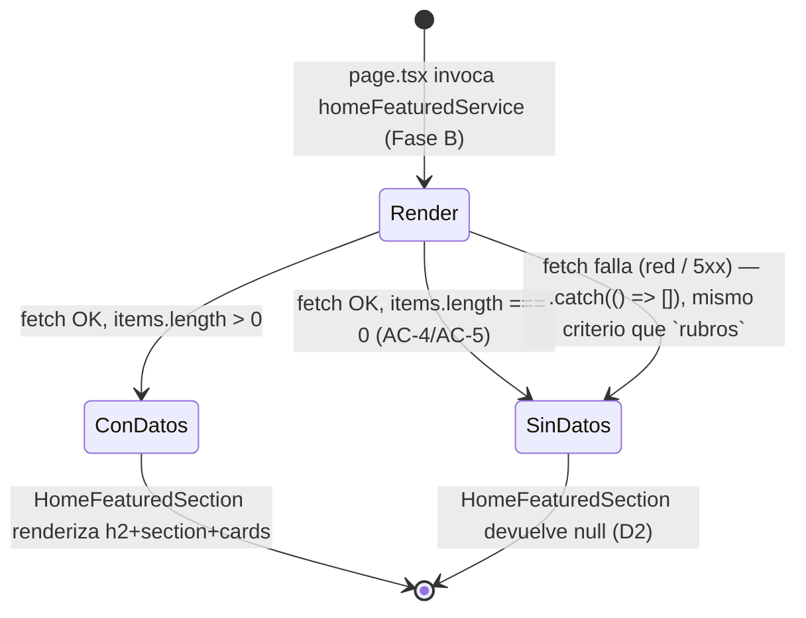

# Design — US-026 Productos destacados en el home (frontend web)

## Context

Este es el tercer change de frontend-web de este proyecto planificado **antes** de que exista su
backend, después de `US-024-edicion-perfil-cliente-frontend-web` y
`US-025-resenas-calificaciones-productos-frontend-web` (ambos archivados). A diferencia de esos
dos, acá **no hace falta ningún container de cliente ni `AsyncState`**: la US §8/§9 confirma dos
secciones sin personalización, sin dependencia de sesión (ninguna de las dos usa datos por
usuario), y el resto del home (`app/(storefront)/page.tsx`) ya es 100% Server Component con
degradación server-side (`categoriesStorefrontService.getTree().catch(() => [])`). El patrón
correcto acá es reproducir exactamente ese mismo mecanismo, no inventar un client container que
esta US no necesita.

También es distinto de sus dos precedentes en un punto favorable: **el shape del DTO que Fase A
puede asumir ya existe y ya está generado** (`StorefrontProductListItem`,
`apps/web/src/api/generated/model/storefrontProductListItem.ts`), porque la US misma (§7) sketchea
que ambos endpoints nuevos deberían reusarlo tal cual. Esto cambia la forma de D1 respecto de
`US-025.../design.md` §D1: no hace falta declarar un `types.provisional.ts` con tipos de dominio
inventados — Fase A tipa directamente contra un artefacto **ya generado y ya verificado** por el
gate `frontend-codegen-fresh` (no un tipo a mano que mire un contrato inexistente). Igual se
documenta el riesgo de que el backend real termine con una forma distinta (ver D1).

## Goals

- Fase A: `ProductCard.categoryName` opcional + un componente presentacional
  (`HomeFeaturedSection`) que renderiza una sección "Novedades"/"Más vendidos" a partir de
  `StorefrontProductListItem[]` — construible, testeable y cerrable **hoy**, sin ninguna llamada
  HTTP.
- Fase B: un `homeFeaturedService.ts` (repository pattern, `frontend-standards.md` §11.5) +
  composición en `page.tsx`, con caché explícita por ruta (NFR de la US §9 — lección de
  US-025 PR #139) — wiring mecánico y de bajo riesgo el día que el backend publique el contrato.

## Non-goals

- Diseñar el query SQL del ranking de "más vendidos" ni la decisión de `@StorefrontCache`
  server-side por handler — eso es de `US-026-productos-destacados-home-backend` (a planificar).
- Un carrusel horizontal interactivo — ver D3 (decisión explícita, no un olvido).
- Cualquier lógica de reordenamiento o filtrado del lado del cliente — el backend decide el
  orden (AC-6) y el filtro por `status`/stock (AC-7, AC-8); el FE renderiza exactamente lo que
  recibe.

## Approach

### D1 — Por qué Fase A puede tipar contra `StorefrontProductListItem` sin violar §3.2

`frontend-standards.md` §3.2 prohíbe el escape hatch "idealmente codegen, si no a mano" cuando
**ya existe un contrato** del cual generar. Acá, igual que en
`US-025-resenas-calificaciones-productos-frontend-web/design.md` §D1, no hay ningún contrato de
`novedades`/`mas-vendidos` contra el cual generar nada todavía — wire el generador hoy no es una
opción porque no hay insumo. La pregunta (misma que resolvió US-025 D1): **¿puede Fase A
construir algo cerrable sin tocar la superficie que §3 gobierna?**

La respuesta acá es **sí, y con una garantía adicional que US-025 no tenía**: en vez de declarar
tipos de dominio de UI inventados en un `types.provisional.ts`, `HomeFeaturedSection` tipa su
prop `items` directamente contra `StorefrontProductListItem` — un artefacto que **ya existe,
ya está generado** (por el endpoint de listado por categoría, US-002) y **ya pasa el gate
`frontend-codegen-fresh`** hoy. No es un tipo a mano que mire un contrato inexistente; es la
reutilización de un contrato real que ya rige otra ruta. Tres garantías estructurales, igual de
verificables por grep/test que en US-025 D1:

1. **Ningún componente de Fase A hace una llamada HTTP.** `HomeFeaturedSection` y
   `HomeFeaturedViewTracker` reciben todo por props — ni `fetch`, ni `homeFeaturedService`, ni
   import de `@/lib/http/*` ni de `@/api/generated/endpoints`. El repositorio
   (`homeFeaturedService.ts`) es, por diseño, una task de Fase B.
2. **No hay ningún `types.provisional.ts` en este change.** La única "apuesta" de Fase A es que
   el backend real termine efectivamente reusando `StorefrontProductListItem` (como la propia US
   §7 sketchea) — si no lo hace, el costo de Fase B es re-tipar la prop de `HomeFeaturedSection`
   contra el tipo generado real (cambio de una línea de import, sin tocar el JSX ni los tests de
   Fase A, que sólo le pasan objetos con esa forma por fixture).
3. **`HomeFeaturedSection`/`HomeFeaturedViewTracker` no importan nada bajo
   `apps/web/app/`.** La composición real en `page.tsx` es explícitamente Fase B (T-A5 lo
   verifica con `git diff --stat` vacío, mismo mecanismo que T-A11 de US-025).

**Lo que este diseño NO hace, y que sí sería el patrón prohibido**: no declara un
`homeFeaturedService.ts` con un `fetch` a mano "hasta que el codegen esté armado" — esa
superficie (DTOs de red, cliente HTTP) es exactamente la que §3 gobierna, y Fase A se detiene
explícitamente antes de esa línea.

### D2 — `HomeFeaturedSection`: la ausencia de datos es responsabilidad del propio componente

AC-4 y AC-5 son casos independientes de "esta sección no tiene datos → no se muestra, ni
siquiera el título". En vez de que `page.tsx` decida por fuera (`items.length > 0 && (...)`,
como hoy hace con `rubros`), `HomeFeaturedSection` encapsula esa regla devolviendo `null` cuando
`items.length === 0`. Motivo: dos secciones nuevas repetirían la misma guarda dos veces en
`page.tsx` si viviera afuera; adentro, la regla se prueba una sola vez en Fase A
(`items: []` → sin salida) sin depender de ningún dato real de backend, y `page.tsx` (Fase B)
queda simétrico para las dos secciones: siempre renderiza `<HomeFeaturedSection ... />`, nunca
una condición manual por sección.

### D3 — Grilla estática, no carrusel

La US §8 deja el layout exacto a criterio de FE ("dos filas/carruseles horizontales... a definir
por el equipo de FE, sin que sea una decisión de producto crítica"). Se elige reusar la **misma
grilla estática** que ya usa `CategoryPage.tsx` (`grid grid-cols-2 gap-4 md:grid-cols-3
lg:grid-cols-4 lg:gap-6`) en vez de un carrusel horizontal, por tres razones: (a) es el patrón de
grilla de producto ya existente en el design-system, coherente con "reusa el componente de card
de producto... sin inventar uno nuevo" (US §8) aplicado también al contenedor; (b) un carrusel
interactivo introduce complejidad de accesibilidad no pedida por ningún AC (foco, scroll-snap,
controles de teclado, anuncio de posición para lector de pantalla) que este change no tiene
presupuesto ni AC para cubrir con el nivel de profundidad que merecería; (c) con 8 ítems por
sección, una grilla de 2-4 columnas ya muestra el contenido completo sin scroll horizontal en la
mayoría de los viewports, sin perder ningún caso de AC-3 (menos de 8 ítems se ve igual de bien).
Si el dueño pide un carrusel más adelante, es un cambio de presentación aislado a
`HomeFeaturedSection` — ningún otro archivo de este change lo asume.

### D4 — Secciones con `aria-labelledby` explícito (refuerzo de a11y, no una regresión del patrón existente)

El patrón existente de "Explorá por rubro" en `page.tsx` es `<h2>` + `<section>` hermanos, sin
`aria-labelledby` — válido cuando hay una sola sección nueva en la página. Con este change el
home pasa a tener **tres** secciones con nombre (rubros, Novedades, Más vendidos): para que un
lector de pantalla que navega por landmarks distinga cada una por su nombre accesible (y no sólo
por el `<h2>` visual que precede), `HomeFeaturedSection` asocia explícitamente
`aria-labelledby={headingId}` en el `<section>` con el `id` del `<h2>` correspondiente. Esto NO
toca la sección de rubros existente (fuera de alcance, `proposal.md` "Out of scope") — es un
estándar más alto aplicado sólo a las dos secciones nuevas de este change, sin reescribir nada
en producción.

### D5 — Caché explícita por ruta (Fase B) — la lección de US-025 PR #139 aplicada del lado FE

La US §9 fija el NFR: caché acotada y explícita por ruta, nunca heredada. Del lado backend eso es
`@StorefrontCache` por handler (fuera de este change). Del lado FE, el mismo criterio ya vigente
en `categoriesStorefrontService`/`storefrontService` (`next: { revalidate, tags }` declarado en
el sitio de la llamada, no en el mutator) se replica en `homeFeaturedService.ts`: cada método
declara su propio `next.revalidate`/`next.tags`, nunca un default compartido implícito. Se elige
`revalidate: 60` (no los 3600s de `categoriesStorefrontService`): el home es la página de mayor
tráfico del sitio y su contenido destacado cambia con más frecuencia relativa (nuevo producto
publicado, una venta que reordena "más vendidos") que el árbol de categorías, que casi no
cambia. Tags separados por sección (`home:novedades`, `home:mas-vendidos`) — no un tag único —
porque son dos fuentes de datos independientes (AC-4/AC-5 lo confirman: pueden faltar por
separado) y una futura invalidación on-demand de una no debe pisar la otra.

**NFR no completamente verificable desde FE** (documentado, no silenciado): la garantía real de
que el backend declara `@StorefrontCache` **por handler** (y no hereda el TTL de otra ruta de la
misma clase, el bug real de US-025 PR #139) es una responsabilidad de
`US-026-productos-destacados-home-backend` — el FE no puede verificar desde este repo qué
decorator lleva un handler del otro servicio. La mitigación de este change es la smoke de T-B3:
confirma que **el propio FE** nunca omite `next.revalidate`/`next.tags` en la llamada (su mitad
de la garantía), y `design.md` deja constancia explícita de que la mitad de backend queda
pendiente de verificación cuando `US-026-productos-destacados-home-backend` se planifique — para
que no se "olvide" como pasó una vez con reseñas.

### D6 — Sin gap de topología (a diferencia de US-025 D6)

`US-025.../design.md` §D6 necesitó un E2E dev-owned de topología porque `/v1/me/reviews/*` viaja
por el rewrite `/v1/me/:path*` (llamada de **cliente**, mismo-origen, sujeta a que el rewrite
exista). Acá no hay ningún riesgo equivalente: `homeFeaturedService` se llama exclusivamente
**server-side** (dentro de `page.tsx`, un Server Component), igual que
`categoriesStorefrontService`/`storefrontService` hoy — es un fetch servidor-a-servidor directo
al origen de la API, sin pasar por ningún rewrite de Next ni por cookies de sesión. No hace falta
ningún spec de topología nuevo.

## Component breakdown

| Componente | Fase | Props (resumen) | A11y |
|---|---|---|---|
| `ProductCard` (modificado) | A | `item: StorefrontProductListItem`, `categoryName?: string` | sin cambios de comportamiento — sólo el tipo del prop |
| `HomeFeaturedSection` | A | `id: string`, `title: string`, `items: StorefrontProductListItem[]` | `<h2 id>` + `<section aria-labelledby>`; `null` si `items.length === 0` (D2) |
| `HomeFeaturedViewTracker` | A | `sectionId: string`, `itemCount: number` | sin UI (leaf de telemetría, `return null`) |
| `homeFeaturedService` | B | — (repositorio) | n/a |
| `app/(storefront)/page.tsx` (modificado) | B | — | compone las dos secciones bajo "Explorá por rubro" |

## State diagram

No hay estado de cliente (§9.3/§11.9 de `frontend-standards.md` no aplican — no hay
`AsyncData`/`AsyncState` porque no hay fetch en el cliente). El único "estado" relevante es
server-side, por request, y se modela como presencia/ausencia de datos — no como
loading/success/error, porque no hay ningún loading visible al usuario (SSR):

Nótese que "fetch falla" y "fetch OK con 0 resultados" convergen al mismo estado visible
(`SinDatos`) — es la misma decisión de resiliencia que ya rige `rubros`
(`frontend-resilience-patterns` skill, patrón #5 / #10: perder una sección no justifica un 500
en la puerta de entrada del sitio).

## Test plan

- **Fase A** (cerrable ahora): RTL sobre `ProductCard` (nuevo caso sin `categoryName`),
  `HomeFeaturedSection` (items vacío → `null`; items con 8 → 8 `ProductCard` en el orden dado;
  ítem sin stock → badge visible, AC-8; heading+`aria-labelledby` asociados correctamente),
  `HomeFeaturedViewTracker` (emite `home_featured_shown` una sola vez por `sectionId`, guard de
  StrictMode igual que `CategoryViewTracker`), axe-core sobre `HomeFeaturedSection` montado con
  8 ítems (0 violaciones serious/critical). Cero MSW: no hay red que mockear en Fase A.
- **Fase B** (bloqueada): `homeFeaturedService.test.ts` con MSW (`msw-setup` skill), incluida la
  smoke de caché explícita (D5); `StorefrontHome.test.tsx` extendido con los 5 escenarios AC-1 a
  AC-5 (mock de `homeFeaturedService`, mismo patrón que el mock existente de
  `categoriesStorefrontService`).
- **QA**: fuera de este change (US §7 no pide `-qa` propio). Fase A deja la superficie
  (roles/headings/`aria-labelledby`) que cualquier E2E cross-stack futuro necesitaría, sin
  duplicar sus escenarios.

## Riesgos y mitigaciones

| Riesgo | Probabilidad | Impacto | Mitigación |
|---|---|---|---|
| El backend real no reusa `StorefrontProductListItem` tal cual (p.ej. agrega `id` o cambia el envelope) | media | bajo — Fase A no depende de la forma real (D1) | Re-tipar el import de `HomeFeaturedSection`/`homeFeaturedService` en Fase B; el JSX y los tests de Fase A no cambian |
| Alguien compone `HomeFeaturedSection` en `page.tsx` con datos falsos "temporales" antes de que Fase B exista | baja | alto (dato falso en producción) | T-A5 deja explícito que Fase A no toca `apps/web/app/` — `Verify` con `git diff --stat` vacío |
| El backend hereda el TTL de otra ruta por accidente (bug real de US-025 PR #139), del lado backend | media (mismo patrón que ya ocurrió una vez) | medio (sección desactualizada por horas, silencioso) | D5 documenta explícitamente que sólo la mitad FE es verificable desde este change; queda registrado para que `US-026-productos-destacados-home-backend` no lo repita |
| Un carrusel termina siendo pedido más adelante | baja | bajo (cambio aislado a un componente) | D3 confina la decisión a `HomeFeaturedSection`; ningún otro archivo asume grilla estática |

## References

- US: `docs/user-stories/US-026-productos-destacados-home.md`
- Precedente de plan en dos fases: `openspec/changes/archive/US-025-resenas-calificaciones-productos-frontend-web/design.md`
  §D1 (por qué Fase A no es el escape hatch de §3.2), `tasks.md` (estructura Fase A/Fase B)
- Precedente de repository pattern + caché explícita: `apps/web/src/features/storefront/categoriesStorefrontService.ts`,
  `apps/web/src/features/storefront/storefrontService.ts`
- Precedente de tracker de telemetría leaf: `apps/web/src/features/storefront/CategoryViewTracker.tsx`
- `docs/code/frontend-standards.md` §3 (codegen obligatorio), §11.5 (repository pattern)
- `docs/product/design-system.md` (grilla de producto, tokens de badge sin-stock)
