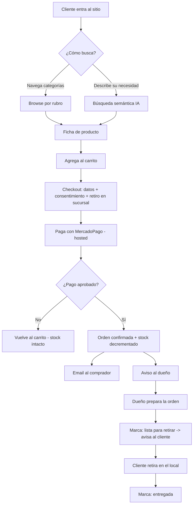
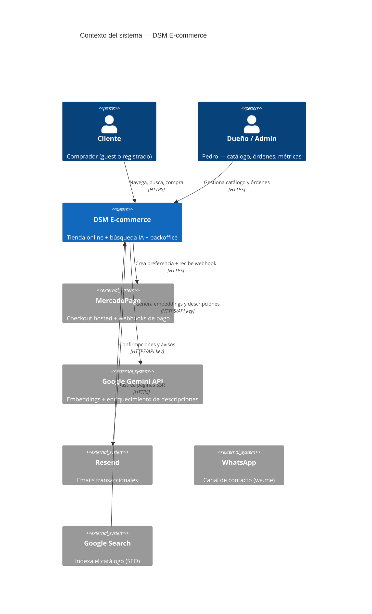
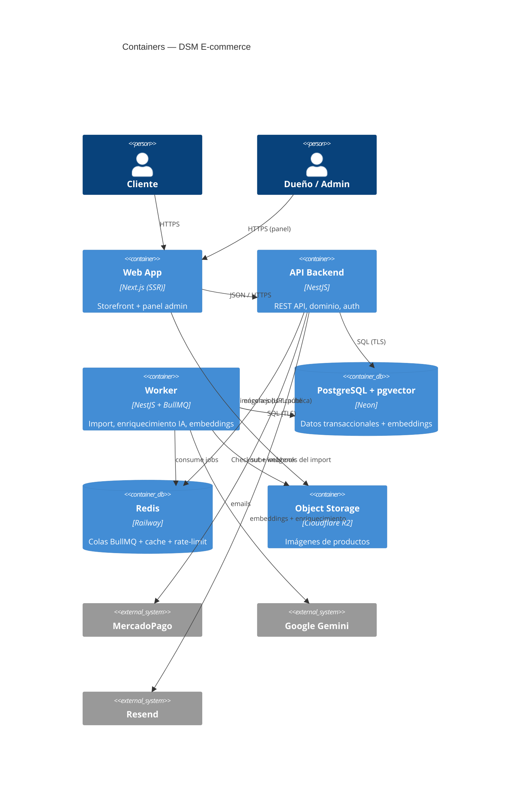
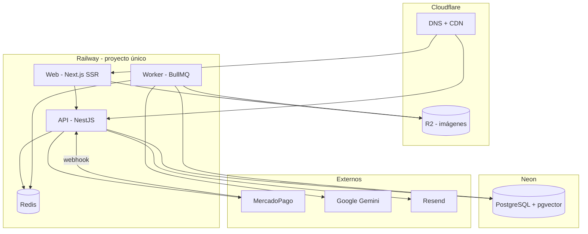
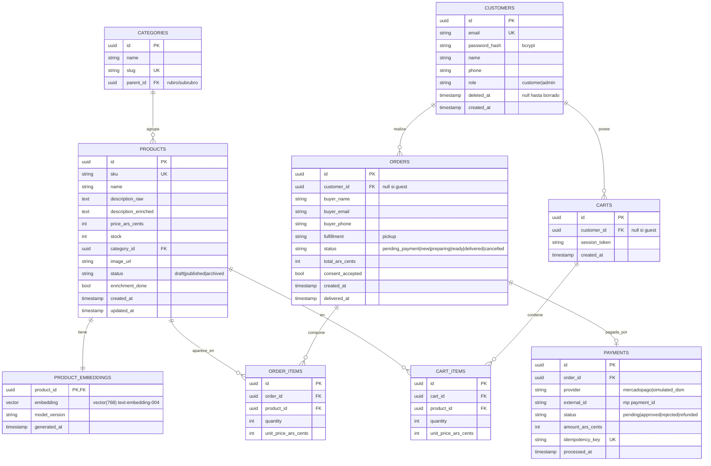
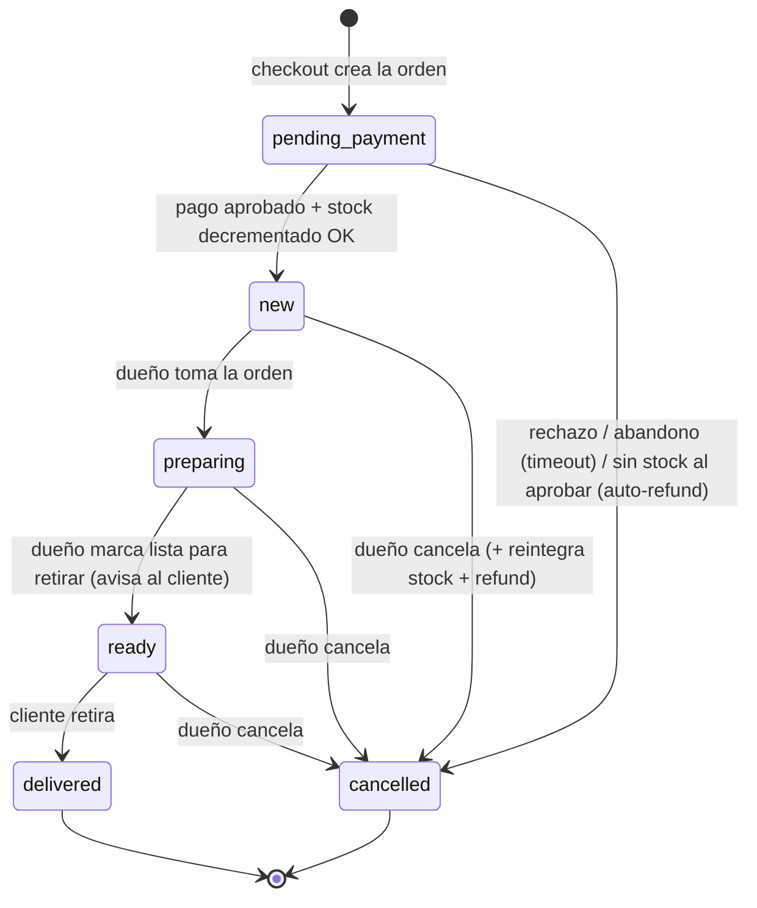

# DSM Refrigeración y Ferretería — Plataforma E-commerce con búsqueda inteligente

> Proyecto final — Máster IA4Devs. E-commerce real para una ferretería de barrio (CABA, Argentina),
> cuyo diferenciador es una **búsqueda de productos en lenguaje natural** potenciada por IA.

## Índice

0. [Ficha del proyecto](#0-ficha-del-proyecto)
1. [Descripción general del producto](#1-descripción-general-del-producto)
2. [Arquitectura del sistema](#2-arquitectura-del-sistema)
3. [Modelo de datos](#3-modelo-de-datos)
4. [Especificación de la API](#4-especificación-de-la-api)
5. [Historias de usuario](#5-historias-de-usuario)
6. [Tickets de trabajo](#6-tickets-de-trabajo)
7. [Pull requests](#7-pull-requests)

---

## 0. Ficha del proyecto

### **0.1. Tu nombre completo:**

Gabriel Suárez

### **0.2. Nombre del proyecto:**

**DSM Refrigeración y Ferretería** — Plataforma e-commerce con búsqueda semántica por IA.

### **0.3. Descripción breve del proyecto:**

Tienda online para una ferretería real de un único local en CABA (esquina de Av. Córdoba y Av. Pueyrredón) que **hoy no tiene ninguna presencia digital**. El sistema cierra el loop comercial completo —el cliente **encuentra y paga**, el dueño **prepara y entrega**— y diferencia al negocio con una **búsqueda inteligente** que entiende lo que el cliente necesita aunque no sepa el nombre técnico del producto (ej. *"algo para colgar un cuadro en una pared dura"*). El stock es la **única fuente de verdad** y la arquitectura queda preparada para integrar MercadoLibre como canal *downstream* en el futuro.

### **0.4. URL del proyecto:**

En desarrollo. El despliegue público (Railway) se entrega en la **Entrega 2** (primer MVP ejecutable). Esta entrega corresponde a la **documentación técnica**.

### 0.5. URL o archivo comprimido del repositorio

Este repositorio (privado; los accesos se comparten con el TA por el canal indicado).

---

## 1. Descripción general del producto

### **1.1. Objetivo:**

DSM es una ferretería real que **no vende online ni aparece en Google**: pierde ventas frente a competidores que sí están en internet y depende del tráfico a pie. El producto:

- **Le da presencia digital y un canal de venta online** con páginas indexables (SEO), para que la encuentren en Google.
- **Diferencia al negocio** con una búsqueda en lenguaje natural: el cliente describe su necesidad y la IA le devuelve los productos relevantes, sin conocer el nombre técnico. Es el corazón del proyecto.
- **Cierra el loop operativo**: el dueño (Pedro) gestiona catálogo y órdenes desde un panel; el cliente compra como invitado y retira en el local.

**Para quién:**
- **Cliente final** (particular o gremio — plomero, electricista, refrigerista) que busca un producto de ferretería para retirar en sucursal. Compra **sin necesidad de registrarse**; la cuenta es opcional (historial).
- **Dueño / administrador** (Pedro Suárez): carga y mantiene el catálogo, gestiona órdenes y mira métricas del negocio.

### **1.2. Características y funcionalidades principales:**

El alcance se priorizó con **MoSCoW**. El flujo E2E prioritario es: *descubrir (browse o búsqueda IA) → comprar (carrito + checkout guest + MercadoPago) → el dueño prepara y entrega*.

| # | Capacidad | Qué resuelve | Prioridad |
|---|---|---|---|
| 1 | **Catálogo + navegación por categorías** | Alta/edición de productos (admin) y browse público por rubros, con páginas indexables (SEO). | Must |
| 2 | **Búsqueda semántica con IA** | El cliente describe su necesidad en lenguaje natural y recibe candidatos relevantes. **El diferenciador.** | Must |
| 3 | **Enriquecimiento de descripciones con IA** | Convierte descripciones pobres del catálogo en descripciones ricas que los embeddings entienden. Habilita la capacidad 2. | Must |
| 4 | **Ficha + carrito + checkout guest + MercadoPago** | Compra de punta a punta sin crear cuenta, pagando con MercadoPago (hosted, fuera de PCI) + un **medio simulado "DSM"** para demos/tests. | Must |
| 5 | **Fulfillment: retiro en sucursal + panel de órdenes** | El cliente retira en el local; el dueño gestiona el estado (nueva → preparada → entregada). | Must |
| 6 | **Registro de orden + ajuste de stock + notificaciones** | Cada pago aprobado registra la orden, decrementa stock (única fuente de verdad) y dispara emails. | Must |
| 7 | **Importación masiva de inventario (CSV/Excel)** | Carga miles de SKUs de una vez (el alta manual no escala). | Should |
| 8 | **Cuentas de cliente registradas** | Login + historial de compras (retención). El guest cubre el loop. | Should |
| 9 | **Panel de métricas del dueño** | Gráficos de ventas, productos más pedidos, evolución temporal. | Should |
| 10 | **Páginas legales + consentimiento** | Privacidad/términos + consentimiento al comprar (Ley 25.326). | Must |
| 11 | **Cancelación / reembolso de orden** | El dueño cancela y reembolsa vía MercadoPago, con reintegro de stock. | Should |
| 12 | **Canal de contacto (WhatsApp)** | Botón `wa.me` para consultas pre/post venta — el canal dominante en AR. | Should |

**Fuera del MVP 1 (roadmap a producción, contemplado en la arquitectura):** integración con **MercadoLibre** (publicación + sync de stock bidireccional, con el e-commerce como única fuente de verdad), **facturación electrónica AFIP**, **envíos a domicilio**, **chatbot conversacional** (evolución del buscador) y filtros avanzados.

### **1.3. Diseño y experiencia de usuario:**

**Dirección visual:** moderna, confiable e industrial-limpia. Funcional sobre decorativo —el comprador viene a resolver—, con referencias de familiaridad (MercadoLibre para patrones de e-commerce que el comprador argentino ya conoce; retailers de hardware para densidad de catálogo). Paleta azul (`#1A56DB`) + acento naranja ferretero (`#C2410C`), tipografía Inter, **accesibilidad WCAG 2.1 AA verificada por contraste**, tono "práctico y confiable" con tratamiento informal argentino (vos).

**Flujo E2E del comprador:**



**Señales de confianza (clave para una tienda sin reputación):** sello "Pagás con MercadoPago", local físico verificable con mini-mapa y horarios, "retirás y revisás en el local antes de llevarlo" y canal de WhatsApp humano. Para el comprador argentino, acostumbrado a la reputación de MercadoLibre, esto **es conversión, no decoración**.

> **Capturas / video:** se incorporan en la Entrega 2/Final, cuando exista el MVP ejecutable. En esta entrega el diseño está especificado como sistema de diseño (tokens + componentes) que reemplaza al Figma.

### **1.4. Instrucciones de instalación:**

> El código se entrega en la Entrega 2. Estas son las instrucciones de puesta en marcha local **previstas** según la arquitectura definida (todo containerizado, paridad local = producción).

**Requisitos:** Node 20+, `pnpm`, Docker + Docker Compose, y claves de MercadoPago (sandbox), Google Gemini, Resend y Cloudflare R2.

```bash
# 1. Clonar e instalar dependencias (monorepo)
git clone <repo> dsm-ecommerce && cd dsm-ecommerce
pnpm install

# 2. Variables de entorno
cp .env.example .env   # completar MP_*, GEMINI_API_KEY, RESEND_API_KEY, R2_*, JWT_SECRET

# 3. Servicios locales: PostgreSQL+pgvector y Redis
docker compose up -d   # postgres (con extensión pgvector) + redis

# 4. Migraciones + datos de prueba (seed)
pnpm db:migrate        # Prisma migrate (crea esquema + extensión pgvector + índice HNSW)
pnpm db:seed           # categorías + productos de prueba + usuario admin

# 5. Levantar todo (web + api + worker)
pnpm dev               # Next.js (web), NestJS (api), worker BullMQ
```

- **Web (storefront + backoffice):** `http://localhost:3000`
- **API:** `http://localhost:3001`
- El **worker** procesa import, enriquecimiento IA y embeddings de forma asíncrona.
- Para probar el flujo de compra **sin transacción real**, usar el **medio de pago simulado "DSM"** (habilitado solo en test/demo).

---

## 2. Arquitectura del Sistema

### **2.1. Diagrama de arquitectura:**

**Patrón: monolito modular** (un único deployable de API con módulos por dominio) + **Next.js SSR** para el frontend + **worker** dedicado para el trabajo asíncrono. Datastore único **PostgreSQL + `pgvector`** (datos transaccionales *y* embeddings de búsqueda).

**Contexto del sistema (C4 — Nivel 1):**



**Contenedores (C4 — Nivel 2):**



**Decisiones clave (formalizadas como ADRs):**

| # | Decisión | Razón |
|---|---|---|
| ADR-0001 | **Railway + Neon + Cloudflare R2** (no hyperscaler) | Hosting económico para presupuesto de ferretería; managed y de bajo costo operativo. |
| ADR-0002 | **PostgreSQL + `pgvector`** como datastore único | Búsqueda semántica sobre el mismo Postgres; sin motor de búsqueda aparte. |
| ADR-0003 | **Google Gemini** (`text-embedding-004` + `gemini-1.5-flash`) | Económico, buen español; embeddings + enriquecimiento. |
| ADR-0004 | **Redis + BullMQ** para trabajo asíncrono | Import/IA/embeddings con reintentos y rate-limit. |
| ADR-0005 | **Auth propia** (NestJS + JWT + bcrypt) | Sin costo SaaS; superficie de auth acotada (guest cubre el loop). |
| ADR-0006 | **MercadoPago Checkout Pro (hosted)** + medio simulado "DSM" | Fuera de alcance PCI; el simulado habilita demos y test E2E. |
| ADR-0007 | **Monolito modular NestJS** | Simplicidad operativa; stock desacoplado para ML *downstream*. |
| ADR-0008 | **Decremento de stock al aprobar pago** (UPDATE atómico + idempotencia) | Stock = única fuente de verdad; sin reservas ni jobs de expiración. |

**Beneficios:** simplicidad operativa y costo bajo (un equipo chico, presupuesto de ferretería); un solo lenguaje (TypeScript) de punta a punta; SEO de primera por SSR; cero lock-in real (todo containerizado + Postgres estándar + storage S3-compatible) → migrable a otro proveedor sin reescritura.
**Sacrificios:** sin multi-AZ (single point of failure, aceptado para 99.5%); dependencia de IA externa (mitigada con degradación a búsqueda full-text); el monolito habrá que modularizar con disciplina para no acoplar dominios.

### **2.2. Descripción de componentes principales:**

> **Estado de implementación (2026-08-23).** Esta sección describe la **arquitectura de
> destino**, que es lo que corresponde a la Entrega 1. Como la Entrega 2 ya está en curso,
> conviene el mapa de lo que existe hoy para que nadie lea esta lista como inventario:
>
> | Componente | Estado real |
> |---|---|
> | `catalog` (productos, categorías, storefront público) | **construido** — US-001, US-002, US-003 |
> | `auth` (JWT + bcrypt, cookies, refresh rotado) | **construido** — US-014 |
> | `cart` | **construido** (backend); el frontend en curso — US-007 |
> | `import` masivo | **construido** — US-006 |
> | `enrichment` (IA + embeddings) | **en curso** — US-005 |
> | `search` (kNN + fallback) | **planificado** — US-004 |
> | `checkout`, `payments`, `orders`, `stock` | **planificados** — US-008, US-009, US-010 |
> | `metrics` | **planificado** — US-016 |
> | `notifications` | **planificado** — US-011 |
> | **Worker (BullMQ) y Redis** | **no aprovisionados.** El trabajo asíncrono corre **en proceso** dentro de `apps/api` con contrato asíncrono y estado durable, listo para cambiar el ejecutor por BullMQ cuando exista el add-on. Ver **ADR-0012** y **ADR-0014**, que enmiendan ADR-0004 |
>
> El detalle vive en `docs/_index/us-status.yaml` y `docs/_index/openspec-changes.yaml`.

- **Web App (Next.js, SSR):** storefront público (home, categorías, ficha, búsqueda) **indexable** + el **backoffice del dueño** (catálogo, import, órdenes, métricas) como sección del mismo app. UI: Tailwind + ShadCN UI + TanStack Table + Recharts.
- **API Backend (NestJS):** monolito modular. Módulos por dominio: `catalog`, `search` (embed de consulta + kNN sobre pgvector + fallback), `cart`, `checkout`, `payments` (webhook MP + medio simulado, idempotente), `orders` (FSM de orden), `stock` (decremento/reintegro atómico), `auth` (JWT + bcrypt), `import`, `metrics`, `notifications`.
- **Worker (NestJS + BullMQ):** procesa import masivo, enriquecimiento de descripciones con IA y generación de embeddings, con reintentos y rate-limit del proveedor IA. Nunca bloquea el request.
- **PostgreSQL + pgvector (Neon):** datos transaccionales + columna `vector(768)` con índice **HNSW** para kNN.
- **Redis (Railway):** colas BullMQ, cache de listados/queries y rate-limit.
- **Cloudflare R2:** imágenes de producto (S3-compatible, sin cargos de egress).

### **2.3. Descripción de alto nivel del proyecto y estructura de ficheros**

Monorepo (pnpm workspaces) con separación apps/packages — patrón que favorece tipos compartidos y un único toolchain:

```
dsm-ecommerce/
├── apps/
│   ├── web/                # Next.js (storefront SSR + backoffice del dueño)
│   ├── api/                # NestJS — REST API, módulos de dominio, auth
│   └── worker/             # NestJS + BullMQ — import, enriquecimiento IA, embeddings
├── packages/
│   ├── db/                 # Prisma schema + migraciones + cliente (pgvector vía $queryRaw)
│   ├── shared/             # tipos / contratos (DTOs) compartidos front<->back
│   └── ui/                 # design-system: tokens (CSS vars + alias) + componentes ShadCN
├── docs/                   # PRD, design-system, E2E, ADRs, user-stories (documentación viva)
│   ├── product/            # prd.md, design-system.md, design-e2e.md
│   ├── architecture/decisions/   # ADR-0001..0008
│   ├── user-stories/       # US-001..018
│   └── _index/             # índices materializados (decisions, us-status)
├── .github/workflows/      # CI/CD (GitHub Actions + SonarCloud)
└── docker-compose.yml      # entorno local: PostgreSQL+pgvector, Redis
```

### **2.4. Infraestructura y despliegue**



- **Despliegue:** GitHub Actions → Railway (web + api + worker + Redis en un único proyecto). Rollback = redeploy del commit verde anterior.
- **Región:** US-East (costo + latencia aceptable a MercadoPago AR; pendiente confirmar si la Ley 25.326 exige residencia AR para PII).
- **Secretos:** variables de entorno cifradas de Railway (claves MP/Gemini/Resend, `JWT_SECRET`, URLs de DB/Redis). Nunca en el repo ni en la imagen.
- **TLS:** gestionado por Railway/Cloudflare. **Backups:** Neon PITR + snapshots diarios (RPO ≤ 24h; RTO ≤ 4h).
- **Observabilidad:** Sentry (errores FE+BE) + logs estructurados (`pino`) + métricas de Railway y de la cola (jobs ok/fail/retry).

### **2.5. Seguridad**

Análisis **STRIDE** sobre las superficies críticas:

| Superficie | Amenaza | Mitigación |
|---|---|---|
| Webhook MercadoPago | Spoofing/Tampering (falso "approved") | Validar firma de MP **+ re-consultar el pago a la API de MP** antes de decrementar. Idempotencia por `payment_id`. |
| Endpoints admin (`/admin/*`) | Elevation of privilege | JWT con `role=admin` + guard; panel no accesible sin auth. |
| Pago simulado "DSM" | Tampering (uso en prod) | Detrás de feature flag, **deshabilitado en producción**. |
| Login / sesión | Brute force / robo de token | Rate-limit (Redis) + bcrypt + mensajes genéricos; **JWT en cookie `httpOnly`+`secure`+`SameSite`** (no localStorage); access corto + refresh rotado; 2FA opcional para admin. |
| Datos del comprador (PII) | Information disclosure | TLS en tránsito; sin datos de tarjeta (hosted MP → fuera de PCI); borrado de cuenta; PII fuera de logs; consentimiento registrado (Ley 25.326). |
| Import de archivos | DoS / injection | Límite de tamaño/filas, validación estricta, jobs rate-limited. |
| Búsqueda / IA | Cost abuse / prompt injection | Rate-limit de `/search`; el texto del usuario **solo** genera un embedding (no ejecuta acciones); cache de queries frecuentes. |

### **2.6. Tests**

Estrategia de testing en capas:

| Capa | Qué se testea | Herramientas |
|---|---|---|
| Unit BE | Servicios, validación de import, **decremento de stock, idempotencia** | Jest |
| Integration BE | Handlers + Postgres real (con pgvector) + Redis | Jest + Testcontainers |
| Contract | OpenAPI vs implementación | Spectral / supertest |
| Unit FE | Componentes con lógica (SearchBar, Cart) | Vitest + RTL |
| **E2E** | Loop completo **con el pago simulado "DSM"** (buscar → comprar → preparar → entregar) | Playwright |
| Performance | `/search`, listado, checkout | k6 |
| **Calidad de búsqueda IA** | Batería de ~30 consultas en lenguaje natural → top-5 | script + assertions (**≥ 70%** relevancia, KPI del producto) |

El **medio de pago simulado "DSM"** es *load-bearing* para el test E2E automatizado: permite ejercer pago → confirmación → decremento → notificación sin transacción real.

---

## 3. Modelo de Datos

### **3.1. Diagrama del modelo de datos:**



### **3.2. Descripción de entidades principales:**

- **PRODUCTS** — el catálogo. `price_ars_cents` (int, centavos ARS, IVA incluido) evita errores de redondeo. `description_raw` (lo que viene del local) vs `description_enriched` (generada por IA). `status` controla visibilidad (`draft|published|archived` — no se borra, se archiva). `stock` con `CHECK (stock >= 0)`. PK `id`; UK `sku`; FK `category_id`.
- **PRODUCT_EMBEDDINGS** — relación 1:1 con producto. `embedding vector(768)` (dimensión de `text-embedding-004`) con índice **HNSW** (`vector_cosine_ops`) para kNN. `model_version` permite trazar/migrar embeddings. PK+FK `product_id`.
- **CATEGORIES** — rubros y subrubros (autorreferencia `parent_id`). `slug` UK para URLs indexables.
- **CARTS / CART_ITEMS** — carrito de invitado (por `session_token`) o de cliente registrado. `unit_price_ars_cents` snapshot del precio.
- **CUSTOMERS** — cuenta opcional (cliente) o admin (`role`). `password_hash` con bcrypt. `deleted_at` para borrado de cuenta a pedido (Ley 25.326). PII: nombre, email, teléfono.
- **ORDERS** — la orden. `status` con FSM (ver abajo); empieza en **`pending_payment`** y solo pasa a `new` (visible para el dueño) cuando el pago se aprueba **y** el stock se decrementa OK. `consent_accepted` registra el consentimiento legal. Datos del comprador embebidos (compra guest).
- **ORDER_ITEMS** — ítems con cantidad y `unit_price_ars_cents` (snapshot al momento de la compra → cambios de precio no alteran ventas pasadas).
- **PAYMENTS** — pago real (MercadoPago) o simulado. `external_id` (mp `payment_id`) + `idempotency_key` UK garantizan **procesamiento exactamente una vez** ante webhooks duplicados/tardíos.

**Máquina de estados de la Orden (FSM):**



---

## 4. Especificación de la API

API **REST/JSON** bajo base path `/api`, versionada (`v1`). **Convenciones:**

- **Autenticación:** los endpoints de cliente (browse, búsqueda, carrito, checkout guest) son **públicos**; los de `/admin/*` y de cuenta requieren **JWT en cookie `httpOnly`+`secure`+`SameSite`** (no `Authorization` header en el navegador). El webhook se autentica por **firma** (`x-signature`), no por sesión.
- **Errores:** envelope uniforme `{ error: { code, message, details? } }` con el status HTTP correspondiente (`422` validación, `401/403` auth, `404` no encontrado, `409` conflicto, `429` rate-limit).
- **Idempotencia:** el webhook de pago es idempotente por `payment_id` (reenvíos no re-aplican efectos). **Rate-limit:** `/api/search` y `/api/auth/*` están limitados (control de abuso/costo IA y brute force).
- **Moneda:** los montos se transportan en **centavos ARS** (`*_ars_cents`, enteros) y se formatean en el cliente.

A continuación, los **3 endpoints representativos** del loop (búsqueda IA, checkout, confirmación de pago), en OpenAPI 3.1:

```yaml
openapi: 3.1.0
info:
  title: DSM E-commerce API
  version: 1.0.0
servers:
  - url: /api
components:
  securitySchemes:
    cookieAuth: { type: apiKey, in: cookie, name: access_token }   # JWT httpOnly (admin/cuenta)
  schemas:
    Error:
      type: object
      properties:
        error:
          type: object
          properties:
            code: { type: string, example: VALIDATION_ERROR }
            message: { type: string }
            details: { type: array, items: { type: string } }
    SearchResult:
      type: object
      properties:
        id: { type: string, format: uuid }
        name: { type: string }
        price_ars_cents: { type: integer, example: 320000 }
        in_stock: { type: boolean }
        score: { type: number, format: float, description: "relevancia semántica 0..1" }
paths:
  /search:
    post:
      summary: Búsqueda semántica en lenguaje natural
      description: >
        Genera el embedding de la consulta y hace kNN sobre pgvector (índice HNSW). Si no hay señal
        sobre el umbral, devuelve fallback a navegación por categoría. Degrada a full-text si el
        proveedor de IA no está disponible. Rate-limited.
      requestBody:
        required: true
        content:
          application/json:
            schema:
              type: object
              required: [query]
              properties:
                query: { type: string, minLength: 2, example: "algo para colgar un cuadro en pared dura" }
                limit: { type: integer, default: 20, maximum: 50 }
      responses:
        "200":
          description: Resultados rankeados (o fallback si no hay señal suficiente)
          content:
            application/json:
              examples:
                conResultados:
                  value:
                    interpreted_as: "fijación a mampostería: tarugos + tornillos para hormigón"
                    confidence: high
                    results:
                      - { id: "a1b2c3d4-…", name: "Taco Fischer SX 8mm (x50)", price_ars_cents: 320000, in_stock: true, score: 0.89 }
                      - { id: "c3d4e5f6-…", name: "Mecha widia 8mm para hormigón", price_ars_cents: 540000, in_stock: true, score: 0.81 }
                    fallback: null
                bajaConfianza:
                  value:
                    interpreted_as: "consulta ambigua"
                    confidence: low
                    results: [ { id: "…", name: "…", price_ars_cents: 0, in_stock: true, score: 0.42 } ]
                    fallback: { suggested_categories: ["Fijaciones", "Mechas y brocas"] }
                sinResultados:
                  value: { results: [], confidence: none, fallback: { suggested_categories: ["Fijaciones"] } }
        "422": { description: Consulta inválida (vacía o muy corta), content: { application/json: { schema: { $ref: "#/components/schemas/Error" } } } }
        "429": { description: Rate-limit excedido }

  /checkout:
    post:
      summary: Crear orden (estado pending_payment) e iniciar el pago
      description: >
        Valida el carrito y los datos del comprador (guest), exige el consentimiento, crea la orden en
        estado `pending_payment` (sin decrementar stock todavía) y devuelve el punto de pago hosted.
      requestBody:
        required: true
        content:
          application/json:
            schema:
              type: object
              required: [cart_id, buyer, consent, fulfillment, payment_method]
              properties:
                cart_id: { type: string, format: uuid }
                buyer:
                  type: object
                  required: [name, email, phone]
                  properties:
                    name: { type: string }
                    email: { type: string, format: email }
                    phone: { type: string, example: "+54 9 11 5555 5555" }
                consent: { type: boolean, description: "aceptación de privacidad + términos (obligatoria)" }
                fulfillment: { type: string, enum: [pickup] }
                payment_method: { type: string, enum: [mercadopago, simulated_dsm], default: mercadopago }
      responses:
        "201":
          description: Orden creada; redirección al checkout hosted (o aprobación directa si es simulado)
          content:
            application/json:
              example: { order_id: "ord_123", status: "pending_payment", init_point: "https://www.mercadopago.com.ar/checkout/v1/redirect?pref_id=…" }
        "409": { description: Ítem del carrito despublicado o sin stock al confirmar }
        "422": { description: Datos faltantes/ inválidos o consentimiento no aceptado, content: { application/json: { schema: { $ref: "#/components/schemas/Error" } } } }

  /webhooks/mercadopago:
    post:
      summary: Webhook de pago de MercadoPago (idempotente)
      description: >
        Verifica la firma, re-consulta el pago a MercadoPago (no confía en el payload) y, si está
        aprobado, confirma la orden y decrementa stock de forma atómica dentro de una transacción.
        Idempotente ante reenvíos (por payment_id). Si no hay stock, revierte la transacción, cancela
        la orden y reembolsa el pago.
      parameters:
        - in: header
          name: x-signature
          required: true
          schema: { type: string }
      requestBody:
        content:
          application/json:
            example: { type: "payment", data: { id: "1234567890" } }
      responses:
        "200": { description: Procesado, o ignorado por idempotencia (efecto exactamente-una-vez) }
        "401": { description: Firma inválida — no se confía en el contenido ni se toca stock }
```

---

## 5. Historias de Usuario

> Tres historias representativas (de 18 definidas). Cada una con criterios de aceptación en Gherkin e INVEST verificado. El conjunto completo vive en `docs/user-stories/`.

**Historia de Usuario 1 — US-001: Admin de catálogo (alta y edición de productos y categorías)**

> **Como** dueño (admin), **quiero** dar de alta y editar productos y categorías, **para** tener el catálogo listo para vender online.

Es la base del catálogo (capacidad #1, Must) e incluye el bootstrap de la plataforma. Criterios de aceptación destacados:
- Crear categoría (rubro) y alta de producto en borrador; publicar solo si cumple los requisitos (nombre, precio, categoría, stock).
- **SKU único** (negative space): rechazar alta/edición con SKU duplicado.
- **El cambio de precio no altera ventas pasadas** (los `order_items` guardan el precio al momento).
- Archivar en vez de borrar (`status=archived`); **acceso restringido** al panel (solo admin autenticado).

**Historia de Usuario 2 — US-004: Búsqueda semántica en lenguaje natural (el diferenciador)**

> **Como** cliente, **quiero** describir lo que necesito en mis palabras y recibir productos relevantes, **para** encontrar lo que busco aunque no sepa el nombre técnico.

Capacidad #2 (Must), el corazón del producto. Criterios de aceptación destacados:
- La consulta en lenguaje natural devuelve candidatos relevantes ordenados por relevancia; **batería de prueba ≥ 70%** con ≥1 producto correcto en el top-5.
- **Fallback** a navegación por categoría cuando no hay señal suficiente (nunca un "0 resultados" desnudo).
- **Degradación** a búsqueda full-text si el proveedor de IA no está disponible (resiliencia).
- Negative space: solo productos publicados; los sin stock aparecen marcados; **la consulta no ejecuta acciones** (solo genera embedding — anti prompt-injection); productos sin embedding no rompen la búsqueda; control de abuso (rate-limit).

**Historia de Usuario 3 — US-010: Confirmación de orden por webhook + ajuste de stock**

> **Como** sistema, **quiero** confirmar la orden y decrementar el stock solo cuando el pago está aprobado y verificado, **para** mantener el stock como única fuente de verdad de forma correcta y segura.

Capacidad #6 (Must), el núcleo transaccional. Criterios de aceptación destacados:
- Pago aprobado → orden a `new` + **decremento atómico** de stock; dispara notificaciones.
- **Idempotencia**: webhook duplicado o tardío no decrementa dos veces (`idempotency_key`).
- **Firma del webhook verificada** + re-consulta a MercadoPago: no se confía en el contenido recibido.
- **Concurrencia**: `UPDATE … WHERE stock >= q` + `CHECK (stock >= 0)` → el stock nunca queda negativo.
- **Pagó pero sin stock** → la transacción se revierte, la orden se cancela y **se reembolsa** el pago.
- **Reconciliación** de webhooks que nunca llegan y **limpieza** de órdenes `pending_payment` abandonadas.

---

## 6. Tickets de Trabajo

> Tres tickets representativos (backend, frontend, base de datos), derivados de las historias y la arquitectura. Cada uno con enfoque técnico, breakdown, criterios de aceptación, casos borde, riesgos y Definición de Hecho — el detalle de implementación profundo (plan OpenSpec por disciplina) se materializa al iniciar el desarrollo en la Entrega 2.

---

### Ticket 1 — Backend · `BE-US-010`: Webhook de pago + confirmación de orden + decremento atómico de stock

**Historia / capacidad:** US-010 · Cap. 6 (registro de orden + ajuste de stock + notificaciones). **Disciplinas:** BE, QA. **Prioridad:** Alta.

**Contexto.** Es el núcleo transaccional del producto: cuando MercadoPago confirma un pago, hay que confirmar la orden y decrementar stock manteniendo el invariante **"stock = única fuente de verdad"**, todo bajo condiciones adversas (webhooks duplicados, tardíos o falsos; compradores concurrentes por la última unidad). Una falla acá es plata mal cobrada o stock inconsistente.

**Enfoque técnico.**
- **Confianza cero en el payload del webhook**: se valida la firma (`x-signature`) y se **re-consulta el pago** a la API de MercadoPago; la verdad del pago viene de esa consulta, no del cuerpo recibido.
- **Idempotencia por diseño**: `payments.idempotency_key` (UNIQUE) + `payments.external_id` (el `payment_id` de MP) + un check de estado de la orden, todo dentro de **una única transacción**, garantizan procesamiento *exactamente una vez*.
- **Decremento sin locks**: `UPDATE products SET stock = stock - :q WHERE id = :id AND stock >= :q` (compare-and-set atómico) + `CHECK (stock >= 0)` como red de la base.
- **Compensación**: si el decremento devuelve 0 filas tras un pago aprobado (se agotó entre carrito y pago) → ROLLBACK, orden → `cancelled`, **reembolso** del pago y aviso al comprador.

**Breakdown de tareas.**
1. `POST /api/webhooks/mercadopago`: parsear evento, validar firma, re-consultar el pago a MP.
2. Servicio transaccional `ConfirmOrder`: idempotencia (corto-circuito si ya procesado) → decremento atómico por ítem → transición `pending_payment → new`.
3. Rama de compensación (sin stock): rollback + `cancelled` + refund + notificación.
4. Encolar (BullMQ) notificaciones: confirmación al comprador + aviso de nueva orden al dueño.
5. **Job de reconciliación**: barre pagos `approved` en MP sin orden confirmada (webhook perdido) y los procesa idempotentemente.
6. **Job de limpieza**: cancela órdenes `pending_payment` vencidas (checkout abandonado) para no contaminar la cola del dueño.
7. Instrumentación (Sentry + métricas): tasa approved/rejected, decrementos bloqueados por stock, webhooks duplicados.

**Criterios de aceptación.** AC-1, AC-4, AC-5…AC-11 de US-010 (confirmación + decremento; auto-refund sin stock; idempotencia ante duplicado; webhook tardío/fuera de orden; firma inválida rechazada; nunca stock negativo bajo concurrencia; simulado por el mismo camino; reconciliación; limpieza).

**Casos borde.** Webhook duplicado · webhook tardío/fuera de orden · firma inválida · pago aprobado sin stock · fallo del refund (reintentar + alertar) · webhook que nunca llega (reconciliación) · doble confirmación concurrente del mismo pago.

**Riesgos.** Pérdida/duplicación de webhooks (mitiga reconciliación + idempotencia) · fallo del refund de MP (cola con reintentos + alerta). **Depende de:** US-009 (pago iniciado + webhook configurado).

**Definición de Hecho.** Unit + integration (Postgres real con Testcontainers) verdes; idempotencia probada con webhook duplicado; test de concurrencia sin stock negativo; reconciliación y limpieza con tests; regresión verde en staging; PO firma.

**Estimación.** 16–24 h (BE) + 8 h (QA) · 8 SP tradicional / 4 SP AI-asistido.

---

### Ticket 2 — Frontend · `FE-US-004`: Componente `SearchExperience` (búsqueda IA + página de resultados)

**Historia / capacidad:** US-004 · Cap. 2 (búsqueda semántica). **Disciplinas:** FE, QA. **Prioridad:** Alta.

**Contexto.** Es **el diferenciador** del producto. No es un input: es un flujo con su propia composición (entrada → sugerencias → resultados → fallback), que debe transmitir confianza en la IA y degradar con gracia. Si esto se siente genérico, se desperdicia la razón de ser del producto.

**Enfoque técnico.**
- **Máquina de estados de la UI**: `idle → typing → searching → results | low-confidence | empty/fallback | degraded`.
- **Integración con la API**: input con *debounce*, cancelación de requests en vuelo (`AbortController`), y desarrollo desacoplado contra **mock (MSW)** apenas exista el contrato OpenAPI del BE (no espera al backend terminado).
- **SSR-aware**: la barra y los resultados no deben romper la indexación; el contenido indexable no depende de JS.

**Breakdown de tareas.**
1. `SearchBar` prominente y persistente (full-width en mobile; **vista full-screen** en mobile), placeholder ejemplificador, dropdown de sugerencias navegable por teclado (↑/↓/Enter/Esc).
2. Estado **"buscando con IA…"** con **skeleton** (no spinner) + microcopy.
3. **Página de resultados**: eco de la consulta + **interpretación visible** ("Buscamos: tarugos + tornillos para hormigón"), grid de `ProductCard` por relevancia, chips de match.
4. Estado **"pocos / baja confianza"** con aviso honesto + refinamiento.
5. **Fallback** a navegación por categoría (nunca "0 resultados" desnudo) y **degradación** visible si la IA cae.
6. Estados de producto: solo publicados; sin stock marcado → CTA "avisame por WhatsApp".
7. Accesibilidad: `role="searchbox"`, cantidad de resultados anunciada (`aria-live`), foco gestionado al abrir/cerrar la vista mobile.

**Criterios de aceptación.** AC-1…AC-10 de US-004 (relevancia, interpretación, baja confianza, fallback, degradación, solo publicados, sin-stock marcado, anti prompt-injection a nivel UX, rate-limit).

**Casos borde.** Consulta vacía/corta · cero resultados · IA caída (degradación) · resultados con baja relevancia · navegación por teclado en el dropdown · doble submit · latencia alta (cancelar request previo).

**Riesgos.** Que el contrato del BE cambie tras empezar (mitiga: arrancar contra mock derivado del OpenAPI) · percepción de "lentitud" de la IA (skeleton + cache). **Depende de:** el contrato OpenAPI de `/api/search` (desacopla del BE terminado).

**Definición de Hecho.** Vitest + RTL de la lógica y la FSM; los 6 estados cubiertos por test; SSR no rota (indexación verificada); accesibilidad (teclado + lectores) ok; regresión visual del componente; PO firma.

**Estimación.** 12–18 h (FE) + 6 h (QA) · 8 SP tradicional / 4 SP AI-asistido.

---

### Ticket 3 — Base de datos · `DB-US-005`: Esquema + `pgvector` + índice HNSW + migraciones

**Historia / capacidad:** US-005 (habilita US-004) · Cap. 3 (enriquecimiento + embeddings). **Disciplinas:** BE/DB, QA. **Prioridad:** Alta (foundation).

**Contexto.** Sin el esquema y el soporte vectorial no hay catálogo ni búsqueda semántica. Es trabajo de fundación que desbloquea casi todo el resto; debe ser **reproducible** (migraciones up/down limpias en entorno nuevo) y eficiente a escala de miles de SKUs.

**Enfoque técnico.**
- **Migraciones versionadas con Prisma** (up/down), idempotentes y reproducibles en un entorno limpio.
- **`pgvector` + HNSW**: la extensión no es tipo nativo de Prisma → el esquema vectorial y las queries kNN se manejan con `$queryRaw` (la columna `vector(768)` y el índice se crean por SQL en la migración).
- **Precios en centavos** (int) en todo el esquema; **soft-delete** (`deleted_at`) para PII.

**Breakdown de tareas.**
1. Esquema base: `products`, `categories` (autorreferente rubro/subrubro), `carts`, `cart_items`, `orders`, `order_items`, `payments`, `customers` — con restricciones: `sku` UK, `slug` UK, `idempotency_key` UK, `CHECK (stock >= 0)`, FKs y `ON DELETE` apropiados.
2. Extensión `pgvector` + tabla `product_embeddings` (`vector(768)`, `model_version`).
3. **Índice HNSW** (`vector_cosine_ops`) sobre `embedding`; tuning inicial de parámetros (`m`, `ef_construction`) documentado.
4. Índices de soporte: `products(category_id, status)`, `payments(external_id)`, `orders(status, created_at)`.
5. **Seed** idempotente: categorías + productos de prueba con descripciones pobres (para ejercer el enriquecimiento) + usuario admin.
6. **Helper kNN** vía `$queryRaw` (`embedding <=> :qvec` con umbral y `LIMIT`), tipado y testeado.
7. Verificación de planes con `EXPLAIN` (que el HNSW se use).

**Criterios de aceptación.** Migración up/down reproducible en entorno nuevo; kNN devuelve vecinos correctos sobre datos de seed; precios en centavos en todo el esquema; soft-delete operativo; restricciones (UK/CHECK/FK) activas.

**Casos borde.** Re-ejecución de migración (idempotente) · rollback (down) limpio · seed re-ejecutado sin duplicar · embedding nulo (producto sin enriquecer no rompe el índice) · colisión de `sku`/`idempotency_key` (rechazada por UK).

**Riesgos.** Que el plan económico de la DB no soporte HNSW (verificar antes de provisionar — pregunta abierta del E2E) · dimensión del embedding acoplada al proveedor (cambiar de proveedor obliga a re-embeddear: `model_version` lo traza). **Depende de:** el bootstrap de plataforma (US-001).

**Definición de Hecho.** `prisma migrate` up/down limpio en entorno nuevo; índices verificados con `EXPLAIN`; seed idempotente; helper kNN con test de integración (Postgres real); regresión verde.

**Estimación.** 8–12 h (BE/DB) + 4 h (QA) · 5 SP tradicional / 3 SP AI-asistido.

---

## 7. Pull Requests

> El trabajo por Pull Requests corresponde a la **Entrega 2** (primer MVP ejecutable) y la **Entrega Final**, cuando exista código. Cada PR llevará título claro, descripción (qué cambia, por qué, impacto) y referencia a la US/ticket correspondiente.

**Pull Request 1** — _(Entrega 2)_ Bootstrap del monorepo + esquema de datos + CI/CD (referencia: `DB-US-005`, US-001).

**Pull Request 2** — _(Entrega 2)_ Búsqueda semántica end-to-end: enriquecimiento IA + embeddings + `SearchExperience` (referencia: US-004, US-005).

**Pull Request 3** — _(Entrega 2/Final)_ Loop de compra: checkout guest + MercadoPago + webhook idempotente + decremento de stock (referencia: US-008, US-009, US-010).
